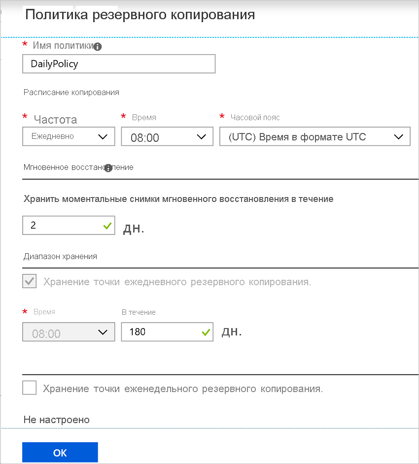
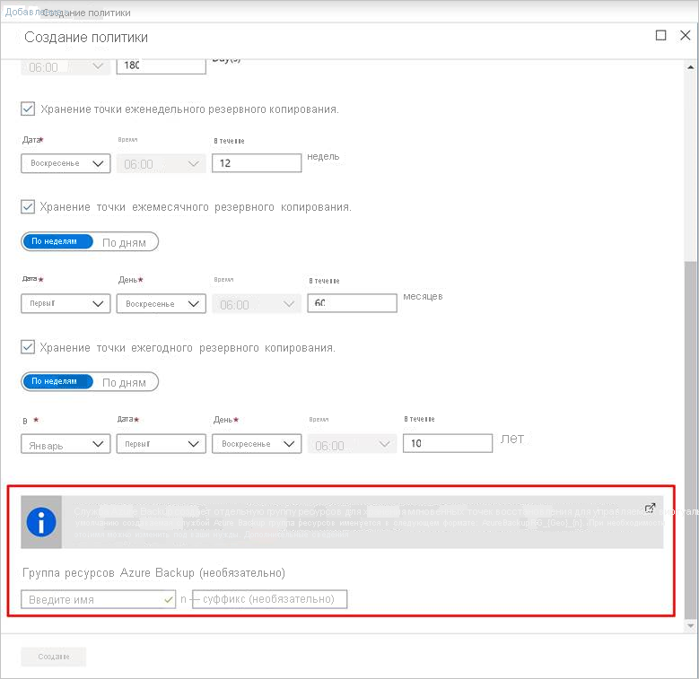
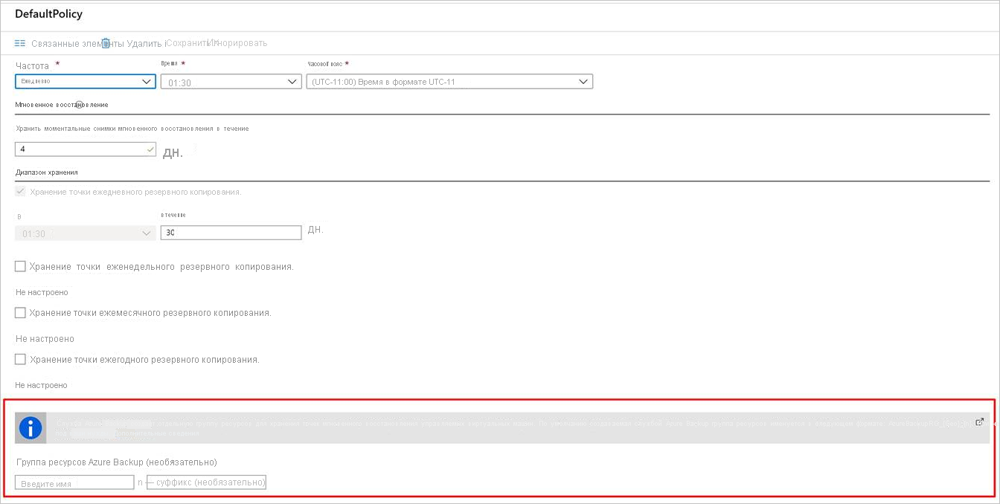

# Включение резервного копирования при создании виртуальной машины Azure

Используйте службу резервного копирования Azure для резервного копирования виртуальных машин Azure (VM). ВМ резервируются в соответствии с графиком, указанным в политике резервного копирования, а точки восстановления создаются из резервных копий. Точки восстановления хранятся в хранилищах служб восстановления.

В этой статье подробно описано, как включить резервное копирование при создании виртуальной машины (VM) на портале Azure.  

## Перед началом работы

- [Проверьте,](backup-support-matrix-iaas.md#supported-backup-actions) какие операционные системы поддерживаются при вралке резервного копирования при создании VM.

## Вход в Azure

Если вы еще не зарегистрировались в своей учетной записи, вопийте на [порталaz.](https://portal.azure.com)

## Создание VM с настройкой резервного копирования

1. На портале Azure нажмите **«Создайте ресурс».**

2. В Azure Marketplace нажмите **«Вычислить»** и выберите изображение VM.

3. Настройка VM в соответствии с инструкциями [Windows](https://docs.microsoft.com/azure/virtual-machines/windows/quick-create-portal) или [Linux.](https://docs.microsoft.com/azure/virtual-machines/linux/quick-create-portal)

4. На вкладке **"Управление"** в **резервном копировании**нажмите **на**кнопку .
5. Резервное копирование резервного копирования Azure в хранилище служб восстановления. Нажмите **Создать новый,** если у вас нет существующего хранилища.
6. Примите предложенное имя хранилища или укажите свое собственное.
7. Укажите или создайте группу ресурсов, в которой будет расположено хранилище. Хранилище группы ресурсов может отличаться от группы ресурсов VM.

    

8. Примите политику резервного копирования по умолчанию или измените настройки.
    - Политика резервного копирования определяет, как часто можно делать снимки резервного копирования VM, и как долго хранить резервные копии.
    - Политика по умолчанию резервирует VM один раз в день.
    - Вы можете настроить собственную политику резервного копирования для Azure VM, чтобы принимать резервные отпоры ежедневно или еженедельно.
    - [Узнайте больше](backup-azure-vms-introduction.md#backup-and-restore-considerations) о соображениях резервного копирования для Пазур VMs.
    - [Узнайте больше](backup-instant-restore-capability.md) о функциональности мгновенного восстановления.

      

## Группа ресурсов резервного копирования Azure для виртуальных машин

Служба резервного копирования создает отдельную группу ресурсов (RG), отличающаяся от группы ресурсов VM для хранения сбора точек восстановления (RPC). RPC дома мгновенного восстановления точек управляемых VMs. Формат именования по умолчанию группы ресурсов, `AzureBackupRG_<Geo>_<number>`созданный службой резервного копирования: Например: *AzureBackupRG_northeurope_1*. Теперь можно настроить имя группы ресурсов, созданное резервным копированием Azure.

Примечания:

1. Вы можете либо использовать имя RG по умолчанию, либо отсваиваться в соответствии с требованиями компании.
2. Шаблон имени RG предоставляется в качестве ввода при создании политики резервного копирования VM. Название RG должно быть следующего `<alpha-numeric string>* n <alpha-numeric string>`формата: . 'n' заменяется целым рядом (начиная с 1) и используется для масштабирования, если первая RG заполнена. Один RG может иметь максимум 600 RPCs сегодня.
              
3. Шаблон должен следовать правилам именования RG ниже, а общая длина не должна превышать максимально допустимую длину имени RG.
    1. Имена групп ресурсов позволяют только алфавитные символы, периоды, подчеркивание, дефисы и скобки. Они не могут закончиться в период.
    2. Имена групп ресурсов могут содержать до 74 символов, включая название RG и суффикс.
4. Первый `<alpha-numeric-string>` является обязательным, в то время как второй после 'n' является необязательным. Это относится только в том случае, если вы даете индивидуальное имя. Если вы ничего не вводите ни в одном из текстовых ящиков, используется имя по умолчанию.
5. Вы можете изменить имя RG, изменив политику, если это необходимо. Если шаблон имени изменен, в новой RG будут созданы новые RPs. Тем не менее, старые RPs по-прежнему будут проживать в старой RG и не будут перемещены, так как RP Collection не поддерживает перемещение ресурсов. В конце концов RPs будет получать мусор, собранный, как точки истекает.

6. Рекомендуется не блокировать группу ресурсов, созданную для использования службой резервного копирования.

## Запуск резервного копирования после создания VM

Резервное копирование VM будет работать в соответствии с вашей политикой резервного копирования. Тем не менее, мы рекомендуем запустить начальную резервную пришварту.

После создания VM сделайте следующее:

1. В свойствах VM нажмите **Backup.** Статус VM является первоначальным резервным копированием до тех пор, пока не будет завершено первоначальное резервное копирование
2. Нажмите **сейчас, чтобы** запустить резервную по требованию резервную часть.

    

## Используйте шаблон менеджера ресурсов для развертывания защищенного VM

Предыдущие шаги объясняют, как использовать портал Azure для создания виртуальной машины и защиты ее в хранилище служб восстановления. Чтобы быстро развернуть один или несколько вс-миноносций и защитить их в хранилище служб восстановления, см. шаблон [Развертывание Windows VM и включить резервное копирование.](https://azure.microsoft.com/resources/templates/101-recovery-services-create-vm-and-configure-backup/)

## Дальнейшие действия

Теперь, когда вы защитили ваш VM, узнать, как управлять и восстановить их.

- [Контроль и мониторинг виртуальных машин](backup-azure-manage-vms.md)
- [Восстановление виртуальной машины](backup-azure-arm-restore-vms.md)

Если вы столкнулись с какими-либо проблемами, [просмотрите](backup-azure-vms-troubleshoot.md) руководство по устранению неполадок.
