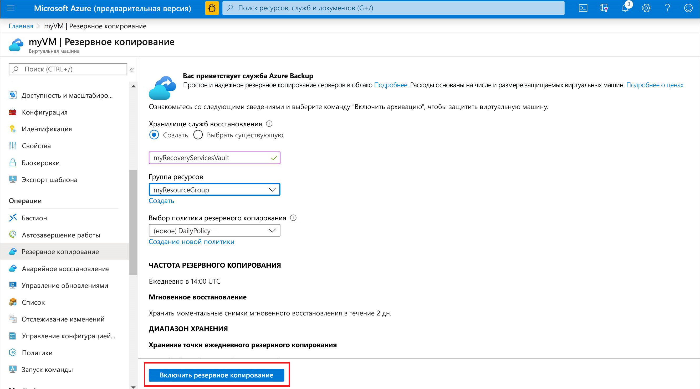
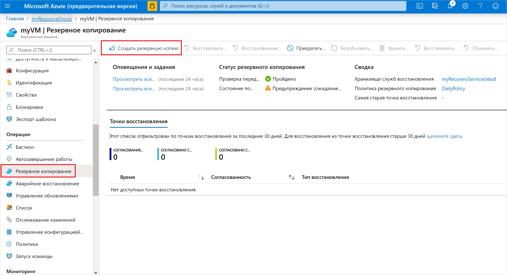
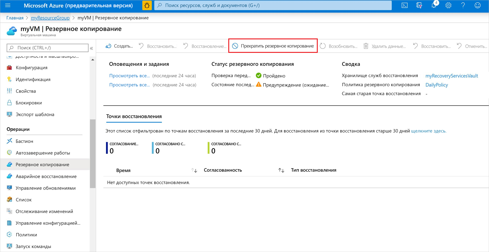

# Резервное копирование виртуальной машины в Azure

Резервные копии Azure можно создавать на портале Azure. В этом случае для создания и настройки резервных копий Azure и всех связанных ресурсов используется пользовательский интерфейс в браузере. Для защиты данных можно создавать архивы с регулярным интервалом. Служба Azure Backup создает точки восстановления, которые могут храниться в геоизбыточных хранилищах служб восстановления. В этой статье объясняется, как создать резервную копию виртуальной машины с помощью портала Azure.

В этом руководстве объясняется, как включить резервное копирование существующей виртуальной машины Azure. Если вам необходимо создать виртуальную машину, см. руководство по [созданию виртуальной машины с помощью портала Azure](../virtual-machines/windows/quick-create-portal.md).

## Вход в Azure

Войдите на [портал Azure](https://portal.azure.com).

## Выбор виртуальной машины для резервного копирования

Создайте простую операцию ежедневной архивации в хранилище служб восстановления.

1. В меню слева выберите **Виртуальные машины**.
2. Выберите из этого списка виртуальную машину для резервного копирования. Если вы использовали простые шаблонные команды для виртуальной машины, виртуальная машина с именем *myVM* будет находится в группе ресурсов *myResourceGroup*.
3. В разделе **Операции** выберите **Резервное копирование**. Откроется окно **Включение резервного копирования**.

## Включение резервного копирования на виртуальной машине

Хранилище служб восстановления — это логический контейнер, в котором хранятся данные резервного копирования для каждого защищенного ресурса, например виртуальных машин Azure. Когда выполняется задание резервного копирования для защищенного ресурса, в хранилище служб восстановления создается точка восстановления. Позже вы сможете использовать одну из этих точек восстановления, чтобы восстановить данные до определенной точки во времени.

1. Выберите **Создать** и укажите имя нового хранилища, например *myRecoveryServicesVault*.
2. Если вы еще не выбрали группу ресурсов, выберите параметр **Использовать существующую**, а затем выберите группу ресурсов виртуальной машины в раскрывающемся меню.

    

    По умолчанию в качестве хранилища задано геоизбыточное хранилище. Для дополнительной защиты данных этот уровень избыточности хранилища гарантирует, что данные резервного копирования реплицируются в дополнительный регион Azure, который находится в сотнях километров от основного.

    Создавая и используя политики, вы можете определить, когда выполнять задание резервного копирования и как долго хранить точку восстановления. Согласно политике защиты по умолчанию задание резервного копирования выполняется каждый день, а точки восстановления хранятся в течение 30 дней. Вы можете использовать значения политики по умолчанию, чтобы быстро защитить виртуальную машину.

3. Чтобы принять значения стандартной политики резервного копирования, выберите **Включить резервное копирование**.

Создание хранилища служб восстановления занимает несколько секунд.

## Запуск задания резервного копирования

Вы можете начать резервное копирование, не дожидаясь, пока политика по умолчанию запустит задание в запланированное время. В ходе первого задания резервного копирования создается точка полного восстановления. Во всех заданиях после начального резервного копирования создаются добавочные точки восстановления. Добавочные точки восстановления требуют мало места и времени, так как они позволяют передать только изменения, внесенные с момента последнего резервного копирования.

1. В окне **Резервное копирование** виртуальной машины выберите **Создать резервную копию**.

    

2. Чтобы принять политику хранения резервных копий в течение 30 дней, оставьте стандартное значение даты для параметра **Хранить архивные копии до**. Чтобы запустить задание, выберите **Резервное копирование**.

## Мониторинг задания резервного копирования

В окне **Резервное копирование** виртуальной машины отображается состояние резервного копирования и число созданных точек восстановления. Когда задание резервного копирования виртуальной машины будет завершено, справа от окна **Общие сведения** отобразится **время последнего резервного копирования**, **последняя точка восстановления** и **первая точка восстановления**.

## Очистка развертывания

Если защита больше не нужна, вы можете отключить ее на виртуальной машине, удалить точки восстановления и хранилище служб восстановления, а затем удалить группу ресурсов и связанные ресурсы виртуальной машины.

Если вы планируете ознакомиться с руководством по службе Backup, в котором объясняется, как восстанавливать данные виртуальной машины, пропустите шаги в этом разделе и перейдите к [дальнейшим действиям](#next-steps).

1. Выберите вариант **Резервное копирование** для виртуальной машины.

2. Выберите **Дополнительно**, чтобы отобразить дополнительные параметры, а затем выберите **Остановить резервное копирование**.

    

3. Выберите в раскрывающемся меню **Удалить данные резервного копирования**.

4. В диалоговом окне **Ввод имени элемента резервного копирования** введите имя виртуальной машины, например *myVM*. Выбор **Прекратить резервное копирование**.

    Остановив резервное копирование виртуальной машины и удалив точки восстановления, можно удалить группу ресурсов. Если вы использовали существующую виртуальную машину, вы можете не удалять ресурсы и виртуальную машину.

5. В меню слева выберите **Группы ресурсов**.
6. Выберите группу ресурсов в списке. Если вы использовали простые шаблонные команды для виртуальной машины, группа ресурсов будет называться *myResourceGroup*.
7. Выберите **Удалить группу ресурсов**. Для подтверждения введите имя группы ресурсов, а затем выберите **Удалить**.

    

## Следующие шаги

В этом кратком руководстве вы создали хранилище служб восстановления, включили защиту на виртуальной машине и создали начальную точку восстановления. Дополнительные сведения о службе Azure Backup и службах восстановления см. в соответствующих руководствах.

> [!div class="nextstepaction"]
> [Резервное копирование нескольких виртуальных машин Azure](./tutorial-backup-vm-at-scale.md)
