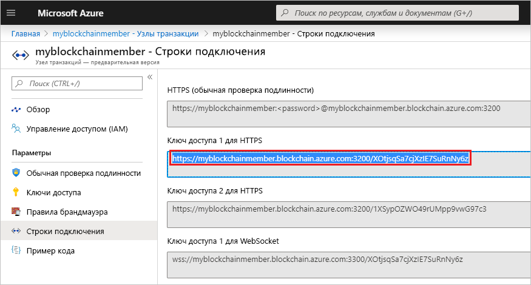

# <a name="quickstart-use-truffle-to-connect-to-azure-blockchain-service"></a>Краткое руководство. Подключение к службе "Блокчейн Azure" с помощью Truffle

В этом кратком руководстве вы используете подключение к узлу транзакции службы "Блокчейн Azure" с помощью Truffle. Затем вы используете интерактивную консоль Truffle, чтобы вызвать методы **web3** для взаимодействия с сетью блокчейн.

[!INCLUDE [quickstarts-free-trial-note](../../../includes/quickstarts-free-trial-note.md)]

## <a name="prerequisites"></a>Предварительные требования

* См. подробнее об [использовании созданию участника блокчейна на портале Azure](create-member.md) и [руководство по созданию участника блокчейна службы "Блокчейн Azure" с помощью Azure CLI](create-member-cli.md);
* Установите [Truffle](https://github.com/trufflesuite/truffle). Для работы с Truffle нужно установить несколько инструментов, включая [Node.js](https://nodejs.org) и [Git](https://git-scm.com/book/en/v2/Getting-Started-Installing-Git).
* Установите [Python 2.7.15](https://www.python.org/downloads/release/python-2715/). Python требуется для Web3.

## <a name="create-truffle-project"></a>Создание проекта Truffle

1. Откройте командную строку или оболочку Node.js.
1. Перейдите к каталогу, в котором нужно создать каталог проекта Truffle.
1. Создайте каталог для проекта и укажите путь к новому каталогу. Например,

    ``` bash
    mkdir truffledemo
    cd truffledemo
    ```

1. Инициализируйте проект Truffle.

    ``` bash
    truffle init
    ```

1. Установите web3 (API JavaScript для Ethereum) в папке проекта. Сейчас требуется web3 версии 1.0.0-beta.37.

    ``` bash
    npm install web3@1.0.0-beta.37
    ```

    Во время установки могут появиться предупреждения npm.
    
## <a name="configure-truffle-project"></a>Настройка проекта Truffle

Для настройки проекта Truffle вам потребуется дополнительная информация об узле транзакций с портала Azure.

1. Войдите на [портале Azure](https://portal.azure.com).
1. Перейдите в область участника службы "Блокчейн Azure". Выберите **Transaction nodes** (Узлы транзакций) и щелкните ссылку на узел транзакций по умолчанию.

    

1. Выберите элемент **Строки подключения**.
1. Скопируйте строку подключения в разделе **HTTPS (Access key 1)** (HTTPS (ключ доступа 1)). Строка понадобится вам при работе со следующим разделом.

    

### <a name="edit-configuration-file"></a>Изменение файла конфигурации

Затем вам нужно изменить файл конфигурации Truffle, указав конечную точку узла транзакции.

1. Откройте в редакторе файл конфигурации Truffle `truffle-config.js` в папке проекта **truffledemo**.
1. Замените содержимое файла следующими данными о конфигурации. Добавьте переменную, содержащую адрес конечной точки. Замените фрагменты в угловых скобках значениями, полученными выше.

    ``` javascript
    var defaultnode = "<default transaction node connection string>";   
    var Web3 = require("web3");
    
    module.exports = {
      networks: {
        defaultnode: {
          provider: new Web3.providers.HttpProvider(defaultnode),
          network_id: "*"
        }
      }
    }
    ```

1. Сохраните изменения в `truffle-config.js`.

## <a name="connect-to-transaction-node"></a>Подключение к узлу транзакций

Для подключения к узлу транзакций используйте *Web3*.

1. С помощью консоли Truffle подключитесь к узлу транзакций по умолчанию. В командной строке или оболочке выполните следующую команду:

    ``` bash
    truffle console --network defaultnode
    ```

    Truffle подключается к узлу транзакции по умолчанию и предоставляет интерактивную консоль.

    Вы можете вызывать методы в объекте **web3** для взаимодействия с сетью блокчейн.

1. Вызовите метод **getBlockNumber**, чтобы отобразился текущий номер блока.

    ```bash
    web3.eth.getBlockNumber();
    ```

    Выходные данные примера:

    ```bash
    truffle(defaultnode)> web3.eth.getBlockNumber();
    18567
    ```
1. Закройте консоль Truffle.

    ```bash
    .exit
    ```

## <a name="next-steps"></a>Дополнительная информация

В этом кратком руководстве вы использовали Truffle для подключения к узлу транзакции службы "Блокчейн Azure" по умолчанию и интерактивную консоль для возврата текущего номера блока блокчейн.

В следующем учебнике описано, как с помощью комплекта SDK службы "Блокчейн Azure" для Ethereum создать, собрать, развернуть и выполнить функцию смарт-контракта путем совершения транзакции.

> [!div class="nextstepaction"]
> [Создание, сборка и развертывание смарт-контрактов в службе "Блокчейн Azure"](send-transaction.md)
