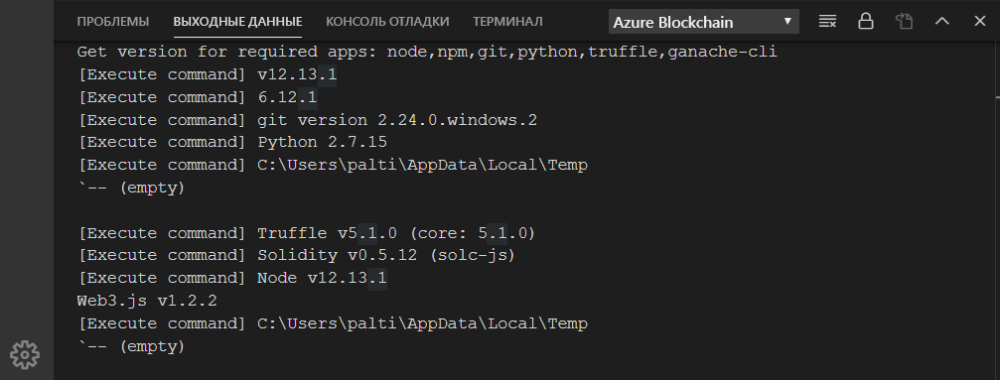
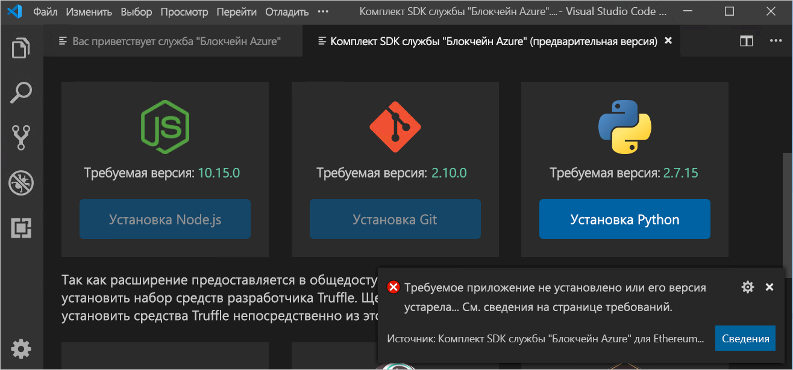

# Краткое руководство. Подключение к сети консорциума службы "Блокчейн Azure" с помощью Visual Studio Code

В этом кратком руководстве вы научитесь устанавливать и использовать комплект SDK службы "Блокчейн Azure" для Ethereum Visual Studio Code (VS Code), чтобы присоединиться к консорциуму в службе "Блокчейн Azure". Комплект SDK службы "Блокчейн Azure" упрощает создание, подключение, сборку и развертывание смарт-контрактов в реестре блокчейна Ethereum.

[!INCLUDE [quickstarts-free-trial-note](../../../includes/quickstarts-free-trial-note.md)]

## Предварительные требования

* См. подробнее об [использовании созданию участника блокчейна на портале Azure](create-member.md) и [руководство по созданию участника блокчейна службы "Блокчейн Azure" с помощью Azure CLI](create-member-cli.md);
* [Visual Studio Code](https://code.visualstudio.com/Download)
* [расширение "Комплект SDK Блокчейна Azure для Ethereum"](https://marketplace.visualstudio.com/items?itemName=AzBlockchain.azure-blockchain);
* [Node.js 10.15.x или более поздней версии](https://nodejs.org).
* [Git 2.10.x или более поздней версии](https://git-scm.com).
* [Python 2.7.15](https://www.python.org/downloads/release/python-2715/). Добавьте в путь файл python.exe. Python версии 2.7.15 необходим для комплекта SDK службы "Блокчейн Azure".
* [Truffle 5.0.0](https://www.trufflesuite.com/docs/truffle/getting-started/installation).
* [Ganache CLI 6.0.0](https://github.com/trufflesuite/ganache-cli).

В Windows для модуля node-gyp должен быть установлен компилятор C++. Вы можете использовать средства MSBuild:

* Если установлен Visual Studio 2017, настройте NPM для использования средств MSBuild с помощью команды `npm config set msvs_version 2017 -g`.
* Если установлен Visual Studio 2019, задайте путь к средствам сборки MS для NPM. Например `npm config set msbuild_path "C:\Program Files (x86)\Microsoft Visual Studio\2019\Community\MSBuild\Current\Bin\MSBuild.exe"`.
* В противном случае установите автономные средства сборки VS, используя `npm install --global windows-build-tools` в командной оболочке с повышенными правами *от имени администратора*.

Дополнительные сведения о node-gyp см. в репозитории [node-gyp на сайте GitHub](https://github.com/node-gyp).

### Проверка среды комплекта SDK службы "Блокчейн Azure"

Комплект SDK службы "Блокчейн Azure" проверяет, выполняются ли необходимые условия для среды разработки. Чтобы проверить среду разработки, выполните следующие действия:

В палитре команд VS Code выберите **Azure Blockchain: Show Welcome Page** (Блокчейн Azure. Показать страницу приветствия).

Комплект SDK службы "Блокчейн Azure" запускает проверочный скрипт, выполнение которого займет около минуты. Чтобы просмотреть выходные данные, выберите **Терминал > Создать терминал**. В строке меню терминала выберите вкладку **Выходные данные**, а в раскрывающемся списке — **Блокчейн Azure**. При успешном завершении проверки отобразится следующий результат:

 Если требуемое средство отсутствует, отобразится новая вкладка **Azure Blockchain Development Kit - Preview** (Комплект SDK службы "Блокчейн Azure" — предварительная версия) со списком нужных средств и ссылками для их скачивания.

Чтобы продолжить изучение краткого руководства установите недостающие компоненты.

## Подключение к участнику консорциума

Подключиться к участникам консорциума можно с помощью расширения "Комплект SDK службы "Блокчейн Azure" для VS Code. После подключения к консорциуму вы можете создавать и развертывать смарт-контракты в участнике консорциума службы "Блокчейн Azure".

Если у вас нет доступа к участнику консорциума службы "Блокчейн Azure", выполните предварительные требования, изложенные в [руководстве по созданию участника блокчейна на портале Azure](create-member.md) и [руководство по созданию участника блокчейна службы "Блокчейн Azure" с помощью Azure CLI](create-member-cli.md).

1. В области обозревателя VS Code разверните расширение **Блокчейн Azure**.
1. Выберите **Подключиться к сети**.

   

    При появлении запроса на проверку подлинности Azure следуйте инструкциям, чтобы выполнить аутентификацию с помощью браузера.
1. В раскрывающемся списке палитры команд выберите **Блокчейн Azure**.
1. Выберите подписку и группу ресурсов, связанные с участником консорциума службы "Блокчейн Azure".
1. Выберите свой консорциум из списка.

Консорциум и участники блокчейна отображаются на боковой панели обозревателя VS Code.

## Дальнейшие действия

В этом кратком руководстве вы использовали комплект SDK службы "Блокчейн Azure" для Ethereum VS Code, чтобы присоединиться к консорциуму в службе "Блокчейн Azure". В следующем учебнике описано, как с помощью комплекта SDK службы "Блокчейн Azure" для Ethereum создать, собрать, развернуть и выполнить функцию смарт-контракта путем совершения транзакции.

> [!div class="nextstepaction"]
> [Создание, сборка и развертывание смарт-контрактов в службе "Блокчейн Azure"](send-transaction.md)