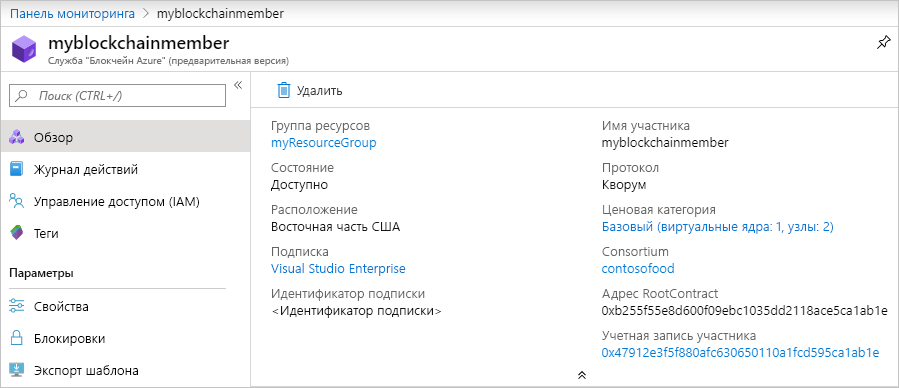

# Краткое руководство. Создание участника блокчейн-сети службы "Блокчейн Azure" с помощью портала Azure

В этом кратком руководстве вы развернете нового участника блокчейн-сети и консорциум в службе "Блокчейн Azure" с помощью портала Azure.

[!INCLUDE [quickstarts-free-trial-note](../../../includes/quickstarts-free-trial-note.md)]

## Предварительные требования

Нет.

## Создание участника блокчейн-сети

Элемент в службе "Azure Блокчейн" — это блокчейн-узел в частной сети блокчейн-консорциума. При подготовке элемента можно создать сеть консорциума или присоединиться к ней. Для сети консорциума требуется хотя бы один элемент. Количество элементов блокчейн-сети, необходимых участникам консирцуима, зависит от вашего сценария. У участников консорциума может быть один или несколько элементов блокчейн-сети или участники могут использовать их совместно. Дополнительные сведения о консорциумах см. в разделе [Консорциум службы "Блокчейн Azure"](consortium.md).

1. Войдите на [портал Azure](https://portal.azure.com).
1. Щелкните **Создать ресурс** в верхнем левом углу окна портала Azure.
1. Выберите **Блокчейн** > **Azure Blockchain Service (preview)** (Служба "Блокчейн Azure" (предварительная версия)).

    

    Параметр | Описание
    --------|------------
    Подписка | Выберите подписку Azure, которую нужно использовать для службы. Если у вас есть несколько подписок, выберите ту, в которой взимается плата за использование ресурса.
    Группа ресурсов | Создайте группу ресурсов или используйте имеющуюся группу из подписки.
    Регион | Выберите регион для создания участника. Все участники консорциума должны находится в одном расположении. Компоненты могут быть недоступны в некоторых регионах. Диспетчер данных блокчейна Azure доступен в таких регионах Azure: восточная часть США и Западная Европа.
    Протокол | В настоящее время предварительная версия службы "Блокчейн Azure" поддерживает протокол Quorum.
    Консорциум | Введите уникальное имя для нового консорциума. Если вы присоединяетесь к консорциуму посредством приглашения, выберите имя этого консорциума. Дополнительные сведения о консорциумах см. в разделе [Консорциум службы "Блокчейн Azure"](consortium.md).
    Имя | Выберите уникальное имя для участника в службе "Блокчейн Azure". Имя участника блокчейн-сети может содержать только строчные буквы и цифры. Первый символ должен быть буквой. Значение должно иметь длину от 2 до 20 символов.
    Пароль учетной записи участника | Пароль учетной записи участника используется для шифрования закрытого ключа для учетной записи Ethereum, созданного для вашего участника. Учетная запись участника и ее пароль используются для управления консорциумом.
    Цены | Настройка и стоимость узла для новой службы. Выберите **Изменить**, чтобы переключаться между уровнями **Стандартный** и **Базовый**. Используйте уровень *Базовый* для разработки, тестирования и подтверждения концепций. Используйте уровень *Стандартный* для рабочих развертываний. Если вы работаете с Диспетчером данных блокчейна или отправляете большой объем частных транзакций, используйте ценовую категорию *Стандартный*. Изменение ценовой категории "Базовый" и "Стандартный" после создания элемента не поддерживается.
    Пароль узла | Пароль для узла транзакций по умолчанию участника. Этот пароль используется для обычной проверки подлинности при подключении к общедоступной конечной точке узла транзакций участника блокчейна.

1. Чтобы проверить параметры, выберите **Просмотр и создание**. Щелкните **Создать**, чтобы подготовить службу. Подготовка занимает примерно 10 минут.
1. На панели инструментов щелкните **Уведомления**, чтобы отслеживать процесс развертывания.
1. После развертывания перейдите в область участника блокчейн-сети.

Выберите **Обзор**, чтобы просмотреть основные сведения о службе, включая учетную запись участника и адрес RootContract.

## Очистка ресурсов

Данные о созданном участнике можно использовать для работы со следующим руководством или учебником. Если ресурсы больше не нужны, вы можете удалить их. Для этого удалите группу ресурсов `myResourceGroup`, которую создали для этого краткого руководства.

Чтобы удалить группу ресурсов, сделайте следующее:

1. На портале Azure перейдите к **группам ресурсов** в области навигации слева и выберите группу ресурсов, которую необходимо удалить.
2. Выберите **Удалить группу ресурсов**. Подтвердите удаление, введя имя группы ресурсов и выбрав **Удалить**.

## Дальнейшие действия

В этом кратком руководстве вы развернули участника службы "Блокчейн Azure" и новый консорциум. Ознакомьтесь со следующим кратким руководством, чтобы использовать комплект SDK службы "Блокчейн Azure" для Ethereum для присоединения к элементу в службе "Блокчейн Azure".

> [!div class="nextstepaction"]
> [Краткое руководство. Подключение к сети консорциума службы "Блокчейн Azure" с помощью Visual Studio Code](connect-vscode.md)
