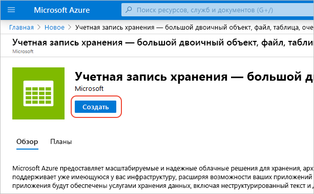
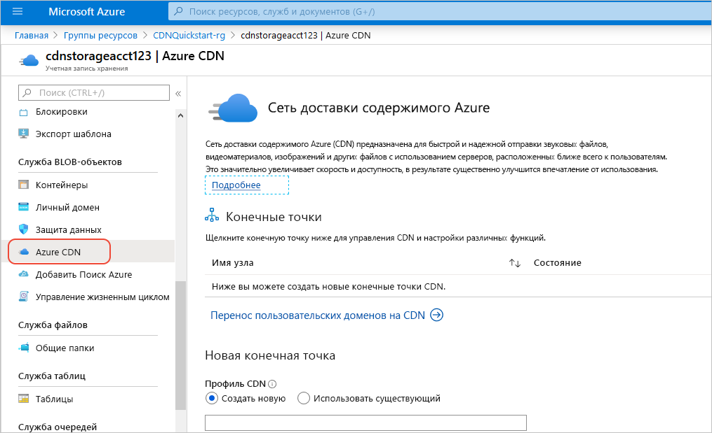
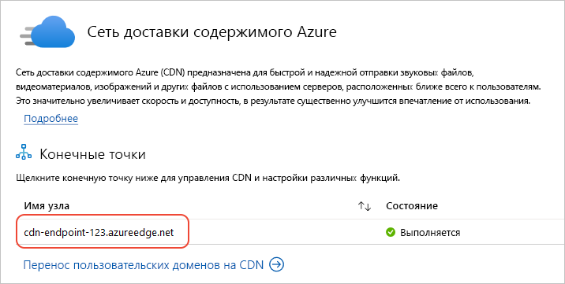

# Краткое руководство. Интеграция учетной записи хранения Azure с Azure CDN

С помощью этого краткого руководства вы настроите для [сети доставки содержимого Azure (CDN)](cdn-overview.md) кэширование содержимого из службы хранилища Azure. Azure CDN предлагает разработчикам глобальное решение по доставке больших объемов содержимого. Она может кэшировать большие двоичные объекты и статическое содержимое вычислительных экземпляров на физических узлах в США, Европе, Азии, Австралии и Южной Америке.

## Предварительные требования

- Учетная запись Azure с активной подпиской. [Создайте учетную запись](https://azure.microsoft.com/free/?ref=microsoft.com&utm_source=microsoft.com&utm_medium=docs&utm_campaign=visualstudio) бесплатно.

## Вход на портал Azure

Войдите на [портал Azure](https://portal.azure.com) с помощью своей учетной записи Azure.

## Создание учетной записи хранения

Учетная запись хранения предоставляет доступ к службам хранилища Azure. Учетная запись хранения представляет собой высший уровень пространства имен для доступа ко всем компонентам службы хранилища Azure: хранилище BLOB-объектов Azure, очередей и таблиц. Дополнительную информацию см. в статье [Введение в хранилище Microsoft Azure](../storage/common/storage-introduction.md).

Чтобы создать учетную запись хранения, вы должны быть администратором службы или соадминистратором для связанной подписки.

1. На портале Azure слева вверху выберите **Создать ресурс**. Появится панель **Создание**.

1. Найдите элемент **Учетная запись хранения** и выберите **Учетная запись хранения — BLOB-объект, файл, таблица, очередь** из раскрывающегося списка. Щелкните **Создать**.
    
    

1. На странице **Создание учетной записи хранения** введите следующие данные:

    | Параметр | Значение | 
    | --- | --- |
    | Сведения о проекте > Группа ресурсов | Выберите **Создать** и укажите имя *CDNQuickstart-rg*. Если пожелаете, здесь можно использовать существующую группу ресурсов. |
    | Сведения об экземпляре > Имя учетной записи хранения | Введите имя учетной записи длиной от 3 до 24 символов, используя только строчные буквы и цифры. Это имя должно быть уникальным в пределах Azure; оно станет именем узла в URL-адресе, используемом для адресации ресурсов BLOB-объекта, очереди и таблицы для подписки. Для обращения к ресурсу контейнера в хранилище BLOB-объектов используйте URI в следующем формате: http:// *&lt;имя_учетной_записи_хранилища&gt;* .blob.core.windows.net/ *&lt;имя_контейнера&gt;* .
    | Сведения об экземпляре > Расположение | В раскрывающемся списке выберите ближайший к вам регион Azure. |
    
    Сохраните все остальные значения по умолчанию и щелкните **Просмотреть и создать**.

1. Создание учетной записи хранения может занять несколько минут. После завершения создания щелкните **Перейти к ресурсу**, чтобы открыть страницу учетной записи хранения для перехода к следующему шагу.

## Включение Azure CDN для учетной записи хранения

1. На странице учетной записи хранения выберите в меню слева **Служба BLOB-объектов** > **Azure CDN**. Откроется страница **Azure CDN**.

    
    
1. В разделе **Новая конечная точка** введите следующие данные:

    | Параметр  | Значение |
    | -------- | ----- |
    | **Профиль CDN** | Щелкните **Создать** и введите имя профиля, например, *cdn-profile-123*. Профиль представляет собой коллекцию конечных точек. |
    | **Ценовая категория** | Выберите один из вариантов с пометкой **стандартный**, например **Стандартный (Майкрософт)** . |
    | **Имя конечной точки CDN** | Введите имя узла конечной точки, например, *cdn-endpoint-123*. Это имя должно быть глобально уникальным в Azure, так как будет использоваться для доступа к кэшированным ресурсам по адресу _&lt;имя_конечной_точки&gt;_ .azureedge.net. |
    | **Имя узла источника** | По умолчанию созданная конечная точка CDN использует имя узла учетной записи хранения как сервер-источник. |

1. Нажмите кнопку **создания**. Созданная конечная точка отображается в списке конечных точек.

    

> [!TIP]
> Если для конечной точки CDN нужно указать дополнительные параметры, например [оптимизировать скачивание больших файлов](cdn-optimization-overview.md#large-file-download), создайте конечную точку CDN или профиль CDN с помощью [расширения Azure CDN](cdn-create-new-endpoint.md).

## Включение дополнительных функций CDN

На странице **Сеть доставки содержимого Azure** для учетной записи хранения выберите в списке конечную точку CDN, чтобы открыть страницу конфигурации конечной точки CDN.

Н этой странице вы можете включить дополнительные функции CDN для доставки, например [сжатие](cdn-improve-performance.md), [кэширование строк запросов](cdn-query-string.md) и [геофильтрацию](cdn-restrict-access-by-country.md). 
    
## Активация подписанных URL-адресов

Если вы хотите предоставить ограниченный доступ к частным контейнерам хранилища, то можете использовать функцию подписанных URL-адресов (SAS) учетной записи хранения Azure. SAS — это URI, который предоставляет ограниченные права доступа к ресурсам хранилища Azure, не отображая ключ вашей учетной записи. Дополнительные сведения см. в статье [Использование Azure CDN с SAS](cdn-sas-storage-support.md).

## Получение доступа к содержимому CDN

Для доступа к кэшированному содержимому в сети CDN воспользуйтесь URL-адресом CDN, отображаемым в портале. Адрес для кэшированного большого двоичного объекта будет иметь следующий вид:

http://<*имя_конечной_точки*\>.azureedge.net/<*общедоступный_контейнер*\>/<*имя_BLOB-объекта*\>

> [!NOTE]
> Когда вы включите доступ Azure CDN к учетной записи хранения, ко всем общедоступным объектам будут применяться кэширование CDN POP. После изменения объекта, который находится в кэше CDN, новое содержимое будет недоступно через Azure CDN до следующего обновления содержимого, например по истечении срока жизни кэшированного содержимого.

## Удаление содержимого из Azure CDN

Если кэширование объекта в сети CDN Azure больше не требуется, можно выполнить одно из следующих действий:

- Сделать контейнер закрытым, а не общедоступным. Дополнительные сведения см. в статье [Управление анонимным доступом на чтение к контейнерам и большим двоичным объектам](../storage/blobs/storage-manage-access-to-resources.md).
- Отключить или удалить конечную точку CDN с помощью портала Azure.
- Изменить размещенную службу, чтобы она перестала отвечать на запросы объекта.

Объект, кэшированный в сети Azure CDN, сохраняется в кэше до истечения срока жизни для этого объекта или до [очистки](cdn-purge-endpoint.md) конечной точки. По истечении срока действия Azure CDN проверит, действует ли еще конечная точка CDN и возможен ли анонимный доступ к этому объекту. Если это не так, объект больше не будет кэшироваться.

## Очистка ресурсов

На предыдущих шагах вы создали профиль и конечную точку CDN в группе ресурсов. Сохраните эти ресурсы, чтобы перейти к разделу [Дополнительная информация](#next-steps) и узнать, как добавить личный домен к конечной точке. Но если в будущем эти ресурсы вам не понадобятся, их можно удалить, удалив группу ресурсов, чтобы избежать дополнительных затрат:

1. На портале Azure в меню слева щелкните **Группы ресурсов**, а затем выберите *CDNQuickstart-rg*\*.

2. На странице **Группа ресурсов** выберите **Удалить группу ресурсов**, в текстовом поле введите *CDNQuickstart-rg* и щелкните **Удалить**.

    В результате удалится группа ресурсов, профиль и конечная точка, которые вы создали с помощью этого краткого руководства.

3. Чтобы удалить учетную запись хранилища, выберите ее на панели мониторинга и щелкните **Удалить** в меню сверху.

## Дальнейшие действия

> [!div class="nextstepaction"]
> [Создание профиля и конечной точки Azure CDN](cdn-create-new-endpoint.md)

> [!div class="nextstepaction"]
> [Руководство. по добавлению сети доставки содержимого Azure в веб-приложение службы приложений Azure](cdn-add-to-web-app.md)
