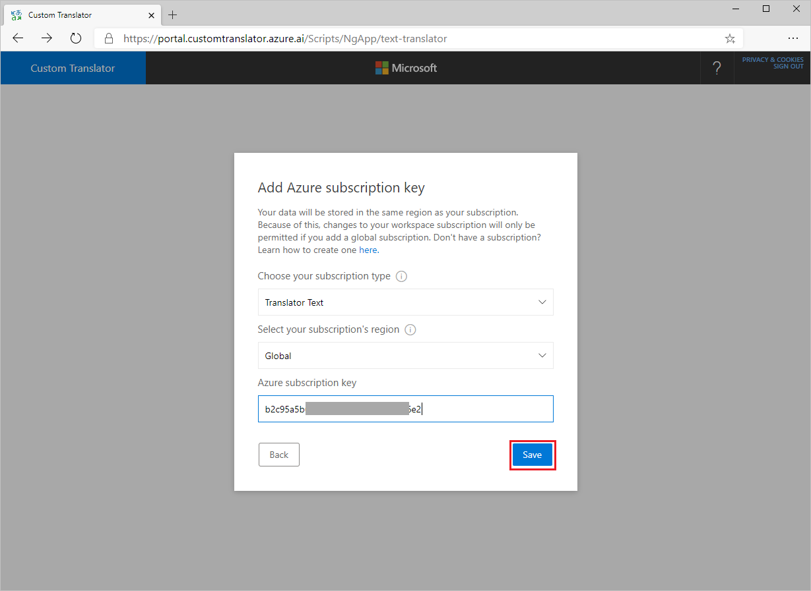

# Краткое руководство. Создание, развертывание и использование пользовательской модели для перевода

В этой статье приведена пошаговая инструкция по созданию системы перевода с помощью Custom Translator.

## Предварительные требования

1. Чтобы войти на портал [Custom Translator](https://portal.customtranslator.azure.ai) и использовать его, вам потребуется [учетная запись Майкрософт](https://signup.live.com) или [Azure AD](https://docs.microsoft.com/azure/active-directory/fundamentals/active-directory-whatis) (размещенная в Azure учетная запись организации).

2. Подписка на службу "Переводчик", которую можно получить на портале Azure. Вам нужно связать ключ подписки службы "Переводчик" с рабочей областью в Пользовательском переводчике. См. сведения о [регистрации для использования Переводчика](https://docs.microsoft.com/azure/cognitive-services/translator/translator-text-how-to-signup).

3. Если у вас есть все указанные выше компоненты, войдите на портал [Пользовательского переводчика](https://portal.customtranslator.azure.ai), чтобы создавать рабочие области и проекты, загружать файлы, а также создавать и развертывать модели.

## Создание рабочей области

Если раньше вы не работали с этим продуктом, вам будет предложено принять условия предоставления услуг, создать рабочую область и связать рабочую область с подпиской службы "Переводчик.

В один из последующих визитов на портал Пользовательского переводчика перейдите на страницу параметров, где вы сможете администрировать рабочую область, создать дополнительные рабочие области, связать ключ подписки Переводчика с рабочими областями, добавить совладельцев, а также изменить ключ подписки.

## Создание проекта

На целевой странице портала Custom Translator щелкните New Project (Новый проект). В диалоговом окне можно ввести имя нужного проекта, языковую пару и категорию, а также заполнить другие соответствующие поля. Сохраните проект. [Дополнительные сведения о создании проекта](how-to-create-project.md).

## Отправка документов

Затем отправьте наборы документов для [обучения](training-and-model.md#training-document-type-for-custom-translator), [настройки](training-and-model.md#tuning-document-type-for-custom-translator) и [тестирования](training-and-model.md#testing-dataset-for-custom-translator). Вы можете отправить [параллельные](what-are-parallel-documents.md) или комбинированные документы. Можно также отправить [словарь](what-is-dictionary.md).

Вы можете отправить документы со вкладки документов или со страницы конкретного проекта.

При отправке документов выберите тип документа (обучение, настройка или тестирование) и языковую пару. В случае отправки параллельных документов необходимо дополнительно указать имя документа. Дополнительные сведения см. в статье о [передаче документов](how-to-upload-document.md).

## Создание модели

После передачи всех необходимых документов нужно переходить к созданию модели.

Выберите проект, который вы создали. Вы увидите все отправленные вами документы, языковая пара которых совпадает с настроенной для этого проекта. Выберите документы, которые необходимо включить в модель. Вы можете выбрать данные для [обучения](training-and-model.md#training-document-type-for-custom-translator), [настройки](training-and-model.md#tuning-document-type-for-custom-translator) или [тестирования](training-and-model.md#testing-dataset-for-custom-translator) либо выбрать только данные для обучения и разрешить Custom Translator автоматически создать для модели наборы для настройки и тестирования.

Когда вы выберете нужные документы, нажмите кнопку Create Model (Создать модель), чтобы создать модель и начать обучение. На вкладке Models (Модели) вы увидите состояние обучения и сведения обо всех обученных моделях.

[Дополнительные сведения об обучении модели](how-to-train-model.md).

## Анализ модели

После успешного завершения обучения проверьте результаты. Оценка BLEU — это метрика, которая показывает качество вашего перевода. Вы также можете самостоятельно сравнить переводы, сделанные с помощью вашей пользовательской модели, с переводами, которые предоставлены в наборе тестирования, перейдя на вкладку Test (Тестирование) и выбрав System Results (Результаты системы). Проверка некоторых из этих переводов самостоятельно даст вам хорошее представление о качестве перевода, сделанного системой. Дополнительные сведения см. в статье [Просмотр результатов теста системы](how-to-view-system-test-results.md).

## Развертывание обученной модели

Когда вы будете готовы развернуть обученную модель, нажмите кнопку Deploy (Развернуть). У вас может быть одна развернутая модель на проект, и вы можете просмотреть состояние развертывания в столбце состояния. Дополнительные сведения см. в разделе [Развертывание модели](how-to-view-system-test-results.md#deploy-a-model)

## Использование развернутой модели

Доступ к развернутым моделям можно получить через служу "Переводчик", указав идентификатор категории](https://docs.microsoft.com/azure/cognitive-services/translator/reference/v3-0-translate?tabs=curl). Дополнительные сведения о службе "Переводчик" см. в [справочнике по API](https://docs.microsoft.com/azure/cognitive-services/translator/reference/v3-0-reference).

## Дальнейшие действия

- Узнайте, как переходить между элементами в [рабочей области Custom Translator и управлять проектами](workspace-and-project.md).
