[Иммерсивное средство чтения](https://www.onenote.com/learningtools) — это включительно разработанное решение, в котором реализованы проверенные методы, улучшающие понимание при чтении.

В рамках этого краткого руководства вы создадите с нуля приложение Android и интегрируете в него иммерсивное средство чтения. Полностью рабочий пример этого краткого руководства доступен [на GitHub](https://github.com/microsoft/immersive-reader-sdk/tree/master/js/samples/quickstart-java-android).

Если у вас еще нет подписки Azure, [создайте бесплатную учетную запись](https://azure.microsoft.com/free/?WT.mc_id=A261C142F), прежде чем начинать работу.

## <a name="prerequisites"></a>Предварительные требования

* Ресурс "Иммерсивное средство чтения", настроенный для проверки подлинности Azure Active Directory. Инструкции по настройке см. [здесь](../../how-to-create-immersive-reader.md). Некоторые из созданных здесь значений вам потребуются при настройке свойств среды. Сохраните результаты своего сеанса в текстовом файле для использования в будущем.
* [Git](https://git-scm.com/).
* [Пакет SDK иммерсивного средства чтения.](https://github.com/microsoft/immersive-reader-sdk)
* [Android Studio](https://developer.android.com/studio).

## <a name="create-an-android-project"></a>Создание проекта Android

Создайте новый проект в Android Studio. Исходный код для этого примера доступен в составе [пакета SDK для иммерсивного средства чтения](https://github.com/microsoft/immersive-reader-sdk/tree/master/js/samples/quickstart-java-android).


В окне **Choose your project** (Выбор проекта) выберите **Empty Activity** (Пустое действие) и щелкните **Next** (Далее).

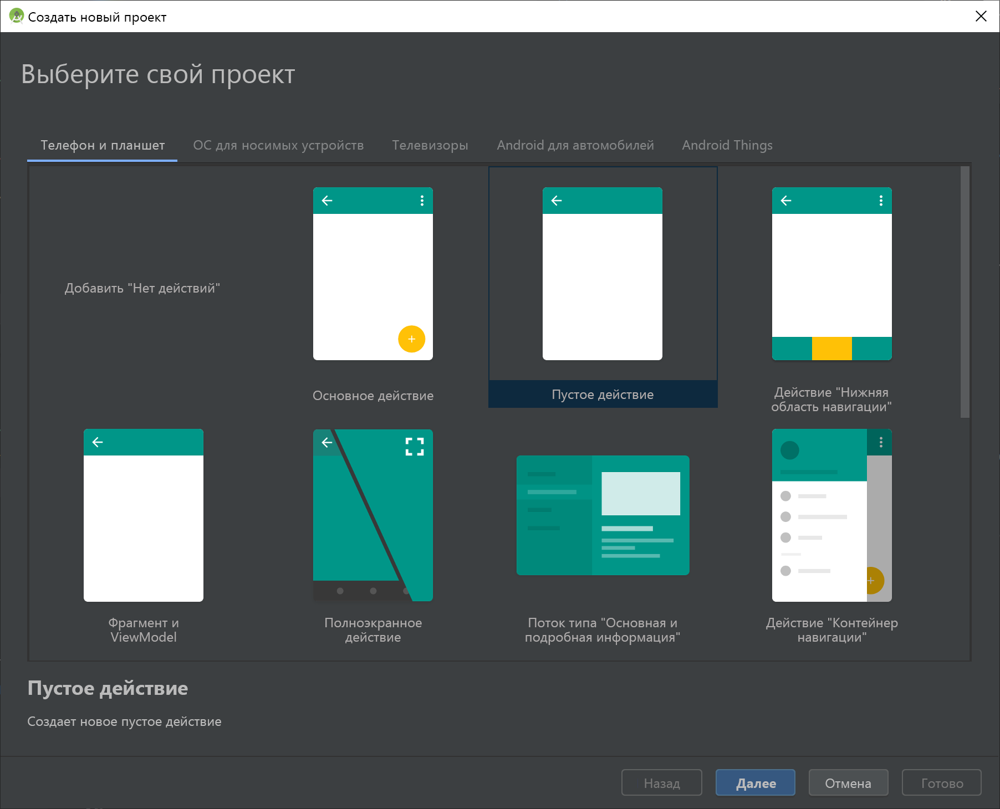

## <a name="configure-the-project"></a>Настройка проекта

Присвойте проекту имя **QuickstartJava** и выберите расположение для его сохранения. Выберите язык программирования **Java**, а затем щелкните **Finish** (Завершить).


## <a name="set-up-assets-and-authentication"></a>Настройка папки assets и аутентификации

Создайте новую папку **/assets**.


 Создайте файл с расширением **env** внутри папки assets. Добавьте следующие имена и значения, используя данные о вашей среде. Не фиксируйте этот ENV-файл в системе управления версиями, так как он содержит секреты, не предназначенные для публикации.


```text
TENANT_ID=<YOUR_TENANT_ID>
CLIENT_ID=<YOUR_CLIENT_ID>
CLIENT_SECRET=<YOUR_CLIENT_SECRET>
SUBDOMAIN=<YOUR_SUBDOMAIN>
```


## <a name="add-dependencies"></a>Добавление зависимостей

Замените существующие зависимости в файле **build.gradle** указанными ниже реализациями, чтобы средства gson (синтаксический анализ JSON и сериализация) и dotenv могли ссылаться на переменные, определенные в ENV-файле. Возможно, при выполнении последующих действий в этом кратком руководстве вам придется повторно синхронизировать проект.

```build.gradle
dependencies {
    implementation fileTree(dir: 'libs', include: ['*.jar'])
    implementation 'androidx.appcompat:appcompat:1.0.2'
    implementation 'androidx.constraintlayout:constraintlayout:1.1.3'
    implementation 'com.google.code.gson:gson:2.8.6'
    implementation 'io.github.cdimascio:java-dotenv:5.1.3'
    testImplementation 'junit:junit:4.12'
    androidTestImplementation 'androidx.test.ext:junit:1.1.0'
    androidTestImplementation 'androidx.test.espresso:espresso-core:3.1.1'
}
```


## <a name="update-app-strings-and-layout-resources"></a>Обновление ресурсов строк и макета для приложения

Замените содержимое файла **res/strings/strings.xml** следующими строками, которые будут использоваться в приложении.


```strings.xml
<resources>

    <!-- Copyright (c) Microsoft Corporation. All rights reserved. -->
    <!-- Licensed under the MIT License. -->

    <string name="app_name">ImmersiveReaderSDK</string>
    <string name="geographyTitle">Geography</string>
    <string name="geographyTextEn">The study of Earth’s landforms is called physical geography. Landforms can be mountains and valleys. They can also be glaciers, lakes or rivers. Landforms are sometimes called physical features. It is important for students to know about the physical geography of Earth. The seasons, the atmosphere and all the natural processes of Earth affect where people are able to live. Geography is one of a combination of factors that people use to decide where they want to live. The physical features of a region are often rich in resources. Within a nation, mountain ranges become natural borders for settlement areas. In the U.S., major mountain ranges are the Sierra Nevada, the Rocky Mountains, and the Appalachians.Fresh water sources also influence where people settle. People need water to drink. They also need it for washing. Throughout history, people have settled near fresh water. Living near a water source helps ensure that people have the water they need. There was an added bonus, too. Water could be used as a travel route for people and goods. Many Americans live near popular water sources, such as the Mississippi River, the Colorado River and the Great Lakes.Mountains and deserts have been settled by fewer people than the plains areas. However, they have valuable resources of their own.</string>
    <string name="geographyTextFr">L\'étude des reliefs de la Terre est appelée géographie physique. Les reliefs peuvent être des montagnes et des vallées. Il peut aussi s\'agira de glaciers, delacs ou de rivières. Les reliefs sont parfois appelés caractéristiques physiques. Il est important que les élèves connaissent la géographie physique de laTerre. Les saisons, l\'atmosphère et tous les processus naturels de la Terre affectent l\'endroit où les gens sont capables de vivre. La géographie est l\'un desfacteurs que les gens utilisent pour décider où ils veulent vivre. Les caractéristiques physiques d\'une région sont souvent riches en ressources. Àl\'intérieur d\'une nation, les chaînes de montagnes deviennent des frontières naturelles pour les zones de peuplement. Aux États-Unis, les principaleschaînes de montagnes sont la Sierra Nevada, les montagnes Rocheuses et les Appalaches.Les sources d\'eau douce influencent également l\'endroit où lesgens s\'installent. Les gens ont besoin d\'eau pour boire. Ils en ont aussi besoin pour se laver. Tout au long de l\'histoire, les gens se sont installés près del\'eau douce. Vivre près d\'une source d\'eau permet de s\'assurer que les gens ont l\'eau dont ils ont besoin. Il y avait un bonus supplémentaire, aussi. L\'eaupourrait être utilisée comme voie de voyage pour les personnes et les marchandises. Beaucoup d\'Américains vivent près des sources d\'eau populaires,telles que le fleuve Mississippi, le fleuve Colorado et les Grands Lacs.Mountains et les déserts ont été installés par moins de gens que les zones desplaines. Cependant, ils disposent de ressources précieuses.Les gens ont une réponse.</string>
    <string name="immersiveReaderButtonText">Immersive Reader</string>
</resources>
```

Замените содержимое файла **res/layout/activity_main.xml** следующим кодом XML, который будет использоваться в приложении. Это макет пользовательского интерфейса для приложения в формате XML.

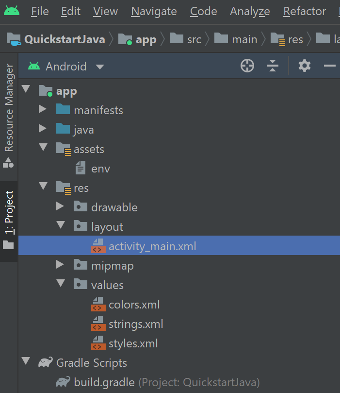

```activity_main.xml
<?xml version="1.0" encoding="utf-8"?>

<!-- Copyright (c) Microsoft Corporation. All rights reserved. -->
<!-- Licensed under the MIT License. -->

<androidx.constraintlayout.widget.ConstraintLayout xmlns:android="http://schemas.android.com/apk/res/android"
    xmlns:app="http://schemas.android.com/apk/res-auto"
    xmlns:tools="http://schemas.android.com/tools"
    android:layout_width="match_parent"
    android:layout_height="match_parent"
    android:background="#FFFFFF"
    tools:context=".MainActivity">

    <LinearLayout
        android:id="@+id/linearLayout"
        android:layout_width="match_parent"
        android:layout_height="0dp"
        android:background="#FFFFFF"
        android:orientation="vertical"
        app:layout_constraintBottom_toBottomOf="parent"
        app:layout_constraintEnd_toEndOf="parent"
        app:layout_constraintHorizontal_bias="0.0"
        app:layout_constraintStart_toStartOf="parent"
        app:layout_constraintTop_toTopOf="parent"
        app:layout_constraintVertical_bias="0.0">

        <TextView
            android:id="@+id/Title"
            android:layout_width="match_parent"
            android:layout_height="wrap_content"
            android:layout_marginLeft="48dp"
            android:layout_marginTop="24dp"
            android:layout_marginRight="48dp"
            android:layout_marginBottom="24dp"
            android:text="@string/geographyTitle"
            android:textSize="24sp"
            android:textStyle="bold" />

        <ScrollView
            android:id="@+id/ContentPane"
            android:layout_width="match_parent"
            android:layout_height="480dp"
            android:layout_marginBottom="48dp"
            android:clipToPadding="false"
            android:fillViewport="false"
            android:paddingLeft="48dp"
            android:paddingRight="48dp"
            android:scrollbarStyle="outsideInset"
            android:visibility="visible"
            tools:visibility="visible">

        <LinearLayout
            android:layout_width="match_parent"
            android:layout_height="match_parent"
            android:orientation="vertical">

            <TextView
                android:id="@+id/Content1"
                android:layout_width="match_parent"
                android:layout_height="wrap_content"
                android:background="#00FFFFFF"
                android:text="@string/geographyTextEn"
                android:textSize="18sp" />

            <TextView
                android:id="@+id/Content2"
                android:layout_width="match_parent"
                android:layout_height="wrap_content"
                android:background="#00FFFFFF"
                android:text="@string/geographyTextFr"
                android:textSize="18sp" />

            </LinearLayout>

        </ScrollView>

        <Button
            android:id="@+id/LaunchImmersiveReaderButton"
            android:layout_width="match_parent"
            android:layout_height="60dp"
            android:layout_marginLeft="40dp"
            android:layout_marginRight="40dp"
            android:layout_marginBottom="80dp"
            android:text="@string/immersiveReaderButtonText"
            android:textAllCaps="false"
            android:textSize="24sp"
            android:visibility="visible"
            tools:visibility="visible" />

    </LinearLayout>

</androidx.constraintlayout.widget.ConstraintLayout>
```

## <a name="add-the-web-view-layout"></a>Добавление макета веб-представления

В папке **res/layout/** создайте новый файл ресурсов макета и присвойте ему имя **activity_immersive_reader**. Затем замените содержимое приведенным ниже кодом XML. Этот код XML добавляет компонент WebView, который будет использоваться кодом Java для IRActivity (мы создадим его позже). Пока его определение отсутствует, что будет вызывать ошибки.

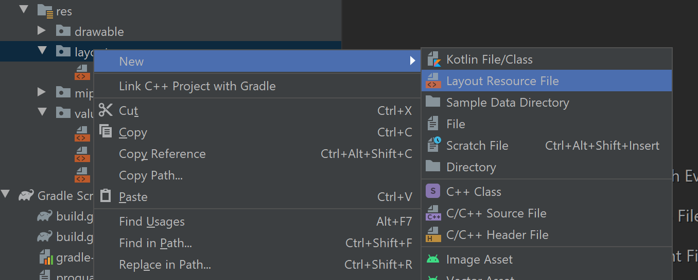

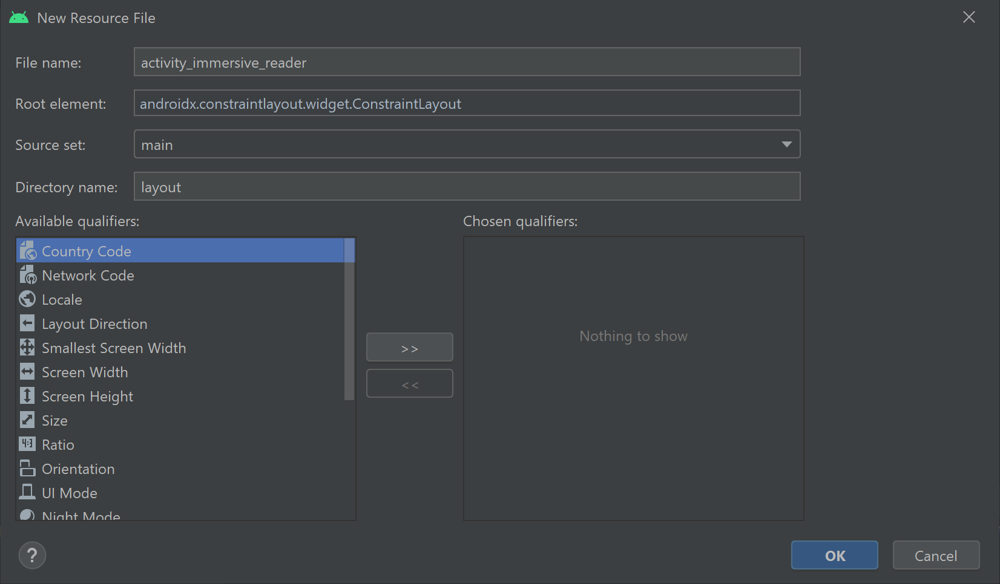

```activity_immersive_reader.xml
<?xml version="1.0" encoding="utf-8"?>

<!-- Copyright (c) Microsoft Corporation. All rights reserved. -->
<!-- Licensed under the MIT License. -->

<androidx.constraintlayout.widget.ConstraintLayout xmlns:android="http://schemas.android.com/apk/res/android"
    xmlns:tools="http://schemas.android.com/tools"
    android:layout_width="match_parent"
    android:layout_height="match_parent"
    android:background="#FFFFFF"
    tools:context=".IRActivity">

    <WebView
        android:id="@+id/webView"
        android:layout_width="match_parent"
        android:layout_height="match_parent" />

</androidx.constraintlayout.widget.ConstraintLayout>
```

## <a name="set-up-the-app-java-code"></a>Настройка кода Java для приложения

В папке **/Java/com.example.quickstartjava** вы увидите существующий файл **MainActivity.java** с классом Java. Именно в этой папке следует создавать логику приложения.

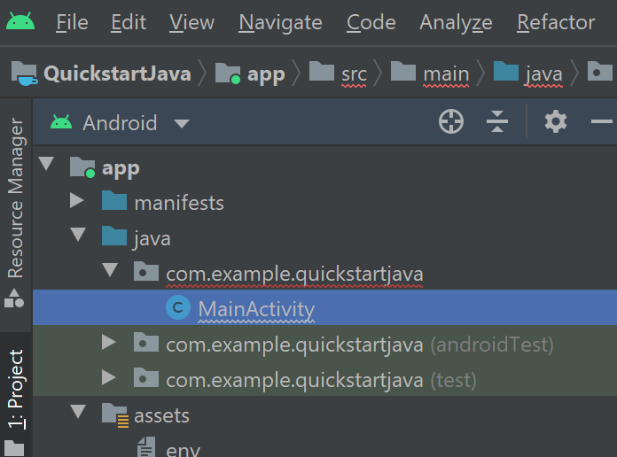

Замените содержимое файла **MainActivity.java** следующим кодом. В этом коде есть ссылки на несколько классов, которые еще не существуют и будут созданы позже.

```MainActivity.java
/**
 * Copyright (c) Microsoft Corporation. All rights reserved.
 * Licensed under the MIT License.
 */

package com.example.quickstartjava;

import android.app.Activity;
import android.os.Bundle;
import android.view.View;
import android.widget.Button;
import android.widget.TextView;

import java.util.ArrayList;
import java.util.List;

/**
 * Creates a new activity, finds its content and the Immersive Reader button.
 * When clicked, the app sends the content to the Immersive Reader SDK and
 * launches the Immersive Reader.
 */
public class MainActivity extends Activity {

    @Override
    public void onCreate(Bundle savedInstanceState) {
        super.onCreate(savedInstanceState);
        setContentView(R.layout.activity_main);
        final TextView irTitle = findViewById(R.id.Title);
        final TextView irText1 = findViewById(R.id.Content1);
        final TextView irText2 = findViewById(R.id.Content2);

        final Button immersiveReaderButton = findViewById(R.id.LaunchImmersiveReaderButton);
        immersiveReaderButton.setOnClickListener(new View.OnClickListener() {
            @Override
            public void onClick(View view) {
                List<ReadableTextChunk> readableTextChunks = new ArrayList<>();
                readableTextChunks.add(new ReadableTextChunk(irText1.getText().toString(), "en"));
                readableTextChunks.add(new ReadableTextChunk(irText2.getText().toString(), "fr"));
                ReadableContent readableContent = new ReadableContent(irTitle.getText().toString(), readableTextChunks);

                ImmersiveReader immersiveReader = new ImmersiveReader(MainActivity.this, new IRAuthenticator());
                immersiveReader.read(readableContent);
            }
        });
    }
}
```

Мы создадим еще 16 файлов для классов Java в папке **/Java/com.example.quickstartjava**. Каждый из этих классов используется приложением для интеграции пакета SDK для иммерсивного средства чтения. В каждом новом файле есть ссылки на несколько классов, которые еще не существуют и будут созданы позже. Когда вы завершите создание всех классов, ошибки пустых ссылок должны исчезнуть.

Чтобы создать новый файл с классом **ImmersiveReader.java**, щелкните правой кнопкой мыши папку в Android Studio, выберите **New** (Создать), а затем **Class Java** (Класс Java). Этот же метод создания файлов для классов Java вы примените для каждого создаваемого файла класса Java.

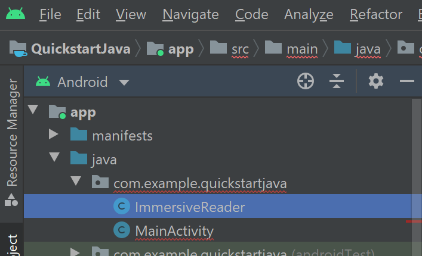

Замените содержимое файла **ImmersiveReader.java** следующим кодом.

```ImmersiveReader.java
/**
 * Copyright (c) Microsoft Corporation. All rights reserved.
 * Licensed under the MIT License.
 */

package com.example.quickstartjava;

import android.app.Activity;
import android.content.Intent;
import androidx.annotation.Keep;

import java.lang.ref.WeakReference;

/**
 * This is the client facing class for invoking the new Immersive Reader functionality.
 * Usage:
 * ImmersiveReader immersiveReader = new ImmersiveReader(Activity, IRAuthenticator);
 * immersiveReader.read(ReadableTextChunk);
 */


@Keep
public class ImmersiveReader {

    WeakReference<Activity> mActivityWR;

    /**
     * Interface to accept access token from client app.
     * Note that it is client's responsibility to give a valid Access Token whenever getAccessToken() is requested.
     * In favor of latency perf, there would be no further validation by Immersive Reader module except to ensure that the provided access token is non-empty string
     */
    @Keep
    public interface IAuthenticator {
        String getAccessToken();
    }

    public ImmersiveReader(Activity activity, IAuthenticator authenticator) {
        mActivityWR = new WeakReference<>(activity);
        IRDataHolder.getInstance().setAuthenticator(authenticator);
    }

    public ImmersiveReader(Activity activity) {
        this(activity, null);
    }

    /**
     * Launches a new activity to speak the content as described by ReadableContent object.
     *
     * @param dataToRead - Content to be read
     * @return IRError - IRError, with following error codes:
     * a) Error.NONE in case of successful launch of Immersive Reader
     * b) Error.INVALID_ACCESS_TOKEN in case of empty access token
     * c) Error.INVALID_STATE in case of empty activity
     * d) Error.INVALID_CONTENT in case of empty list of text chunks
     */

    public IRError read(ReadableContent dataToRead) {

        Activity activity = mActivityWR.get();
        if (activity == null) {
            return new IRError(Error.INVALID_STATE, "Client activity is null");
        }

        if (dataToRead == null || dataToRead.getTextChunks().size() == 0) {
            return new IRError(Error.INVALID_CONTENT, "Readable Text Chunks not passed to Immersive Reader");
        }

        IRDataHolder.getInstance().setContentToRead(dataToRead);
        Intent intent = new Intent(mActivityWR.get(), IRActivity.class);
        activity.startActivity(intent);

        return new IRError(Error.NONE, "Immersive Reader launched");
    }

}
```

Создайте новый файл класса Java **IRActivity.java**.


Замените содержимое файла **IRActivity.java** следующим кодом.

```IRActivity.java
/**
 * Copyright (c) Microsoft Corporation. All rights reserved.
 * Licensed under the MIT License.
 */

package com.example.quickstartjava;

import android.app.Activity;
import android.content.Intent;
import androidx.annotation.Keep;

import java.lang.ref.WeakReference;

/**
 * This is the client facing class for invoking the new Immersive Reader functionality.
 * Usage:
 * ImmersiveReader immersiveReader = new ImmersiveReader(Activity, IRAuthenticator);
 * immersiveReader.read(ReadableTextChunk);
 */


@Keep
public class ImmersiveReader {

    WeakReference<Activity> mActivityWR;

    /**
     * Interface to accept access token from client app.
     * Note that it is the client's responsibility to give a valid Access Token whenever getAccessToken() is requested.
     * In favor of latency perf, there would be no further validation by Immersive Reader module except to ensure that the provided access token is non-empty string.
     */
    @Keep
    public interface IAuthenticator {
        String getAccessToken();
    }

    public ImmersiveReader(Activity activity, IAuthenticator authenticator) {
        mActivityWR = new WeakReference<>(activity);
        IRDataHolder.getInstance().setAuthenticator(authenticator);
    }

    public ImmersiveReader(Activity activity) {
        this(activity, null);
    }

    /**
     * Launches a new activity to speak the content as described by ReadableContent object.
     *
     * @param dataToRead - Content to be read
     * @return IRError - IRError, with following error codes:
     * a) Error.NONE in case of successful launch of Immersive Reader
     * b) Error.INVALID_ACCESS_TOKEN in case of empty access token.
     * c) Error.INVALID_STATE in case of empty activity
     * d) Error.INVALID_CONTENT in case of empty list of text chunks
     */

    public IRError read(ReadableContent dataToRead) {

        Activity activity = mActivityWR.get();
        if (activity == null) {
            return new IRError(Error.INVALID_STATE, "Client activity is null");
        }

        if (dataToRead == null || dataToRead.getTextChunks().size() == 0) {
            return new IRError(Error.INVALID_CONTENT, "Readable Text Chunks not passed to Immersive Reader");
        }

        IRDataHolder.getInstance().setContentToRead(dataToRead);
        Intent intent = new Intent(mActivityWR.get(), IRActivity.class);
        activity.startActivity(intent);

        return new IRError(Error.NONE, "Immersive Reader launched");
    }

}
```

Создайте новый файл класса Java **IRError.java**.


Замените содержимое файла **IRError.java** следующим кодом.

```IRError.java
/**
 * Copyright (c) Microsoft Corporation. All rights reserved.
 * Licensed under the MIT License.
 */

package com.example.quickstartjava;

import android.os.Parcel;
import android.os.Parcelable;
import androidx.annotation.Keep;

/**
 * Shared error handling of the app.
 */

@Keep
public class IRError implements Parcelable {

    private int errorId;
    private String errorMessage = "";

    public String getErrorMessage() {
        return errorMessage;
    }

    public void setErrorMessage(String errorMessage) {
        this.errorMessage = errorMessage;
    }

    public int getErrorId() {
        return errorId;
    }

    public void setErrorId(int errorId) {
        this.errorId = errorId;
    }

    public IRError(int errorId, String errorMessage) {
        this.errorId = errorId;
        this.errorMessage = errorMessage;
    }

    // parcelable
    @Override
    public int describeContents() {
        return 0;
    }

    @Override
    public void writeToParcel(Parcel out, int flags) {
        out.writeInt(this.errorId);
        out.writeString(this.errorMessage);
    }

    public static final Creator<IRError> CREATOR
            = new Creator<IRError>() {
        public IRError createFromParcel(Parcel in) {
            return new IRError(in);
        }

        public IRError[] newArray(int size) {
            return new IRError[size];
        }
    };

    private IRError(Parcel in) {
        this.errorId = in.readInt();
        this.errorMessage = in.readString();
    }
}
```

Создайте новый файл класса Java **Error.java**.


Замените содержимое файла **Error.java** следующим кодом.

```Error.java
/**
 * Copyright (c) Microsoft Corporation. All rights reserved.
 * Licensed under the MIT License.
 */

package com.example.quickstartjava;

import androidx.annotation.Keep;

/**
 * Adds some default error status codes.
 */

@Keep
public class Error {

    public static final int NONE = 1000;
    public static final int INVALID_ACCESS_TOKEN = 8001;
    public static final int INVALID_STATE = 8002;
    public static final int INVALID_CONTENT = 8003;

}
```

Создайте новый файл класса Java **ReadableContent.java**.

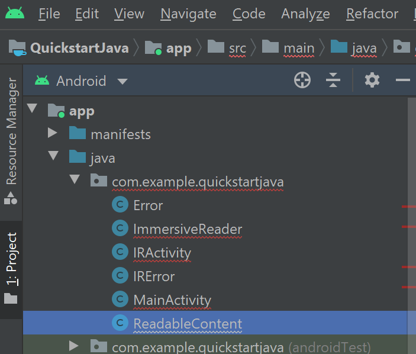

Замените содержимое файла **ReadableContent.java** следующим кодом.

```ReadableContent.java
/**
 * Copyright (c) Microsoft Corporation. All rights reserved.
 * Licensed under the MIT License.
 */

package com.example.quickstartjava;

import androidx.annotation.Keep;

import java.util.List;

/**
 * Content data to be sent to the Immersive Reader SDK
 */

@Keep
public class ReadableContent {

    private String mTitle;
    private List<ReadableTextChunk> mTextChunks;

    public ReadableContent(String title, List<ReadableTextChunk> textChunks) {
        this.mTitle = title;
        this.mTextChunks = textChunks;
    }

    public String getTitle() {
        return mTitle;
    }

    public List<ReadableTextChunk> getTextChunks() {
        return mTextChunks;
    }

}
```

Создайте новый файл класса Java **ReadableTextChunk.java**.


Замените содержимое файла **ReadableTextChunk.java** следующим кодом.

```ReadableTextChunk.java
/**
 * Copyright (c) Microsoft Corporation. All rights reserved.
 * Licensed under the MIT License.
 */

import androidx.annotation.Keep;

/**
 * Content sent to the Immersive Reader SDK may be separated into chunks so that there may be
 * different types of content sent in the same document. This includes content of different
 * languages, math content, et cetera.
 */

@Keep
public class ReadableTextChunk {
    public String mText;
    public String mLocale;

    public ReadableTextChunk(String text, String locale) {
        this.mText = text;
        this.mLocale = locale;
    }
}
```

Создайте новый файл класса Java **IRDataHolder.java**.


Замените содержимое файла **IRDataHolder.java** следующим кодом.

```IRDataHolder.java
/**
 * Copyright (c) Microsoft Corporation. All rights reserved.
 * Licensed under the MIT License.
 */

package com.example.quickstartjava;

import androidx.annotation.Keep;

/**
 * A thin singleton class that is used to hold the Client's IAuthenticator's implementation and the Content to be read.
 * This is required for two reasons:
 * 1) As per Android guidelines, data being passed via intent should be limited to a few KBs. Alternative is to use Singleton holder classes like this one.
 * 2) We need a way to make callbacks survive app configuration changes and killed in background scenarios.
 */

@Keep
public class IRDataHolder {

    private static IRDataHolder mInstance = null;
    private ReadableContent mActiveContent = null;
    private ImmersiveReader.IAuthenticator mAuthenticator = null;

    public static IRDataHolder getInstance() {

        if (mInstance == null) {
            synchronized (IRDataHolder.class) {
                if (mInstance == null) {
                    mInstance = new IRDataHolder();
                }
            }
        }
        return mInstance;
    }

    public void setContentToRead(ReadableContent content) {
        mActiveContent = content;
    }

    public ReadableContent getContentToRead() {
        return mActiveContent;
    }

    public ImmersiveReader.IAuthenticator getAuthenticator() {
        return mAuthenticator;
    }

    public void setAuthenticator(ImmersiveReader.IAuthenticator accessTokenProvider) {
        this.mAuthenticator = accessTokenProvider;
    }

    public void clearContent() {
        mActiveContent = null;
    }

}
```

Создайте новый файл класса Java **IRAuthenticator.java**.

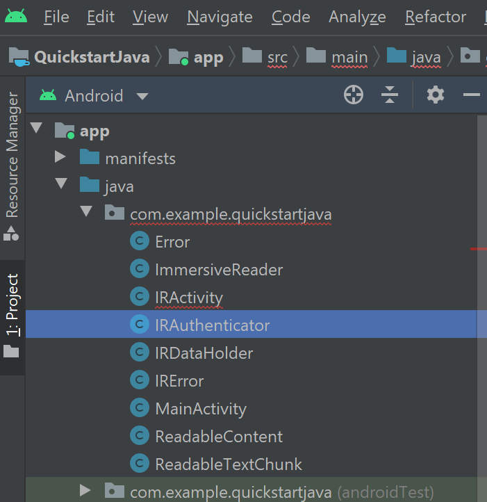

Замените содержимое файла **IRAuthenticator.java** следующим кодом.

```IRAuthenticator.java
/**
 * Copyright (c) Microsoft Corporation. All rights reserved.
 * Licensed under the MIT License.
 */

package com.example.quickstartjava;

import android.text.TextUtils;
import android.util.Log;

import org.json.JSONException;
import org.json.JSONObject;

import io.github.cdimascio.dotenv.Dotenv;
import java.io.BufferedReader;
import java.io.DataOutputStream;
import java.io.IOException;
import java.io.InputStreamReader;
import java.net.HttpURLConnection;
import java.net.MalformedURLException;
import java.net.URL;

import static java.net.HttpURLConnection.HTTP_OK;

// This sample app uses the Dotenv. It's a module that loads environment variables from a .env file to better manage secrets.
// https://github.com/cdimascio/java-dotenv
// Be sure to add a "env" file to the /assets folder.
// Instead of '.env', use 'env'.

public class IRAuthenticator implements ImmersiveReader.IAuthenticator {
    private static final String LOG_TAG = "IRAuthenticator";
    Dotenv dotEnv = Dotenv.configure()
            .directory("/assets")
            .filename("env")
            .ignoreIfMalformed()
            .ignoreIfMissing()
            .load();

    @Override
    public String getAccessToken() {
        String clientId = dotEnv.get("CLIENT_ID");
        String clientSecret = dotEnv.get("CLIENT_SECRET");
        String tenantId = dotEnv.get("TENANT_ID");
        String accessToken = null;

        try {
            StringBuilder urlStringBuilder = new StringBuilder();
            urlStringBuilder.append("https://login.windows.net/");
            urlStringBuilder.append(tenantId);
            urlStringBuilder.append("/oauth2/token");
            URL tokenUrl = new URL(urlStringBuilder.toString());


            StringBuilder formStringBuilder = new StringBuilder();
            formStringBuilder.append("grant_type=client_credentials&resource=https://cognitiveservices.azure.com/&client_id=");
            formStringBuilder.append(clientId);
            formStringBuilder.append("&client_secret=");
            formStringBuilder.append(clientSecret);
            String form = formStringBuilder.toString();

            HttpURLConnection httpURLConnection = (HttpURLConnection) tokenUrl.openConnection();
            httpURLConnection.setRequestMethod("POST");
            httpURLConnection.setRequestProperty("content-type", "application/x-www-form-urlencoded");
            httpURLConnection.setDoOutput(true);

            DataOutputStream dataOutputStream = new DataOutputStream(httpURLConnection.getOutputStream());
            dataOutputStream.writeBytes(form);
            dataOutputStream.flush();
            dataOutputStream.close();

            int responseCode = httpURLConnection.getResponseCode();

            if (responseCode == HTTP_OK) {
                BufferedReader bufferedReader = new BufferedReader(new InputStreamReader(httpURLConnection.getInputStream()));
                StringBuffer response = new StringBuffer();


                String line = bufferedReader.readLine();
                while (!TextUtils.isEmpty(line)) {
                    response.append(line);
                    line = bufferedReader.readLine();
                }

                bufferedReader.close();

                JSONObject accessTokenJson = new JSONObject(response.toString());
                accessToken = accessTokenJson.getString("access_token");
            }

        } catch (MalformedURLException e) {
            e.printStackTrace();
        } catch (IOException e) {
            e.printStackTrace();
        } catch (JSONException e) {
            e.printStackTrace();
        }

        //  accessToken = Constants.ACCESS_TOKEN;
        Log.i(LOG_TAG, "Accesstoken: " + accessToken);
        return accessToken;
    }
}
```

Создайте новый файл класса Java **IRLauncher.java**.


Замените содержимое файла **IRLauncher.java** следующим кодом.

```IRLauncher.java
/**
 * Copyright (c) Microsoft Corporation. All rights reserved.
 * Licensed under the MIT License.
 */

package com.example.quickstartjava;

import android.content.Context;
import android.os.Build;
import android.text.TextUtils;
import android.view.View;
import android.webkit.CookieManager;
import android.webkit.WebView;
import android.webkit.WebViewClient;
import android.widget.Toast;

import com.google.gson.Gson;
import com.google.gson.GsonBuilder;

import java.util.ArrayList;
import java.util.Date;
import java.util.List;
import java.util.concurrent.Callable;

import io.github.cdimascio.dotenv.Dotenv;

/**
 * Responsible for setting up the web view with appropriate bridging between JavaScript and Java to launch the Immersive Reader url for reading the content.
 */

public class IRLauncher {
    Dotenv dotEnv = Dotenv.configure()
            .directory("/assets")
            .filename("env")
            .ignoreIfMalformed()
            .ignoreIfMissing()
            .load();

    private WebView mWebView;
    private Context mContext;
    public final String SUBDOMAIN = dotEnv.get("SUBDOMAIN");

    interface IRLaunchListener {

        // Invoked in case of successful launch of Immersive Reader Activity. Note that content reading can still fail due to multiple reasons including expired access token.
        void onSuccess();

        // Invoked in case of empty access token or empty content request to be read
        void onFailure(IRError error);

        // Invoked when Immersive Reader is exiting (e.g.) user pressed back in the Immersive Reader experience
        void onExit();
    }

    public IRLauncher(Context context, WebView webView) {
        this.mContext = context;
        this.mWebView = webView;
    }

    public void launch(final IRLaunchListener launchListener) {

        AuthenticationTask authenticationTask = new AuthenticationTask();
        AuthenticationTask.TaskParams params = authenticationTask.new TaskParams(IRDataHolder.getInstance().getAuthenticator(), new AuthenticationTask.ITaskListener() {
            @Override
            public void onAccessTokenObtained(String accessToken) {

                // Basic validation for access token
                if (TextUtils.isEmpty(accessToken)) {
                    launchListener.onFailure(new IRError(Error.INVALID_ACCESS_TOKEN, "Access token is empty"));
                }

                // Create list of chunks from data that was passed originally by the client and stored in the data holder
                List<Chunk> chunkList = new ArrayList<>();
                for (ReadableTextChunk textChunk : IRDataHolder.getInstance().getContentToRead().getTextChunks()) {
                    chunkList.add(new Chunk(textChunk.mText, textChunk.mLocale, "text/plain"));
                }
                Content content = new Content(IRDataHolder.getInstance().getContentToRead().getTitle(), chunkList);
                Options options = new Options(new Callable<Void>() {
                    public Void call() {
                        launchListener.onExit();
                        return null;
                    }
                }, "en", 0);

                // Prepare the webview
                prepareWebView(accessToken, content, options, launchListener);
                mWebView.loadUrl("file:///android_asset/immersiveReader.html");
                launchListener.onSuccess();
            }
        });

        authenticationTask.setParams(params);
        authenticationTask.execute();
    }

    private void prepareWebView(String accessToken, Content content, Options options, final IRLaunchListener launchListener) {
        mWebView.getSettings().setAllowContentAccess(true);
        mWebView.getSettings().setJavaScriptEnabled(true);
        mWebView.getSettings().setLoadsImagesAutomatically(true);
        mWebView.getSettings().setLoadWithOverviewMode(true);
        mWebView.getSettings().setUseWideViewPort(true);
        mWebView.getSettings().setUserAgentString("Android");
        mWebView.getSettings().setDomStorageEnabled(true);
        mWebView.getSettings().setAppCacheEnabled(false);
        mWebView.getSettings().setSupportZoom(true);
        mWebView.setInitialScale(1);

        // Enable web view cookies
        if (android.os.Build.VERSION.SDK_INT >= android.os.Build.VERSION_CODES.LOLLIPOP) {
            CookieManager.getInstance().setAcceptThirdPartyCookies(mWebView, true);
        } else {
            CookieManager.getInstance().setAcceptCookie(true);
        }

        final Date startPostMessageSentDurationInMs = new Date();

        // Create the Message
        final Message messageData = new Message(accessToken, SUBDOMAIN, content, 0, options);

        // Set WebView Client
        mWebView.setWebViewClient(new WebViewClient() {

            @Override
            public boolean shouldOverrideUrlLoading(WebView view, String url) {
                mWebView.loadUrl(url);
                return true;
            }

            @Override
            public void onPageFinished(WebView view, String url) {
                Date endPostMessageSentDurationInMs = new Date();
                long postMessageSentDurationInMs = endPostMessageSentDurationInMs.getTime() - startPostMessageSentDurationInMs.getTime();

                // Updates launchToPostMessageSentDurationInMs
                if (Build.VERSION.SDK_INT >= Build.VERSION_CODES.N) {
                    messageData.launchToPostMessageSentDurationInMs = Math.toIntExact(postMessageSentDurationInMs);
                } else {
                    messageData.launchToPostMessageSentDurationInMs = 0;
                }

                GsonBuilder gsonBuilder = new GsonBuilder();
                Gson gson = gsonBuilder.create();
                String messageJson = gson.toJson(messageData);

                if (Build.VERSION.SDK_INT >= Build.VERSION_CODES.KITKAT) {
                    StringBuilder scriptStringBuilder = new StringBuilder().append("handleLaunchImmersiveReader(").append(messageJson).append(")");
                    view.evaluateJavascript(scriptStringBuilder.toString(), null);
                } else {
                    StringBuilder urlStringBuilder = new StringBuilder().append("javascript:handleLaunchImmersiveReader(").append(messageJson).append(")");
                    view.loadUrl(urlStringBuilder.toString());
                }
                mWebView.setVisibility(View.VISIBLE);
            }
        });

        // Prepare and set the WebAppInterface to hear back from the JavaScript
        WebAppInterface jsInterface = new WebAppInterface(new WebAppInterface.WebAppListener() {
            @Override
            public void onShowToast(String toast) {
                Toast.makeText(mContext, toast, Toast.LENGTH_SHORT).show();
            }

            @Override
            public void onImmersiveReaderExit() {
                IRDataHolder.getInstance().clearContent();
                mWebView.post(new Runnable() {
                    @Override
                    public void run() {
                        mWebView.clearHistory();
                        mWebView.clearCache(true);
                        mWebView.loadUrl("about:blank");
                        mWebView.onPause();
                        mWebView.removeAllViews();
                        mWebView.pauseTimers();
                        mWebView.destroy();
                    }
                });
                launchListener.onExit();
            }
        });

        mWebView.addJavascriptInterface(jsInterface, "Android");
    }
}
```

Создайте новый файл класса Java **IRStore.java**.

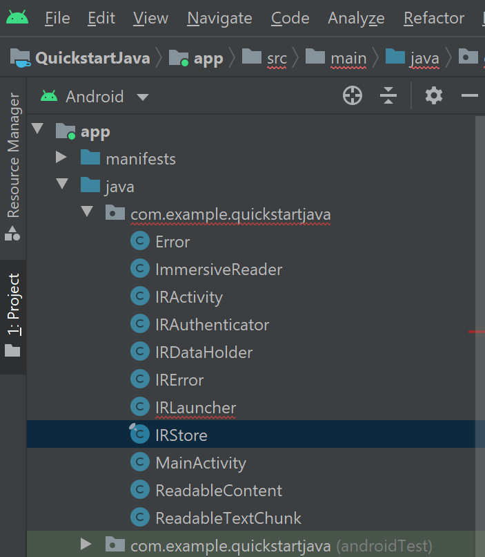

Замените содержимое файла **IRStore.java** следующим кодом.

```IRStore.java
/**
 * Copyright (c) Microsoft Corporation. All rights reserved.
 * Licensed under the MIT License.
 */

package com.example.quickstartjava;

import androidx.annotation.Keep;

@Keep
public final class IRStore {
    @Keep
    public final static class Output {
        public final static String ERROR = "Error";
    }
}
```

Создайте новый файл класса Java **AuthenticationTask.java**.


Замените содержимое файла **AuthenticationTask.java** следующим кодом.

```AuthenticationTask.java
/**
 * Copyright (c) Microsoft Corporation. All rights reserved.
 * Licensed under the MIT License.
 */

package com.example.quickstartjava;

import android.os.AsyncTask;

/**
 * Async task to request the client for the access token in background thread.
 */

public class AuthenticationTask extends AsyncTask<Void, Void, String> {

    private TaskParams mParams;

    public interface ITaskListener {
        void onAccessTokenObtained(String accessToken);
    }

    public class TaskParams {
        ImmersiveReader.IAuthenticator mAccessTokenProvider;
        ITaskListener mTaskListener;

        public TaskParams(ImmersiveReader.IAuthenticator accessTokenProvider, ITaskListener taskListener) {
            this.mAccessTokenProvider = accessTokenProvider;
            this.mTaskListener = taskListener;
        }
    }

    public void setParams(TaskParams mParams) {
        this.mParams = mParams;
    }

    @Override
    protected String doInBackground(Void... voids) {
        return mParams.mAccessTokenProvider.getAccessToken();
    }

    @Override
    protected void onPostExecute(String accessToken) {
        super.onPostExecute(accessToken);
        if (mParams.mTaskListener != null) {
            mParams.mTaskListener.onAccessTokenObtained(accessToken);
        }
    }
}
```

Создайте новый файл класса Java **Chunk.java**.

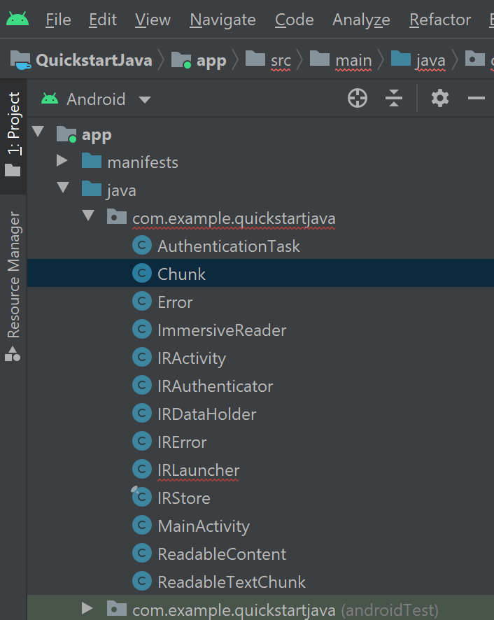

Замените содержимое файла **Chunk.java** следующим кодом.

```Chunk.java
/**
 * Copyright (c) Microsoft Corporation. All rights reserved.
 * Licensed under the MIT License.
 */

package com.example.quickstartjava;

import androidx.annotation.Keep;

/**
 * The chunk object that will be sent to the Immersive Reader SDK.
 * The content is a string of text, the lang is a string, e.g. 'll-cc',
 * and the mimeType is also a string, e.g. 'text/plain'.
 */

@Keep
public class Chunk {

    public String content;
    public String lang;
    public String mimeType;

    public Chunk(String content, String lang, String mimeType) {
        this.content = content;
        this.lang = lang;
        this.mimeType = mimeType;
    }
}
```

Создайте новый файл класса Java **Content.java**.

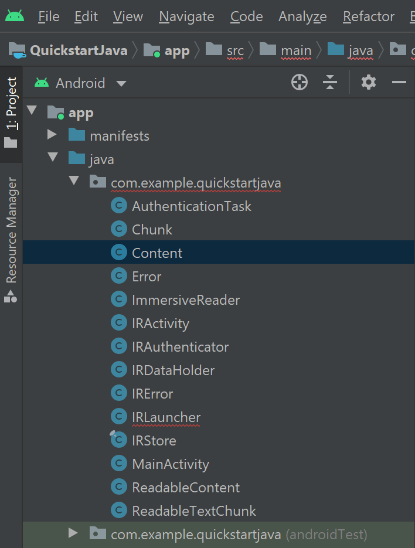

Замените содержимое файла **Content.java** следующим кодом.

```Content.java
/**
 * Copyright (c) Microsoft Corporation. All rights reserved.
 * Licensed under the MIT License.
 */

package com.example.quickstartjava;

import androidx.annotation.Keep;
import java.util.List;

/**
 * The content object that will be sent to the Immersive Reader SDK.
 * This object contains the title and a list of Chunk objects.
 */

@Keep
public class Content {

    public String title;
    public List<Chunk> chunks;

    public Content(String title, List<Chunk> chunks) {
        this.title = title;
        this.chunks = chunks;
    }

}
```

Создайте новый файл класса Java **Options.java**.

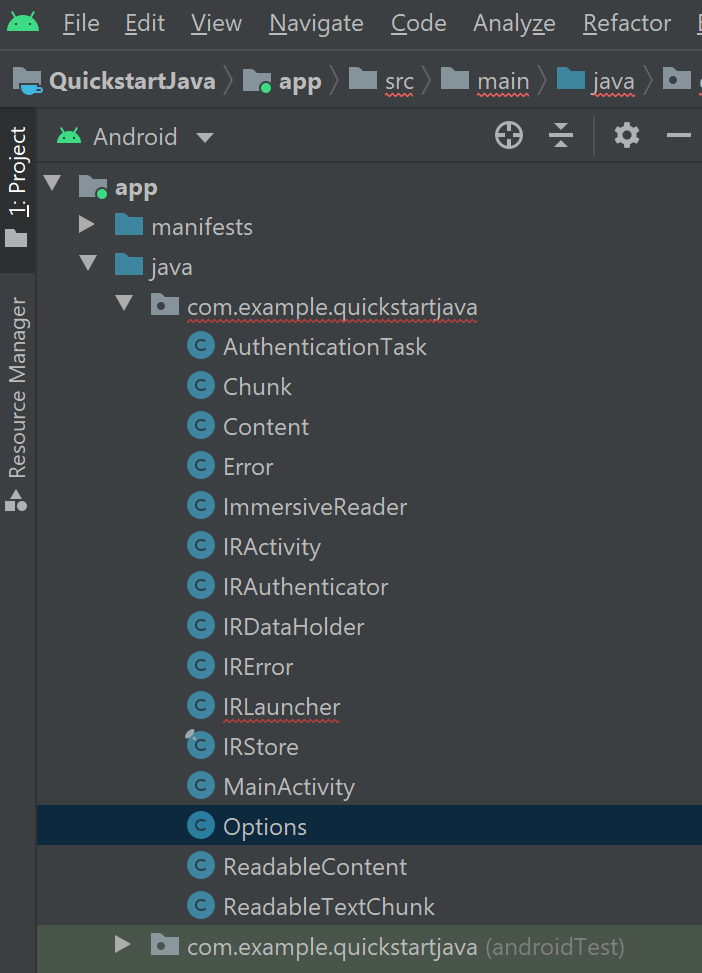

Замените содержимое файла **Options.java** следующим кодом.

```Options.java
/**
 * Copyright (c) Microsoft Corporation. All rights reserved.
 * Licensed under the MIT License.
 */

import java.util.concurrent.Callable;
import androidx.annotation.Keep;

/**
 * The options object that will be sent to the Immersive Reader SDK.
 */

@Keep
public class Options {

    public Callable<Void> onExit;
    public String uiLang;
    public Integer timeout;

    public Options(Callable<Void> exitCallback, String uiLang, Integer timeout) {
        this.onExit = exitCallback;
        this.uiLang = uiLang;
        this.timeout = timeout;
    }
}
```

Создайте новый файл класса Java **Message.java**.

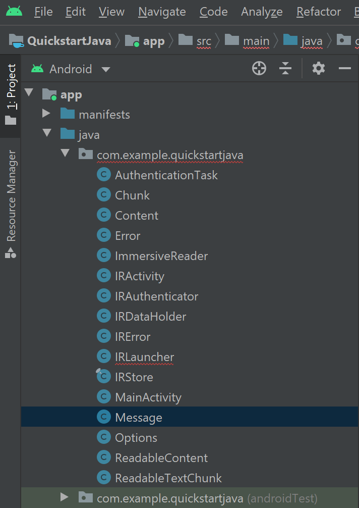

Замените содержимое файла **Message.java** следующим кодом.

```Message.java
/**
 * Copyright (c) Microsoft Corporation. All rights reserved.
 * Licensed under the MIT License.
 */

import androidx.annotation.Keep;

/**
 * The message object that will be sent to the Immersive Reader SDK.
 * This object contains the access token, sub domain, Content, and Options.
 */

@Keep
public class Message {

    public String cogSvcsAccessToken;
    public String cogSvcsSubdomain;
    public Content request;
    public Integer launchToPostMessageSentDurationInMs;
    public Options options;

    public Message(String cogSvcsAccessToken, String cogSvcsSubdomain, Content request, Integer launchToPostMessageSentDurationInMs, Options options) {
        this.cogSvcsAccessToken = cogSvcsAccessToken;
        this.cogSvcsSubdomain = cogSvcsSubdomain;
        this.request = request;
        this.launchToPostMessageSentDurationInMs = launchToPostMessageSentDurationInMs;
        this.options = options;
    }
}
```

Создайте новый файл класса Java **WebAppInterface.java**.


Замените содержимое файла **WebAppInterface.java** следующим кодом.

```WebAppInterface.java
/**
 * Copyright (c) Microsoft Corporation. All rights reserved.
 * Licensed under the MIT License.
 */

package com.example.quickstartjava;

import androidx.annotation.Keep;
import android.webkit.JavascriptInterface;

/**
 * JavaScript interface implementation passed to the WebView to enable talking between JavaScript and Java.
 */

@Keep
public class WebAppInterface {

    public static WebAppListener mListener;

    interface WebAppListener {
        void onShowToast(String toast);

        void onImmersiveReaderExit();
    }

    public WebAppInterface(WebAppListener listener) {
        this.mListener = listener;
    }

    @JavascriptInterface
    public void showToast(String toast) {
        mListener.onShowToast(toast);
    }

    @JavascriptInterface
    public void immersiveReaderExit() {
        mListener.onImmersiveReaderExit();
    }

}
```

## <a name="add-the-app-html-to-the-web-view"></a>Добавление HTML-кода для приложения в веб-представление

Для работы реализации веб-представления требуется HTML-код. Щелкните правой кнопкой папку **/assets**, создайте здесь файл и присвойте ему имя **immersiveReader.html**.


Добавьте следующий код HTML и JavaScript. Этот код добавляет в приложение пакет SDK для иммерсивного средства чтения, а затем с помощью этого пакета и созданного нами кода приложения открывает иммерсивное средство чтения.

```immersiveReader.html
<!-- Copyright (c) Microsoft Corporation. All rights reserved.
Licensed under the MIT License. -->

<!DOCTYPE html>
<html>
<head>
    <meta charset="utf-8">
    <meta name="viewport" content="width=device-width, initial-scale=1, shrink-to-fit=no">
    <script type="text/javascript" src="https://contentstorage.onenote.office.net/onenoteltir/immersivereadersdk/immersive-reader-sdk.1.0.0.js"></script>
</head>
<body>
    <script type="text/javascript">
        function handleLaunchImmersiveReader(message) {
            if (!message) {
                Android.showToast('Message is null or undefined!');
            } else {
                // Learn more about chunk usage and supported MIME types https://docs.microsoft.com/azure/cognitive-services/immersive-reader/reference#chunk
                var data = {
                    title: message.request.title,
                    chunks: []
                };

                for (var chunkIndex = 0; chunkIndex < message.request.chunks.length; chunkIndex++) {
                    data.chunks.push({
                        content: message.request.chunks[chunkIndex].content,
                        lang: message.request.chunks[chunkIndex].lang,
                        mimeType: message.request.chunks[chunkIndex].mimeType
                    });
                }

                // Learn more about options https://docs.microsoft.com/azure/cognitive-services/immersive-reader/reference#options
                var options = {
                    onExit: exitCallback,
                    uiZIndex: 2000
                };

                // Use the JavaScript SDK to launch the Immersive Reader.
                ImmersiveReader.launchAsync(message.cogSvcsAccessToken, message.cogSvcsSubdomain, data, options);

                // A simple declarative function used to close the Immersive Reader WebView via @JavaScriptInterface
                function exitCallback() {
                    Android.immersiveReaderExit();
                }
            }
        }
    </script>
</body>
</html>
```

## <a name="set-up-app-permissions"></a>Настройка разрешений приложения

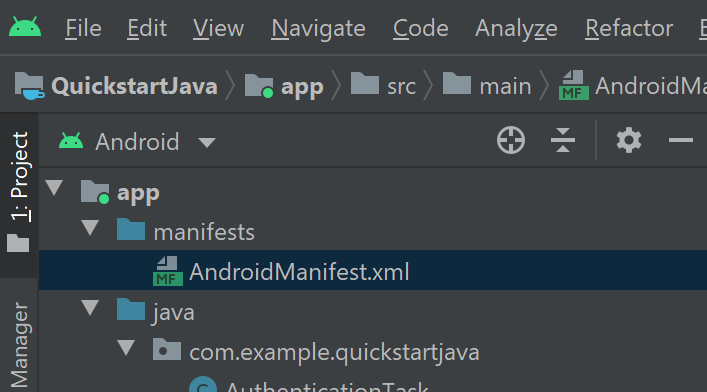

При работе это приложение будет выполнять сетевые вызовы к пакету SDK для иммерсивного средства чтения, поэтому нам нужно предоставить приложению разрешения на доступ к сети. Замените содержимое файла **/manifests/AndroidManifest.xml** следующим кодом XML.

```AndroidManifest.xml
<?xml version="1.0" encoding="utf-8"?>
<manifest xmlns:android="http://schemas.android.com/apk/res/android"
    package="com.example.quickstartjava">

    <uses-permission android:name="android.permission.INTERNET" />

    <application
        android:allowBackup="true"
        android:icon="@mipmap/ic_launcher"
        android:label="@string/app_name"
        android:roundIcon="@mipmap/ic_launcher_round"
        android:supportsRtl="true"
        android:theme="@style/AppTheme">
        <activity android:name=".MainActivity">
            <intent-filter>
                <action android:name="android.intent.action.MAIN" />

                <category android:name="android.intent.category.LAUNCHER" />
            </intent-filter>
        </activity>
        <activity
            android:name=".IRActivity"
            android:multiprocess="true" />
    </application>

</manifest>
```

## <a name="run-the-app"></a>Запустите приложение

С помощью Android Studio запустите приложение на эмуляторе устройства. Теперь, когда вы выберете **иммерсивное средство чтения**, откроется иммерсивное средство чтения с содержимым приложения.

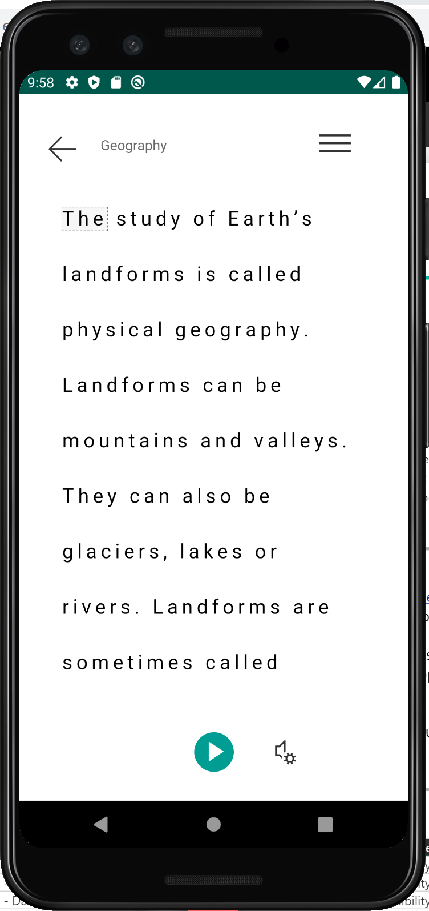

## <a name="next-steps"></a>Дальнейшие действия

Изучите статью [о пакете SDK для иммерсивного средства чтения](https://github.com/microsoft/immersive-reader-sdk) и [документацию по этому пакету](../../reference.md).