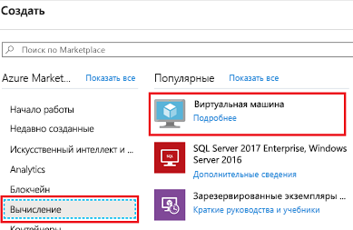
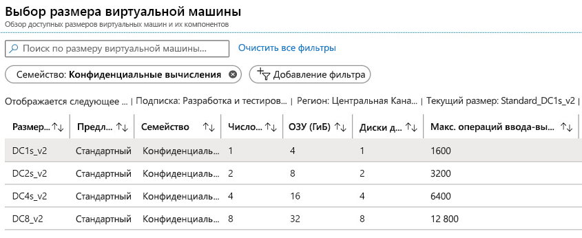
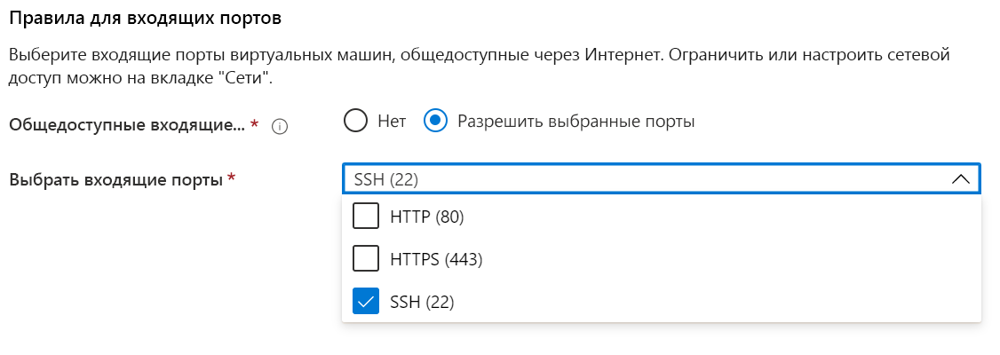

# <a name="quickstart-deploy-an-azure-confidential-computing-vm-in-the-azure-portal"></a>Краткое руководство. Развертывание виртуальной машины конфиденциальных вычислений на портале Azure

Начните работу с конфиденциальными вычислениями Azure, применив портал Azure для создания виртуальной машины на базе Intel SGX. После этого вы установите пакет средств разработки Open Enclave, чтобы настроить среду разработки. 

Это руководство предназначено для тех, кто заинтересован в развертывании виртуальных машин конфиденциальных вычислений с настраиваемой конфигурацией. Если это к вам не относится, мы рекомендуем перейти к [процедуре развертывания виртуальной машины конфиденциальных вычислений для коммерческой платформы Майкрософт](quick-create-marketplace.md).


## <a name="prerequisites"></a>Предварительные требования

Если у вас еще нет подписки Azure, [создайте учетную запись Azure](https://azure.microsoft.com/pricing/purchase-options/pay-as-you-go/), прежде чем начинать работу.

> [!NOTE]
> Учетные записи бесплатной пробной версии не предоставляют доступа к виртуальным машинам, которые используются в этом руководстве. Перейдите на подписку с оплатой по мере использования.


## <a name="sign-in-to-azure"></a>Вход в Azure

1. Войдите на [портал Azure](https://portal.azure.com/).

1. В верхней части экрана выберите команду **Создать ресурс**.

1. На панели **Marketplace** слева выберите элемент **Вычисления**.

1. Найдите и выберите элемент **Виртуальная машина**.

    

1. На главной странице сведений о виртуальной машине выберите команду **Создать**.


## <a name="configure-a-confidential-computing-virtual-machine"></a>Настройка виртуальной машины конфиденциальных вычислений

1. На вкладке **Основы** выберите **Подписка** и **Группа ресурсов**.

1. В поле **Имя виртуальной машины** введите имя новой виртуальной машины.

1. Введите или выберите следующие значения:

   * **Регион**. Выберите подходящий регион Azure.

        > [!NOTE]
        > Виртуальные машины конфиденциальных вычислений работают только на специализированном оборудовании, которое доступно не во всех регионах. Актуальный список регионов с поддержкой виртуальных машин серии DCsv2 см. [здесь](https://azure.microsoft.com/global-infrastructure/services/?products=virtual-machines).

1. Настройте образ операционной системы, который вы намерены использовать для виртуальной машины.

    * **Выбор образа.** Для работы с этим руководством выберите Ubuntu 18.04 LTS. Кроме того, можно использовать Windows Server 2019, Windows Server 2016 или Ubuntu 16.04 LTS. Для этих вариантов вам будут предложены соответствующие руководства.
    
    * **Переключение образа на 2-е поколение.** Виртуальные машины конфиденциальных вычислений работают только на образах [2-го поколения](../virtual-machines/linux/generation-2.md). Обязательно выберите образ 2-го поколения. Щелкните вверху вкладку **Дополнительно**, где вы сможете настроить виртуальную машину. Прокрутите вниз до раздела "Поколение виртуальной машины". Выберите 2-е поколение и вернитесь к вкладке **Основные сведения**.
    

        


        

    * **Возврат к основной конфигурации.** Вернитесь на вкладку **Основные сведения** с помощью элементов навигации вверху.

1. Выберите виртуальную машину с возможностями конфиденциальных вычислений в средстве для выбора размера, щелкнув действие **Изменить размер**. В средстве выбора размера щелкните команду **Очистить все фильтры**. Выберите элемент **Добавить фильтр**, затем выберите тип фильтра **Семейство** и выберите только один вариант: **Конфиденциальные вычисления**.

    

    > [!TIP]
    > Здесь вы увидите размеры **DC1s_v2**, **DC2s_v2**, **DC4s_V2** и **DC8_v2**. Пока только эти размеры виртуальных машин поддерживают конфиденциальные вычисления. [Подробнее](virtual-machine-solutions.md).

1. Заполните следующие сведения:

   * **Тип проверки подлинности.** Выберите элемент **Открытый ключ SSH**, если вы создаете виртуальную машину Linux. 

        > [!NOTE]
        > Для проверки подлинности вы можете использовать открытый ключ или пароль SSH. SSH является более безопасным. Сведения о создании ключа SSH см. в статье [Как создать и использовать пару из открытого и закрытого ключей SSH для виртуальных машин Linux в Azure](../virtual-machines/linux/mac-create-ssh-keys.md).

    * **Имя пользователя**. Введите имя администратора для виртуальной машины.

    * **Открытый ключ SSH**. Введите открытый ключ RSA, если это применимо.
    
    * **Пароль**. Введите пароль, используемый для проверки подлинности, если это применимо.

    * **Общедоступные входящие порты**. Выберите команду **Разрешить выбранные порты**, а затем выберите порты **SSH (22)** и **HTTP (80)** в списке **общедоступных входящих портов**. Если вы развертываете виртуальную машину Windows, выберите **HTTP (80)** и **RDP (3389)** . В нашем руководстве этот шаг нужен для подключения к виртуальной машине и завершения настройки пакета SDK Open Enclave. 

     


1. Внесите изменения на вкладке **Диски**.

   * Если вы выбрали виртуальную машину **DC1s_v2**, **DC2s_v2** или **DC4s_V2**, выберите тип диска **SSD (цен. категория "Стандартный")** или **SSD (цен. категория "Премиум")** . 
   * Если вы выбрали виртуальную машину **DC8_v2**, выберите тип диска **SSD (цен. категория "Стандартный")** .

1. На перечисленных ниже вкладках внесите в параметры нужные изменения или сохраните значения по умолчанию.

    * **Сеть**
    * **Управление**
    * **Конфигурация гостевой ОС**
    * **Теги**

1. Выберите **Review + create** (Просмотреть и создать).

1. В области **Отзыв и создание** выберите **Создать**.

> [!NOTE]
> Если вы развернули виртуальную машину Linux, переходите к следующему разделу этого руководства. Если вы развернули виртуальную машину Windows, [выполните эту процедуру для подключения к виртуальной машине Windows](../virtual-machines/windows/connect-logon.md) и установите [пакет OE SDK для Windows](https://github.com/openenclave/openenclave/blob/master/docs/GettingStartedDocs/install_oe_sdk-Windows.md).


## <a name="connect-to-the-linux-vm"></a>Подключение к виртуальной машине Linux

Если вы уже используете оболочку BASH, подключитесь к виртуальной машине Azure с помощью команды **SSH**. В следующей команде замените имя пользователя и IP-адрес виртуальной машины, чтобы подключиться к виртуальной машине Linux.

```bash
ssh azureadmin@40.55.55.555
```

Общедоступный IP-адрес виртуальной машины можно получить на портале Azure в разделе "Обзор" для виртуальной машины.

:::image type="content" source="media/quick-create-portal/public-ip-virtual-machine.png" alt-text="IP-адрес на портале Azure":::

Если вы используете Windows и у вас нет оболочки BASH, установите клиент SSH, например PuTTY.

1. [Скачайте и установите PuTTY](https://www.chiark.greenend.org.uk/~sgtatham/putty/download.html).

1. Запустите PuTTY.

1. На экране настройки PuTTY введите общедоступный IP-адрес виртуальной машины.

1. Выберите **Открыть** и введите имя пользователя и пароль при появлении запросов.

Дополнительные сведения о подключении к виртуальным машинам Linux см. в статье [Создание виртуальной машины Linux с помощью портала Azure](../virtual-machines/linux/quick-create-portal.md).

> [!NOTE]
> Если вы видите оповещение системы безопасности PuTTY о том, что ключ узла сервера не кэшируется в реестре, выберите один из следующих параметров. Если вы доверяете этому узлу, выберите **Да**, чтобы добавить ключ в кэш PuTTy и продолжить подключение. Если вы хотите продолжить подключение один раз, не добавляя ключ в кэш, выберите **Нет**. Если вы не доверяете этому узлу, выберите **Отмена**, чтобы прервать подключение.

## <a name="install-the-open-enclave-sdk-oe-sdk"></a>Установка пакета SDK Open Enclave (OE SDK) <a id="Install"></a>

Выполните пошаговые инструкции по установке [OE SDK](https://github.com/openenclave/openenclave) на виртуальной машине серии DCsv2, развернутой из образа Ubuntu 18.04 LTS 2-го поколения. 

Если для виртуальной машины вы выбрали образ Ubuntu 16.04 LTS 2-го поколения, воспользуйтесь [инструкциями по установке Ubuntu 16.04](https://github.com/openenclave/openenclave/blob/master/docs/GettingStartedDocs/install_oe_sdk-Ubuntu_16.04.md).

#### <a name="1-configure-the-intel-and-microsoft-apt-repositories"></a>1. Настройте репозитории Intel и Microsoft APT.

```bash
echo 'deb [arch=amd64] https://download.01.org/intel-sgx/sgx_repo/ubuntu bionic main' | sudo tee /etc/apt/sources.list.d/intel-sgx.list
wget -qO - https://download.01.org/intel-sgx/sgx_repo/ubuntu/intel-sgx-deb.key | sudo apt-key add -

echo "deb http://apt.llvm.org/bionic/ llvm-toolchain-bionic-7 main" | sudo tee /etc/apt/sources.list.d/llvm-toolchain-bionic-7.list
wget -qO - https://apt.llvm.org/llvm-snapshot.gpg.key | sudo apt-key add -

echo "deb [arch=amd64] https://packages.microsoft.com/ubuntu/18.04/prod bionic main" | sudo tee /etc/apt/sources.list.d/msprod.list
wget -qO - https://packages.microsoft.com/keys/microsoft.asc | sudo apt-key add -
```

#### <a name="2-install-the-intel-sgx-dcap-driver"></a>2. Установите драйвер Intel SGX DCAP.

```bash
sudo apt update
sudo apt -y install dkms
wget https://download.01.org/intel-sgx/sgx-dcap/1.4/linux/distro/ubuntuServer18.04/sgx_linux_x64_driver_1.21.bin -O sgx_linux_x64_driver.bin
chmod +x sgx_linux_x64_driver.bin
sudo ./sgx_linux_x64_driver.bin
```

> [!WARNING]
> Установите последнюю версию драйвера Intel SGX DCAP с [сайта Intel SGX](https://01.org/intel-software-guard-extensions/downloads).

#### <a name="3-install-the-intel-and-open-enclave-packages-and-dependencies"></a>3. Установите пакеты Intel и Open Enclave и зависимости для них.

```bash
sudo apt -y install clang-7 libssl-dev gdb libsgx-enclave-common libsgx-enclave-common-dev libprotobuf10 libsgx-dcap-ql libsgx-dcap-ql-dev az-dcap-client open-enclave
```

> [!NOTE] 
> Среди прочего, на этом шаге устанавливается пакет [az-dcap-client](https://github.com/microsoft/azure-dcap-client), который необходим для удаленной аттестации в Azure.

#### <a name="4-verify-the-open-enclave-sdk-install"></a>4. **Проверьте установку пакета SDK Open Enclave (OE SDK)** .

Изучите инструкции по [использованию пакета SDK Open Enclave](https://github.com/openenclave/openenclave/blob/master/docs/GettingStartedDocs/Linux_using_oe_sdk.md) на GitHub, где описаны проверка и применение установленного пакета.

## <a name="clean-up-resources"></a>Очистка ресурсов

Если группа ресурсов, виртуальная машина и все связанные с ними ресурсы вам больше не требуются, их можно удалить. 

Выберите группу ресурсов для виртуальной машины и щелкните **Удалить**. Подтвердите имя группы ресурсов, чтобы завершить удаление ресурсов.

## <a name="next-steps"></a>Дальнейшие действия

В рамках этого краткого руководства вы развернули виртуальную машину конфиденциальных вычислений и пакет SDK Open Enclave. Дополнительные сведения о виртуальных машинах конфиденциальных вычислений в Azure см. в [этой статье](virtual-machine-solutions.md). 

Если вы развернули виртуальную машину Windows, изучите [примеры приложений с использованием OE SDK для Windows](https://github.com/openenclave/openenclave/blob/master/samples/README_Windows.md) на сайте GitHub. 

Изучите возможности по созданию приложений конфиденциальных вычислений на Linux, перейдя к разделу примеров OE SDK для Linux на сайте GitHub. 

> [!div class="nextstepaction"]
> [Создание примеров с пакетом SDK Open Enclave в Linux](https://github.com/openenclave/openenclave/blob/master/samples/README_Linux.md)
