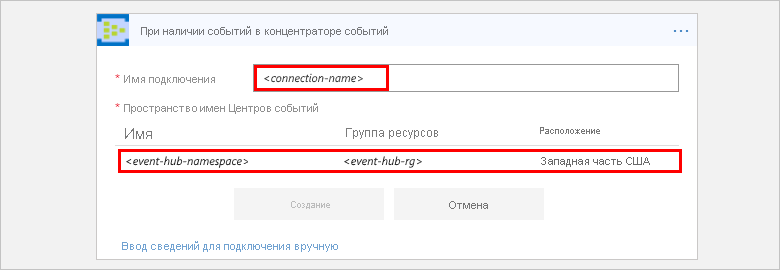
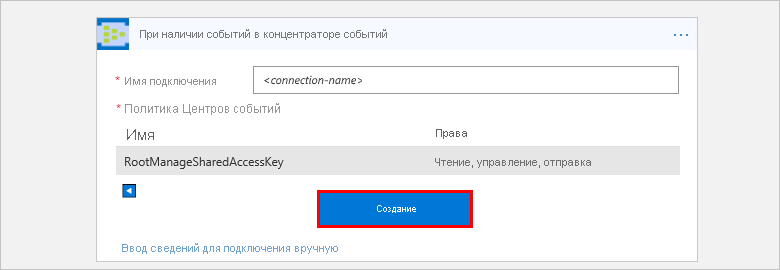

# Мониторинг, получение и отправка событий с помощью Центров событий Azure и Azure Logic Apps

В этой статье показано, как можно отслеживать и управлять событиями, отправленными в [Центры событий Azure](../event-hubs/event-hubs-what-is-event-hubs.md) из внутреннего приложения логики при помощи соединителя Центров событий Azure. Таким образом, можно создать приложения логики, которые автоматизируют задачи и рабочие процессы для проверки, отправки и получения событий из концентратора событий. Для получения технической [информации,](https://docs.microsoft.com/connectors/eventhubs/)</a>конкретной для разъема, см.

## Предварительные требования

* Подписка Azure. Если у вас еще нет подписки Azure, [зарегистрируйтесь для получения бесплатной учетной записи Azure](https://azure.microsoft.com/free/). 

* [Пространство имен событий Azure event hubs и концентратор событий](../event-hubs/event-hubs-create.md)

* Приложение логики, из которого необходимо получить доступ к концентратору событий. Чтобы запустить приложение логики с помощью триггера Центров событий Azure, требуется [пустое приложение логики](../logic-apps/quickstart-create-first-logic-app-workflow.md).
Если вы не работали с приложениями логики, см. руководства по [Azure Logic Apps](../logic-apps/logic-apps-overview.md) и [созданию первого приложения логики](../logic-apps/quickstart-create-first-logic-app-workflow.md).

## Проверка разрешений и получение строки подключения

Чтобы убедиться, что приложение логики может получить доступ к концентратору событий, проверьте ваши разрешения и получите строку соединения для пространства имен Event Hubs.

1. Войдите на [портал Azure](https://portal.azure.com).

1. Перейдите к *пространству имен* Центров событий (но не к конкретному концентратору событий). 

1. В меню пространства имен в **настройках**выберите **политики общего доступа.** В разделе **Утверждения** убедитесь, что у вас есть разрешения на **управление** для этого пространства имен.

   

1. Если вы хотите в дальнейшем вручную ввести сведения о подключении, получите строку подключения для пространства имен Центров событий.

   1. В разделе **Политика** выберите **RootManageSharedAccessKey**.

   1. Найдите строку подключения первичного ключа. Нажмите кнопку "Копировать" и сохраните строку подключения для последующего использования.

      

      > [!TIP]
      > Чтобы проверить, относится ли строка подключения к пространству имен Центров событий или к определенному концентратору событий, убедитесь, что она не содержит параметр `EntityPath` . Если в строке подключения есть этот параметр, значит она относится к определенной "сущности" концентратора событий и ее нельзя использовать в приложении логики.

1. Теперь продолжайте дальше, используя варианты [Add an Event Hubs trigger](#add-trigger) (Добавить триггер Центров событий) или [Add an Event Hubs action](#add-action) (Добавить действие Центров событий).

## Добавление триггера концентраторов событий

В Azure Logic Apps каждое приложение логики должно запускаться по [триггеру](../logic-apps/logic-apps-overview.md#logic-app-concepts), который активируется, когда происходит определенное событие или если выполняются заданные условия. При каждом срабатывании триггера обработчик Logic Apps создает экземпляр приложения логики, запускающий рабочий процесс.

В этом примере показано, как запустить рабочий процесс приложения логики, когда новые события отправляются в концентратор событий. 

1. На портале Azure или в Visual Studio создайте пустое приложение логики. Откроется конструктор Logic Apps. В этом примере используется портал Azure.

1. В поле поиска в качестве фильтра введите "Центры событий". Из списка триггеров выберите этот триггер: **Когда события доступны в концентраторе событий - Концентраторы событий**

   

1. Если вам будет предложено ввести сведения о подключении, [создайте подключение к Центрам событий](#create-connection). 

1. В триггере предоставьте информацию о концентраторе событий, который вы хотите контролировать. Для получения дополнительных свойств откройте новый список **параметров Добавить.** Выбор параметра добавляет это свойство к триггерной карте.

   

   | Свойство | Обязательно | Описание |
   |----------|----------|-------------|
   | **Имя концентратора событий** | Да | Название концентратора событий, который вы хотите контролировать |
   | **Тип содержимого** | нет | Тип содержимого события. Значение по умолчанию — `application/octet-stream`. |
   | **Имя группы потребителей** | нет | [Название группы потребителей Event Hub](../event-hubs/event-hubs-features.md#consumer-groups) для чтения событий. Если оно не задано, используется группа потребителей по умолчанию. |
   | **Maximum events count (Счетчик максимального количества событий)** | нет | Максимальное количество событий. Триггер возвращает значение от 1 до количества событий, заданного в этом свойстве. |
   | **Интервал** | Да | Положительный ряд, который описывает, как часто работает рабочий процесс на основе частоты |
   | **Частота** | Да | Единица времени для повторения |
   ||||

   **Дополнительные свойства**

   | Свойство | Обязательно | Описание |
   |----------|----------|-------------|
   | **Схема содержимого** | нет | Схема содержимого JSON для чтения событий из концентратора событий. Например, если вы укажете схему содержимого, можно запустить приложение логики только для тех событий, которые соответствуют схеме. |
   | **Minimum partition key (Минимальное количество ключей секций)** | нет | Введите минимальное количество идентификаторов [секций](../event-hubs/event-hubs-features.md#partitions) для считывания. По умолчанию считываются все секции. |
   | **Maximum partition key (Максимальное количество ключей секций)** | нет | Введите максимальное количество идентификаторов [секций](../event-hubs/event-hubs-features.md#partitions) для считывания. По умолчанию считываются все секции. |
   | **Часовой пояс** | нет | Применяется только при указании времени начала, так как этот триггер не принимает смещение от UTC. Выберите часовой пояс, который необходимо применить. 
Для получения дополнительной информации [см. Создание и выполнение повторяющихся задач и рабочих процессов с приложениями Azure Logic Apps.](../connectors/connectors-native-recurrence.md) |
   | **Время начала** | нет | Укажите время начала в следующем формате: 
ГГГГ-ММ-ДДTчч:мм:сс, если выбран часовой пояс
-или-
ГГГГ-ММ-ДДTчч:мм:ссZ, если часовой пояс не выбран.
Для получения дополнительной информации [см. Создание и выполнение повторяющихся задач и рабочих процессов с приложениями Azure Logic Apps.](../connectors/connectors-native-recurrence.md) |
   ||||

1. Завершив работу, нажмите кнопку **Сохранить** на панели инструментов конструктора.

1. Теперь продолжайте добавлять действия в приложение логики для задач, которые необходимо выполнить с результатами триггера. 

   Например, для фильтрации событий на основе определенного значения, например категории, можно добавить условие, чтобы действие **события Отправки** отправлял только события, отвечающие вашему состоянию. 

> [!NOTE]
> Все триггеры концентратора событий являются триггерами *длинного опроса*. Это значит, что при срабатывании триггер обрабатывает все события, а затем 30 секунд ожидает, пока в концентраторе событий не появятся дополнительные события.
> Запуск триггера пропускается, если на протяжении 30 секунд не будет получено ни одного события. В противном случае триггер продолжит считывать события до момента, пока концентратор событий не останется пустым.
> Следующий опрос триггера происходит на основе интервала повторения, указанного в свойствах триггера.

## Добавление действия концентраторов событий

В Azure Logic Apps [действие](../logic-apps/logic-apps-overview.md#logic-app-concepts) — это шаг в рамках рабочего процесса, выполняемый после срабатывания триггера или другого действия. В этом примере приложение логики запускается с помощью триггера Центров событий, который проверяет наличие новых событий в концентраторе событий.

1. На портале Azure или в Visual Studio откройте приложение логики в конструкторе Logic Apps. В этом примере используется портал Azure.

1. Под спусковым крючком или действием выберите **новый шаг.**

   Чтобы добавить действие между существующими шагами, наведите указатель мыши на соединяющую стрелку. 
   Выберите знак**+** плюс (), который появляется, а затем выберите **Добавить действие.**

1. В поле поиска в качестве фильтра введите "Центры событий".
Из списка действий выберите это действие: **Отправить событие - Концентраторы событий**

   

1. Если вам будет предложено ввести сведения о подключении, [создайте подключение к Центрам событий](#create-connection). 

1. В действии предоставьте информацию о событиях, которые вы хотите отправить. Для получения дополнительных свойств откройте новый список **параметров Добавить.** Выбор параметра добавляет это свойство к действию карты.

   

   | Свойство | Обязательно | Описание |
   |----------|----------|-------------|
   | **Имя концентратора событий** | Да | Концентратор событий, куда вы хотите отправить событие |
   | **Содержимое** | нет | Содержимое для события, которое необходимо отправить |
   | **Свойства** | нет | Свойства приложения и значения для отправки |
   | **Ключ раздела** | нет | Идентификатор [раздела,](../event-hubs/event-hubs-features.md#partitions) куда отправить событие |
   ||||

   Например, можно отправить выход из триггера event Hubs в другой концентратор событий:

   

1. Завершив работу, нажмите кнопку **Сохранить** на панели инструментов конструктора.

## Подключение к концентратору событий

[!INCLUDE [Create connection general intro](../../includes/connectors-create-connection-general-intro.md)] 

1. Когда вам будет предложено ввести информацию о соединении, укажите следующие сведения.

   | Свойство | Обязательно | Значение | Описание |
   |----------|----------|-------|-------------|
   | **Имя подключения** | Да | <*имя соединения*> | Имя создаваемого подключения |
   | **Пространство имен Центров событий** | Да | <*событие-хаб-имяпространства*> | Выберите пространство имен Центров событий, которые необходимо использовать. |
   |||||  

   Пример:

   

   Чтобы вручную ввести строку соединения, выберите **вручную ввести информацию о подключении.** 
   Сведения о том, как найти строку подключения, см. в разделе [Проверка разрешений для пространства имен концентраторов событий и определение строки подключения](#permissions-connection-string).

2. Выберите нужную политику Центров событий, если она еще не выбрана. Выберите **Создать**.

   

3. После создания подключения перейдите к [Add an Event Hubs trigger](#add-trigger) (Добавить триггер Центров событий) или [Add an Event Hubs action](#add-action) (Добавить действие Центров событий).

## Справочник по соединителям

См. дополнительные технические сведения о [триггерах, действиях и ограничениях, описываемых файлом Swagger соединителя](https://docs.microsoft.com/connectors/eventhubs/).

> [!NOTE]
> Для логических приложений в [среде служб интеграции (ISE)](../logic-apps/connect-virtual-network-vnet-isolated-environment-overview.md)эта версия с маркировкой ISE разъема использует вместо этого [ограничения сообщений ISE.](../logic-apps/logic-apps-limits-and-config.md#message-size-limits)

## Дальнейшие действия

* См. дополнительные сведения о других [соединителях Logic Apps](../connectors/apis-list.md).