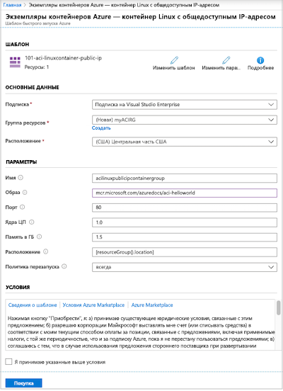
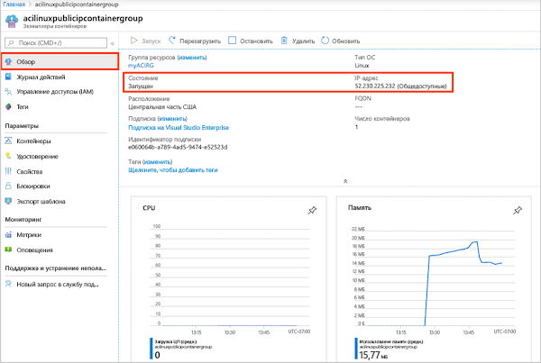
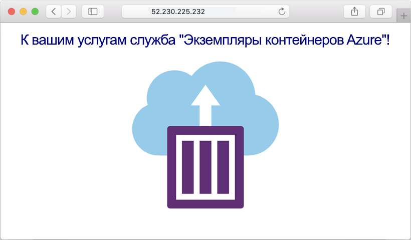
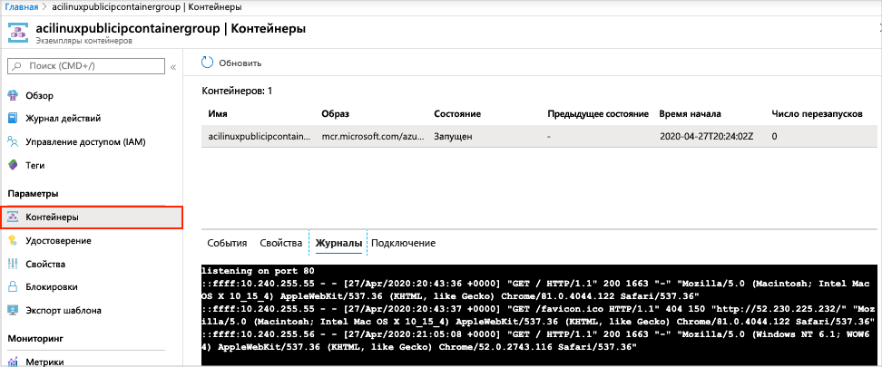

# Краткое руководство. Развертывание экземпляра контейнера в Azure с помощью шаблона ARM

Служба "Экземпляры контейнеров Azure" позволяет легко и быстро запускать бессерверные контейнеры Docker в Azure. Развертывайте приложения в экземпляр контейнера по требованию, когда вам не нужна полная платформа оркестрации контейнера, такая как Служба Azure Kubernetes. В этом кратком руководстве показано, как развернуть изолированный контейнер Docker с помощью шаблона Azure Resource Manager (шаблона ARM) и сделать его веб-приложение доступным по общедоступному IP-адресу.

[!INCLUDE [About Azure Resource Manager](../../includes/resource-manager-quickstart-introduction.md)]

Если среда соответствует предварительным требованиям и вы знакомы с использованием шаблонов ARM, нажмите кнопку **Развертывание в Azure**. Шаблон откроется на портале Azure.

## Предварительные требования

Если у вас еще нет подписки Azure, создайте [бесплатную](https://azure.microsoft.com/free/) учетную запись Azure, прежде чем начинать работу.

## Изучение шаблона

Шаблон, используемый в этом кратком руководстве, взят из [шаблонов быстрого запуска Azure](https://azure.microsoft.com/resources/templates/101-aci-linuxcontainer-public-ip/).

:::code language="json" source="~/quickstart-templates/101-aci-linuxcontainer-public-ip/azuredeploy.json":::

В этом шаблоне определяется следующий ресурс.

* **[Microsoft.ContainerInstance/containerGroups](/azure/templates/microsoft.containerinstance/containergroups)**  — создание группы контейнеров Azure. Этот шаблон определяет группу, состоящую из одного экземпляра контейнера.

Другие примеры шаблонов службы "Экземпляры контейнеров Azure" можно найти в [коллекции шаблонов быстрого запуска](https://azure.microsoft.com/resources/templates/?resourceType=Microsoft.Containerinstance&pageNumber=1&sort=Popular).

## Развертывание шаблона

 1. Выберите следующее изображение, чтобы войти на портал Azure и открыть шаблон. Шаблон создает реестр контейнеров и реплику в другом расположении.

    

 2. Введите или выберите следующие значения.

    * **Подписка**. Выберите нужную подписку Azure.
    * **Группа ресурсов.** Щелкните **Создать**, введите уникальное имя новой группы ресурсов и щелкните **ОК**.
    * **Расположение**. Выберите расположение группы ресурсов. Пример **Центральная часть США.**
    * **Имя.** Используйте имя, созданное для экземпляра, или введите другое имя.
    * **Образ.** Используйте имя образа по умолчанию. Этот пример образа Linux содержит небольшое веб-приложение Node.js, которое обслуживает статические HTML-страницы. 

    Примите значения по умолчанию для остальных свойств.

    Ознакомьтесь с условиями использования. Если вы согласны с ними, щелкните **Я принимаю указанные выше условия**.

    

 3. После успешного создания экземпляра вы получите уведомление.

    

 Для развертывания шаблона используется портал Azure. Кроме портала Azure, вы можете использовать Azure PowerShell, Azure CLI и REST API. Дополнительные сведения о других методах развертывания см. в статье о [развертывании с использованием шаблонов](../azure-resource-manager/templates/deploy-cli.md).

## Просмотр развернутых ресурсов

Для просмотра свойств экземпляра контейнера используйте портал Azure или такое средство, как [Azure CLI](container-instances-quickstart.md).

1. На портале найдите службу "Экземпляры контейнеров" и выберите созданный экземпляр контейнера.

1. На странице **Обзор** обратите внимание на **состояние** экземпляра и его **IP-адрес**.

    

2. Если параметр состояния имеет значение *Выполняется*, перейдите в браузере по IP-адресу. 

    

### Просмотр журналов контейнеров

Просмотр журналов для экземпляра контейнера помогает устранять неполадки с этим контейнером или запущенными в нем приложениями.

Чтобы просмотреть журналы контейнера, в разделе **Параметры** щелкните **Контейнеры** > **Журналы**. Вы увидите запрос HTTP GET, созданный при просмотре приложения в браузере.

## Очистка ресурсов

Завершив работу с контейнером, на странице **Обзор** экземпляра контейнера щелкните **Удалить**. При появлении запроса подтвердите удаление.

## Дальнейшие действия

В этом кратком руководстве вы создали экземпляр контейнера Azure из общедоступного образа Microsoft. Если вы хотите создать образ контейнера и развернуть его через частный реестр контейнеров Azure, перейдите к руководству по использованию службы "Экземпляры контейнеров Azure".

> [!div class="nextstepaction"]
> [Руководство. Создание образа контейнера для развертывания в службе "Экземпляры контейнеров Azure"](./container-instances-tutorial-prepare-app.md)

Пошаговые инструкции по созданию шаблона см. в следующей статье:

> [!div class="nextstepaction"]
> [Руководство. Создание и развертывание первого шаблона ARM](../azure-resource-manager/templates/template-tutorial-create-first-template.md)