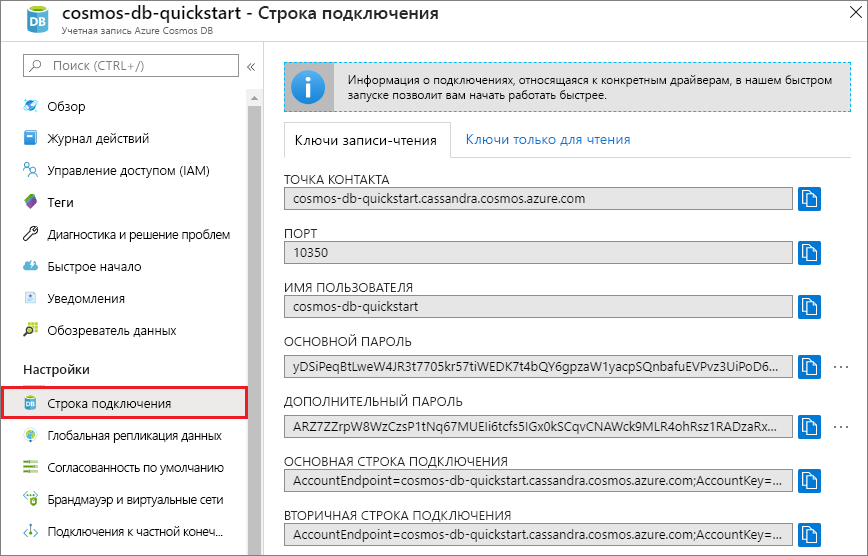

# <a name="quickstart-build-a-cassandra-app-with-python-sdk-and-azure-cosmos-db"></a>Краткое руководство. Создание приложения Cassandra с помощью пакета SDK для Python и Azure Cosmos DB

> [!div class="op_single_selector"]
> * [.NET](create-cassandra-dotnet.md)
> * [Java](create-cassandra-java.md)
> * [Node.js](create-cassandra-nodejs.md)
> * [Python](create-cassandra-python.md)
>  

В рамках этого краткого руководства вы создадите учетную запись API Cassandra Azure Cosmos DB и используете приложение Cassandra Python, клонированное из GitHub, чтобы создать базу данных и контейнер Cassandra. Azure Cosmos DB — это служба многомодельной базы данных, позволяющая быстро создать и запрашивать документы, таблицы, пары "ключ-значение", а также графовые базы данных, используя возможности глобального распределения и горизонтального масштабирования.

## <a name="prerequisites"></a>Предварительные требования

- Учетная запись Azure с активной подпиской. [Создайте бесплатно](https://azure.microsoft.com/free/?ref=microsoft.com&utm_source=microsoft.com&utm_medium=docs&utm_campaign=visualstudio). Или [бесплатно поработайте с Azure Cosmos DB](https://azure.microsoft.com/try/cosmosdb/) без подписки Azure.
- [Python 2.7.14 и более поздних версий или 3.4 и более поздних версий](https://www.python.org/downloads/).
- [Git](https://git-scm.com/downloads).
- [Драйвер Python для Apache Cassandra](https://github.com/datastax/python-driver).

## <a name="create-a-database-account"></a>Создание учетной записи базы данных

Прежде чем создавать базу данных документов, необходимо создать в Azure Cosmos DB учетную запись Cassandra.

[!INCLUDE [cosmos-db-create-dbaccount-cassandra](../../includes/cosmos-db-create-dbaccount-cassandra.md)]

## <a name="clone-the-sample-application"></a>Клонирование примера приложения

Теперь необходимо клонировать приложение API Cassandra из GitHub, задать строку подключения и запустить приложение. Вы узнаете, как можно упростить работу с данными программным способом. 

1. Откройте командную строку. Создайте папку с именем `git-samples`. Затем закройте командную строку.

    ```bash
    md "C:\git-samples"
    ```

2. Откройте окно терминала git, например git bash, и выполните команду `cd`, чтобы перейти в новую папку для установки примера приложения.

    ```bash
    cd "C:\git-samples"
    ```

3. Выполните команду ниже, чтобы клонировать репозиторий с примером. Эта команда создает копию примера приложения на локальном компьютере.

    ```bash
    git clone https://github.com/Azure-Samples/azure-cosmos-db-cassandra-python-getting-started.git
    ```

## <a name="review-the-code"></a>Просмотр кода

Это необязательный шаг. Если вы хотите узнать, как создавать ресурсы базы данных в коде, изучите приведенные ниже фрагменты кода. Фрагменты кода взяты из файла *pyquickstart.py*. Если вас это не интересует, можете сразу переходить к разделу [Обновление строки подключения](#update-your-connection-string). 

* Для указания имени пользователя и пароля используется страница строки подключения на портале Azure. `path\to\cert` указывает путь к сертификату X509. 

   ```python
    ssl_opts = {
            'ca_certs': 'path\to\cert',
            'ssl_version': ssl.PROTOCOL_TLSv1_2
            }
    auth_provider = PlainTextAuthProvider( username=cfg.config['username'], password=cfg.config['password'])
    cluster = Cluster([cfg.config['contactPoint']], port = cfg.config['port'], auth_provider=auth_provider, ssl_options=ssl_opts)
    session = cluster.connect()
   
   ```

* `cluster` инициализируется со сведениями contactPoint. contactPoint извлекается с портала Azure.

    ```python
   cluster = Cluster([cfg.config['contactPoint']], port = cfg.config['port'], auth_provider=auth_provider)
    ```

* `cluster` подключается к API Cassandra Azure Cosmos DB.

    ```python
    session = cluster.connect()
    ```

* Создается пространство ключей.

    ```python
   session.execute('CREATE KEYSPACE IF NOT EXISTS uprofile WITH replication = {\'class\': \'NetworkTopologyStrategy\', \'datacenter1\' : \'1\' }')
    ```

* Создается таблица.

   ```
   session.execute('CREATE TABLE IF NOT EXISTS uprofile.user (user_id int PRIMARY KEY, user_name text, user_bcity text)');
   ```

* Вставляются сущности ключа и значения.

    ```Python
    insert_data = session.prepare("INSERT INTO  uprofile.user  (user_id, user_name , user_bcity) VALUES (?,?,?)")
    session.execute(insert_data, [1,'Lybkov','Seattle'])
    session.execute(insert_data, [2,'Doniv','Dubai'])
    session.execute(insert_data, [3,'Keviv','Chennai'])
    session.execute(insert_data, [4,'Ehtevs','Pune'])
    session.execute(insert_data, [5,'Dnivog','Belgaum'])
    ....
    
    ```

* Запрос на получение всех значений ключа.

    ```Python
    rows = session.execute('SELECT * FROM uprofile.user')
    ```  
    
* Запрос на получение значения ключа.

    ```Python
    
    rows = session.execute('SELECT * FROM uprofile.user where user_id=1')
    ```  

## <a name="update-your-connection-string"></a>Обновление строки подключения

Теперь вернитесь на портал Azure, чтобы получить данные строки подключения. Скопируйте эти данные в приложение. Строка подключения обеспечивает обмен данными между вашим приложением и размещенной базой данных.

1. Выберите элемент **Строка подключения** в своей учетной записи Azure Cosmos DB на [портале Azure](https://portal.azure.com/). 

    Вы можете использовать кнопку  в правой части экрана, чтобы скопировать значение параметра Contact point (Контакт).

    

2. Откройте файл *config.py*. 

3. Вставьте полученное на портале значение параметра Contact point (Контакт) над элементом `<FILLME>` в строке 10.

    Теперь строка 10 должна выглядеть примерно так: 

    `'contactPoint': 'cosmos-db-quickstarts.cassandra.cosmosdb.azure.com:10350'`

4. Скопируйте значение параметра "Пользователь" на портале и вставьте его над элементом `<FILLME>` в строке 6.

    Теперь строка 6 должна выглядеть примерно так: 

    `'username': 'cosmos-db-quickstart',`
    
5. Скопируйте значение параметра "Пароль" с портала и вставьте его над элементом `<FILLME>` в строке 8.

    Теперь строка 8 должна выглядеть примерно так:

    `'password' = '2Ggkr662ifxz2Mg==`';`

6. Сохраните файл *config.py*.
    
## <a name="use-the-x509-certificate"></a>Использование сертификата X509

1. Скачайте сертификат Baltimore CyberTrust Root на локальный компьютер из [https://cacert.omniroot.com/bc2025.crt](https://cacert.omniroot.com/bc2025.crt). Переименуйте файл, указав расширение *.cer*.

   Сертификат имеет серийный номер `02:00:00:b9` и отпечаток SHA1 `d4🇩🇪20:d0:5e:66:fc:53:fe:1a:50:88:2c:78:db:28:52:ca:e4:74`.

2. Откройте *pyquickstart.py* и измените `path\to\cert`, чтобы указать на новый сертификат.

3. Сохраните *pyquickstart.py*.

## <a name="run-the-python-app"></a>Запуск приложения Python

1. Выполните команду cd в окне терминала git, чтобы переключиться на папку `azure-cosmos-db-cassandra-python-getting-started`. 

2. Чтобы установить необходимые модули, выполните следующие команды:

    ```python
    python -m pip install cassandra-driver
    python -m pip install prettytable
    python -m pip install requests
    python -m pip install pyopenssl
    ```

2. Запустите приложение Python с помощью следующей команды:

    ```
    python pyquickstart.py
    ```

3. Проверьте результаты из командной строки.

    Нажмите клавиши CTRL+C, чтобы остановить выполнение программы и закрыть окно консоли. 

    
    
4. На портале Azure откройте **обозреватель данных**, чтобы запросить, изменить и обработать новые данные. 

    

## <a name="review-slas-in-the-azure-portal"></a>Просмотр соглашений об уровне обслуживания на портале Azure

[!INCLUDE [cosmosdb-tutorial-review-slas](../../includes/cosmos-db-tutorial-review-slas.md)]

## <a name="clean-up-resources"></a>Очистка ресурсов

[!INCLUDE [cosmosdb-delete-resource-group](../../includes/cosmos-db-delete-resource-group.md)]

## <a name="next-steps"></a>Дальнейшие действия

Из этого краткого руководства вы узнали, как создать учетную запись Azure Cosmos DB с помощью API Cassandra и запустить приложение Cassandra Python, которое создает базу данных и контейнер Cassandra. Теперь вы можете импортировать дополнительные данные в учетную запись Azure Cosmos DB. 

> [!div class="nextstepaction"]
> [Импорт данных Cassandra в Azure Cosmos DB](cassandra-import-data.md)

