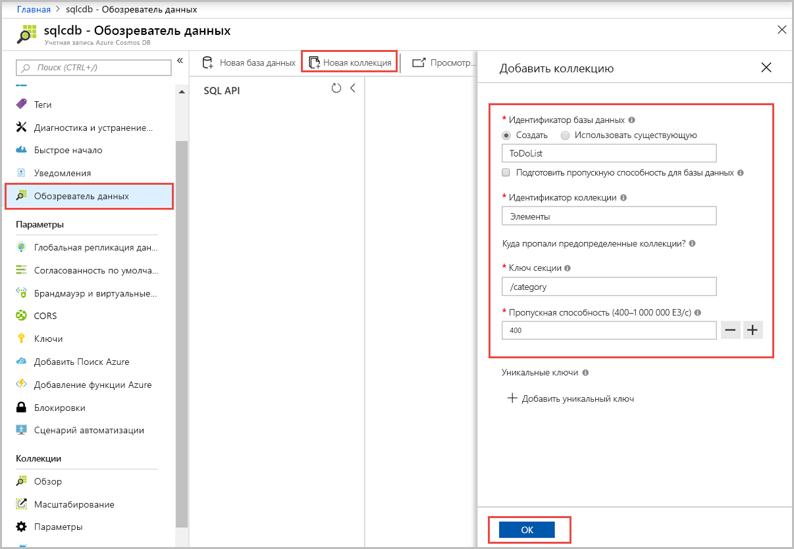

# <a name="quickstart-create-an-azure-cosmos-account-database-container-and-items-from-the-azure-portal"></a>Краткое руководство. Создание учетной записи, базы данных, контейнера и элементов Azure Cosmos на портале Azure

> [!div class="op_single_selector"]
> * [портал Azure](create-cosmosdb-resources-portal.md)
> * [.NET](create-sql-api-dotnet.md)
> * [Java](create-sql-api-java.md)
> * [Node.js](create-sql-api-nodejs.md)
> * [Python](create-sql-api-python.md)
> * [Xamarin](create-sql-api-xamarin-dotnet.md)
>  

Azure Cosmos DB — это глобально распределенная многомодельная служба базы данных Майкрософт. С помощью Azure Cosmos DB вы можете быстро создавать базы данных с парами "ключ-значение", документами и графами, которые используют возможности глобального распределения и горизонтального масштабирования ядра Azure Cosmos DB, а также выполнять запросы к таким базам данных. 

В этом кратком руководстве показано, как с помощью портала Azure создать учетную запись [API SQL](sql-api-introduction.md) в Azure Cosmos DB, создать базу данных документов и контейнер, а также добавить данные в контейнер. 

## <a name="prerequisites"></a>Предварительные требования

Подписка Azure или бесплатная пробная учетная запись Azure Cosmos DB.
- [!INCLUDE [quickstarts-free-trial-note](../../includes/quickstarts-free-trial-note.md)] 

- [!INCLUDE [cosmos-db-emulator-docdb-api](../../includes/cosmos-db-emulator-docdb-api.md)]  

<a id="create-account"></a>
## <a name="create-an-azure-cosmos-db-account"></a>создание учетной записи Azure Cosmos DB;

[!INCLUDE [cosmos-db-create-dbaccount](../../includes/cosmos-db-create-dbaccount.md)]

<a id="create-container-database"></a>
## <a name="add-a-database-and-a-container"></a>Добавление базы данных и контейнера 

Создать базу данных и контейнер можно с помощью обозревателя данных на портале Azure. 

1.  Выберите **Обозреватель данных** в области навигации слева на странице учетной записи Azure Cosmos DB, а затем щелкните **Новый контейнер**. 
    
    Возможно, потребуется прокрутить страницу вправо, чтобы отобразилось окно **Добавить контейнер**.
    
    
    
1.  На панели **Добавить контейнер** введите параметры для нового контейнера.
    
    |Параметр|Рекомендуемое значение|ОПИСАНИЕ
    |---|---|---|
    |**Идентификатор базы данных**|ToDoList|Введите *ToDoList* в качестве имени новой базы данных. Имена баз данных должны быть длиной от 1 до 255 символов и не могут содержать символы `/, \\, #, ?` или пробел в конце. Проверьте параметр **Provision database throughput** (Подготовка пропускной способности базы данных), который позволяет предоставить общий доступ к пропускной способности, подготовленной для базы данных всех контейнеров в пределах базы данных. Этот параметр также способствует экономии денежных средств. |
    |**Пропускная способность**|400|Для пропускной способности сохраните значение в 400 единиц запроса в секунду. Чтобы сократить задержку, позже вы можете увеличить масштаб пропускной способности.| 
    |**Идентификатор контейнера**|Items|Введите *Items* в качестве имени нового контейнера. Для идентификаторов контейнеров предусмотрены те же требования к символам, что и для имен баз данных.|
    |**Ключ секции**| /category| В примере, описанном в этой статье, используется ключ секции */category*.|

    
    Не добавляйте **уникальные ключи** для этого примера. Уникальные ключи позволяют создать в базе данных дополнительный слой целостности данных, отслеживая уникальность одного или нескольких значений по каждому ключу секции. Дополнительные сведения см. в статье об [уникальных ключах в Azure Cosmos DB](unique-keys.md).
    
1.  Нажмите кнопку **ОК**. В обозревателе данных отображается новая база данных и контейнер, который вы создали.

## <a name="add-data-to-your-database"></a>Добавление данных в базу данных

Теперь вы можете добавить данные в созданную базу данных с помощью обозревателя данных.

1. В **Обозревателе данных** разверните базу данных**ToDoList**, а затем контейнер **Элементы**. Далее выберите **Элементы**, а потом — **Новый элемент**. 
   
   
   
1. Добавьте следующую структуру в документ в правой части панели **Документы**:

     ```json
     {
         "id": "1",
         "category": "personal",
         "name": "groceries",
         "description": "Pick up apples and strawberries.",
         "isComplete": false
     }
     ```

1. Щелкните **Сохранить**.
   
   
   
1. Снова щелкните **Новый документ**, создайте и сохраните другой документ с уникальным значением `id`, присвоив ему все нужные свойства и значения. Документы могут иметь любую структуру, так как Azure Cosmos DB не требует использовать определенные схемы данных.

## <a name="query-your-data"></a>Обращение к данным

[!INCLUDE [cosmos-db-create-sql-api-query-data](../../includes/cosmos-db-create-sql-api-query-data.md)] 

## <a name="clean-up-resources"></a>Очистка ресурсов

[!INCLUDE [cosmosdb-delete-resource-group](../../includes/cosmos-db-delete-resource-group.md)]

## <a name="next-steps"></a>Дополнительная информация

В этом руководстве описано, как создать учетную запись Azure Cosmos DB, базу данных и контейнер с помощью обозревателя данных. Теперь можно импортировать дополнительные данные в учетную запись Azure Cosmos DB. 

> [!div class="nextstepaction"]
> [Импорт данных в DocumentDB с помощью средства миграции базы данных](import-data.md)