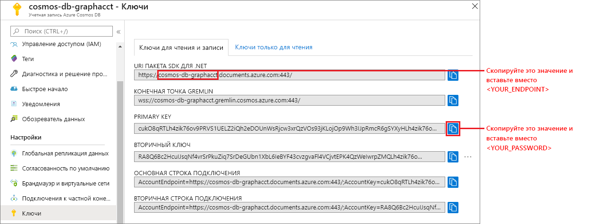
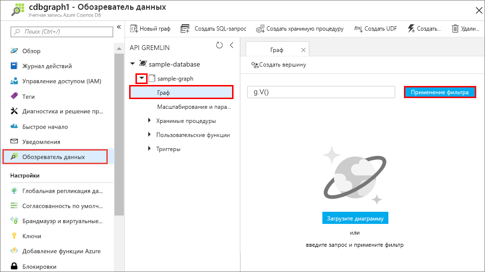
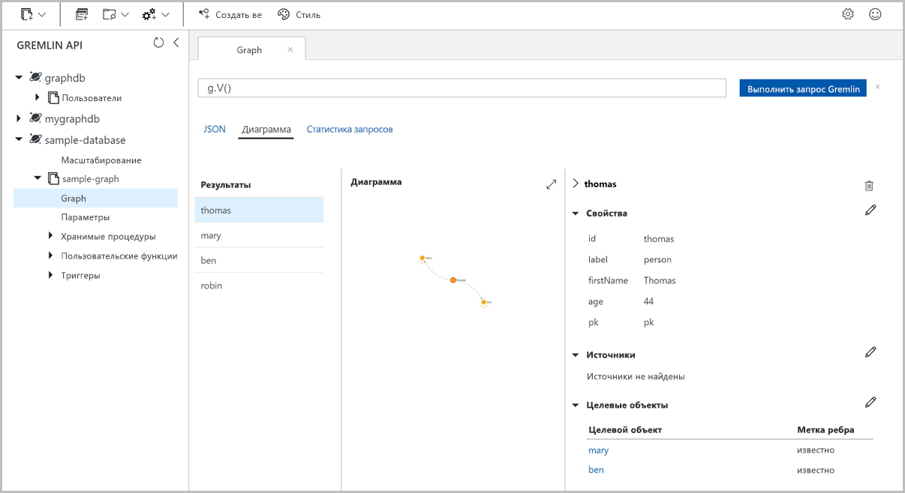
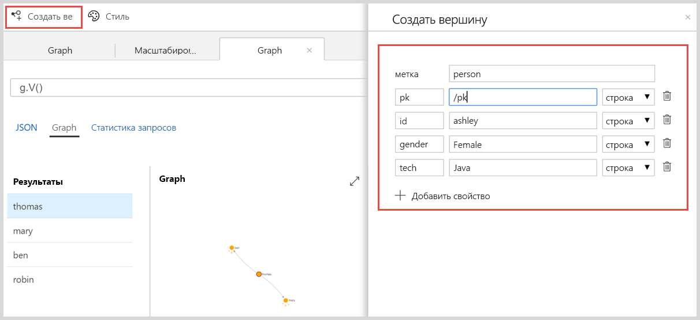
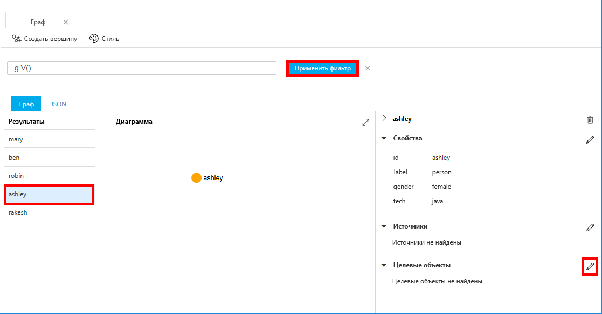
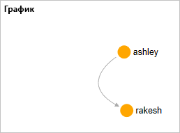

# <a name="quickstart-create-a-graph-database-in-azure-cosmos-db-using-python-and-the-azure-portal"></a>Краткое руководство. Создание графовой базы данных в Azure Cosmos DB с помощью Python и портала Azure

> [!div class="op_single_selector"]
> * [Консоль Gremlin](create-graph-gremlin-console.md)
> * [.NET](create-graph-dotnet.md)
> * [Java](create-graph-java.md)
> * [Node.js](create-graph-nodejs.md)
> * [Python](create-graph-python.md)
> * [PHP](create-graph-php.md)
>  

В этом кратком руководстве вы создадите учетную запись API Gremlin (граф) Azure Cosmos DB и будете управлять ею из портала Azure, после чего добавите данные с помощью приложения Python, клонированного из GitHub. Azure Cosmos DB — это служба многомодельной базы данных, позволяющая быстро создавать и запрашивать документы, таблицы, пары "ключ-значение" и графовые базы данных, используя возможности глобального распределения и горизонтального масштабирования.

## <a name="prerequisites"></a>Предварительные требования
- Учетная запись Azure с активной подпиской. [Создайте бесплатно](https://azure.microsoft.com/free/?ref=microsoft.com&utm_source=microsoft.com&utm_medium=docs&utm_campaign=visualstudio). Или [воспользуйтесь пробной версией Azure Cosmos DB](https://azure.microsoft.com/try/cosmosdb/) без подписки Azure.
- [Python 3.5 +](https://www.python.org/downloads/), включая установщик пакетов [pip](https://pip.pypa.io/en/stable/installing/).
- [Драйвер Python для Gremlin](https://github.com/apache/tinkerpop/tree/master/gremlin-python).
- [Git](https://git-scm.com/downloads).

> [!NOTE]
> Для работы с этим кратким руководством требуется учетная запись базы данных графа, созданной после 20 декабря 2017 г. Существующие учетные записи будут поддерживать Python после переноса в общедоступную версию.

## <a name="create-a-database-account"></a>Создание учетной записи базы данных

Перед созданием графовой базы данных необходимо создать учетную запись графовой базы данных Gremlin с Azure Cosmos DB.

[!INCLUDE [cosmos-db-create-dbaccount-graph](../../includes/cosmos-db-create-dbaccount-graph.md)]

## <a name="add-a-graph"></a>Добавление графа

[!INCLUDE [cosmos-db-create-graph](../../includes/cosmos-db-create-graph.md)]

## <a name="clone-the-sample-application"></a>Клонирование примера приложения

Теперь перейдем к работе с кодом. Мы клонируем приложение API Gremlin из GitHub, зададим строку подключения и запустим приложение. Вы узнаете, как можно упростить работу с данными программным способом.  

1. Откройте командную строку, создайте папку git-samples, а затем закройте окно командной строки.

    ```bash
    md "C:\git-samples"
    ```

2. Откройте окно терминала git, например git bash, и выполните команду `cd`, чтобы перейти в папку для установки примера приложения.  

    ```bash
    cd "C:\git-samples"
    ```

3. Выполните команду ниже, чтобы клонировать репозиторий с примером. Эта команда создает копию примера приложения на локальном компьютере. 

    ```bash
    git clone https://github.com/Azure-Samples/azure-cosmos-db-graph-python-getting-started.git
    ```

## <a name="review-the-code"></a>Просмотр кода

Это необязательный шаг. Если вы хотите узнать, как создать в коде ресурсы базы данных, изучите приведенные ниже фрагменты кода. Они взяты из файла *connect.py*, который расположен в папке *C:\git-samples\azure-cosmos-db-graph-python-getting-started\\* . Если вас это не интересует, можете сразу переходить к разделу [Обновление строки подключения](#update-your-connection-information). 

* Gremlin `client` инициализируется в строке 104 файла *connect.py*:

    ```python
    ...
    client = client.Client('wss://<YOUR_ENDPOINT>.gremlin.cosmosdb.azure.com:443/','g', 
        username="/dbs/<YOUR_DATABASE>/colls/<YOUR_COLLECTION_OR_GRAPH>", 
        password="<YOUR_PASSWORD>")
    ...
    ```

* Последовательность шагов Gremlin объявляется в начале файла *connect.py*. Затем они выполняются с помощью метода `client.submitAsync()`:

    ```python
    client.submitAsync(_gremlin_cleanup_graph)
    ```

## <a name="update-your-connection-information"></a>Обновление информации о подключении

Теперь вернитесь на портал Azure, чтобы получить данные для подключения. Скопируйте эти данные в приложение. Эти настройки обеспечат обмен данными между вашим приложением и размещенной базой данных.

1. В учетной записи Azure Cosmos DB на [портале Azure](https://portal.azure.com/) выберите элемент **Ключи**. 

    Скопируйте первую часть значения URI.

    

2. Откройте файл *connect.py* `<YOUR_ENDPOINT>` и в строке 104 вставьте значение URI вместо :

    ```python
    client = client.Client('wss://<YOUR_ENDPOINT>.gremlin.cosmosdb.azure.com:443/','g', 
        username="/dbs/<YOUR_DATABASE>/colls/<YOUR_COLLECTION_OR_GRAPH>", 
        password="<YOUR_PASSWORD>")
    ```

    Часть URI в клиентском объекте теперь должна выглядеть следующим образом:

    ```python
    client = client.Client('wss://test.gremlin.cosmosdb.azure.com:443/','g', 
        username="/dbs/<YOUR_DATABASE>/colls/<YOUR_COLLECTION_OR_GRAPH>", 
        password="<YOUR_PASSWORD>")
    ```

3. Измените второй параметр объекта `client`, чтобы заменить строки `<YOUR_DATABASE>` и `<YOUR_COLLECTION_OR_GRAPH>`. Если вы использовали предложенные значения, параметр должен выглядеть следующим образом:

    `username="/dbs/sample-database/colls/sample-graph"`

    Весь объект `client` теперь должен выглядеть следующим образом:

    ```python
    client = client.Client('wss://test.gremlin.cosmosdb.azure.com:443/','g', 
        username="/dbs/sample-database/colls/sample-graph", 
        password="<YOUR_PASSWORD>")
    ```

4. На странице `<YOUR_PASSWORD>`Ключи`password=<YOUR_PASSWORD>` с помощью кнопки "Копировать" скопируйте первичный ключ и вставьте его вместо **в параметр**.

    Теперь все определение объекта `client` должно выглядеть следующим образом:
    ```python
    client = client.Client('wss://test.gremlin.cosmosdb.azure.com:443/','g', 
        username="/dbs/sample-database/colls/sample-graph", 
        password="asdb13Fadsf14FASc22Ggkr662ifxz2Mg==")
    ```

6. Сохраните файл *connect.py*.

## <a name="run-the-console-app"></a>Запуск консольного приложения

1. В окне терминала Git перейдите в папку azure-cosmos-db-graph-python-getting-started folder с помощью команды `cd`.

    ```git
    cd "C:\git-samples\azure-cosmos-db-graph-python-getting-started"
    ```

2. В окне терминала Git введите следующую команду, чтобы установить необходимые пакеты Python.

   ```
   pip install -r requirements.txt
   ```

3. В окне терминала Git выполните следующую команду, чтобы запустить приложение Python.
    
    ```
    python connect.py
    ```

    В окне терминала появятся вершины и ребра, добавляемые в граф. 
    
    Если возникают ошибки времени ожидания, проверьте, правильно ли вы [указали сведения о подключении](#update-your-connection-information), и попробуйте еще раз выполнить последнюю команду. 
    
    Когда программа завершит работу, нажмите клавишу ВВОД и переключитесь на окно веб-браузера с порталом Azure.

<a id="add-sample-data"></a>
## <a name="review-and-add-sample-data"></a>Просмотр и добавление демонстрационных данных

Добавив вершины и ребра, вы можете вернуться в обозреватель данных, чтобы просмотреть вершины, добавленные в граф, и включить дополнительные точки данных.

1. В учетной записи Azure Cosmos DB на портале Azure выберите **Обозреватель данных**, разверните **sample-graph**, а затем выберите **Граф** и нажмите кнопку **Применить фильтр**. 

   

2. В списке **Результаты** обратите внимание на трех новых пользователей, добавленных в граф. Здесь можно перетаскивать вершины мышью, увеличивать или уменьшать масштаб колесиком мыши, а также увеличивать размер графа с помощью двойной стрелки. 

   

3. Давайте добавим несколько новых пользователей. Нажмите кнопку **Новая вершина**, чтобы добавить данные в граф.

   

4. Введите метку *person*.

5. Щелкните **Добавить свойство**, чтобы добавить каждое из указанных ниже свойств. Обратите внимание, что вы можете создать уникальные свойства для каждого пользователя в графе. Требуется только ключ идентификатора.

    ключ|value|Примечания
    ----|----|----
    pk|/pk| 
    идентификатор|ashley|Уникальный идентификатор вершины. Если не указать идентификатор, он создастся автоматически.
    gender|Женский| 
    Технология | java | 

    > [!NOTE]
    > В этом кратком руководстве создается несекционированная коллекция. Но если вы создаете секционированную коллекцию, указав ключ раздела во время создания коллекции, включите ключ раздела в качестве ключа каждой новой вершины. 

6. Щелкните **ОК**. Чтобы увидеть кнопку **ОК** в нижней части экрана, может потребоваться развернуть экран.

7. Еще раз щелкните **Создать вершину**, чтобы добавить нового пользователя. 

8. Введите метку *person*.

9. Щелкните **Добавить свойство**, чтобы добавить каждое из указанных ниже свойств:

    ключ|value|Примечания
    ----|----|----
    pk|/pk| 
    идентификатор|rakesh|Уникальный идентификатор вершины. Если не указать идентификатор, он создастся автоматически.
    gender|Мужской| 
    Учебное заведение|MIT| 

10. Щелкните **ОК**. 

11. Нажмите кнопку **Применить фильтр** со стандартным значением фильтра `g.V()`, чтобы отобразить все значения графа. Все пользователи теперь отображаются в списке **Результаты**. 

    По мере добавления новых данных используйте фильтры для ограничения результатов. По умолчанию обозреватель данных использует `g.V()` для получения всех вершин в графе. Вы можете задать для него другой [запрос графа](tutorial-query-graph.md), например `g.V().count()`, который возвращает число всех вершин графа в формате JSON. Если вы изменили фильтр, снова установите фильтр `g.V()` и щелкните **Применить фильтр**, чтобы снова отобразить полный список результатов.

12. Теперь можно будет соединить пользователей rakesh и ashley. Убедитесь, что в списке **Результаты** выбрано пользователя **ashley**, а затем нажмите кнопку редактирования рядом с разделом **Целевые объекты** в нижнем правом углу. Чтобы отобразить область **Свойства**, может потребоваться развернуть окно.

    

13. В поле **Целевой объект** введите *rakesh*, затем в поле **Edge label** (Граничная метка) введите слово *знает* и щелкните значок галочки.

    

14. Теперь выберите пользователя **rakesh** в списке результатов. Вы увидите, что пользователи ashley и rakesh связаны. 

    

На этом часть руководства, посвященная созданию ресурсов, завершена. Вы можете дополнить граф новыми вершинами, а также изменить существующие вершины или запросы. Теперь давайте изучим метрики, которые предоставляет Azure Cosmos DB, а затем очистим все ресурсы. 

## <a name="review-slas-in-the-azure-portal"></a>Просмотр соглашений об уровне обслуживания на портале Azure

[!INCLUDE [cosmosdb-tutorial-review-slas](../../includes/cosmos-db-tutorial-review-slas.md)]

## <a name="clean-up-resources"></a>Очистка ресурсов

[!INCLUDE [cosmosdb-delete-resource-group](../../includes/cosmos-db-delete-resource-group.md)]

## <a name="next-steps"></a>Дальнейшие действия

В этом кратком руководстве вы узнали, как создать учетную запись Azure Cosmos DB, граф с помощью Data Explorer, а также как запустить приложение Python, чтобы добавить данные в граф. Теперь вы можете создавать более сложные запросы и внедрять эффективную логику обхода графа с помощью Gremlin. 

> [!div class="nextstepaction"]
> [Как выполнять запросы к данным в базе данных Azure Cosmos DB с помощью API Graph (предварительная версия)](tutorial-query-graph.md)

