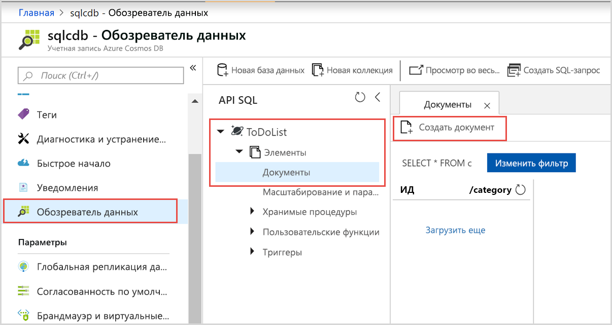
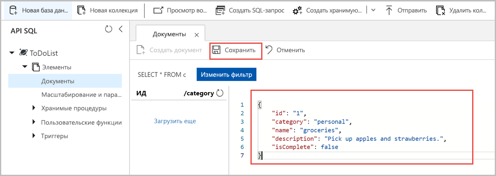
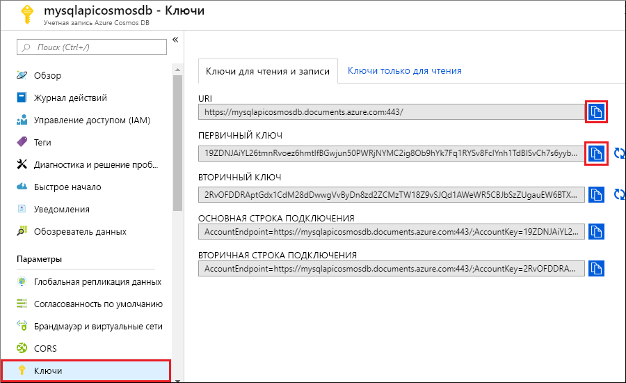

# <a name="quickstart-build-a-net-web-app-using-sql-api-account-in-azure-cosmos-db"></a>Краткое руководство. Создание веб-приложения .NET с помощью учетной записи API SQL в Azure Cosmos DB

> [!div class="op_single_selector"]
> * [.NET](create-sql-api-dotnet.md)
> * [.NET (предварительная версия)](create-sql-api-dotnet-preview.md)
> * [Java](create-sql-api-java.md)
> * [Node.js](create-sql-api-nodejs.md)
> * [Python](create-sql-api-python.md)
> * [Xamarin](create-sql-api-xamarin-dotnet.md)
>  
> 

Azure Cosmos DB — это глобально распределенная многомодельная служба базы данных Майкрософт. С помощью Azure Cosmos DB вы можете быстро создавать базы данных с парами "ключ-значение", документами и графами, которые используют возможности глобального распределения и горизонтального масштабирования ядра Azure Cosmos DB, а также выполнять запросы к таким базам данных. 

В этом кратком руководстве показано, как с помощью портала Azure создать учетную запись [API SQL](sql-api-introduction.md) в Azure Cosmos DB, создать базу данных документов и коллекцию, а также добавить пример данных в эту коллекцию. После этого вы примените веб-приложение на основе [пакета SDK .NET для SQL](sql-api-sdk-dotnet.md), чтобы добавить в коллекцию дополнительные данные. 

В рамках этого краткого руководстве вы создадите базу данных и коллекцию с помощью средства обозревателя данных на портале Azure. Кроме того, базу данных и коллекцию можно создать с помощью примера кода .NET. Дополнительные сведения см. в [описании кода .NET](#review-the-net-code). 

## <a name="prerequisites"></a>Предварительные требования

Visual Studio 2019 с установленной рабочей нагрузкой разработки для Azure
- Вы можете скачать и использовать **бесплатную** версию [Visual Studio 2019 Community Edition](https://www.visualstudio.com/downloads/). При установке Visual Studio необходимо включить возможность **разработки для Azure**. 

Подписка Azure или бесплатная пробная учетная запись Azure Cosmos DB.
- [!INCLUDE [quickstarts-free-trial-note](../../includes/quickstarts-free-trial-note.md)] 
- [!INCLUDE [cosmos-db-emulator-docdb-api](../../includes/cosmos-db-emulator-docdb-api.md)]  

<a id="create-account"></a>
## <a name="create-an-azure-cosmos-db-account"></a>создание учетной записи Azure Cosmos DB;

[!INCLUDE [cosmos-db-create-dbaccount](../../includes/cosmos-db-create-dbaccount.md)]

<a id="create-collection-database"></a>
## <a name="add-a-database-and-a-collection"></a>Добавление базы данных и коллекции 

Теперь вы можете создать базу данных и коллекцию с помощью обозревателя данных на портале Azure. 

1.  Выберите **Обозреватель данных** в области навигации слева на странице учетной записи Azure Cosmos DB, а затем щелкните **Новый контейнер**. 
    
    Возможно, потребуется прокрутить страницу вправо, чтобы отобразилось окно **Добавить контейнер**.
    
    
    
1.  В области **Добавить контейнер** введите параметры для новой коллекции.
    
    |Параметр|Рекомендуемое значение|ОПИСАНИЕ
    |---|---|---|
    |**Идентификатор базы данных**|ToDoList|Введите *ToDoList* в качестве имени новой базы данных. Имена баз данных должны быть длиной от 1 до 255 символов и не могут содержать символы `/, \\, #, ?` или пробел в конце. Проверьте параметр **Provision database throughput** (Подготовка пропускной способности базы данных), который позволяет предоставить общий доступ к пропускной способности, подготовленной для базы данных всех контейнеров в пределах базы данных. Этот параметр также способствует экономии денежных средств. |
    |**Пропускная способность**|400|Для пропускной способности сохраните значение в 400 единиц запроса в секунду. Чтобы сократить задержку, позже вы можете увеличить масштаб пропускной способности.| 
    |**Идентификатор контейнера**|Items|Введите *Элементы* в качестве имени новой коллекции. Для идентификаторов коллекций предусмотрены те же требования к символам, что и для имен баз данных.|
    |**Ключ секции**| /category| В примере, описанном в этой статье, используется ключ секции */category*.|

    
    Не добавляйте **уникальные ключи** для этого примера. Уникальные ключи позволяют создать в базе данных дополнительный слой целостности данных, отслеживая уникальность одного или нескольких значений по каждому ключу секции. Дополнительные сведения см. в статье об [уникальных ключах в Azure Cosmos DB](unique-keys.md).
    
1.  Нажмите кнопку **ОК**. В обозревателе данных отображается новая база данных и контейнер, который вы создали.
    

## <a name="add-data-to-your-database"></a>Добавление данных в базу данных

Теперь вы можете добавить данные в созданную базу данных с помощью обозревателя данных.

1. В **Обозревателе данных** разверните базу данных**ToDoList**, а затем контейнер **Элементы**. Далее выберите **Элементы**, а потом — **Новый элемент**. 
   
   
   
1. Добавьте следующую структуру в документ в правой части панели **Документы**:

     ```json
     {
         "id": "1",
         "category": "personal",
         "name": "groceries",
         "description": "Pick up apples and strawberries.",
         "isComplete": false
     }
     ```

1. Щелкните **Сохранить**.
   
   
   
1. Снова щелкните **Новый документ**, создайте и сохраните другой документ с уникальным значением `id`, присвоив ему все нужные свойства и значения. Документы могут иметь любую структуру, так как Azure Cosmos DB не требует использовать определенные схемы данных.

## <a name="query-your-data"></a>Обращение к данным

[!INCLUDE [cosmos-db-create-sql-api-query-data](../../includes/cosmos-db-create-sql-api-query-data.md)]

## <a name="use-the-net-web-app-to-manage-data"></a>Использование веб-приложения .NET для управления данными

Чтобы оценить простоту программной работы с данными в Azure Cosmos DB, клонируйте пример приложения SQL API .NET из GitHub, отредактируйте строку подключения и запустите приложение, чтобы обновить данные. 

Базу данных и контейнер также можно создать с помощью примера кода .NET. Дополнительные сведения см. в [описании кода .NET](#review-the-net-code).

### <a name="clone-the-sample-app"></a>Клонирования примера приложения

Сначала клонируйте [интерфейсное приложение SQL](https://github.com/Azure-Samples/documentdb-dotnet-todo-app) на C# из GitHub. 

1. Откройте окно терминала Git, например Git Bash, создайте каталог с именем *git-samples* и откройте его: 
   
   ```bash
   mkdir /c/git-samples/
   cd /c/git-samples/
   ```
   
1. Выполните следующую команду, чтобы клонировать пример из репозитория на локальный компьютер:
   
   ```bash
   git clone https://github.com/Azure-Samples/documentdb-dotnet-todo-app.git
   ```

### <a name="update-the-connection-string"></a>Обновление строки подключения 

1. Найдите файл *todo.sln* в папке клонированного приложения и откройте его в Visual Studio. 

1. В **обозревателе решений** Visual Studio откройте файл *web.config*. 

1. Вернитесь на портал Azure и скопируйте данные строки подключения. Затем вставьте их в файл *web.config*.
   
   1. На навигационной панели слева для учетной записи Azure Cosmos DB выберите элемент **Ключи**.
      
      
      
   1. В разделе **Ключи для чтения и записи** скопируйте значение **URI** с помощью кнопки копирования справа и вставьте его в ключ `endpoint` в файле *web.config*. Например: 
      
      `<add key="endpoint" value="https://mysqlapicosmosdb.documents.azure.com:443/" />`
      
   1. Скопируйте значение **первичного ключа** и вставьте его в ключ `authKey` в файле *web.config*. Например:
      
      `<add key="authKey" value="19ZDNJAiYL26tmnRvoez6hmtIfBGwjun50PWRjNYMC2ig8Ob9hYk7Fq1RYSv8FcIYnh1TdBISvCh7s6yyb0000==" />`

       
1. Убедитесь, что значения базы данных и коллекции (другое название — контейнер) в *web.config* совпадают с созданными ранее именами. 

   ```csharp
   <add key="database" value="ToDoList"/>
   <add key="collection" value="Items"/>
   ```
 
1. Сохраните файл *web.config*. Теперь приложение содержит все сведения, необходимые для взаимодействия с Azure Cosmos DB.

### <a name="run-the-web-app"></a>Запуск веб-приложения

1. В Visual Studio в **обозревателе решений** щелкните проект **todo** правой кнопкой мыши и выберите **Управление пакетами NuGet**. 

1. В окне NuGet в поле **Обзор** введите *DocumentDB*.

1. Из списка результатов поиска установите **версию 2.2.3** библиотеки **Microsoft.Azure.DocumentDB**, если она еще не установлена. С помощью этого действия устанавливается пакет [Microsoft.Azure.DocumentDB](https://www.nuget.org/packages/Microsoft.Azure.DocumentDB/) и все его зависимости.
   
   Если в диспетчере пакетов NuGet отобразится сообщение о том, что в решении отсутствуют некоторые пакеты, выберите действие **Восстановить**, чтобы установить их из внутренних источников. 

1. Запустите приложение в браузере с помощью сочетания клавиш **CTRL**+**F5**. 

1. Щелкните **Создать** в приложении списка задач и создайте несколько произвольных задач.

   

Вернитесь к обозревателю данных на портале Azure. Здесь вы можете просматривать, запрашивать, изменять и обрабатывать новые данные. 

## <a name="review-the-net-code"></a>Изучение кода .NET

Этот шаг не является обязательным. В рамках этого краткого руководства вы создали базу данных и контейнер на портале Azure и добавили тестовые данные с помощью примера кода .NET. Тем не менее, базу данных и контейнер можно также создать с помощью примера кода .NET. Если вы хотите узнать, как создать в коде ресурсы базы данных, изучите приведенные ниже фрагменты кода. Все эти фрагменты взяты из файла *DocumentDBRepository.cs* проекта **todo**.

* С помощью этого кода инициализируется `DocumentClient`: 

    ```csharp
    client = new DocumentClient(new Uri(ConfigurationManager.AppSettings["endpoint"]), ConfigurationManager.AppSettings["authKey"]);
    ```

* С помощью этого кода создается база данных с использованием метода `CreateDatabaseAsync`:

    ```csharp
    await client.CreateDatabaseAsync(new Database { Id = DatabaseId });
    ```

* С помощью этого кода создается коллекция с использованием метода `CreateDocumentCollectionAsync`:

    ```csharp
    private static async Task CreateCollectionIfNotExistsAsync(string partitionkey)
    {
       try
       {       
        await client.ReadDocumentCollectionAsync(UriFactory.CreateDocumentCollectionUri(DatabaseId, CollectionId), new RequestOptions { PartitionKey = new PartitionKey(partitionkey) });
       }
        catch (DocumentClientException e)
        {
           if (e.StatusCode == System.Net.HttpStatusCode.NotFound)
            {
                await client.CreateDocumentCollectionAsync(
                  UriFactory.CreateDatabaseUri(DatabaseId),
                   new DocumentCollection
                    {
                      Id = CollectionId,
                      PartitionKey = new PartitionKeyDefinition
                       {
                           Paths = new System.Collections.ObjectModel.Collection<string>(new List<string>() { partitionkey })
                        }
                    },
                      new RequestOptions { OfferThroughput = 400 });
            }
            else
            {
                throw;
            }
        }
    }
    ```

## <a name="clean-up-resources"></a>Очистка ресурсов

[!INCLUDE [cosmosdb-delete-resource-group](../../includes/cosmos-db-delete-resource-group.md)]

## <a name="next-steps"></a>Дополнительная информация

Из этого краткого руководства вы узнали, как создать учетную запись Azure Cosmos DB, базу данных и контейнер с помощью обозревателя данных и как запустить веб-приложение .NET для обновления данных. Теперь можно импортировать дополнительные данные в учетную запись Azure Cosmos DB. 

> [!div class="nextstepaction"]
> [Импорт данных в DocumentDB с помощью средства миграции базы данных](import-data.md)

