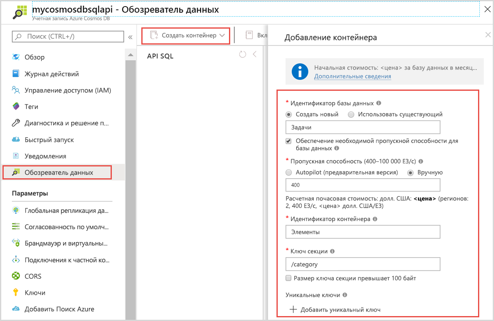
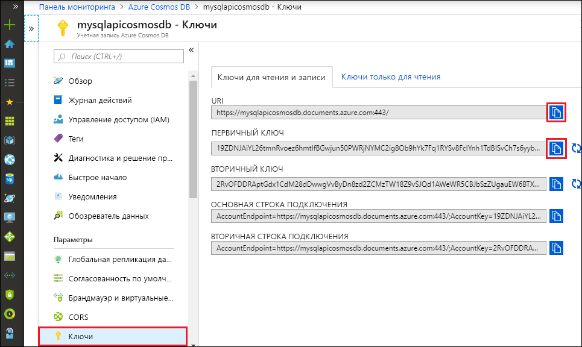

# <a name="quickstart-build-a-python-application-using-an-azure-cosmos-db-sql-api-account"></a>Краткое руководство. Создание приложения Python с использованием учетной записи API SQL для Azure Cosmos DB

> [!div class="op_single_selector"]
> * [.NET версии 3](create-sql-api-dotnet.md)
> * [.NET версии 4](create-sql-api-dotnet-V4.md)
> * [Java](create-sql-api-java.md)
> * [Node.js](create-sql-api-nodejs.md)
> * [Python](create-sql-api-python.md)
> * [Xamarin](create-sql-api-xamarin-dotnet.md)

В этом кратком руководстве показано, как создать учетную запись [API SQL для Azure Cosmos DB](sql-api-introduction.md), базу данных документов и контейнер с помощью портала Azure. Затем вы создадите консольное приложение с помощью пакета SDK для Python для [API SQL](sql-api-sdk-python.md) и запустите его.

Azure Cosmos DB — это глобально распределенная многомодельная служба базы данных Майкрософт. Можно быстро создавать и запрашивать документы, пары "ключ-значение", широкие столбцы и графовые базы данных. Все эти операции используют преимущества распределения и масштабирования Azure Cosmos DB.

В рамках этого краткого руководства используется версия 4 [пакета SDK для Python](https://pypi.org/project/azure-cosmos/#history).

[!INCLUDE [quickstarts-free-trial-note](../../includes/quickstarts-free-trial-note.md)] [!INCLUDE [cosmos-db-emulator-docdb-api](../../includes/cosmos-db-emulator-docdb-api.md)]

## <a name="prerequisites"></a>Предварительные требования

* [Python 3.6 или более поздней версии](https://www.python.org/downloads/) с исполняемым файлом `python` в `PATH`.
* [Visual Studio Code](https://code.visualstudio.com/)
* [Расширение Python для Visual Studio Code](https://marketplace.visualstudio.com/items?itemName=ms-python.python#overview)

## <a name="create-a-database-account"></a>Создание учетной записи базы данных

[!INCLUDE [cosmos-db-create-dbaccount](../../includes/cosmos-db-create-dbaccount.md)]

## <a name="add-a-container"></a>Добавление контейнера

Теперь вы можете использовать средство обозреватель данных на портале Azure для создания базы данных и контейнера. 

1. Щелкните **Обозреватель данных** > **Создать контейнер**. 
    
    Справа отобразится область **Добавить контейнер**. Возможно, вам придется прокрутить экран вправо, чтобы увидеть ее.

    

2. На странице **Добавить контейнер** введите параметры для нового контейнера.

    |Параметр|Рекомендуемое значение|Описание
    |---|---|---|
    |**Идентификатор базы данных**|Задания|Введите *ToDoList* в качестве имени новой базы данных. Имена баз данных должны быть длиной от 1 до 255 символов и не могут содержать символы `/, \\, #, ?` или пробел в конце. Проверьте параметр **Provision database throughput** (Подготовка пропускной способности базы данных), который позволяет предоставить общий доступ к пропускной способности, подготовленной для базы данных всех контейнеров в пределах базы данных. Этот параметр также способствует экономии денежных средств. |
    |**Пропускная способность**|400|Для пропускной способности сохраните значение в 400 единиц запроса в секунду. Чтобы сократить задержку, позже вы можете увеличить масштаб пропускной способности.| 
    |**Идентификатор контейнера**|Items|Введите *Items* в качестве имени нового контейнера. Для идентификаторов контейнеров предусмотрены те же требования к символам, что и для имен баз данных.|
    |**Ключ секции**| /category| В примере, описанном в этой статье, используется ключ секции */category*.|
    
    Помимо указанных выше параметров вы также можете добавить **уникальные ключи** для контейнера. В рамках этого примера оставим это поле пустым. Уникальные ключи предоставляют разработчикам возможность добавить слой целостности данных в базу данных. Создавая политику уникальных ключей при создании контейнера, вы гарантируете уникальность одного или нескольких значений ключа секции. Дополнительные сведения см. в статье [Уникальные ключи в Azure Cosmos DB](unique-keys.md).
    
    Щелкните **ОК**. В обозревателе данных отобразится новая база данных и контейнер.

## <a name="add-sample-data"></a>Добавление демонстрационных данных

[!INCLUDE [cosmos-db-create-sql-api-add-sample-data](../../includes/cosmos-db-create-sql-api-add-sample-data.md)]

## <a name="query-your-data"></a>Обращение к данным

[!INCLUDE [cosmos-db-create-sql-api-query-data](../../includes/cosmos-db-create-sql-api-query-data.md)]

## <a name="clone-the-sample-application"></a>Клонирование примера приложения

Теперь необходимо клонировать приложение API SQL из GitHub. Задайте строку подключения и выполните ее.

1. Откройте командную строку, создайте папку git-samples, а затем закройте окно командной строки.

    ```cmd
    md "git-samples"
    ```
   Если используете строку Bash, укажите следующую команду:

   ```bash
   mkdir "git-samples"
   ```

2. Откройте окно терминала git, например git bash, и выполните команду `cd`, чтобы перейти в новую папку для установки примера приложения.

    ```bash
    cd "git-samples"
    ```

3. Выполните команду ниже, чтобы клонировать репозиторий с примером. Эта команда создает копию примера приложения на локальном компьютере. 

    ```bash
    git clone https://github.com/Azure-Samples/azure-cosmos-db-python-getting-started.git
    ```  

## <a name="update-your-connection-string"></a>Обновление строки подключения

Теперь вернитесь на портал Azure, чтобы получить данные строки подключения. Скопируйте эти данные в приложение.

1. На [портале Azure](https://portal.azure.com/) в учетной записи Azure Cosmos выберите **Ключи** в области навигации слева. На следующем шаге используйте кнопку копирования в правой части экрана, чтобы скопировать **универсальный код ресурса (URI)** и **первичный ключ** в файл `cosmos_get_started.py`.

    

2. Откройте файл `cosmos_get_started.py` из \git-samples\azure-cosmos-db-python-getting-started в Visual Studio Code.

3. Скопируйте значение **универсального кода ресурса (URI)** на портале (с помощью кнопки копирования) и добавьте его в качестве значения переменной **endpoint** (конечная точка) в файл ``cosmos_get_started.py``. 

    `endpoint = 'https://FILLME.documents.azure.com',`

4. Затем скопируйте значение **первичного ключа** с портала и добавьте его в качестве значения **key** (ключ) в файл ``cosmos_get_started.py``. Теперь приложение со всеми сведениями, необходимыми для взаимодействия с Azure Cosmos DB, обновлено. 

    `key = 'FILLME'`

5. Сохраните файл ``cosmos_get_started.py``.

## <a name="review-the-code"></a>Просмотр кода

Это необязательный шаг. Узнайте о ресурсах базы данных, созданных в коде, или сразу перейдите к разделу [Обновление строки подключения](#update-your-connection-string).

Приведенные ниже фрагменты кода взяты из файла `cosmos_get_started.py`.

* Инициализация экземпляра CosmosClient. Обязательно обновите значения "endpoint" (конечная точка) и "key" (ключ), как описано в разделе об [обновлении строки подключения](#update-your-connection-string). 

    [!code-python[](~/azure-cosmos-db-python-getting-started/cosmos_get_started.py?name=create_cosmos_client)]

* Создание базы данных.

    [!code-python[](~/azure-cosmos-db-python-getting-started/cosmos_get_started.py?name=create_database_if_not_exists)]

* Будет создан контейнер с [подготовленной пропускной способностью](request-units.md) в 400 единиц запросов в секунду. Мы выбрали значение `lastName` для параметра [partition key](partitioning-overview.md#choose-partitionkey) (ключ секции), что позволяет эффективно выполнять запросы с фильтрацией по этому свойству. 

    [!code-python[](~/azure-cosmos-db-python-getting-started/cosmos_get_started.py?name=create_container_if_not_exists)]

* Некоторые элементы добавляются в контейнер. Контейнеры — это коллекции элементов (документов JSON) с переменными схемами. Вспомогательные методы ```get_[name]_family_item``` возвращают представления семейства, которые хранятся в Azure Cosmos DB в виде документов JSON.

    [!code-python[](~/azure-cosmos-db-python-getting-started/cosmos_get_started.py?name=create_item)]

* Точечные операции чтения (поиск по ключу) выполняются с помощью метода `read_item`. Мы выводим сведения о [стоимости в ЕЗ](request-units.md) для каждой операции.
    [!code-python[](~/azure-cosmos-db-python-getting-started/cosmos_get_started.py?name=read_item)]

* Запрос выполняется с помощью синтаксиса SQL. Так как мы используем в предложении WHERE значения ключа секции ```lastName```, Azure Cosmos DB будет эффективно маршрутизировать этот запрос к соответствующим секциям, что повышает производительность.

    [!code-python[](~/azure-cosmos-db-python-getting-started/cosmos_get_started.py?name=query_items)]
   
## <a name="run-the-app"></a>Запустите приложение

1. В Visual Studio Code выберите **Вид** > **Палитра команд**. 

2. При появлении соответствующего запроса введите **Python: выбрать интерпретатор** и установите нужную версию Python.

    Нижний колонтитул в Visual Studio Code будет обновлен для указания выбранного интерпретатора. 

3. Выберите **Вид** > **Интегрированный терминал**, чтобы открыть интегрированный терминал Visual Studio Code.

4. В окне терминала проверьте, находитесь ли вы в папке "azure-cosmos-db-python-getting-started". Если нет, выполните следующую команду, чтобы перейти в папку примера. 

    ```cmd
    cd "\git-samples\azure-cosmos-db-python-getting-started"`
    ```

5. Выполните следующую команду, чтобы установить пакет azure-cosmos. 

    ```python
    pip install --pre azure-cosmos
    ```

    Если при попытке установить пакет azure-cosmos появляется ошибка отказа в доступе, необходимо [запустить Visual Studio Code от имени администратора](https://stackoverflow.com/questions/37700536/visual-studio-code-terminal-how-to-run-a-command-with-administrator-rights).

6. Выполните приведенную ниже команду, чтобы выполнить пример, а также создать и сохранить документы в Azure Cosmos DB.

    ```python
    python cosmos_get_started.py
    ```

7. Чтобы убедиться в том, что элементы созданы и сохранены, выберите на портале Azure **Обозреватель данных** > **AzureSampleFamilyDatabase** > **Элементы**. Проверьте, есть ли здесь созданные элементы. Ниже приведен пример документа JSON для семейства Андерсен:

```json
{
    "id": "Andersen-1569479288379",
    "lastName": "Andersen",
    "district": "WA5",
    "parents": [
        {
            "familyName": null,
            "firstName": "Thomas"
        },
        {
            "familyName": null,
            "firstName": "Mary Kay"
        }
    ],
    "children": null,
    "address": {
        "state": "WA",
        "county": "King",
        "city": "Seattle"
    },
    "registered": true,
    "_rid": "8K5qAIYtZXeBhB4AAAAAAA==",
    "_self": "dbs/8K5qAA==/colls/8K5qAIYtZXc=/docs/8K5qAIYtZXeBhB4AAAAAAA==/",
    "_etag": "\"a3004d78-0000-0800-0000-5d8c5a780000\"",
    "_attachments": "attachments/",
    "_ts": 1569479288
}
```

## <a name="review-slas-in-the-azure-portal"></a>Просмотр соглашений об уровне обслуживания на портале Azure

[!INCLUDE [cosmosdb-tutorial-review-slas](../../includes/cosmos-db-tutorial-review-slas.md)]

## <a name="clean-up-resources"></a>Очистка ресурсов

[!INCLUDE [cosmosdb-delete-resource-group](../../includes/cosmos-db-delete-resource-group.md)]

## <a name="next-steps"></a>Дальнейшие действия

В этом руководстве описано, как создать учетную запись Azure Cosmos и контейнер с помощью обозревателя данных, а также как запустить приложение. Теперь можно импортировать дополнительные данные в учетную запись Azure Cosmos DB. 

> [!div class="nextstepaction"]
> [Импорт данных в Azure Cosmos DB для API SQL](import-data.md)


