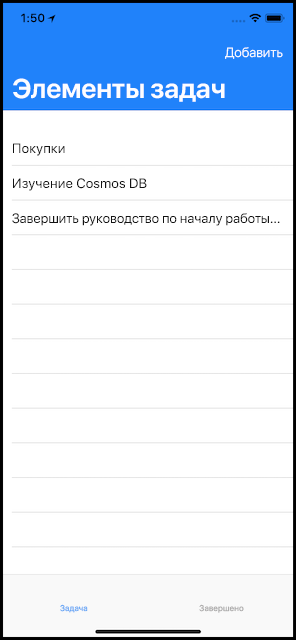
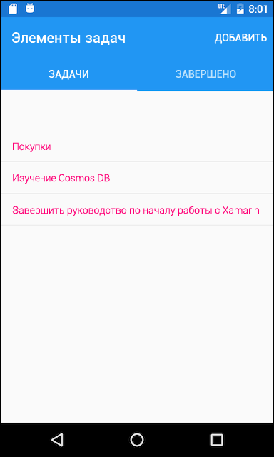
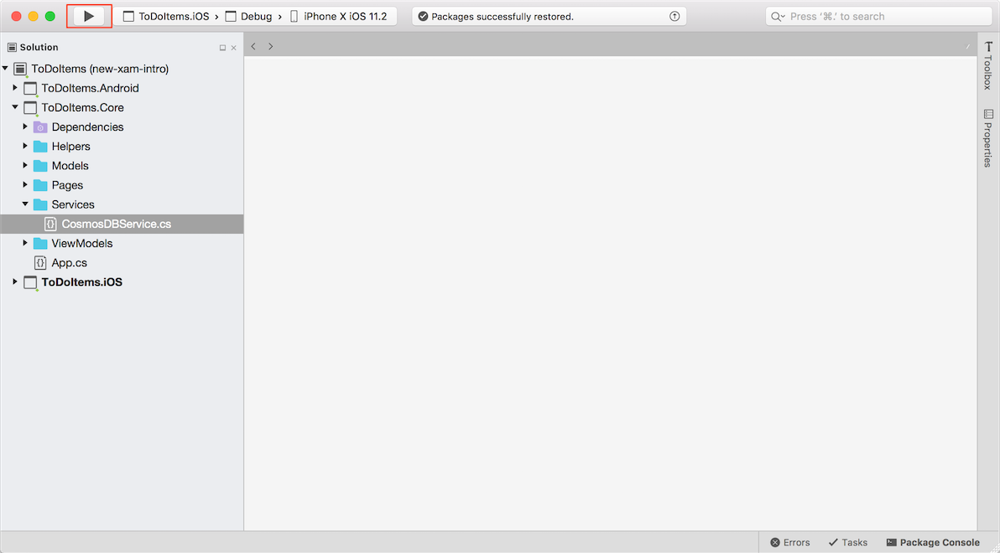
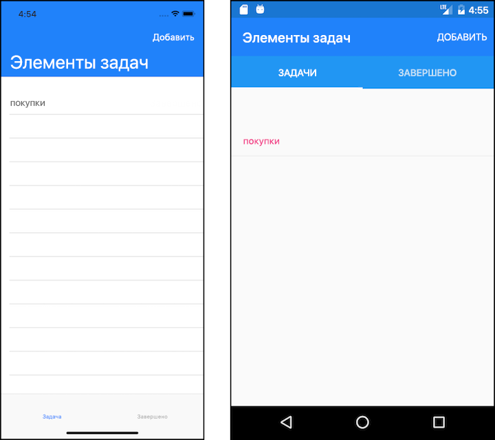
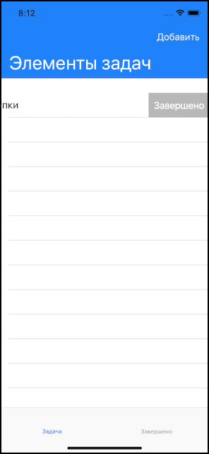
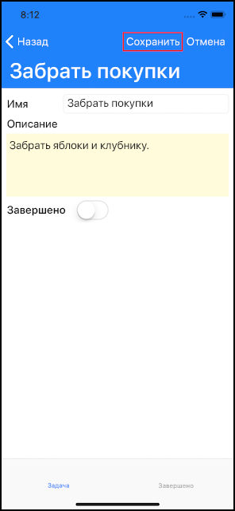
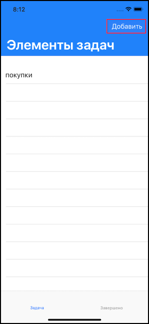

# <a name="quickstart-build-a-todo-app-with-xamarin-using-azure-cosmos-db-sql-api-account"></a>Краткое руководство. Создание приложения со списком дел с помощью Xamarin и API SQL для Azure Cosmos DB | Документация Майкрософт

> [!div class="op_single_selector"]
> * [.NET](create-sql-api-dotnet.md)
> * [.NET (предварительная версия)](create-sql-api-dotnet-preview.md)
> * [Java](create-sql-api-java.md)
> * [Node.js](create-sql-api-nodejs.md)
> * [Python](create-sql-api-python.md)
> * [Xamarin](create-sql-api-xamarin-dotnet.md)
>  

Azure Cosmos DB — это глобально распределенная многомодельная служба базы данных Майкрософт. Вы можете быстро создавать и запрашивать документы, пары "ключ — значение" и базы данных графов, используя преимущества возможностей глобального распределения и горизонтального масштабирования базы данных Azure Cosmos DB.

> [!NOTE]
> Полный канонический пример кода для приложения Xamarin, демонстрирующий множество предложений Azure, включая Cosmos DB, можно найти [на этой странице](https://github.com/xamarinhq/app-geocontacts) сайта GitHub. Это приложение позволяет просмотреть географически распределенные контакты и обеспечивает обновление их расположения.

В этом кратком руководстве показано, как создать учетную запись API SQL для Azure Cosmos DB, базу данных документов и коллекцию с использованием портала Azure. Затем вы создадите и развернете веб-приложение со списком дел на основе [API-интерфейса .NET для SQL](sql-api-sdk-dotnet.md) и [Xamarin](https://docs.microsoft.com/xamarin/), используя [Xamarin.Forms](https://docs.microsoft.com/xamarin/) и [шаблон архитектуры MVVM](https://docs.microsoft.com/xamarin/xamarin-forms/xaml/xaml-basics/data-bindings-to-mvvm).



## <a name="prerequisites"></a>Предварительные требования

Если вы разрабатываете приложение в Windows, но еще не установили Visual Studio 2019, можете скачать и использовать **бесплатный** [выпуск Visual Studio 2019 Community](https://www.visualstudio.com/downloads/). При установке Visual Studio необходимо включить рабочие нагрузки **Разработка для Azure** и **Разработка мобильных приложений на .NET**.

Если вы используете Mac, скачайте **бесплатный** выпуск [Visual Studio для Mac](https://www.visualstudio.com/vs/mac/).

[!INCLUDE [quickstarts-free-trial-note](../../includes/quickstarts-free-trial-note.md)]
[!INCLUDE [cosmos-db-emulator-docdb-api](../../includes/cosmos-db-emulator-docdb-api.md)]

## <a name="create-a-database-account"></a>Создание учетной записи базы данных

[!INCLUDE [cosmos-db-create-dbaccount](../../includes/cosmos-db-create-dbaccount.md)]

## <a name="add-a-container"></a>Добавление контейнера

[!INCLUDE [cosmos-db-create-collection](../../includes/cosmos-db-create-collection.md)]

## <a name="add-sample-data"></a>Добавление демонстрационных данных

[!INCLUDE [cosmos-db-create-sql-api-add-sample-data](../../includes/cosmos-db-create-sql-api-add-sample-data.md)]

## <a name="query-your-data"></a>Обращение к данным

[!INCLUDE [cosmos-db-create-sql-api-query-data](../../includes/cosmos-db-create-sql-api-query-data.md)]

## <a name="clone-the-sample-application"></a>Клонирование примера приложения

Теперь необходимо клонировать приложение API SQL Xamarin из GitHub, просмотреть код, получить ключи API и запустить приложение. Вы узнаете, как можно упростить работу с данными программным способом.

1. Откройте командную строку, создайте папку git-samples, а затем закройте окно командной строки.

    ```bash
    md "C:\git-samples"
    ```

2. Откройте окно терминала git, например git bash, и выполните команду `cd`, чтобы перейти в новую папку для установки примера приложения.

    ```bash
    cd "C:\git-samples"
    ```

3. Выполните команду ниже, чтобы клонировать репозиторий с примером. Эта команда создает копию примера приложения на локальном компьютере.

    ```bash
    git clone https://github.com/Azure-Samples/azure-cosmos-db-sql-xamarin-getting-started.git
    ```

4. Затем откройте файл ToDoItems.sln из папки samples/xamarin/ToDoItems в Visual Studio.

## <a name="obtain-your-api-keys"></a>Получение ключей API

Вернитесь на портал Azure, чтобы найти сведения о ключе API. Скопируйте эти данные в приложение.

1. На [портале Azure](https://portal.azure.com/) перейдите к учетной записи API SQL для Azure Cosmos DB и на левой панели навигации щелкните **Ключи**, а затем выберите **Ключи записи-чтения**. На следующем шаге используйте кнопки копирования в правой части экрана, чтобы скопировать универсальный код ресурса (URI) и первичный ключ в файл APIKeys.cs.

    

2. В Visual Studio 2019 или Visual Studio для Mac откройте файл APIKeys.cs в папке azure-documentdb-dotnet/samples/xamarin/ToDoItems/ToDoItems.Core/Helpers.

3. Скопируйте значение URI с портала (с помощью кнопки копирования) и добавьте его в качестве значения переменной `CosmosEndpointUrl` в файле APIKeys.cs.

    `public static readonly string CosmosEndpointUrl = "{Azure Cosmos DB account URL}";`

4. Затем скопируйте значение первичного ключа с портала и добавьте его в качестве значения параметра `Cosmos Auth Key` в файле APIKeys.cs.

    `public static readonly string CosmosAuthKey = "{Azure Cosmos DB secret}";`

[!INCLUDE [cosmos-db-auth-key-info](../../includes/cosmos-db-auth-key-info.md)]

## <a name="review-the-code"></a>Просмотр кода

В примере этого решения показано, как создать приложение со списком дел с помощью API SQL для Azure Cosmos DB и Xamarin.Forms. В приложении представлены две вкладки: на первой вкладке содержится представление списка с элементами списка дел, которые еще не завершены. На второй вкладке отображаются элементы списка дел, которые уже завершены. На первой вкладке можно не только просмотреть список незавершенных дел, но и добавить новые элементы списка дел, а также отметить элементы как завершенные.



Код в решении ToDoItems содержит:

* ToDoItems.Core: проект .NET Standard, который содержит проект Xamarin.Forms и общий код логики приложения, используемый для элементов списка дел в Azure Cosmos DB.
* ToDoItems.Android: проект, который содержит приложение Android.
* ToDoItems.iOS: проект, который содержит приложение iOS.

Рассмотрим краткий обзор того, как приложение обменивается данными с Azure Cosmos DB.

* Во все проекты необходимо добавить пакет NuGet [Microsoft.Azure.DocumentDb.Core](https://www.nuget.org/packages/Microsoft.Azure.DocumentDB.Core/).
* Класс `ToDoItem` в папке azure-documentdb-dotnet/samples/xamarin/ToDoItems/ToDoItems.Core/Models позволяет моделировать документы в созданной ранее коллекции **Элементы**. Обратите внимание, что в именах свойств учитывается регистр.
* Класс `CosmosDBService` в папке azure-documentdb-dotnet/samples/xamarin/ToDoItems/ToDoItems.Core/Services позволяет инкапсулировать данные о подключении к Azure Cosmos DB.
* Класс `CosmosDBService` содержит переменную типа `DocumentClient`. Переменная `DocumentClient` используется для настройки и выполнения запросов к учетной записи Azure Cosmos DB. Ее экземпляр создается в строке 31:

    ```csharp
    docClient = new DocumentClient(new Uri(APIKeys.CosmosEndpointUrl), APIKeys.CosmosAuthKey);
    ```

* Для запроса коллекции документов используется метод `DocumentClient.CreateDocumentQuery<T>`, как показано в строке функции `CosmosDBService.GetToDoItems`:

    ```csharp
    public async static Task<List<ToDoItem>> GetToDoItems()
    {
        var todos = new List<ToDoItem>();

        var todoQuery = docClient.CreateDocumentQuery<ToDoItem>(
                                UriFactory.CreateDocumentCollectionUri(databaseName, collectionName),
                                .Where(todo => todo.Completed == false)
                                .AsDocumentQuery();

        while (todoQuery.HasMoreResults)
        {
            var queryResults = await todoQuery.ExecuteNextAsync<ToDoItem>();

            todos.AddRange(queryResults);
        }

        return todos;
    }
    ```

    `CreateDocumentQuery<T>` принимает код URI, указывающий на коллекцию, созданную в предыдущем разделе. Можно также указать операторы LINQ, такие как предложение `Where`. В этом случае возвращаются только незавершенные элементы списка дел.

    Функция `CreateDocumentQuery<T>` выполняется синхронно и возвращает `IQueryable<T>`. Но метод `AsDocumentQuery` позволяет преобразовать `IQueryable<T>` в объект `IDocumentQuery<T>`, который может выполняться асинхронно. Таким образом, поток пользовательского интерфейса для мобильных приложений не блокируется.

    Функция `IDocumentQuery<T>.ExecuteNextAsync<T>` позволяет извлечь страницу результатов из Azure Cosmos DB. Метод `HasMoreResults` проверяет на странице наличие дополнительных результатов, которые можно вернуть.

> [!TIP]
> Некоторые функции, которые работают с коллекциями и документами Azure Cosmos DB, принимают URI в качестве параметра, указывающего на адрес коллекции или документа. Этот код URI создается с помощью класса `URIFactory`. Этот класс можно использовать для создания URI баз данных, коллекций и документов.

* В строке 107 показано, как вставить новый документ с помощью функции `ComsmosDBService.InsertToDoItem`:

    ```csharp
    public async static Task InsertToDoItem(ToDoItem item)
    {
        ...
        await docClient.CreateDocumentAsync(UriFactory.CreateDocumentCollectionUri(databaseName, collectionName), item);
        ...
    }
    ```

    Помимо элемента для вставки также указывается URI коллекции документов.

* В строке 124 показано, как заменить существующий документ новым с помощью функции `CosmosDBService.UpdateToDoItem`:

    ```csharp
    public async static Task UpdateToDoItem(ToDoItem item)
    {
        ...
        var docUri = UriFactory.CreateDocumentUri(databaseName, collectionName, item.Id);

        await docClient.ReplaceDocumentAsync(docUri, item);
    }
    ```

    В этом случае нужно указать новый URI для идентификации заменяемого документа. Чтобы получить URI, используйте функцию `UriFactory.CreateDocumentUri`, передайте ей имя базы данных и коллекции, а также идентификатор документа.

    Функция `DocumentClient.ReplaceDocumentAsync` заменяет документ, соответствующий URI, другим документом, указанным в параметре.

* В строке 115 показано, как удалить элемент с помощью функции `CosmosDBService.DeleteToDoItem`:

    ```csharp
    public async static Task DeleteToDoItem(ToDoItem item)
    {
        ...
        var docUri = UriFactory.CreateDocumentUri(databaseName, collectionName, item.Id);

        await docClient.DeleteDocumentAsync(docUri);
    }
    ```

    Снова обратите внимание на то, что для документа создается уникальный URI, который передается в функцию `DocumentClient.DeleteDocumentAsync`.

## <a name="run-the-app"></a>Запуск приложения

Теперь приложение со всеми сведениями, необходимыми для взаимодействия с Azure Cosmos DB, обновлено.

Ниже приведены инструкции по запуску приложения с помощью отладчика Visual Studio для Mac.

> [!NOTE]
> Для приложения версии Android используются такие же действия. Все различия будут рассмотрены далее. Чтобы выполнить отладку в Visual Studio в Windows, ознакомьтесь с документацией по предложению со списком дел [для iOS](https://docs.microsoft.com/xamarin/ios/deploy-test/debugging-in-xamarin-ios?tabs=vswin) и [для Android](https://docs.microsoft.com/xamarin/android/deploy-test/debugging/).

1. Сначала выберите целевую платформу. Для этого щелкните выделенный раскрывающийся список и выберите ToDoItems.iOS для iOS или ToDoItems.Android для Android.

    

2. Чтобы начать отладку приложения, нажмите клавиши CMD+ВВОД или кнопку воспроизведения.

    

3. По завершении запуска в симуляторе iOS или эмуляторе Android в приложении появятся две вкладки: в нижней части экрана — для iOS и в верхней части экрана — для Android. На первой вкладке отображаются незавершенные элементы списка дел, а на второй — завершенные.

    

4. Чтобы завершить элемент в списке дел в iOS, переместите его влево и нажмите кнопку **Complete** (Завершить). Чтобы завершить элемент в списке дел в Android, коснитесь элемента и долго удерживайте его, а затем нажмите кнопку завершения.

    

5. Чтобы изменить элемент списка дел, коснитесь элемента. Откроется новый экран для ввода новых значений. Нажмите кнопку сохранения, чтобы сохранить изменения в Azure Cosmos DB.

    

6. Чтобы добавить элемент списка дел, нажмите кнопку **Добавить** в правом верхнем углу начального экрана. После этого откроется новая пустая страница для изменения.

    

## <a name="review-slas-in-the-azure-portal"></a>Просмотр соглашений об уровне обслуживания на портале Azure

[!INCLUDE [cosmosdb-tutorial-review-slas](../../includes/cosmos-db-tutorial-review-slas.md)]

## <a name="clean-up-resources"></a>Очистка ресурсов

[!INCLUDE [cosmosdb-delete-resource-group](../../includes/cosmos-db-delete-resource-group.md)]

## <a name="next-steps"></a>Дополнительная информация

В этом кратком руководстве было показано, как создать учетную запись Azure Cosmos и контейнер с помощью обозревателя данных, а также выполнить сборку и развертывание приложения Xamarin. Теперь вы можете импортировать дополнительные данные в учетную запись Azure Cosmos.

> [!div class="nextstepaction"]
> [Импорт данных в DocumentDB с помощью средства миграции базы данных](import-data.md)
