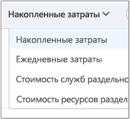
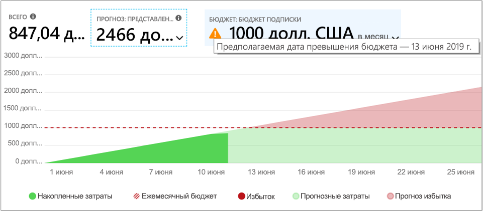
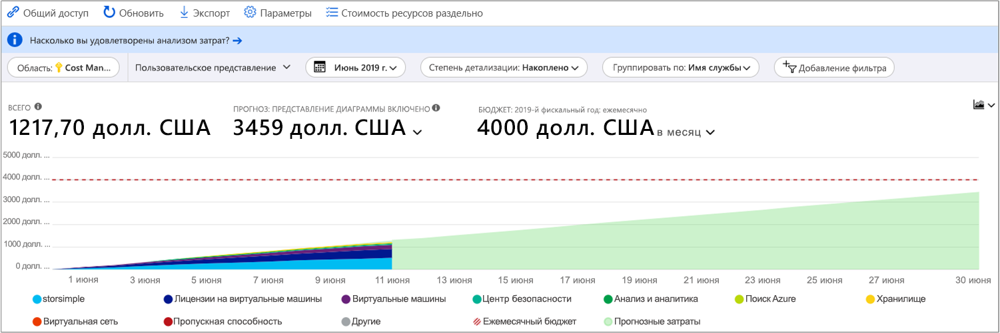
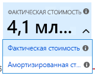
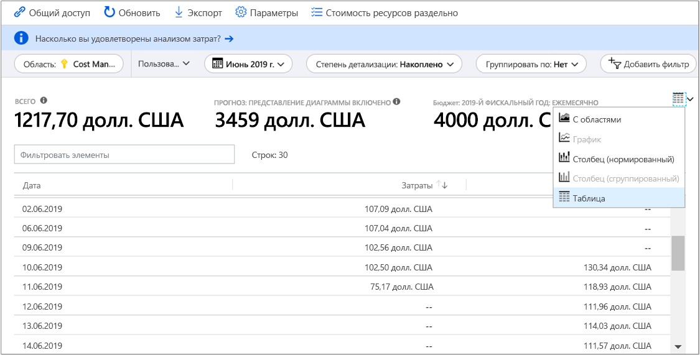

# Краткое руководство. Изучение и анализ затрат с помощью функции анализа затрат

Прежде чем вы сможете правильно контролировать и оптимизировать свои затраты в Azure, вам необходимо понять, где они возникают в вашей организации. Кроме того, полезно понимать, сколько стоят ваши службы и какие среды и системы задействуются при их работе. Видимость всего спектра затрат имеет решающее значение для точного понимания тенденций расходов организации. Вы можете использовать типичные расходы для применения механизмов контроля затрат, таких как бюджеты.

В этом кратком руководстве вы можете использовать службу анализа затрат, чтобы изучить и проанализировать затраты своей организации. Вы можете просматривать агрегированные затраты своей организации, чтобы понять, где возникают затраты с течением времени, и определить тенденции расходов. Вы можете просматривать накопленные затраты с течением времени для оценки ежемесячных, квартальных или даже годовых тенденций затрат с учетом бюджета. Бюджет помогает соблюдать финансовые ограничения. С его помощью можно просматривать ежедневные или ежемесячные затраты для выявления нарушений. Вы можете скачать данные текущего отчета для дальнейшего анализа или использования во внешней системе.

Из этого краткого руководства вы узнаете, как выполнять следующие задачи:

- Просмотр затрат в функции анализа затрат
- Настройка представления затрат
- Скачивание данных анализа затрат

## Предварительные требования

Анализ стоимости поддерживает различные типы учетных записей Azure. Полный список поддерживаемых типов учетных записей см. в статье [Understand Cost Management data](understand-cost-mgt-data.md) (Интерпретация данных службы "Управление затратами"). Чтобы просмотреть данные о затратах, нужен как минимум доступ на чтение для учетной записи Azure.

Дополнительные сведения о назначении доступа к данным службы "Управление затратами" Azure см. в [этой статье](./assign-access-acm-data.md).

Если у вас новая подписка, вы не сможете сразу начать использовать функции Управления затратами. Полная активация всех функций Управления затратами может потребовать до 48 часов.

## Вход в Azure

- Войдите на портал Azure по адресу https://portal.azure.com.

## Просмотр затрат в функции анализа затрат

Для просмотра затрат с помощью функции анализа затрат выберите нужную область применения на портале Azure, а затем в строке меню выберите **Анализ затрат** . Например, перейдите к разделу **Подписки** , выберите подписку из списка и щелкните в меню **Анализ стоимости** . Менять области для анализа затрат можно с помощью меню **Область** .

Выбранная пользователем область распространяется на всю среду "Управление затратами", чтобы обеспечить консолидацию данных и ограничить доступ к сведениям о затратах. При использовании области не нужно выбирать по отдельности. Вместо этого выберите более широкую область, в которую входят другие области, и отфильтруйте по нужным дочерним областям. Важно понимать такой подход, потому что у некоторых пользователей может отсутствовать доступ к родительской области, в которую входят вложенные области.

Просмотрите видео о том, [как использовать Управление затратами на портале Azure](https://www.youtube.com/watch?v=mfxysF-kTFA), чтобы узнать, как использовать анализ затрат. Чтобы просмотреть другие видео, посетите канал YouTube, посвященный [Управлению затратами](https://www.youtube.com/c/AzureCostManagement).

>[!VIDEO https://www.youtube.com/embed/mfxysF-kTFA]

В первоначальном представлении анализа затрат содержатся следующие области.

**Представление накопленных затрат** : отображает заранее заданную конфигурацию представления анализа затрат. Каждое представление содержит диапазон дат, степень детализации, группировки и настройки фильтра Представление по умолчанию отображает затраты, накопленные за текущий период выставления счетов, но его можно изменить на другие встроенные представления.

**Фактическая стоимость** : показаны общие затраты на потребление и покупки за текущий месяц по мере их возникновения. Эти затраты отображаются в вашем счете.

**Прогноз** : показаны общие прогнозируемые затраты на установленный период.

**Бюджет** : показана запланированная предельная сумма расходов (при наличии) для выбранной области.

**Степень детализации накопленных затрат** : показана общая совокупная сумма суточных расходов с начала периода выставления счетов. После создания бюджета для учетной записи выставления счетов или подписки вы можете быстро просмотреть тенденцию расходов по отношению к бюджету. Наведите курсор на дату для просмотра накопленных затрат до этого дня.

**Сводные (круговые) диаграммы** : предоставляют динамические сводные данные, разделяя общие затраты на набор стандартных вариантов. Они отображают затраты за текущий месяц от большего к меньшему. Вы можете изменить сводные диаграммы в любое время, выбрав другую сводку. Затраты разделены по категориям: служба (категория единиц измерения), расположение (регион) и дочерняя область по умолчанию. Например, учетные записи регистрации находятся в учетных записях выставления счетов, группы ресурсов в подписках и ресурсы в группах ресурсов.

### Общие сведения о прогнозе

Прогноз стоимости показывает проекцию предполагаемых затрат за выбранный период времени. Модель основывается на модели регрессии временных рядов. Для точного прогнозирования затрат требуются данные о затратах и использовании по крайней мере за 10 дней. В течение заданного периода времени для прогнозной модели нужны равные части обучающих данных для периода прогнозирования. Например, проекция за три месяца требует данных о стоимости и использовании, по крайней мере, за три месяца.

Для расчета расходов по проекту за год в модели используются обучающие данные в течение максимум шести месяцев. Для изменения прогнозирования требуется как минимум семидневное использование обучающих данных. Прогнозирование основано на серьезных изменениях, таких как пики и DIP в шаблонах затрат и использования. Прогноз не создает отдельные проекции для каждого элемента в свойствах **Группировать по** . Он предоставляет прогноз только для общих суммарных затрат. При использовании нескольких валют модель предоставляет прогноз расходов только в долларах США.

## Настройка представления затрат

Анализ затрат предоставляет четыре встроенных представления, которые оптимизированы для наиболее распространенных целей.

Представление | Ответы на вопросы
--- | ---
Накопленные затраты. | Сколько средств уже потрачено в этом месяце? Выхожу ли я за пределы бюджета?
Ежедневные затраты. | Повышались ли ежедневные затраты в течение последних 30 дней?
Затраты по службам. | Как изменялась сумма за ежемесячное использование в последних трех счетах?
Стоимость ресурсов раздельно. | Какие ресурсы стоят больше всего в этом месяце?

Однако есть много случаев, когда вам нужен более глубокий анализ. Настройка начинается с выбора даты в верхней части страницы.

В разделе анализа затрат по умолчанию отображаются данные за текущий месяц. Используйте селектор даты, чтобы быстро переключаться на распространенные диапазоны дат. Например, прошлая неделя, прошлый месяц, текущий календарный год или пользовательский диапазон дат. Подписка с оплатой по мере использования также включает диапазоны дат, основанные на вашем расчетном периоде, который не привязан к календарному месяцу, например текущий платежный период или последний счет. Чтобы перейти к предыдущему или следующему периоду, используйте ссылки **<Назад** и **Далее>** в верхней части меню соответственно. Например, с помощью ссылки **<Назад** можно переключиться с **последних 7 дней** на **8–14 дней назад** или на **15–21 день назад** .

В разделе анализа затрат по умолчанию отображаются **накопленные** затраты. Накопленные затраты включают в себя все расходы за каждый день в дополнение к предыдущим дням. Вы можете видеть постоянно растущее представление ваших ежедневно начисляемых расходов. Это представление оптимизировано для отображения наблюдаемых тенденций по отношению к бюджету для выбранного диапазона времени.

Используйте представления прогноза в виде диаграммы, чтобы определить потенциальные бреши в бюджете. При наличии потенциальной бреши в бюджете прогнозируемые чрезмерные затраты будут показаны красным цветом. На диаграмме также отображается символ индикатора. При наведении курсора на этот символ отображается предположительная дата возникновения бреши в бюджете.

Для просмотра затрат за каждый день доступно **ежедневное** представление. В ежедневном представлении не отображается тенденция роста. Представление показывает ежедневные нарушения в виде максимумов и минимумов затрат. После выбора бюджета ежедневное представление также отображает оценку вашего суточного бюджета.

Если ваши ежедневные расходы постоянно превышают ожидаемый суточный бюджет, вы, вероятно, превысите ежемесячный бюджет. Ожидаемый дневной бюджет позволяет вам визуализировать ваш бюджет на более низком уровне. При наличии колебания в ежедневных расходах сравнение предполагаемого ежедневного бюджета с ежемесячным бюджетом будет менее точным.

Это разбитое по дням представление недавних расходов с включенным прогнозом расходов.

Если отключить прогноз расходов, прогнозируемые расходы на будущие даты не отображаются. Кроме того, для затрат за прошлый период времени также не будут отображаться прогнозируемые затраты.

Обычно данные или уведомления для использованных ресурсов отображаются в течение 8–12 часов.

Можно выполнять **группировку по** общим свойствам, чтобы разбить затраты и выявить наивысшие показатели. Например, чтобы выполнить группирование по тегам ресурсов, выберите ключ тега, с помощью которого необходимо выполнить группировку. В результате отобразится разбивка затрат по каждому значению тега с одной дополнительной категорией для ресурсов, к которым не применялся тег.

Большинство ресурсов Azure поддерживают теги. Однако некоторые теги недоступны в Управлении затратами и выставлении счетов. Кроме того, не поддерживаются теги группы ресурсов. Поддержка тегов применяется к использованию, отчет о котором поступил *после* того, как к ресурсу был применен тег. Теги не применяются к сверткам затрат задним числом.

Просмотрите видео [How to review tag policies with Azure Cost Management](https://www.youtube.com/watch?v=nHQYcYGKuyw) (Как просматривать политики тегов с помощью службы "Управление затратами Azure"), чтобы узнать, как использовать политику тегов Azure для улучшения видимости данных о расходах.

Это представление затрат на службы Azure за текущий месяц.

В службе анализа затрат по умолчанию отображается полная стоимость потребления и покупок по мере их возникновения. Эта стоимость и будет отображаться в вашем счете ( **фактическая стоимость** ). Просмотр фактических затрат идеально подходит для сверки счета. Тем не менее резкое повышение затрат на покупки может быть настораживающим, если вы следите за аномалиями расходов и другими изменениями затрат. Для выравнивания резкого роста затрат, вызванного приобретением резервирования, переключитесь на представление **амортизированной стоимости** .

Представление амортизированной стоимости разбивает покупки резервирования на ежедневные блоки и распределяет их на срок резервирования. Например, стоимость покупки в 365 долл. США за 1 января будет отображена в виде 1,00 долл. США ежедневного расхода с 1 января до 31 декабря. Кроме основной амортизации, эти затраты также можно перераспределить и привязать с помощью конкретных ресурсов, использующих резервирование. Например, если оплата за сутки в 1,00 долл. США была разделена между двумя виртуальными машинами, вы увидите два списания по 0,50 долл. США в день. Если часть резервирования не используется в определенный день, вы увидите списание в 0,50 долл. США, которое будет закреплено за используемой виртуальной машиной и списание остальных 0,50 долл. США с типом `UnusedReservation`. Обратите внимание, что неиспользованные средства для резервирования можно увидеть только в представлении амортизированных затрат.

Важно отметить, что в связи с различиями в отображении расходов в представлениях фактической и амортизированной стоимости будет показана разная общая сумма. Как правило, общие месячные затраты с покупками резервирования уменьшаются в представлении амортизированной стоимости, а месячные затраты после покупки резервирования возрастают. Амортизация стоимости доступна только для покупок резервирования и не имеет отношения к покупкам в Azure Marketplace в этот период времени.

На следующем рисунке показаны имена групп ресурсов. Вы можете группировать по тегу для просмотра общей стоимости по нему или использовать **представление затрат по ресурсам** , чтобы увидеть все теги для конкретного ресурса.

При группировании затрат по определенным атрибутам первые 10 основных факторов затрат будут отображаться в порядке убывания. При наличии более десяти групп отображаются первые девять основных статей затрат и категория **Прочие** , содержащая все прочие группы. При группировании по тегам появится группа затрат **Без тегов** , к компонентам которой ключ тега не применялся. Категория **Без тегов** всегда указана последней в списке, даже если величина затрат в ней больше, чем в других категориях. Если категорий с тегами больше 10, статьи затрат без тегов включаются в категорию **Прочие** . Переключитесь в табличное представление и измените степень детализации на **Нет** , чтобы просмотреть все категории, упорядоченные по объему затрат.

Ресурсы классических виртуальных машин, сетевые ресурсы и ресурсы хранения не предоставляют детальную информацию о данных выставления счетов. При группировании затрат они объединяются в группу **Классические службы** .

На сводных графиках под основным графиком отображаются соотношения компонентов затрат, которые дают более четкое представление об общих затратах за выбранный период времени и с учетом используемых фильтров. Выберите свойство или тег, чтобы просмотреть совокупные затраты в любом измерении.

Вы можете просмотреть полный набор данных для любого представления. Любые выбранные параметры или фильтры влияют на представленные данные. Чтобы просмотреть полный набор данных, выберите список **типов диаграмм** , а затем представление **Таблица** .

## Сохранение и совместное использование настроенных представлений

Чтобы сохранить и совместно использовать настроенные представления с другими лицами, необходимо закрепить анализ затрат на панели мониторинга портала Azure или скопировать ссылку на анализ затрат.

Просмотрите видео о [совместном использовании и сохранении представлений в службе "Управление затратами Azure"](https://www.youtube.com/watch?v=kQkXXj-SmvQ), чтобы узнать больше о том, как с помощью портала предоставлять сведения о затратах в организации. Чтобы просмотреть другие видео, посетите канал YouTube, посвященный [Управлению затратами](https://www.youtube.com/c/AzureCostManagement).

>[!VIDEO https://www.youtube.com/embed/kQkXXj-SmvQ]

Для закрепления анализа затрат выберите значок закрепления в правом верхнем углу или рядом с элементом "<Subscription Name> | Анализ затрат". При закреплении анализа затрат будет сохранена только основная диаграмма или представление таблицы. Предоставьте общий доступ к панели мониторинга, чтобы другие пользователи могли перейти к вашей плитке. Обратите внимание, что так вы предоставляете только общий доступ к конфигурации панели мониторинга, но не к базовым данным. Если у вас отсутствует доступ к затратам, но есть общий доступ к панели мониторинга, вы увидите сообщение "Доступ запрещен".

Чтобы отправить ссылку на анализ затрат, выберите **Общий доступ** вверху колонки. Будет отображен пользовательский URL-адрес, который открывает конкретное представление для конкретной области. Если у вас нет доступа к ресурсам и вы получаете этот URL-адрес, появится сообщение "Доступ запрещен".

## Загрузка данных об использовании

В некоторых случаях необходимо загрузить данные для дальнейшего анализа. Для этого объедините новые данные с собственными или интегрируйте их в свои системы. На такой случай служба "Управление затратами" предлагает несколько различных вариантов. Если вам требуется специальная общая сводка, которую вы получаете при анализе затрат, в качестве отправной точки настройте нужное представление. Затем скачайте его, выбрав **Экспорт** и **Скачать данные в формате CSV** или **Скачать данные в Excel** . Загрузив данные в формате Excel, вы получаете дополнительный контекст в представлении, используемом для скачивания, например область, конфигурацию запроса, общие показатели и дату создания.

Если вам потребуется полный неагрегированный набор данных, скачайте его из учетной записи выставления счетов. Затем в списке служб на левой панели навигации портала перейдите в область **Управление затратами + выставление счетов** . При наличии выберите учетную запись выставления счетов. Перейдите в раздел **Использование+расходы** , а затем щелкните значок **Скачать** для нужного периода выставления счетов.

## Очистка ресурсов

- Если вы закрепили представление для анализа затрат, которое вам больше не нужно, перейдите на ту панель мониторинга, где оно закреплено, и удалите его.
- Если вы загрузили файлы данных об использовании, которые вам больше не нужны, удалите их.

## Дальнейшие действия

Перейдите к первому руководству, чтобы узнать, как создать бюджет и управлять им.

> [!div class="nextstepaction"]
> [Создание бюджетов и управление ими](tutorial-acm-create-budgets.md)