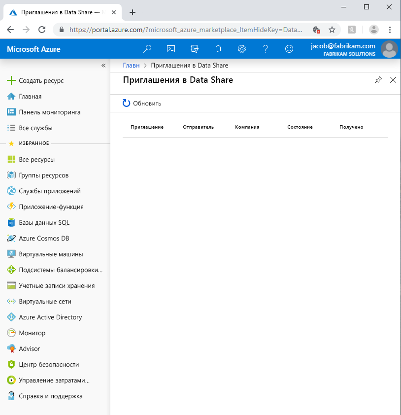

# <a name="troubleshoot-common-issues-in-azure-data-share"></a>Устранение проблем в общих проблемах в общем доступе к данным Azure 

В этой статье показано, как устранить общие проблемы для совместного использования данных Azure. 

## <a name="azure-data-share-invitations"></a>Приглашения Azure Data Share 

В некоторых случаях, когда новый пользователь выбирает **Принять приглашение** из отправленного по электронной почте приглашения, ему может быть представлен пустой список приглашений. 



Это может быть связано со следующими причинами:

* **Служба совместного использования данных Azure не зарегистрирована в качестве поставщика ресурсов какой-либо подписки Azure в клиенте Azure.** Вы столкнетесь с этой проблемой, если в вашем арендаторе Azure нет ресурса «Общий доступ к данным». При создании ресурса Azure Data Share он автоматически регистрирует поставщика ресурсов в подписке Azure. Вы также можете вручную зарегистрировать службу обмена данными после этих шагов. Для выполнения этих шагов необходимо создать роль вкладчика Azure.

    1. На портале Azure перейдите к **подпискам**
    1. Выберите подписку, используемую для создания ресурса «Общий доступ к ресурсам данных Azure»
    1. Щелкните **Поставщики ресурсов**
    1. Поиск по **Microsoft.DataShare**
    1. Нажмите **Регистрация** 

    Вам потребуется [роль Azure Contributor RBAC](https://docs.microsoft.com/azure/role-based-access-control/built-in-roles#contributor), чтобы выполнить эти действия. 

* **Приглашение отправляется на ваш псевдоним электронной почты вместо электронной почты для входа в Azure.** Если вы зарегистрировали службу совместного использования данных Azure или уже создали ресурс «Общий поток данных» в нанимателе, но все еще не можете увидеть приглашение, возможно, потому, что провайдер ввел псевдоним электронной почты в качестве получателя вместо адреса электронной почты для входа в Azure. Свяжитесь со своим поставщиком данных и убедитесь, что он отправил приглашение на ваш адрес электронной почты, а не на псевдоним электронной почты.

* **Приглашение уже принято.** Ссылка в электронной почте переносит вас на страницу «Приглашение обмена данными» на портале Azure, на которой перечислены только ожидающие приглашения. Если вы уже приняли приглашение, оно больше не будет отображаться на странице приглашения «Общий доступ к данным». Перейдите к ресурсу «Общий доступ к данным», который вы использовали для приема приглашения на просмотр полученных акций и настройки целевого параметра кластера Azure Data Explorer.

## <a name="error-when-creating-or-receiving-a-new-share"></a>Ошибка при создании или получении новой доли

"Не удалось добавить наборы данных"

"Не удалось сопоставить наборы данных"

"Не удается предоставить ресурсу Data Share x доступ к y"

"У вас нет надлежащих разрешений на x"

"Мы не смогли добавить разрешения на запись для учетной записи Отдела данных Azure в один или несколько выбранных вами ресурсов"

Если при создании новых наборов данных об общих или картографических данных вы получаете какие-либо из вышеперечисленных ошибок, это может быть связано с недостаточными разрешениями в хранилище данных Azure. Просматривайте [роли и требования](concepts-roles-permissions.md) для требуемых разрешений. 

Требуется разрешение на публикацию или получение данных из хранилища данных Azure, которое обычно существует в роли contributor. 

Если это первый раз, когда вы обмениваетесь или получаете данные из хранилища данных Azure, вам также необходимо *получить разрешение на назначение в microsoft.Authorization/role/write,* которое обычно существует в роли владельца. Даже если вы создали ресурс хранилища данных Azure, он не делает вас автоматически владельцем ресурса. С соответствующего разрешения служба Azure Data Share автоматически предоставляет управляемому identity доступу ресурса к идентации данных в хранилище данных. Этот процесс может занять несколько минут, чтобы ввести в действие. Если вы испытываете сбой из-за этой задержки, попробуйте еще раз в течение нескольких минут.

Совместное использование на основе S'L требует дополнительных разрешений. Подробнее о неприятном использовании совместного использования на основе проблем на основе СЗЛ.

## <a name="troubleshooting-sql-based-sharing"></a>Устранение неполадок с совместным использованием на основе SQL

"Пользователь x не существует в базе данных S'L"

Если вы получили эту ошибку при добавлении набора данных из исходного кода, основанного на S'L, это может быть связано с тем, что вы не создали пользователя для управляемого итога управления данными Azure Data Share на вашем сервере S'L.  Чтобы решить эту проблему, запустите следующий сценарий:

```sql
    create user "<share_acct_name>" from external provider; 
    exec sp_addrolemember db_datareader, "<share_acct_name>";
```      
Если вы получили эту ошибку при отображении набора данных в целевой центр на основе S'L, это может быть связано с тем, что вы не создали пользователя для управляемого итога управления данными Azure Data Share на вашем сервере S'L.  Чтобы решить эту проблему, запустите следующий сценарий:

```sql
    create user "<share_acc_name>" from external provider; 
    exec sp_addrolemember db_datareader, "<share_acc_name>"; 
    exec sp_addrolemember db_datawriter, "<share_acc_name>"; 
    exec sp_addrolemember db_ddladmin, "<share_acc_name>";
```
Обратите внимание на то, что *<share_acc_name>* — это имя вашего ресурса Data Share.      

Убедитесь, что вы следовали всем предпосылкам, перечисленным в [Share ваши данные](share-your-data.md) и [принимать и получать данные](subscribe-to-data-share.md) учебник.

## <a name="snapshot-failed"></a>Моментальный снимок не удался
Снимок может выйти из строя по ряду причин. Вы можете найти подробное сообщение об ошибке, нажав на время начала снимка, а затем на состояние каждого набора данных. 

Если сообщение об ошибке связано с разрешением, проверить службу Data Share имеет необходимое разрешение. Ознакомьтесь с [ролями и требованиями](concepts-roles-permissions.md) к деталям. Если это первый момент, когда вы делаете снимок, ресурсу «Общий доступ» к магазину данных Azure может пройти несколько минут. Подождите несколько минут и попробуйте еще раз.

## <a name="next-steps"></a>Дальнейшие действия

Чтобы узнать, как приступить к обмену данными, перейдите к [этому](share-your-data.md) руководству. 

Чтобы узнать, как получать данные, продолжайте [принимать и получать учебник по обработке данных.](subscribe-to-data-share.md)

