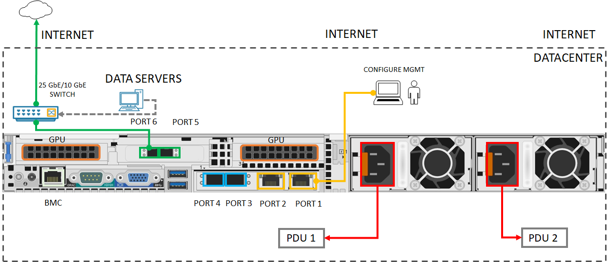

# Краткое руководство. Начало работы с Azure Stack Edge Pro с GPU 

В этом кратком руководстве описаны предварительные требования и действия, необходимые для развертывания устройства Azure Stack Edge Pro с GPU. Задачи, описанные в этом кратком руководстве, выполняются на портале Azure, а также в локальном веб-интерфейсе устройства. 

В целом процедура должна занять примерно 1,5 часа. Подробные пошаговые инструкции см. в [учебнике по подготовке к развертыванию Azure Stack Edge Pro с GPU](azure-stack-edge-gpu-deploy-prep.md#deployment-configuration-checklist). 

## Предварительные требования

Перед развертыванием убедитесь, что вы выполнили следующие предварительные требования:

1. [Распакуйте](azure-stack-edge-gpu-deploy-install.md#unpack-the-device) и [смонтируйте в стойку](azure-stack-edge-gpu-deploy-install.md#rack-the-device) устройство Azure Stack Edge Pro с GPU, доставленное на место развертывания. 
1. Настройте сеть таким образом, чтобы устройство могло получить доступ к [указанным шаблонам URL-адресов и портам](azure-stack-edge-gpu-system-requirements.md#networking-port-requirements). 
1. Убедитесь, что у вас есть доступ к подписке Azure в роли владельца или участника.
1. На портале Azure выберите **Главная > Подписки > ваша_подписка > Поставщики ресурсов**. Найдите поставщик ресурсов `Microsoft.DataBoxEdge` и зарегистрируйте его. Повторите эту процедуру, чтобы зарегистрировать `Microsoft.Devices`, если вы намерены создать ресурс Центра Интернета вещей для развертывания вычислительных рабочих нагрузок.
1. Убедитесь, что у вас есть как минимум 2 свободных статических смежных IP-адреса для узлов Kubernetes и хотя бы 1 статический IP-адрес для службы IoT Edge. Для каждого развертываемого модуля и каждой развертываемой внешней службы потребуется 1 дополнительный IP-адрес.
1. Сверьтесь с [контрольным списком развертывания](azure-stack-edge-gpu-deploy-checklist.md) и убедитесь, что у вас есть все необходимое для настройки устройства. 

## Шаги по развертыванию

1. **Установка**. Подключите порт 1 к клиентскому компьютеру через перекрестный кабель или USB-адаптер Ethernet. Подключите по крайней мере один порт устройства для данных, желательно 25 GbE (с 3-го по 6-й порт), к Интернету через коммутатор (как минимум 1 GbE) и медные кабели SFP+. Подключите шнуры питания из комплекта поставки к блокам питания и электрическим розеткам в разных контурах сети. Нажмите кнопку питания на лицевой панели, чтобы включить устройство.  

    Сведения о совместимых сетевых кабелях и коммутаторах см. в [таблице взаимодействия Cavium FastlinQ серии 41000](https://www.marvell.com/documents/xalflardzafh32cfvi0z/) и на странице [Продукты, совместимые с канальным сетевым адаптером Mellanox ConnectX-4 с двумя портами 25G](https://docs.mellanox.com/display/ConnectX4LxFirmwarev14271016/Firmware+Compatible+Products).

    Ниже приведена минимально необходимая конфигурация кабелей для развертывания устройства.  

2. **Подключение**: Настройте параметры IPv4 на адаптере Ethernet компьютера, указав статический IP-адрес **192.168.100.5** и подсеть **255.255.255.0**. Откройте браузер и подключитесь к локальному веб-интерфейсу устройства по адресу https://192.168.100.10. Это может занять несколько минут. Перейдите на веб-страницу, когда появится предупреждение о сертификате безопасности.

3. **Вход**. Войдите на устройство, используя пароль по умолчанию *Password1*. Измените пароль администратора устройства. Пароль должен содержать от 8 до 16 символов, 3 из которых должны быть из разных категорий (прописные буквы, строчные буквы, цифры и специальные знаки).

4. **Настройка сети**. Примите конфигурацию DHCP по умолчанию для подключенного порта данных, если в сети есть DHCP-сервер. В противном случае укажите IP-адрес, DNS-сервер и шлюз по умолчанию. Просмотрите дополнительные сведения о [параметрах сети](azure-stack-edge-gpu-deploy-configure-network-compute-web-proxy.md#configure-network).

5. **Настройка вычислительной сети**. Создайте виртуальный коммутатор, включив порт на устройстве. Введите 2 свободных смежных статических IP-адреса для узлов Kubernetes в той же сети, где создан коммутатор. Укажите по крайней мере 1 статический IP-адрес, который служба центра IoT Edge будет использовать для доступа к вычислительным модулям, и 1 статический IP-адрес для каждой дополнительной службы и каждого дополнительного контейнера, которые должны быть доступны для расположений вне кластера Kubernetes. 

    Kubernetes требуется для развертывания всех контейнерных рабочих нагрузок. Просмотрите дополнительные сведения о [параметрах вычислительной сети](azure-stack-edge-gpu-deploy-configure-network-compute-web-proxy.md#enable-compute-network).

6. **Настройка веб-прокси**. Если вы используете в своей среде веб-прокси, введите IP-адрес сервера веб-прокси в формате `http://<web-proxy-server-FQDN>:<port-id>`. Задайте для параметра проверка подлинности значение **Нет**. Просмотрите дополнительные сведения о [параметрах веб-прокси](azure-stack-edge-gpu-deploy-configure-network-compute-web-proxy.md#configure-web-proxy).

7. **Настройка устройства**. Введите имя устройства и домен DNS или примите значения по умолчанию. 

8. **Настройка сервера Центра обновления**. Оставьте сервер Центр обновления Майкрософт по умолчанию или укажите сервер Windows Server Update Services (WSUS) и путь к нему. 

9. **Настройка параметров времени**. Оставьте параметры времени по умолчанию или задайте часовой пояс, а также основной и дополнительный NTP-серверы (в локальной сети или общедоступные).

10. **Настройка сертификатов**. Если вы изменили имя устройства и (или) домен DNS, необходимо создать или добавить сертификаты для активации устройства. 

    - Чтобы протестировать рабочие нагрузки в непроизводственной среде, используйте [параметр создания сертификатов](azure-stack-edge-gpu-deploy-configure-certificates.md#generate-device-certificates). 
    - Если вы будете использовать собственные сертификаты, в том числе цепочки подписывания, [добавьте сертификаты](azure-stack-edge-gpu-deploy-configure-certificates.md#bring-your-own-certificates) в соответствующем формате. Сначала необходимо отправить цепочку подписывания. См. статьи о [создании сертификатов](azure-stack-edge-j-series-create-certificates-tool.md) и [их отправке через локальный пользовательский интерфейс](azure-stack-edge-gpu-deploy-configure-certificates.md#bring-your-own-certificates).

11. **Включить**. Получение ключа активации 

    1. На портале Azure выберите **ресурс Azure Stack Edge > Обзор > Настройка устройства > Активировать > Создать ключ**. Скопируйте ключ. 
    1. В локальном веб-интерфейсе выберите **Начало работы > Активировать** и укажите ключ активации. При применении ключа для активации устройства требуется несколько минут. Скачайте файл `<device-serial-number>`.json, когда появится запрос о безопасном хранении ключей устройств, необходимых для восстановления в будущем. 

12. **Настройка вычислений**. На портале Azure последовательно выберите **Обзор > Устройство**. Убедитесь, что устройство **подключено**. На панели слева последовательно выберите **Вычисления Edge > Начало работы > Настройка вычислений Edge > Вычисление**. Укажите существующую или новую службу Центра Интернета вещей и подождите около 20 минут завершения настройки вычислений. Дополнительные сведения см. в [учебнике по настройке вычислений на устройстве Azure Stack Edge Pro с GPU](azure-stack-edge-gpu-deploy-configure-compute.md)

Теперь вы готовы к развертыванию вычислительных рабочих нагрузок на устройстве с помощью [IoT Edge](azure-stack-edge-gpu-deploy-sample-module-marketplace.md),[ `kubectl`](azure-stack-edge-gpu-create-kubernetes-cluster.md) или [Kubernetes с поддержкой Azure Arc](azure-stack-edge-gpu-deploy-arc-kubernetes-cluster.md)! Если во время установки возникнут какие либо проблемы, просмотрите статьи об устранении [неполадок устройства](), а также [проблем с заказом](azure-stack-edge-gpu-troubleshoot.md), [сертификатами](azure-stack-edge-j-series-certificate-troubleshooting.md) или Kubernetes. 

## Дальнейшие действия

[Установка устройства Azure Stack Edge Pro с GPU](./azure-stack-edge-gpu-deploy-install.md)

