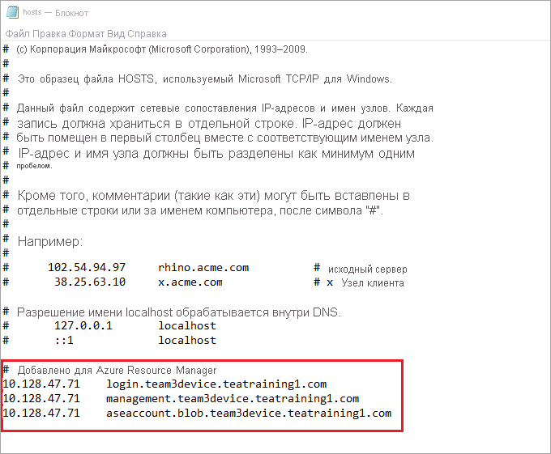

# <a name="deploy-vms-on-your-azure-stack-edge-pro-gpu-device-via-azure-powershell-script"></a>Развертывание виртуальных машин на устройстве с Azure Stack ребра Pro GPU с помощью скрипта Azure PowerShell

<!--[!INCLUDE [applies-to-skus](../../includes/azure-stack-edge-applies-to-all-sku.md)]-->

В этом учебнике описано, как создать виртуальную машину на устройстве Azure Stack пограничной Pro и управлять ею с помощью скрипта Azure PowerShell.

## <a name="prerequisites"></a>Предварительные требования

Прежде чем приступить к созданию виртуальной машины и управлению ею на устройстве Azure Stack пограничной Pro с помощью этого сценария, необходимо убедиться, что выполнены предварительные требования, перечисленные в следующих шагах.

### <a name="for-azure-stack-edge-pro-device-via-the-local-web-ui"></a>Для Azure Stack устройства Pro с помощью локального пользовательского веб-интерфейса

1. Настройте параметры сети на устройстве Azure Stack Edge Pro (см. раздел [Шаг 1. Настройка устройства Azure Stack Edge Pro](azure-stack-edge-j-series-connect-resource-manager.md#step-1-configure-azure-stack-edge-pro-device)).

2. Включите сетевой интерфейс для служб вычислений. IP-адрес этого сетевого интерфейса используется для создания виртуального коммутатора для развертывания виртуальной машины. Это можно сделать следующим образом:

    1. Перейдите к **параметрам вычислений**. Выберите сетевой интерфейс, который будет использоваться для создания виртуального коммутатора.

        > [!IMPORTANT] 
        > Для служб вычислений можно настроить только один порт.

    2. Включите службы вычислений на сетевом интерфейсе. Azure Stack Edge Pro создает виртуальный коммутатор, соответствующий этому сетевому интерфейсу, и управляет им.

3. Вы создали и установили все сертификаты на устройстве Azure Stack ребра Pro и в доверенном корневом хранилище клиента. (см. раздел [Шаг 2. Создание и установка сертификатов](azure-stack-edge-j-series-connect-resource-manager.md#step-2-create-and-install-certificates)).

### <a name="for-your-windows-client"></a>Для клиента Windows

1. Вы определили виртуальный IP-адрес (VIP) служб Azure на странице **сети** в локальном интерфейсе пользователя на устройстве. Этот виртуальный IP-адрес необходимо добавить в:

    - файл узла на клиенте ИЛИ
    - конфигурацию DNS-сервера.
    
    > [!IMPORTANT]
    > Рекомендуется изменить конфигурацию DNS-сервера для разрешения имен конечных точек.

    1. Откройте **Блокнот** от имени администратора (для сохранения файла требуются привилегии администратора), а затем откройте файл **hosts**, расположенный в `C:\Windows\System32\Drivers\etc`.
    
        
    
    2. Добавьте следующие записи в файл **hosts**, указав соответствующие значения для вашего устройства:
    
        ```
        <Azure consistent services VIP> login.<appliance name>.<DNS domain>
        <Azure consistent services VIP> management.<appliance name>.<DNS domain>
        <Azure consistent services VIP> <storage name>.blob.<appliance name>.<DNS domain>
        ```
        Для учетной записи хранения можно указать имя, которое сценарий будет использовать позже для создания новой учетной записи хранения. Сценарий не проверяет, существует ли эта учетная запись хранения.

    3. Для справки используйте следующее изображение. Сохраните файл **hosts**.

        

2. [Скачайте скрипт PowerShell,](https://aka.ms/ase-vm-powershell) используемый в этой процедуре.

3. Убедитесь, что клиент Windows работает под управлением PowerShell 5,0 или более поздней версии.

4. Убедитесь, что `Azure.Storage Module version 4.5.0` установлен в системе. Этот модуль можно получить из [коллекция PowerShell](https://www.powershellgallery.com/packages/Azure.Storage/4.5.0). Чтобы установить этот модуль, введите:

    `Install-Module -Name Azure.Storage -RequiredVersion 4.5.0`

    Чтобы проверить версию установленного модуля, введите:

    `Get-InstalledModule -name Azure.Storage`

    Чтобы удалить другие модули версии, введите:

    `Uninstall-Module -Name Azure.Storage`

5. [Скачайте AzCopy 10](../storage/common/storage-use-azcopy-v10.md#download-azcopy) в клиент Windows. Запишите это расположение, так как оно будет передано в качестве параметра при выполнении скрипта.

6. Убедитесь, что клиент Windows работает под управлением TLS 1,2 или более поздней версии.


## <a name="create-a-vm"></a>Создание виртуальной машины

1. Откройте сеанс PowerShell от имени администратора.
2. Перейдите в папку, в которую был скачан скрипт на клиенте.  
3. Выполните следующую команду, чтобы запустить скрипт.
 
    `.\ArmPowershellClient.ps1 -VNetAddressSpace <AddressSpace> -NicPrivateIp <Private IP> -VHDPath <Path> -VHDFile <VHD File, with extension> -StorageAccountName <Name> -OS <Windows/Linux> -VMSize <Supported VM Size> -VMUserName <UserName to be used to login into VM> -VMPassword <Password for the VM login> --AzCopy10Path <Absolute Path>`

    Ниже приведены примеры выполнения сценария для создания ВИРТУАЛЬНОЙ машины Windows и виртуальной машины Linux.

    **Для виртуальной машины Windows:**

    `.\ArmPowershellClient.ps1 -VNetAddressSpace 5.5.0.0/16 -NicPrivateIp 5.5.168.73 -VHDPath \\intel01\d$\vm_vhds\AzureWindowsVMmode -VHDFile WindowsServer2016Datacenter.vhd -StorageAccountName teaaccount1 -OS Windows -VMSize Standard_D1_v2 -VMUserName Administrator -VMPassword Password1 -AzCopy10Path C:\azcopy10\azcopy.exe`

    **Для виртуальной машины Linux:**

    `.\ArmPowershellClient.ps1 -VNetAddressSpace 5.5.0.0/16 -NicPrivateIp 5.5.168.83 -VHDPath \\intel01\d$\vm_vhds\AzurestackLinux -VHDFile ubuntu13.vhd -StorageAccountName sa2 -OS Linux -VMSize Standard_D1_v2 -VMUserName Administrator -VMPassword Password1 -AzCopy10Path C:\azcopy10\azcopy.exe`
    
4. Чтобы очистить ресурсы, созданные сценарием, используйте следующие команды:
    
    ```powershell
    Get-AzureRmVM | Remove-AzureRmVM -Force
    Get-AzureRmNetworkInterface | Remove-AzureRmNetworkInterface -Force
    Get-AzureRmResource | Remove-AzureRmResource -f
    Get-AzureRmResourceGroup | Remove-AzureRmResourceGroup -f
    ```


## <a name="next-steps"></a>Дальнейшие действия

[Развертывание виртуальных машин с помощью командлетов Azure PowerShell](azure-stack-edge-j-series-deploy-virtual-machine-powershell.md)