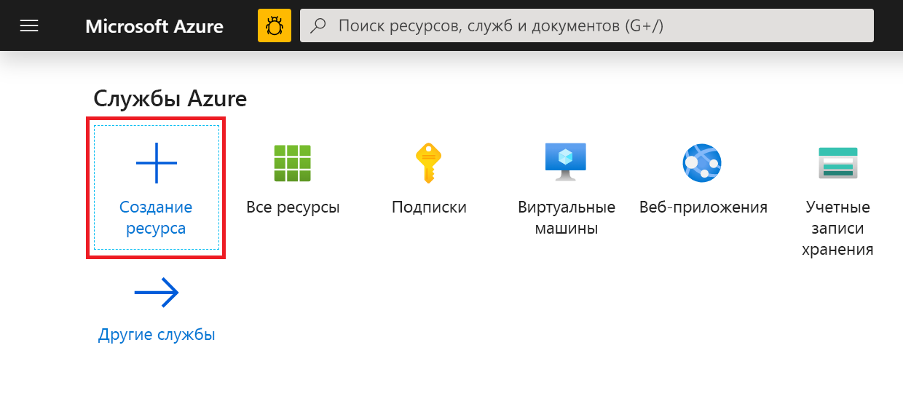
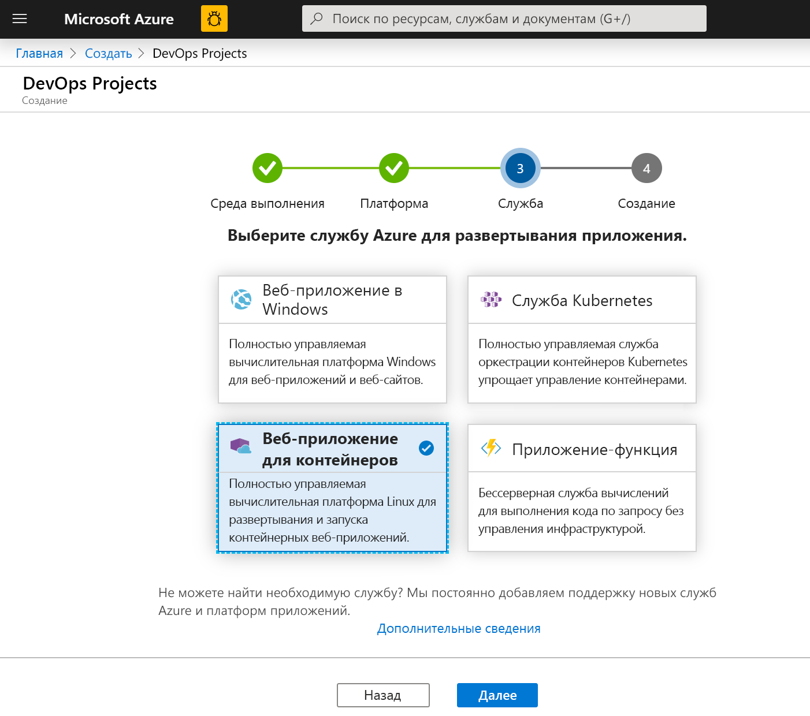
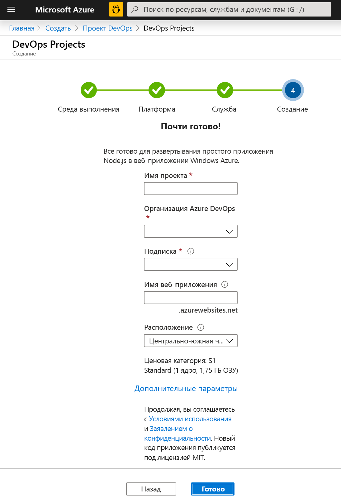
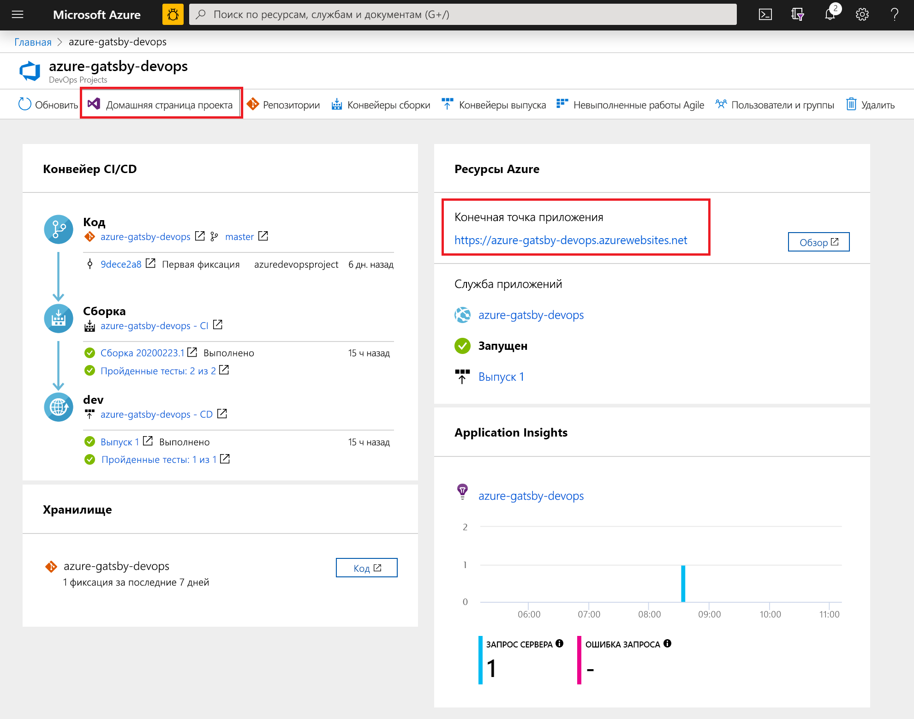
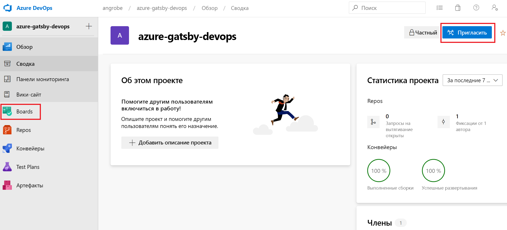
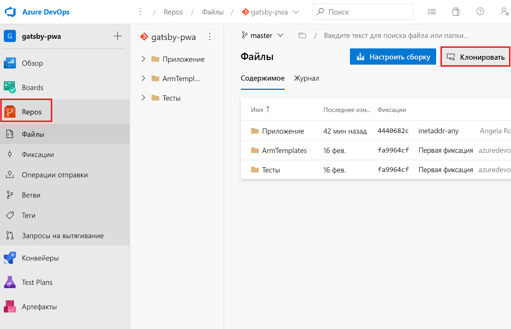
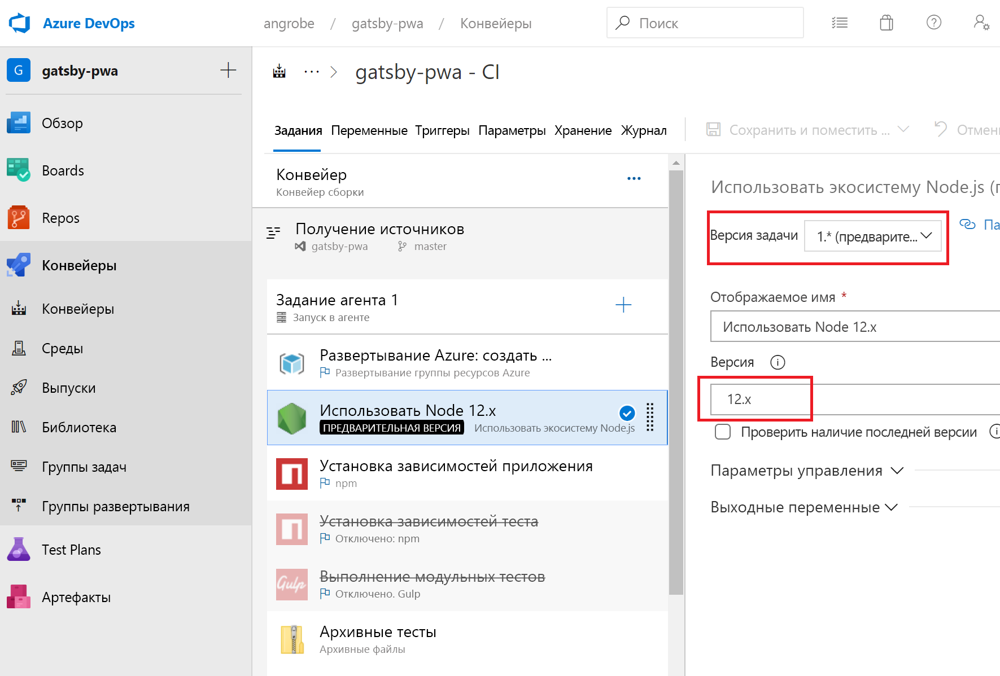
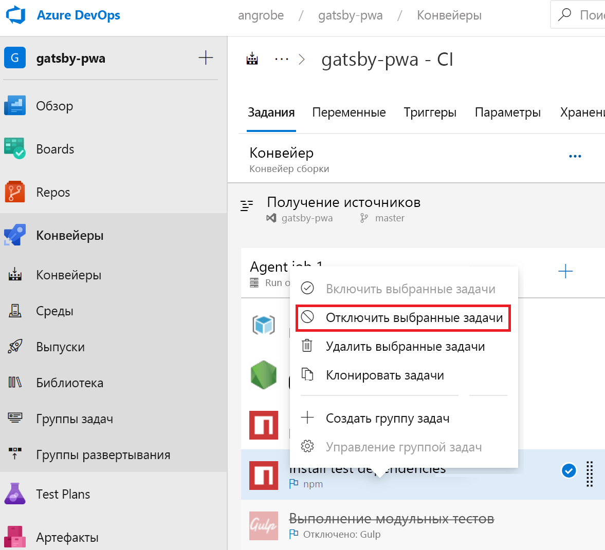
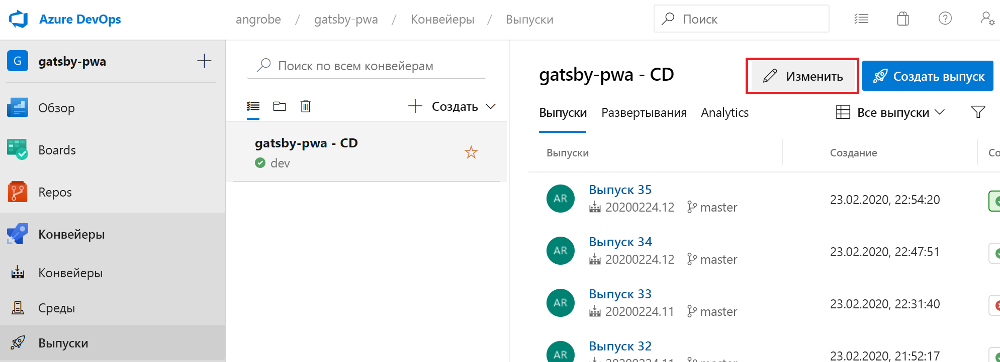
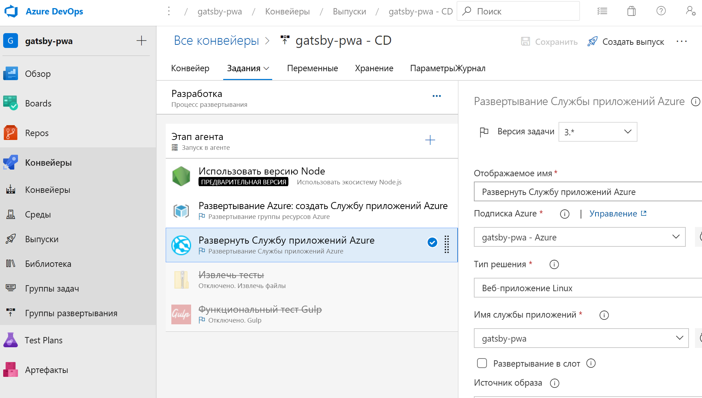

# <a name="create-a-cicd-pipeline-in-azure-pipelines-for-nodejs-with-azure-devops-starter"></a>Создание конвейера CI/CD в Azure Pipelines для Node. js с помощью Azure DevOps Starter

В этом кратком руководстве вы создадите NodeJS последовательное веб-приложение (PWA) с помощью [гатсбижс](https://www.gatsbyjs.org/) и упрощенного процесса создания Azure DevOps Starter. По завершении вы получите полнофункциональный конвейер непрерывной интеграции (CI) и непрерывной доставки (CD) для прогрессивного веб-приложения в Azure Pipelines. Azure DevOps Starter настраивает, что необходимо для разработки, развертывания и мониторинга.

## <a name="prerequisites"></a>Предварительные требования

- Учетная запись Azure с активной подпиской. [Создайте учетную запись](https://azure.microsoft.com/free/?ref=microsoft.com&utm_source=microsoft.com&utm_medium=docs&utm_campaign=visualstudio) бесплатно. 
- Организация [Azure DevOps](https://azure.microsoft.com/services/devops/).

## <a name="sign-in-to-the-azure-portal"></a>Вход на портал Azure

DevOps Starter создает конвейер CI/CD в Azure Pipelines. Вы можете создать новую организацию Azure DevOps или использовать существующую. DevOps Starter также создает ресурсы Azure в вашей подписке Azure по своему усмотрению.

1. Войдите на [портал Azure](https://portal.azure.com) и на панели слева выберите элемент **Создать ресурс**. 

   

1. В поле поиска введите **DevOps Starter**, а затем выберите. Нажмите кнопку **Добавить** , чтобы создать новый.

    

## <a name="select-a-sample-application-and-azure-service"></a>Выбор примера приложения и службы Azure

1. Выберите пример приложения Node.js.   

     

1. Платформа примера по умолчанию — **Express.js**. Измените выделенный фрагмент на **простое приложение Node. js** и нажмите кнопку **Далее**. 

     

1. Целевые объекты развертывания, доступные на этом шаге, определяются платформой приложений, выбранной на шаге 2. В этом примере **Windows Web App** является целью развертывания по умолчанию. Оставьте **веб-приложение для контейнеров** набор и нажмите кнопку **Далее**.

    

## <a name="configure-a-project-name-and-an-azure-subscription"></a>Настройка имени проекта и подписки Azure

1. На последнем шаге рабочего процесса создания DevOps Starter вы назначаете имя проекта, выберите подписку Azure и нажмите кнопку **Готово**.  

    

1. Страница Сводка отображается во время сборки проекта и развертывания приложения в Azure. После краткого периода в [Организации Azure DevOps](https://dev.azure.com/) создается проект, который включает репозиторий Git, доску Канбан, конвейер развертывания, планы тестирования и артефакты, необходимые для приложения.  

## <a name="managing-your-project"></a>Управление проектом

1. Перейдите ко **всем ресурсам** и найдите DevOps Starter. Выберите **DevOps Starter**.

    

1. Вы направляетесь на панель мониторинга, которая предоставляет сведения о домашней странице проекта, репозитории кода, конвейере CI/CD и ссылку на работающее приложение. Выберите **домашнюю страницу проекта** , чтобы просмотреть приложение в **Azure DevOps** , а затем на другой вкладке браузера выберите **конечную точку приложения** , чтобы просмотреть пример приложения в реальном времени. Далее мы изменим этот пример, чтобы использовать Гатсбижс, созданный PWA.

     

1. В проекте Azure DevOps вы можете пригласить членов команды для совместной работы и создания доски Канбан, чтобы начать отслеживание работы. Дополнительные сведения см. [здесь](https://docs.microsoft.com/azure/devops/user-guide/what-is-azure-devops?view=azure-devops).



## <a name="clone-the-repo-and-install-your-gatsby-pwa"></a>Клонирование репозитория и установка Гатсби PWA

DevOps Starter создает репозиторий Git в Azure Repos или GitHub. В этом примере создан репозиторий Azure. Следующим шагом является Клонирование репозитория и внесение изменений.

1. Выберите **репозиториев** из **проекта DevOps** , а затем нажмите кнопку **клонировать**.  Существует несколько механизмов клонирования репозитория Git на Рабочий стол.  Выберите тот, который подходит для разработки.  

    

1. После клонирования репозитория на Рабочий стол Внесите некоторые изменения в начальный шаблон. Начните с установки Гатсбижс CLI из терминала.

   ```powershell
    npm install -g gatsby
   ```

1. В окне терминала перейдите к корню репозитория. Он должен содержать три папки, которые выглядят следующим образом:

    ```powershell
    Mode                LastWriteTime         Length Name
    ----                -------------         ------ ----
    d-----        2/23/2020  10:42 PM                Application
    d-----        2/23/2020   3:05 PM                ArmTemplates
    d-----        2/23/2020   3:05 PM                Tests
    ```
    
1. Мы не хотим, чтобы все файлы в папке приложения были заменены на Гатсби Starter. Выполните следующие команды последовательно, чтобы обрезать ее.
    
    ```powershell
    cp .\Application\Dockerfile .
    rmdir Application
    ```

1. Используйте интерфейс командной строки Гатсби для создания примера PWA. Запустите `gatsby new` программу из терминала, чтобы запустить мастер PWA и выбрать `gatsby-starter-blog` шаблон для начального шаблона. Этот пример должен выглядеть примерно так:

    ```powershell
    c:\myproject> gatsby new
    √ What is your project called? ... my-gatsby-project
    ? What starter would you like to use? » - Use arrow-keys. Return to submit.
        gatsby-starter-default
        gatsby-starter-hello-world
    >   gatsby-starter-blog
        (Use a different starter)
    ```
    
1. Теперь у вас есть папка с `my-gatsby-project`именем. Переименуйте его `Application` в и скопируйте `Dockerfile` в него.
    
    ```powershell
    mv my-gatsby-project Application
    mv Dockerfile Application
    ```
    
1. В любимом редакторе откройте Dockerfile и измените первую строку с `FROM node:8` на. `FROM node:12` Это изменение гарантирует, что контейнер использует Node. js версии 12. x вместо версии 8. x. Гатсбижс требует более современных версий Node. js.

1. Затем откройте файл Package. JSON в папке приложения и измените [поле сценарии](https://docs.npmjs.com/files/package.json#scripts) , чтобы убедиться в том, что серверы разработки и рабочих серверов прослушивают все доступные сетевые интерфейсы (например, 0.0.0.0) и порт 80. Без этих параметров служба приложений контейнеров не может маршрутизировать трафик к приложению Node. js, выполняющемуся в контейнере. `scripts` Поле должно выглядеть примерно так, как показано ниже. В `develop`частности, необходимо изменить целевые объекты `serve`, и `start` , используя значения по умолчанию.

    ```json
      "scripts": {
        "build": "gatsby build",
        "develop": "gatsby develop  -H 0.0.0.0 -p 80",
        "format": "prettier --write \"**/*.{js,jsx,json,md}\"",
        "start": "npm run serve",
        "serve": "npm run build && gatsby serve -H 0.0.0.0 -p 80",
        "clean": "gatsby clean",
        "test": "echo \"Write tests! -> https://gatsby.dev/unit-testing\" && exit 1"
      }
    ```
    
## <a name="edit-your-cicd-pipelines"></a>Изменение конвейеров CI/CD

1. Перед фиксацией кода в предыдущем разделе Внесите некоторые изменения в конвейеры сборки и выпуска. Измените "конвейер сборки" и обновите задачу Node, чтобы она использовала Node. js версии 12. x. Задайте в поле **Версия задачи** значение 1. x, а в поле **версия** — 12. x.

    

1. В этом кратком руководстве мы не создаем модульные тесты, и мы отключим эти шаги в нашем конвейере сборки. При написании тестов можно снова включить эти шаги. Щелкните правой кнопкой мыши, чтобы выбрать задачи с меткой **установить зависимости теста** и **запустить модульные тесты** и отключить их.

    

1. Измените конвейер выпуска.

    

1. Как и в случае с конвейером сборки, измените задачу узла на использование 12. x и отключите две задачи тестирования. Ваш выпуск должен быть похож на этот снимок экрана.

    

1. В области слева в браузере перейдите к файлу **views/index.pug**.

1. Выберите **Изменить** и внесите изменения в заголовок h2.  Например, введите **Начало работы прямо сейчас с помощью Azure DevOps Starter** или внесите другие изменения.

1. Выберите **Зафиксировать** и сохраните изменения.

1. В браузере перейдите на панель мониторинга DevOps Starter.   
Теперь вы должны увидеть, что сборка выполняется. Внесенные изменения автоматически создаются и развертываются с помощью конвейера CI/CD.

## <a name="commit-your-changes-and-examine-the-azure-cicd-pipeline"></a>Зафиксируйте изменения и изучите конвейер Azure CI/CD

В предыдущих двух шагах вы добавили в репозиторий Git созданный Гатсби PWA и изменили конвейеры для создания и развертывания кода. Мы можем зафиксировать код и следить за его ходом с помощью конвейера сборки и выпуска.

1. В корне репозитория Git проекта в терминале выполните следующие команды, чтобы отправить код в проект Azure DevOps:

    ```powershell
    git add .
    git commit -m "My first Gatsby PWA"
    git push
    ```
    
1. Сборка запускается сразу после `git push` завершения. Вы можете выполнить ход выполнения на **панели мониторинга DevOps для Azure**.

3. Через несколько минут завершится работа конвейеров сборки и выпуска, и PWA будет развернуто в конвейере. Щелкните ссылку **Конечная точка приложения** на панели мониторинга, и вы увидите готовый начальный проект Gatsby для блогов.

## <a name="clean-up-resources"></a>Очистка ресурсов

Ненужную Службу приложений Azure и связанные ресурсы можно удалить. Используйте функцию **удаления** на панели мониторинга DevOps Starter.

## <a name="next-steps"></a>Дальнейшие действия

После настройки процесса CI/CD конвейеры сборки и выпуска создаются автоматически. Вы можете изменить эти конвейеры сборки и выпуска в соответствии с требованиями вашей команды. См. дополнительные сведения о конвейере CI/CD:

> [!div class="nextstepaction"]
> [Define your multi-stage continuous deployment (CD) process](https://docs.microsoft.com/azure/devops/pipelines/release/define-multistage-release-process?view=vsts) (Определение многоэтапного процесса непрерывного развертывания)

