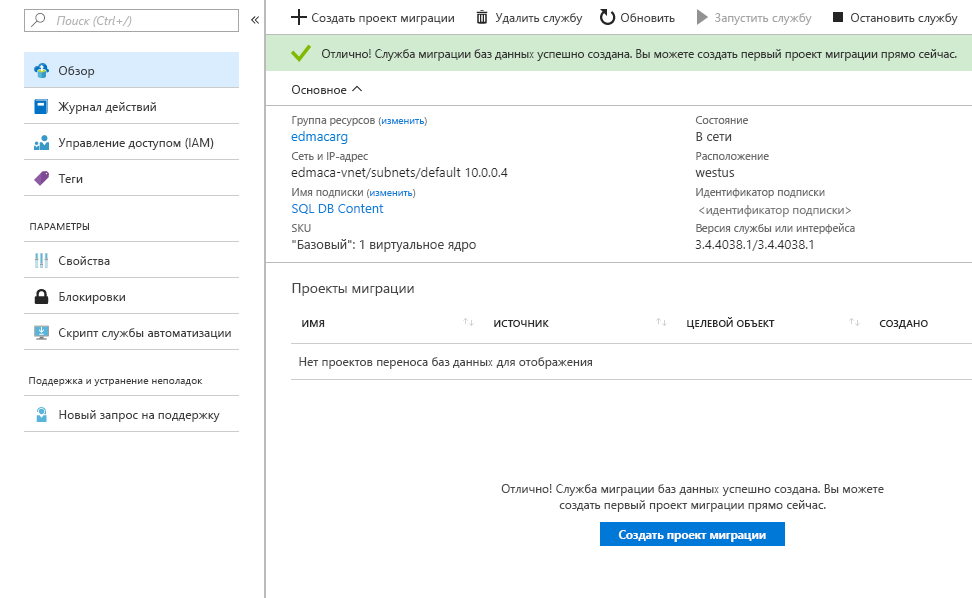

# Краткое руководство. Создание экземпляра службы Azure Database Migration Service с помощью портала Azure

В этом кратком руководстве вы создадите экземпляр Azure Database Migration Service с помощью портала Azure.  Созданный экземпляр можно будет использовать для переноса данных с платформы SQL Server в Базу данных SQL Azure.

Если у вас еще нет подписки Azure, создайте [бесплатную](https://azure.microsoft.com/free/) учетную запись Azure, прежде чем начинать работу.

## Вход на портал Azure

Откройте веб-браузер, перейдите к [порталу Microsoft Azure](https://portal.azure.com/) и введите учетные данные для входа на портал.

Панель мониторинга службы является представлением по умолчанию.

> [!NOTE]
> В одной подписке можно создать до 10 экземпляров DMS. Если требуется больше экземпляров, создайте запрос в службу поддержки.

## Регистрация поставщика ресурсов

Прежде чем создать свой первый экземпляр Database Migration Service, зарегистрируйте поставщик ресурсов Microsoft.DataMigration.

1. На портале Azure щелкните **Все службы** и выберите **Подписки**.

2. Выберите подписку, в которой нужно создать экземпляр Azure Database Migration Service, а затем щелкните **Поставщики ресурсов**.

3. В поле поиска введите migration, а затем справа от **Microsoft.DataMigration** щелкните **Зарегистрировать**.

    

## Создание экземпляра службы

1. Щелкните **+Создать ресурс**, чтобы создать экземпляр Azure Database Migration Service.

2. Выполните в Marketplace поиск по слову migration, выберите службу **Azure Database Migration Service**, а затем на экране **Azure Database Migration Service** нажмите кнопку **Create**.

3. На экране **Создать Migration Service** сделайте следующее:

    - Выберите **имя службы**, которое хорошо запоминается и будет уникальным для идентификации экземпляра Azure Database Migration Service.
    - Выберите **подписку** Azure, в которой нужно создать экземпляр.
    - Выберите существующую **группу ресурсов** или создайте новую.
    - Выберите **расположение**, наиболее близкое к исходному или целевому серверу.
    - Выберите существующую **виртуальную сеть** или создайте новую.

        Виртуальная сеть предоставляет Azure Database Migration Service доступ к базе данных-источнику и целевой среде.

        См. дополнительные сведения о [создании виртуальной сети с помощью портала Azure](../virtual-network/quick-create-portal.md).

    - Выберите "Basic: 1 vCore" (Базовый: 1 виртуальное ядро) для параметра **Ценовая категория**.

        

4. Нажмите кнопку **создания**.

    Через несколько секунд экземпляр Azure Database Migration Service будет создан и готов к использованию. Экземпляр Azure Database Migration Service отобразится, как показано на рисунке ниже.

    

## Очистка ресурсов

Чтобы очистить ресурсы, созданные при работе с этим кратким руководством, удалите [группу ресурсов Azure](../azure-resource-manager/management/overview.md). Чтобы удалить группу ресурсов, перейдите к созданному экземпляру Azure Database Migration Service. Выберите имя **группы ресурсов** и щелкните **Удалить группу ресурсов**. Это действие удаляет все ресурсы в группе ресурсов, а также саму группу.

## Дальнейшие действия

> [!div class="nextstepaction"]
> [Перенос SQL Server в Базу данных Azure SQL](tutorial-sql-server-to-azure-sql.md)