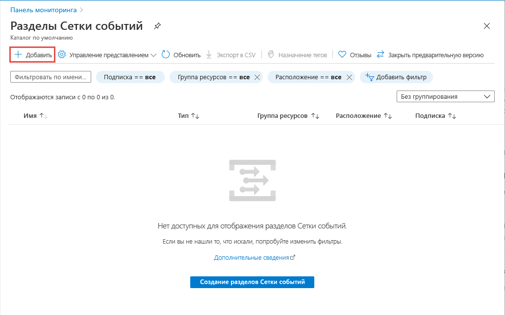
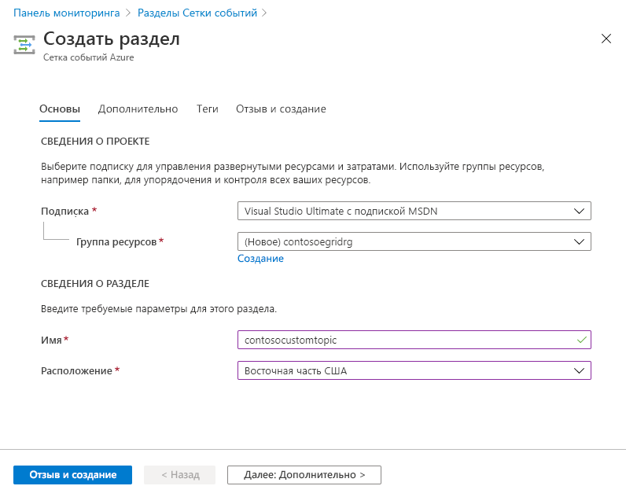
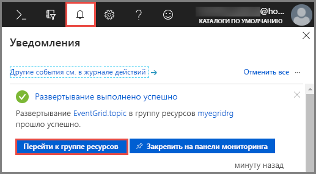
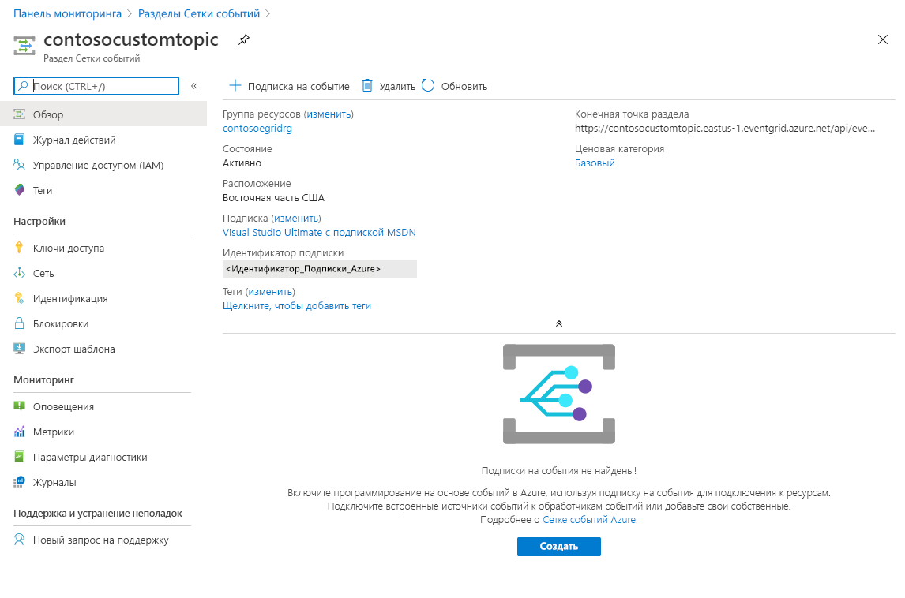
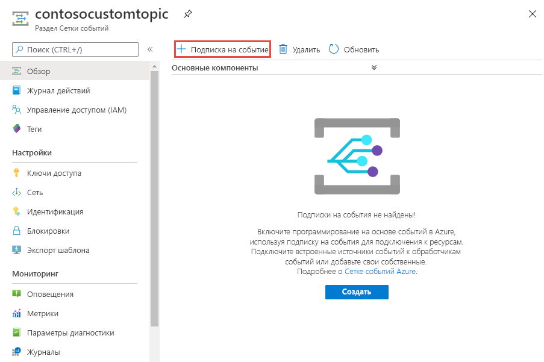
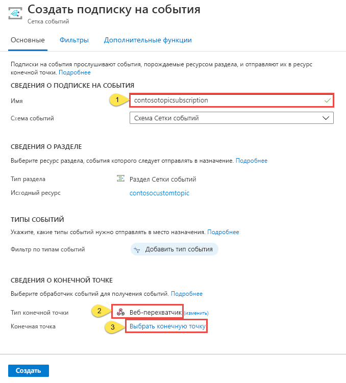
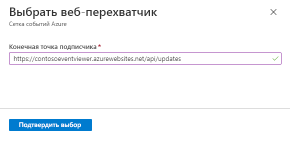
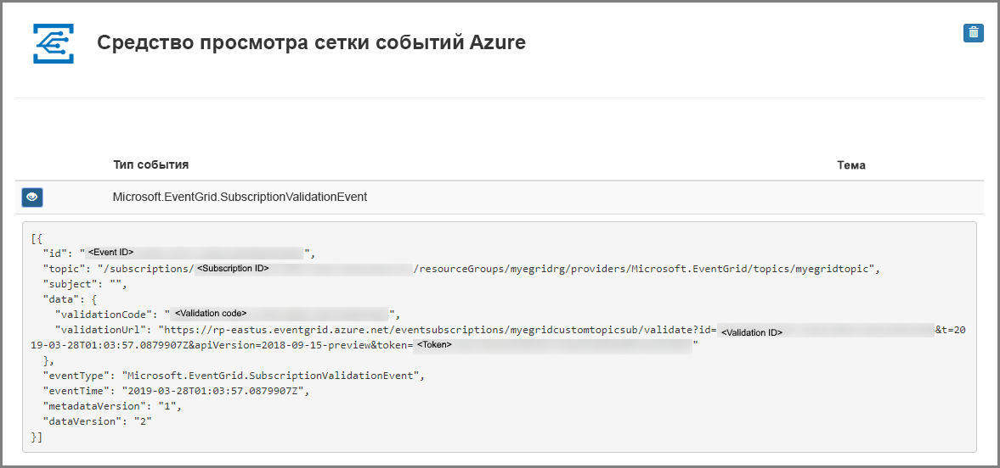
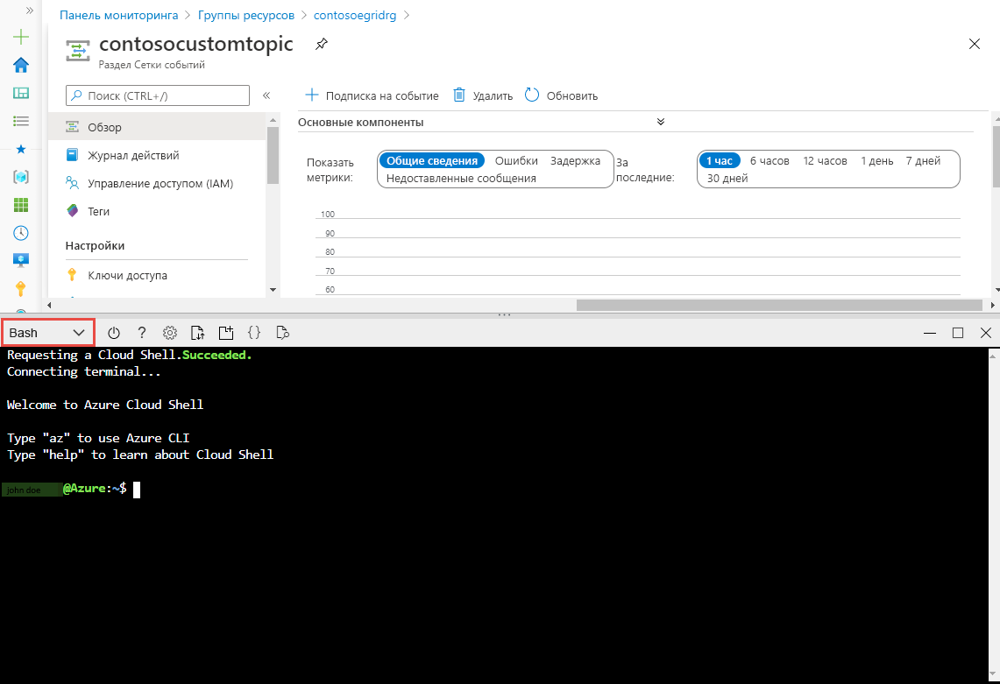

# <a name="quickstart-route-custom-events-to-web-endpoint-with-the-azure-portal-and-event-grid"></a>Краткое руководство. Перенаправление пользовательских событий в конечную веб-точку с помощью портала Azure и службы "Сетка событий"

"Сетка событий Azure" — это служба обработки событий для облака. В рамках этой статьи с помощью портала Azure вы создадите пользовательский раздел, подпишетесь на раздел и активируете событие для просмотра результата. Как правило, события отправляются на конечную точку, которая обрабатывает данные событий и выполняет соответствующие действия. Но в этой статье для простоты события отправляются в веб-приложение, которое собирает и отображает сообщения.

По завершении можно увидеть, что данные событий отправлены в веб-приложение.


[!INCLUDE [updated-for-az](../../includes/updated-for-az.md)]

[!INCLUDE [quickstarts-free-trial-note.md](../../includes/quickstarts-free-trial-note.md)]

[!INCLUDE [event-grid-register-provider-portal.md](../../includes/event-grid-register-provider-portal.md)]

## <a name="create-a-custom-topic"></a>Создание пользовательской темы

Раздел сетки событий содержит определяемую пользователем конечную точку, в которой можно размещать свои события. 

1. Войдите на [портал Azure](https://portal.azure.com/).
2. Выберите **Все службы** в меню навигации слева, найдите пункт **Сетка событий** и выберите **Разделы сетки событий**. 

    
3. На странице **Разделы сетки событий** на панели инструментов выберите **+ Добавить**. 

    
4. На странице **Создать раздел** выполните следующие действия:
    1. Укажите уникальное **имя** для пользовательского раздела. Имя раздела должно быть уникальным, так как оно представлено записью службы доменных имен (DNS). Не используйте имя, указанное на изображении. Вместо этого создайте собственное имя длиной от 3 до 50 символов, которое может содержать только буквы (a–z, A–Z), цифры (0–9) и дефисы (-).
    2. Выберите свою **подписку Azure**.
    3. Щелкните имеющуюся группу ресурсов или выберите **Создать** и введите **имя** для новой **группы ресурсов**.
    4. Выберите **расположение** для раздела Сетки событий.
    5. В поле **Схема событий** оставьте значение по умолчанию **Схема сетки событий**. 

       
    6. Нажмите кнопку **создания**. 
5. После создания пользовательского раздела появится уведомление об успехе. Выберите **Перейти к группе ресурсов**. 

   
6. На странице **Группа ресурсов** выберите раздел сетки событий. 

   
7. Отобразится страница **Раздел сетки событий** для соответствующей Сетки событий. Оставьте эту страницу открытой. Она понадобится позже при работе с кратким руководством. 

    

## <a name="create-a-message-endpoint"></a>Создание конечной точки сообщения
Перед созданием подписки на пользовательский раздел создайте конечную точку для сообщения о событии. Обычно конечная точка выполняет действия на основе данных событий. Чтобы упростить работу с этим руководством, разверните [готовое веб-приложение](https://github.com/Azure-Samples/azure-event-grid-viewer), которое отображает сообщения о событиях. Развернутое решение содержит план службы приложений, веб-приложение службы приложений и исходный код из GitHub.

1. Выберите **Развернуть в Azure**, чтобы развернуть решение в своей подписке. На портале Azure укажите значения остальных параметров.

   <a href="https://portal.azure.com/#create/Microsoft.Template/uri/https%3A%2F%2Fraw.githubusercontent.com%2FAzure-Samples%2Fazure-event-grid-viewer%2Fmaster%2Fazuredeploy.json" target="_blank"></a>
1. Завершение развертывания может занять несколько минут. Когда развертывание успешно завершится, откройте веб-приложение и убедитесь, что оно работает. Откройте браузер и перейдите по адресу `https://<your-site-name>.azurewebsites.net`.
1. Вы увидите сайт без опубликованных событий.

   

## <a name="subscribe-to-custom-topic"></a>Подписка на события пользовательского раздела

Подпишитесь на соответствующий раздел, чтобы определить в Сетке событий Azure, какие события необходимо отслеживать и куда их отправлять.

1. Теперь на странице **Раздел сетки событий** выберите для пользовательского раздела **+ Подписка на события** на панели инструментов.

   
2. На странице **Создать подписку на событие** выполните следующие действия:
    1. Укажите **имя** подписки на события.
    3. Выберите **веб-перехватчик** в качестве типа **конечной точки**. 
    4. Выберите **Выбрать конечную точку**. 

       
    5. Для конечной точки веб-перехватчика укажите URL-адрес веб-приложения и добавьте `api/updates` к URL-адресу домашней страницы. Выберите **Подтвердить выбор**.

       
    6. Вернитесь на страницу **Создать подписку на событие** и выберите **Создать**.

3. Теперь снова откройте веб-приложение и убедитесь, что оно успешно получило отправленное событие подтверждения подписки. Щелкните значок с изображением глаза, чтобы развернуть данные события. Сетка событий отправляет событие подтверждения, чтобы конечная точка могла подтвердить, что она готова получать данные события. Веб-приложение содержит код для проверки подписки.

    

## <a name="send-an-event-to-your-topic"></a>Отправка события в тему

Теперь необходимо активировать событие, чтобы увидеть, как Сетка событий Azure распределяет сообщение к вашей конечной точке. Отправьте тестовое событие в пользовательский раздел с помощью PowerShell или Azure CLI. Как правило, приложение или служба Azure отправит данные события.

В первом примере используется Azure CLI. Он возвращает URL-адрес, ключ пользовательского раздела и пример данных события. Используйте имя пользовательского раздела для `<topic name>`. Будет создан пример данных событий. Элемент `data` JSON отображает полезные данные события. Любое значение JSON с правильным форматом может быть в этом поле. Кроме того, можно использовать поле темы для дополнительной маршрутизации и фильтрации. CURL — это служебная программа, которая отправляет HTTP-запросы.


### <a name="azure-cli"></a>Azure CLI
1. На портале Azure выберите **Cloud Shell**. Выберите **Bash** в левом верхнем углу окна Cloud Shell. 

    
1. Выполните следующую команду, чтобы получить **конечную точку** для раздела: После копирования и вставки команды перед ее выполнением измените соответствующим образом **имя раздела** и **имя группы ресурсов**. 

    ```azurecli
    endpoint=$(az eventgrid topic show --name <topic name> -g <resource group name> --query "endpoint" --output tsv)
    ```
2. Выполните следующую команду, чтобы получить **ключ** для пользовательского раздела. После копирования и вставки команды перед ее выполнением измените соответствующим образом **имя раздела** и **имя группы ресурсов**. 

    ```azurecli
    key=$(az eventgrid topic key list --name <topic name> -g <resource group name> --query "key1" --output tsv)
    ```
3. Скопируйте следующую инструкцию с определением события и нажмите клавишу **ВВОД**. 

    ```json
    event='[ {"id": "'"$RANDOM"'", "eventType": "recordInserted", "subject": "myapp/vehicles/motorcycles", "eventTime": "'`date +%Y-%m-%dT%H:%M:%S%z`'", "data":{ "make": "Ducati", "model": "Monster"},"dataVersion": "1.0"} ]'
    ```
4. Выполните следующую команду **Curl**, чтобы отправить событие:

    ```
    curl -X POST -H "aeg-sas-key: $key" -d "$event" $endpoint
    ```

### <a name="azure-powershell"></a>Azure PowerShell
Во втором примере для выполнения аналогичных действий используется PowerShell.

1. На портале Azure выберите **Cloud Shell** (или перейдите по адресу https://shell.azure.com/) ). Выберите **PowerShell** в левом верхнем углу окна Cloud Shell. Пример того, как выглядит окно **Cloud Shell**, приведен в разделе "Инфраструктура CLI Azure".
2. Задайте следующие переменные. После копирования и вставки команды перед ее выполнением измените соответствующим образом **имя раздела** и **имя группы ресурсов**.

    ```powershell
    $resourceGroupName = <resource group name>
    $topicName = <topic name>
    ```
3. Выполните следующую команду, чтобы получить **конечную точку** и **ключи** для раздела:

    ```powershell
    $endpoint = (Get-AzEventGridTopic -ResourceGroupName $resourceGroupName -Name $topicName).Endpoint
    $keys = Get-AzEventGridTopicKey -ResourceGroupName $resourceGroupName -Name $topicName
    ```
4. Подготовьте событие. Скопируйте и выполните инструкции в окне Cloud Shell. 

    ```powershell
    $eventID = Get-Random 99999

    #Date format should be SortableDateTimePattern (ISO 8601)
    $eventDate = Get-Date -Format s

    #Construct body using Hashtable
    $htbody = @{
        id= $eventID
        eventType="recordInserted"
        subject="myapp/vehicles/motorcycles"
        eventTime= $eventDate   
        data= @{
            make="Ducati"
            model="Monster"
        }
        dataVersion="1.0"
    }
    
    #Use ConvertTo-Json to convert event body from Hashtable to JSON Object
    #Append square brackets to the converted JSON payload since they are expected in the event's JSON payload syntax
    $body = "["+(ConvertTo-Json $htbody)+"]"
    ```
5. Используйте командлет **Invoke-WebRequest** для отправки события. 

    ```powershell
    Invoke-WebRequest -Uri $endpoint -Method POST -Body $body -Headers @{"aeg-sas-key" = $keys.Key1}
    ```

### <a name="verify-in-the-event-grid-viewer"></a>Проверка в средстве просмотра Сетки событий
Вы активировали событие, а служба "Сетка событий" отправила сообщение в конечную точку, настроенную вами при оформлении подписки. Откройте веб-приложение и просмотрите в нем отправленные события.

```json
{
  "id": "974",
  "eventType": "recordInserted",
  "subject": "myapp/vehicles/motorcycles",
  "eventTime": "2019-03-28T01:11:59+00:00",
  "data": {
    "make": "Ducati",
    "model": "Monster"
  },
  "dataVersion": "1.0",
  "metadataVersion": "1",
  "topic": "/subscriptions/11111111-1111-1111-1111-111111111111/resourceGroups/myegridrg/providers/Microsoft.EventGrid/topics/myegridtopic"
}
```

## <a name="clean-up-resources"></a>Очистка ресурсов
Если вы планируете продолжить работу с этим событием, не удаляйте ресурсы, созданные при работе с этой статьей. В противном случае удалите ресурсы, созданные при работе с этой статьей.

1. Выберите **Группы ресурсов** в меню слева. Если этот параметр не отображается, выберите **Все службы** в меню слева и выберите **Группы ресурсов**. 
2. Выберите группу ресурсов, чтобы открыть страницу **Группа ресурсов**. 
3. На панели инструментов выберите **Удалить группу ресурсов**. 
4. Подтвердите удаление. Для этого введите имя группы ресурсов и выберите **Удалить**. 

    

    Другая группа ресурсов, показанная на рисунке, создана и используется в окне Cloud Shell. Удалите ее, если вы не планируете использовать окно Cloud Shell в дальнейшем. 

## <a name="next-steps"></a>Дальнейшие действия

Теперь, когда вы знаете, как создавать пользовательские раздели и подписки на события, ознакомьтесь с дополнительными сведениями о сетке событий, которые могут помочь вам:

- [An introduction to Azure Event Grid](overview.md) (Общие сведения о службе "Сетка событий Azure")
- [Перенаправление событий хранилища BLOB-объектов в пользовательскую конечную веб-точку (предварительная версия)](../storage/blobs/storage-blob-event-quickstart.md?toc=%2fazure%2fevent-grid%2ftoc.json)
- [Monitor virtual machine changes with Azure Event Grid and Logic Apps](monitor-virtual-machine-changes-event-grid-logic-app.md) (Отслеживание изменений виртуальной машины с помощью Azure Logic Apps и службы "Сетка событий Azure")
- [Потоковая передача больших данных в хранилище данных](event-grid-event-hubs-integration.md)
