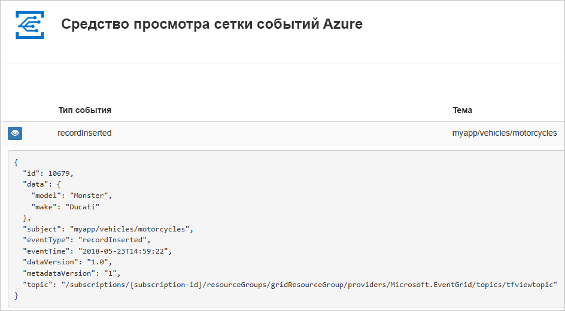
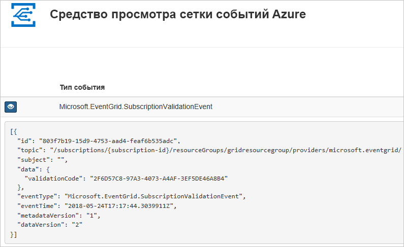

# <a name="quickstart-route-custom-events-to-web-endpoint-with-azure-cli-and-event-grid"></a>Краткое руководство. Перенаправление пользовательских событий в конечную веб-точку с помощью Azure CLI и службы "Сетка событий"

"Сетка событий Azure" — это служба обработки событий для облака. В этой статье описано, как с помощью Azure CLI создать пользовательский раздел, подписаться на него и активировать событие для просмотра результата.

Как правило, события отправляются на конечную точку, которая обрабатывает данные событий и выполняет соответствующие действия. Но в этой статье для простоты события отправляются в веб-приложение, которое собирает и отображает сообщения.

По завершении можно увидеть, что данные событий отправлены в веб-приложение.



[!INCLUDE [quickstarts-free-trial-note.md](../../includes/quickstarts-free-trial-note.md)]

[!INCLUDE [cloud-shell-try-it.md](../../includes/cloud-shell-try-it.md)]

Если вы решили установить и использовать интерфейс командной строки локально, для работы с этой статьей вам понадобится Azure CLI 2.0.70 или более поздней версии. Чтобы узнать версию, выполните команду `az --version`. Если вам необходимо выполнить установку или обновление, см. статью [Установка Azure CLI 2.0](/cli/azure/install-azure-cli).

Если вы не используете Cloud Shell, сначала выполните вход с помощью `az login`.

## <a name="create-a-resource-group"></a>Создание группы ресурсов

Темами событий сетки являются ресурсы Azure, которые необходимо поместить в группу ресурсов Azure. Группа ресурсов Azure — это логическая коллекция, в которой выполняется развертывание и администрирование ресурсов Azure.

Создайте группу ресурсов с помощью команды [az group create](/cli/azure/group#az-group-create). 

В следующем примере создается группа ресурсов с именем *gridResourceGroup* в расположении *westus2*.

```azurecli-interactive
az group create --name gridResourceGroup --location westus2
```

[!INCLUDE [event-grid-register-provider-cli.md](../../includes/event-grid-register-provider-cli.md)]

## <a name="create-a-custom-topic"></a>Создание пользовательской темы

Раздел сетки событий содержит определяемую пользователем конечную точку, в которой можно размещать свои события. В приведенном ниже примере создается пользовательский раздел в вашей группе ресурсов. Замените `<your-topic-name>` уникальным именем для вашей темы. Имя пользовательского раздела должно быть уникальным, так как оно включается в запись DNS. Кроме того, его длина должна составлять от 3 до 50 символов и оно может содержать только буквы (a–z, A–Z), цифры (0–9) и дефисы (-).

```azurecli-interactive
topicname=<your-topic-name>

az eventgrid topic create --name $topicname -l westus2 -g gridResourceGroup
```

## <a name="create-a-message-endpoint"></a>Создание конечной точки сообщения

Перед подпиской на пользовательский раздел необходимо создать конечную точку для сообщения о событии. Обычно конечная точка выполняет действия на основе данных событий. Чтобы упростить работу с этим руководством, разверните [готовое веб-приложение](https://github.com/Azure-Samples/azure-event-grid-viewer), которое отображает сообщения о событиях. Развернутое решение содержит план службы приложений, веб-приложение службы приложений и исходный код из GitHub.

Замените `<your-site-name>` уникальным именем для вашего веб-приложения. Имя веб-приложения должно быть уникальным, так как оно включается в запись DNS.

```azurecli-interactive
sitename=<your-site-name>

az group deployment create \
  --resource-group gridResourceGroup \
  --template-uri "https://raw.githubusercontent.com/Azure-Samples/azure-event-grid-viewer/master/azuredeploy.json" \
  --parameters siteName=$sitename hostingPlanName=viewerhost
```

Завершение развертывания может занять несколько минут. Когда развертывание успешно завершится, откройте веб-приложение и убедитесь, что оно работает. Откройте браузер и перейдите по адресу `https://<your-site-name>.azurewebsites.net`.

Вы увидите сайт, на котором сейчас не отображаются никакие сообщения.

## <a name="subscribe-to-a-custom-topic"></a>Создание подписки на события пользовательского раздела

Подпишитесь на соответствующий раздел, чтобы определить в Сетке событий, какие события необходимо отслеживать и куда их отправлять. В следующем примере создается подписка на созданный пользовательский раздел и передается URL-адрес веб-приложения в качестве конечной точки для уведомления о событиях.

Конечная точка веб-приложения должна содержать суффикс `/api/updates/`.

```azurecli-interactive
endpoint=https://$sitename.azurewebsites.net/api/updates

az eventgrid event-subscription create \
  --source-resource-id "/subscriptions/{subscription-id}/resourceGroups/{resource-group}/providers/Microsoft.EventGrid/topics/$topicname" \
  --name demoViewerSub \
  --endpoint $endpoint
  
```

Теперь снова откройте веб-приложение и убедитесь, что оно успешно получило отправленное событие подтверждения подписки. Щелкните значок с изображением глаза, чтобы развернуть данные события. Сетка событий отправляет событие подтверждения, чтобы конечная точка могла подтвердить, что она готова получать данные события. Веб-приложение содержит код для проверки подписки.




## <a name="send-an-event-to-your-custom-topic"></a>Отправка события в пользовательский раздел

Давайте активируем событие, чтобы увидеть, как сообщение отправляется в конечную точку при помощи службы "Сетка событий". Сначала получите URL-адрес и ключ для пользовательского раздела.

```azurecli-interactive
endpoint=$(az eventgrid topic show --name $topicname -g gridResourceGroup --query "endpoint" --output tsv)
key=$(az eventgrid topic key list --name $topicname -g gridResourceGroup --query "key1" --output tsv)
```

Для простоты используйте пример данных события для отправки в пользовательский раздел. Как правило, приложение или служба Azure отправит данные события. В следующем примере показано, как создать пример данных события.

```azurecli-interactive
event='[ {"id": "'"$RANDOM"'", "eventType": "recordInserted", "subject": "myapp/vehicles/motorcycles", "eventTime": "'`date +%Y-%m-%dT%H:%M:%S%z`'", "data":{ "make": "Ducati", "model": "Monster"},"dataVersion": "1.0"} ]'
```

Элемент `data` JSON отображает полезные данные события. Любое значение JSON с правильным форматом может быть в этом поле. Кроме того, можно использовать поле темы для дополнительной маршрутизации и фильтрации.

CURL — это служебная программа, которая отправляет HTTP-запросы. В этой статье мы используем CURL для отправки события в раздел. 

```azurecli-interactive
curl -X POST -H "aeg-sas-key: $key" -d "$event" $endpoint
```

Вы активировали событие, а служба "Сетка событий" отправила сообщение в конечную точку, настроенную вами при оформлении подписки. Откройте веб-приложение и просмотрите в нем отправленные события.

```json
[{
  "id": "1807",
  "eventType": "recordInserted",
  "subject": "myapp/vehicles/motorcycles",
  "eventTime": "2017-08-10T21:03:07+00:00",
  "data": {
    "make": "Ducati",
    "model": "Monster"
  },
  "dataVersion": "1.0",
  "metadataVersion": "1",
  "topic": "/subscriptions/{subscription-id}/resourceGroups/{resource-group}/providers/Microsoft.EventGrid/topics/{topic}"
}]
```

## <a name="clean-up-resources"></a>Очистка ресурсов
Если вы планируете продолжить работу с этим событием или с приложением для просмотра событий, не удаляйте ресурсы, созданные при работе с этой статьей. В противном случае удалите соответствующие ресурсы с помощью следующей команды.

```azurecli-interactive
az group delete --name gridResourceGroup
```

## <a name="next-steps"></a>Дальнейшие действия

Теперь, когда вы знаете, как создавать темы и подписки на события, ознакомьтесь с дополнительными сведениями о сетке событий, которые могут помочь вам:

- [An introduction to Azure Event Grid](overview.md) (Общие сведения о службе "Сетка событий Azure")
- [Перенаправление событий хранилища BLOB-объектов в пользовательскую конечную веб-точку (предварительная версия)](../storage/blobs/storage-blob-event-quickstart.md?toc=%2fazure%2fevent-grid%2ftoc.json)
- [Monitor virtual machine changes with Azure Event Grid and Logic Apps](monitor-virtual-machine-changes-event-grid-logic-app.md) (Отслеживание изменений виртуальной машины с помощью Azure Logic Apps и службы "Сетка событий Azure")
- [Потоковая передача больших данных в хранилище данных](event-grid-event-hubs-integration.md)
