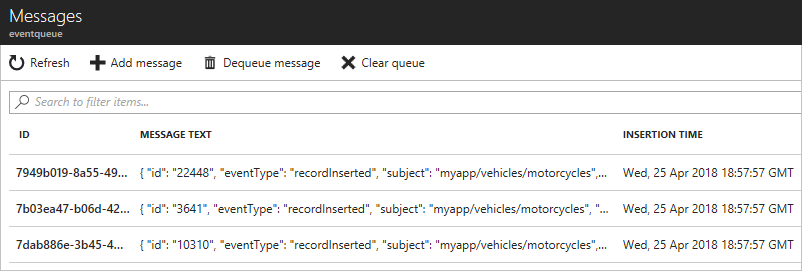

# <a name="quickstart-route-custom-events-to-azure-queue-storage-with-azure-cli-and-event-grid"></a>Краткое руководство. Перенаправление пользовательских событий в хранилище очередей Azure с помощью Azure CLI и службы "Сетка событий"

"Сетка событий Azure" — это служба обработки событий для облака. А хранилище очередей Azure — это один из поддерживаемых обработчиков событий. В этой статье описано, как с помощью Azure CLI создать пользовательский раздел, подписаться на него и активировать событие для просмотра результата. Вы также отправите события в хранилище очередей.

[!INCLUDE [quickstarts-free-trial-note.md](../../includes/quickstarts-free-trial-note.md)]

[!INCLUDE [cloud-shell-try-it.md](../../includes/cloud-shell-try-it.md)]

Если вы используете Azure CLI или Azure PowerShell на локальном компьютере вместо Cloud Shell на портале Azure, убедитесь, что у вас установлены следующие версии Azure CLI и Azure PowerShell: 

- Azure CLI 2.0.56 или более поздней версии. Инструкции по установке последней версии Azure CLI см. в [этой статье](/cli/azure/install-azure-cli). 
- Azure PowerShell 1.1.0 или более поздней версии. Скачайте последнюю версию Azure PowerShell на компьютер Windows со [страницы загрузок Azure — программы командной строки](https://azure.microsoft.com/downloads/). 

В этой статье приводятся команды для использования в Azure CLI. 

## <a name="create-a-resource-group"></a>Создание группы ресурсов

Темами событий сетки являются ресурсы Azure, которые необходимо поместить в группу ресурсов Azure. Группа ресурсов Azure — это логическая коллекция, в которой выполняется развертывание и администрирование ресурсов Azure.

Создайте группу ресурсов с помощью команды [az group create](/cli/azure/group#az-group-create). 

В следующем примере создается группа ресурсов с именем *gridResourceGroup* в расположении *westus2*.

```azurecli-interactive
az group create --name gridResourceGroup --location westus2
```

[!INCLUDE [event-grid-register-provider-cli.md](../../includes/event-grid-register-provider-cli.md)]

## <a name="create-a-custom-topic"></a>Создание пользовательской темы

Раздел сетки событий содержит определяемую пользователем конечную точку, в которой можно размещать свои события. В приведенном ниже примере создается пользовательский раздел в вашей группе ресурсов. Замените `<topic_name>` уникальным именем для вашего пользовательского раздела. Имя раздела сетки событий должно быть уникальным, так как оно представлено записью службы доменных имен (DNS).

```azurecli-interactive
az eventgrid topic create --name <topic_name> -l westus2 -g gridResourceGroup
```

## <a name="create-queue-storage"></a>Создание хранилища очередей

Перед подпиской на пользовательский раздел необходимо создать конечную точку для сообщения о событии. Хранилище очередей создается для сбора событий.

```azurecli-interactive
storagename="<unique-storage-name>"
queuename="eventqueue"

az storage account create -n $storagename -g gridResourceGroup -l westus2 --sku Standard_LRS
az storage queue create --name $queuename --account-name $storagename
```

## <a name="subscribe-to-a-custom-topic"></a>Создание подписки на события пользовательского раздела

Подпишитесь на пользовательский раздел, чтобы определить в Сетке событий, какие события вам необходимо отслеживать. В следующем примере создается подписка на созданный пользовательский раздел и передается идентификатор ресурса хранилища очередей для конечной точки. С помощью Azure CLI можно передать идентификатор хранилища очередей в качестве конечной точки. Конечная точка имеет следующий формат:

`/subscriptions/<subscription-id>/resourcegroups/<resource-group-name>/providers/Microsoft.Storage/storageAccounts/<storage-name>/queueservices/default/queues/<queue-name>`

Приведенный ниже скрипт получает идентификатор ресурса учетной записи хранения для очереди. Этот скрипт создает идентификатор для хранилища очередей и подписку на раздел сетки событий. В нем также задается тип `storagequeue` для конечной точки и используется ее идентификатор.

```azurecli-interactive
storageid=$(az storage account show --name $storagename --resource-group gridResourceGroup --query id --output tsv)
queueid="$storageid/queueservices/default/queues/$queuename"
topicid=$(az eventgrid topic show --name <topic_name> -g gridResourceGroup --query id --output tsv)

az eventgrid event-subscription create \
  --source-resource-id $topicid \
  --name <event_subscription_name> \
  --endpoint-type storagequeue \
  --endpoint $queueid \
  --expiration-date "<yyyy-mm-dd>"
```

Учетная запись, в который создается подписка на события, должна предоставлять доступ для записи в хранилище очередей. Обратите внимание, что задана [дата окончания срока действия](concepts.md#event-subscription-expiration) подписки.

При использовании REST API для создания подписки идентификатор учетной записи хранения и имя очереди передаются как отдельный параметр.

```json
"destination": {
  "endpointType": "storagequeue",
  "properties": {
    "queueName":"eventqueue",
    "resourceId": "/subscriptions/<subscription-id>/resourcegroups/<resource-group-name>/providers/Microsoft.Storage/storageAccounts/<storage-name>"
  }
  ...
```

## <a name="send-an-event-to-your-custom-topic"></a>Отправка события в пользовательский раздел

Давайте активируем событие, чтобы увидеть, как сообщение отправляется в конечную точку при помощи службы "Сетка событий". Сначала получите URL-адрес и ключ для пользовательского раздела. Снова используйте имя пользовательского раздела для `<topic_name>`.

```azurecli-interactive
endpoint=$(az eventgrid topic show --name <topic_name> -g gridResourceGroup --query "endpoint" --output tsv)
key=$(az eventgrid topic key list --name <topic_name> -g gridResourceGroup --query "key1" --output tsv)
```

Для простоты используйте пример данных события для отправки в пользовательский раздел. Как правило, приложение или служба Azure отправит данные события. CURL — это служебная программа, которая отправляет HTTP-запросы. В этой статье мы используем CURL для отправки события в пользовательский раздел.  В следующем примере в раздел сетки событий отправляется три события:

```azurecli-interactive
for i in 1 2 3
do
   event='[ {"id": "'"$RANDOM"'", "eventType": "recordInserted", "subject": "myapp/vehicles/motorcycles", "eventTime": "'`date +%Y-%m-%dT%H:%M:%S%z`'", "data":{ "make": "Ducati", "model": "Monster"},"dataVersion": "1.0"} ]'
   curl -X POST -H "aeg-sas-key: $key" -d "$event" $endpoint
done
```

Перейдите к хранилищу очередей на портале. Вы увидите, что служба "Сетка событий" отправила эти три события в очередь.




## <a name="clean-up-resources"></a>Очистка ресурсов
Если вы планируете продолжить работу с этим событием, не удаляйте ресурсы, созданные при работе с этой статьей. В противном случае удалите соответствующие ресурсы с помощью следующей команды.

```azurecli-interactive
az group delete --name gridResourceGroup
```

## <a name="next-steps"></a>Дальнейшие действия

Теперь, когда вы знаете, как создавать темы и подписки на события, ознакомьтесь с дополнительными сведениями о сетке событий, которые могут помочь вам:

- [An introduction to Azure Event Grid](overview.md) (Общие сведения о службе "Сетка событий Azure")
- [Перенаправление событий хранилища BLOB-объектов в пользовательскую конечную веб-точку (предварительная версия)](../storage/blobs/storage-blob-event-quickstart.md?toc=%2fazure%2fevent-grid%2ftoc.json)
- [Monitor virtual machine changes with Azure Event Grid and Logic Apps](monitor-virtual-machine-changes-event-grid-logic-app.md) (Отслеживание изменений виртуальной машины с помощью Azure Logic Apps и службы "Сетка событий Azure")
- [Потоковая передача больших данных в хранилище данных](event-grid-event-hubs-integration.md)
