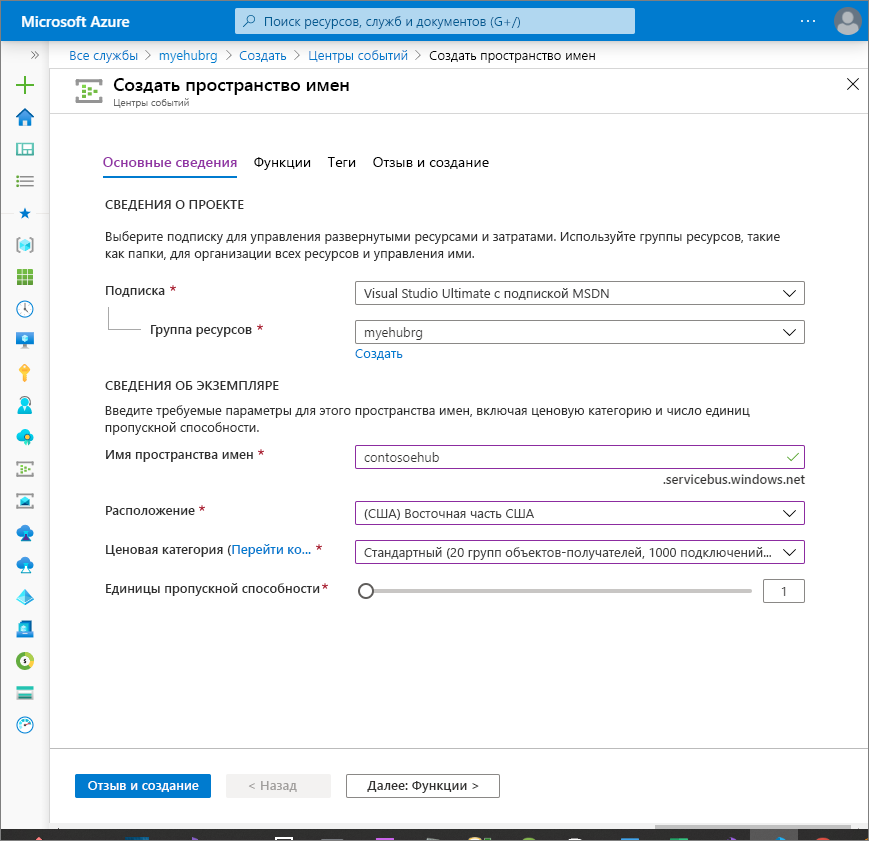
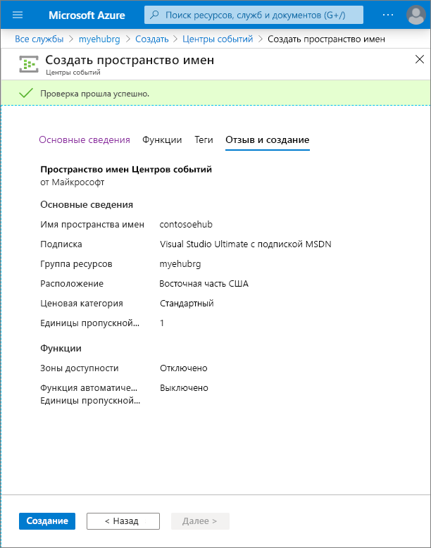
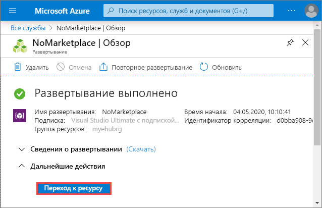
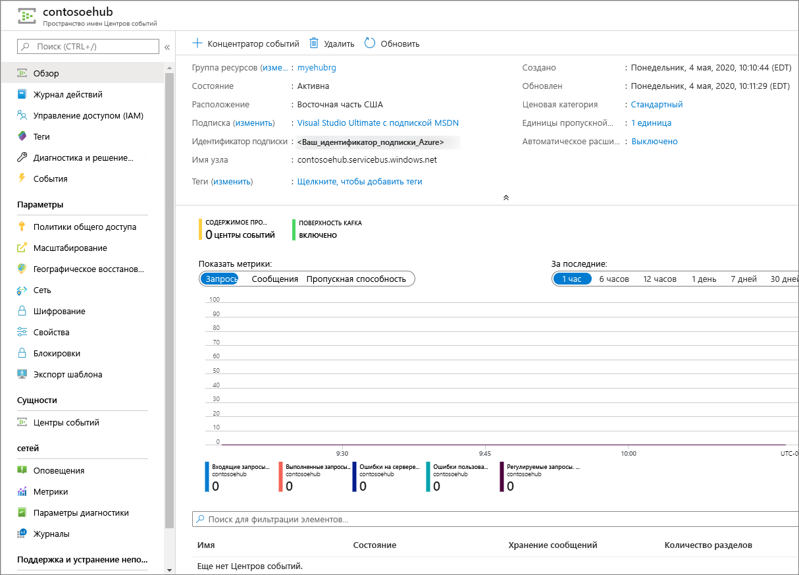

# Краткое руководство. Создание концентратора событий с помощью портала Azure
Центры событий Azure — это платформа потоковой передачи больших данных и служба приема событий, принимающая и обрабатывающая миллионы событий в секунду. Центры событий могут обрабатывать и сохранять события, данные и телеметрию, созданные распределенным программным обеспечением и устройствами. Данные, отправляемые в концентратор событий, можно преобразовывать и сохранять с помощью любого поставщика аналитики в реальном времени, а также с помощью адаптеров пакетной обработки или хранения. Подробный обзор Центров событий см. в статьях [Что такое Центры событий Azure?](event-hubs-about.md) и [Обзор функций Центров событий](event-hubs-features.md).

В этом кратком руководстве вы создадите концентратор событий на [портале Azure](https://portal.azure.com).

## Предварительные требования

В рамках этого краткого руководства вам потребуются:

- Подписка Azure. Если у вас еще нет подписки Azure, [создайте бесплатную учетную запись](https://azure.microsoft.com/free/), прежде чем начать работу.
- [Visual Studio 2019](https://www.visualstudio.com/vs) или более поздней версии.
- [Пакет SDK для .NET Standard](https://www.microsoft.com/net/download/windows) версии 2.0 или более новой.

## Создание группы ресурсов

Группа ресурсов — это логическая коллекция ресурсов Azure. Все ресурсы развертываются и управляются в группе ресурсов. Чтобы создать группу ресурсов:

1. Войдите на [портал Azure](https://portal.azure.com).
2. В области навигации слева щелкните **Группа ресурсов**. Нажмите кнопку **Добавить**.

   

2. В поле **Подписка** выберите имя подписки Azure, в которой необходимо создать группу ресурсов.
3. Введите уникальное **имя группы ресурсов**. Система мгновенно проверит, доступно ли имя в текущей выбранной подписке Azure.
4. Выберите **регион** для группы ресурсов.
5. Выберите **Review + Create** (Просмотреть и создать).

   
6. На странице **Отзыв и создание** выберите **Создать**. 

## Создание пространства имен в Центрах событий

Пространство имен Центров событий предоставляет уникальный контейнер, ограничивающий область действия. Вы можете обращаться к этому контейнеру по полному доменному имени и создавать в нем концентраторы событий. Чтобы создать пространство имен в группе ресурсов с использованием портала, выполните следующие действия:

1. На портале Azure щелкните **Создать ресурс** в левой верхней части экрана.
2. Выберите **Все службы** в меню слева и щелкните **звездочку (`*`)** рядом с пунктом **Центры событий** в категории **Аналитика**. Убедитесь, что **Центры событий** были добавлены в раздел **Избранное** в меню навигации слева. 
    
   
3. Выберите **Центры событий** в разделе **Избранное** в меню навигации слева и щелкните **Добавить** на панели инструментов.

   
4. На странице **Создание пространства имен** выполните следующие действия.
    1. Выберите **подписку**, в которой нужно создать пространство имен.
    2. Выберите **группу ресурсов**, созданную на предыдущем шаге. 
    3. Введите **имя** для пространства имен. Система немедленно проверяет, доступно ли оно.
    4. Выберите **расположение** для пространства имен.    
    5. Выберите **ценовую категорию** ("Базовый" или "Стандартный").  
    6. Не изменяйте параметр **единиц пропускной способности**. Дополнительные сведения о единицах пропускной способности см. в статье [Масштабируемость Центров событий](event-hubs-scalability.md#throughput-units).  
    5. В нижней части страницы выберите **Просмотреть и создать**.

       
   6. На странице **Просмотр и создание** проверьте параметры и нажмите кнопку **Создать**. Дождитесь завершения развертывания. 

       
   7. На странице **Развертывание** нажмите **Перейти к ресурсу**, чтобы открыть страницу пространства имен. 

      
   8. Убедитесь, что отображаемая страница **Пространство имен Центров событий** имеет похожий на следующий вид: 

              

       > [!NOTE]
       > Центры событий Azure предоставляют конечную точку Kafka. Эта конечная точка позволяет вашему пространству имен Центров событий распознавать протокол [Apache Kafka](https://kafka.apache.org/intro) и API в собственном коде. Эта возможность позволяет подключиться к концентраторам событий, как к темам Kafka, не изменяя клиентов протокола или запустив собственные кластеры. Центры событий поддерживают [Apache Kafka 1.0.](https://kafka.apache.org/10/documentation.html) и более поздние версии. Дополнительные сведения см. в статье [Использование Центров событий из приложений Apache Kafka](event-hubs-for-kafka-ecosystem-overview.md).
    
## Создание концентратора событий

Чтобы создать концентратор событий в пространстве имен, выполните следующие действия:

1. На странице "Пространство имен Центров событий" выберите **Центры событий** в меню слева.
1. Щелкните **+Концентратор событий** в верхней части окна.
   
    
1. Введите имя концентратора событий, а затем щелкните **Создать**.
   
    
4. Вы можете проверить состояние создания концентратора событий в оповещениях. После создания концентратора событий вы увидите его в соответствующем списке, как показано на следующем рисунке.

    

## Дальнейшие действия

В этой статье вы создали группу ресурсов, пространство имен Центров событий и концентратор событий. Пошаговые инструкции по отправке событий в концентратор и получении событий из него см. в следующих руководствах по **отправке и получению событий**: 

- [.NET Core](get-started-dotnet-standard-send-v2.md)
- [Java](get-started-java-send-v2.md)
- [Python](get-started-python-send-v2.md)
- [JavaScript](get-started-node-send-v2.md)
- [GO](event-hubs-go-get-started-send.md)
- [C (только отправка)](event-hubs-c-getstarted-send.md)
- [Apache Storm (только получение)](event-hubs-storm-getstarted-receive.md)

[Azure portal]: https://portal.azure.com/
[3]: ./media/event-hubs-quickstart-portal/sender1.png
[4]: ./media/event-hubs-quickstart-portal/receiver1.png
