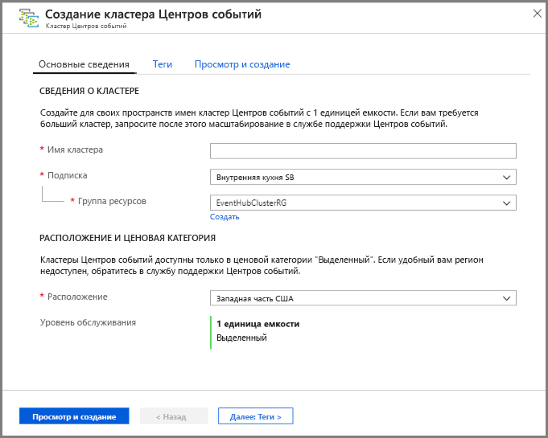
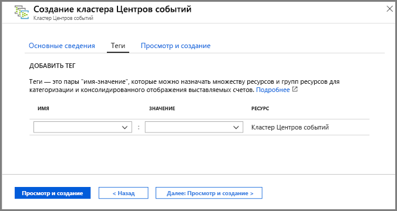
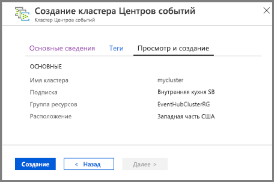
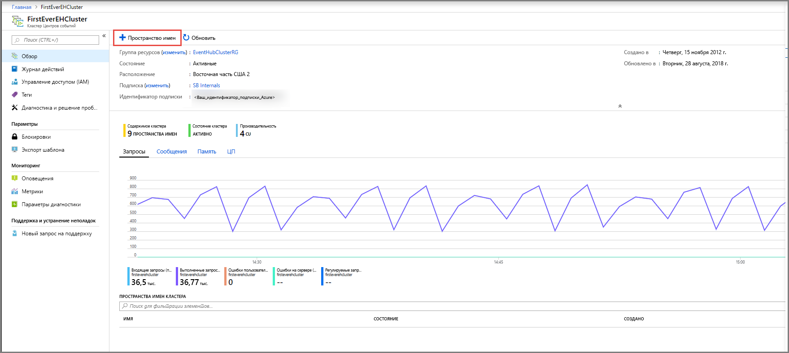
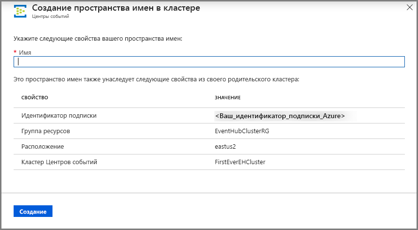
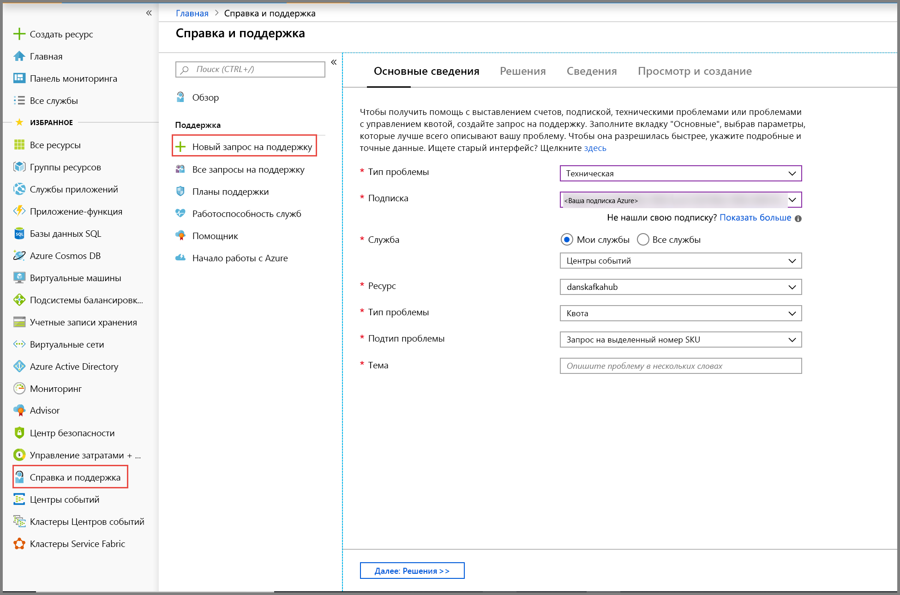
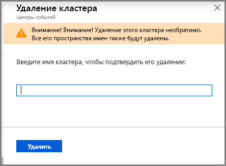

# Краткое руководство. Создание выделенного кластера Центров событий с помощью портала Azure 
Кластеры Центров событий предоставляют однотенантные развертывания для удовлетворения самых высоких требований к потоковой передаче. Для этого предложения предусмотрено Соглашение об уровне обслуживания на уровне 99,99 %, доступное только для ценовой категории "Выделенный". [Кластер Центров событий](event-hubs-dedicated-overview.md) может принимать миллионы событий в секунду с гарантированной емкостью и задержкой менее секунды. Пространства имен и концентраторы событий, созданные в кластере, используют все возможности предложения ценовой категории "Стандартный" и даже больше, но без ограничения объема входящих данных. Кроме того, ценовая категория "Выделенный" предоставляет популярную возможность ["Сбор" в Центрах событий](event-hubs-capture-overview.md) без дополнительных затрат, что позволит вам автоматически в пакетном резжиме обрабатывать и передавать потоки данных в [хранилище BLOB-объектов Azure](../storage/blobs/storage-blobs-introduction.md) или [Azure Data Lake Storage 1-го поколения](../data-lake-store/data-lake-store-overview.md).

Кластеры ценовой категории "Выделенный" подготавливаются и оплачиваются с учетом **единиц мощности**, которые представляют собой предварительно выделенный объем ресурсов ЦП и памяти. Вы можете приобрести 1, 2, 4, 8, 12, 16 или 20 единиц мощности для каждого кластера. В этом кратком руководстве мы рассмотрим создание кластера Центров событий с 1 единицей емкости (CU) на портале Azure.

> [!NOTE]
> Эта возможность самообслуживания сейчас доступна в предварительной версии на [портале Azure](https://aka.ms/eventhubsclusterquickstart). Если у вас есть вопросы по предложению ценовой категории "Выделенный", обратитесь к [группе разработчиков Центров событий](mailto:askeventhubs@microsoft.com).

## Предварительные требования
В рамках этого краткого руководства вам потребуются:

- Учетная запись Azure. Если у вас еще нет подписки Azure, [приобретите учетную запись](https://azure.microsoft.com/pricing/purchase-options/pay-as-you-go/), прежде чем начинать работу. Эта функция не поддерживается для бесплатной учетной записи Azure. 
- [Visual Studio 2017](https://visualstudio.microsoft.com/vs/) с обновлением 3 (версия 15.3, 26730.01) или более новая версия.
- [Пакет SDK для .NET Standard](https://dotnet.microsoft.com/download) версии 2.0 или более новой.
- [Созданная группа ресурсов](../event-hubs/event-hubs-create.md#create-a-resource-group).

## Создание кластера Центров событий ценовой категории "Выделенный"
Кластер Центров событий предоставляет уникальный контейнер, в котором можно создать одно или несколько пространств имен. На этапе предварительной версии портала самообслуживания вы можете создать в выбранных регионах кластер с одной единицей емкости. Если требуется кластер большего размера, можно отправить запрос на поддержку в Azure, чтобы увеличить масштаб кластера после его создания.

Чтобы создать кластер в группе ресурсов с помощью портала Azure, выполните следующие действия.

1. Перейдите по [этой ссылке](https://aka.ms/eventhubsclusterquickstart), чтобы создать кластер на портале Azure. Или же выберите **Все службы** в левой области навигации, затем введите в поле поиска "Кластеры Центров событий" и выберите "Кластеры Центров событий" из списка результатов.
2. На странице **Создание кластера** настройте следующие параметры.
    1. Введите **имя кластера**. Система немедленно проверяет, доступно ли оно.
    2. Выберите **подписку**, в которой нужно создать кластер.
    3. Выберите **группу ресурсов**, в которой нужно создать кластер.
    4. Выберите **расположение** для этого кластера. Если предпочтительный регион недоступен, в нем временно не хватает емкости, и вы можете отправить [запрос на поддержку](#submit-a-support-request) группе разработчиков Центров событий.
    5. Нажмите кнопку **Далее: теги** в нижней части страницы. Полная подготовка ресурсов для системы может занять несколько минут.

        
3. На странице **Теги** настройте следующие параметры.
    1. Введите **имя** и **значение** для тега, который нужно добавить. Этот шаг **не является обязательным**.  
    2. Нажмите кнопку **Просмотреть и создать**.

        
4. На странице **Просмотр и создание** проверьте значения и щелкните **Создать**. 

    

## Создание пространства имен и концентратора событий в кластере

1. Чтобы создать в кластере пространство имен, на странице **Кластер Центров событий** выберите **+ Пространство имен** в меню сверху.

    
2. На странице создания пространства имен выполните следующие действия:
    1. Введите **имя для пространства имен**.  Система проверит, доступно ли это имя.
    2. Пространство имен наследует следующие свойства:
        1. Идентификатор подписки
        2. Группа ресурсов
        3. Расположение
        4. Имя кластера,
    3. Выберите **Создать**, чтобы создать пространство имен. Теперь вы можете управлять кластером.  

        
3. Создав пространство имен, вы можете [создать концентратор событий](event-hubs-create.md#create-an-event-hub), как обычно в любом пространстве имен. 

## Отправить запрос на техническую поддержку.

Если вы хотите изменить размер кластера после создания или ваш предпочтительный регион недоступен, отправьте запрос на поддержку, сделав следующее.

1. На [портале Azure](https://portal.azure.com) выберите элемент **Справка и поддержка** в меню слева.
2. Выберите **+ Создать запрос в службу поддержки** в меню "Поддержка".
3. На странице поддержки выполните следующие действия:
    1. В раскрывающемся списке **Тип проблемы** выберите **Техническая**.
    2. В качестве **подписки** выберите свою подписку.
    3. В поле **Служба** выберите **Мои службы**, а затем **Концентраторы событий**.
    4. В поле **Ресурсы** выберите нужный кластер, если он уже существует, в противном случае выберите **Общий вопрос/недоступен ресурс**.
    5. В поле **Тип проблемы** выберите **Квота**.
    6. В раскрывающемся списке **Подтип проблемы** выберите одно из следующих значений:
        1. Выберите **Запросить SKU ценовой категории "Выделенный"** , чтобы включить поддержку этой функции в вашем регионе.
        2. Выберите **Запросить увеличение или уменьшение масштаба для кластера ценовой категории "Выделенный"** , чтобы масштабировать кластер. 
    7. В поле **Тема** опишите суть запроса.

        

 ## Удаление кластера ценовой категории "Выделенный"
 
1. Чтобы удалить кластер, выберите **Удалить** в меню сверху. Обратите внимание на то, что после создания кластера будет снята плата как минимум за 4 часа использования. 
2. Появится сообщение с запросом на подтверждение удаления кластера.
3. Введите **имя кластера** и выберите **Удалить**, чтобы удалить этот кластер.

    

## Дальнейшие действия
В этой статье описано, как создать кластер Центров событий. Пошаговые инструкции по отправке и получению событий через концентраторы событий и сбору событий в хранилище Azure или Azure Data Lake Store см. в следующих руководствах:

- Отправка и получение событий 
    - [.NET Core](event-hubs-dotnet-standard-getstarted-send.md)
    - [Java](event-hubs-java-get-started-send.md)
    - [Python](event-hubs-python-get-started-send.md)
    - [JavaScript](event-hubs-java-get-started-send.md)
- [Использование портала Azure для включения функции "Сбор" в Центрах событий](event-hubs-capture-enable-through-portal.md)
- [Use Azure Event Hubs for Apache Kafka](event-hubs-for-kafka-ecosystem-overview.md) (Использование Центров событий Azure для Apache Kafka)
