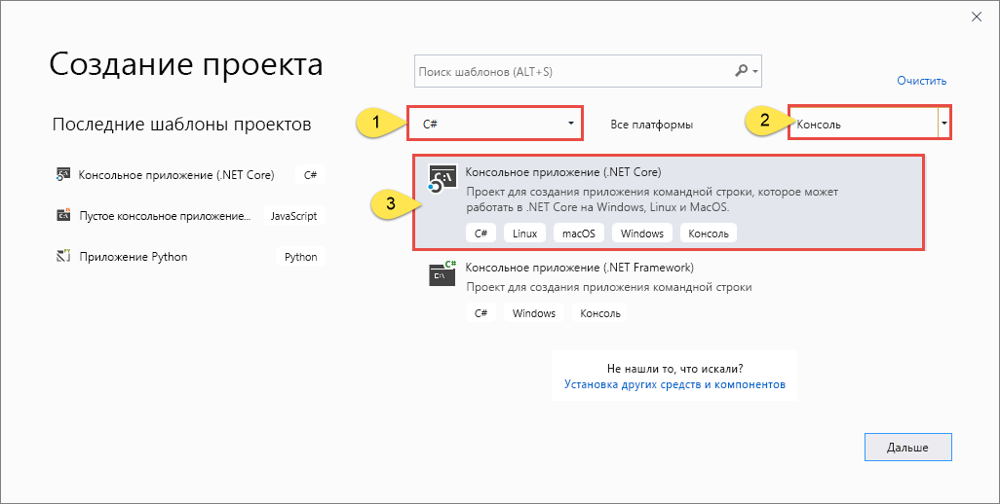
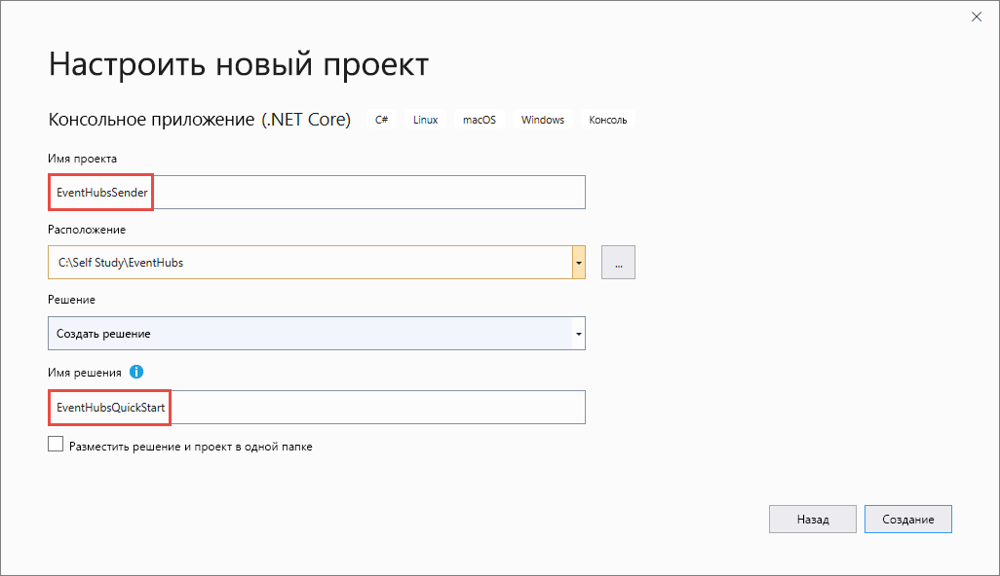

# <a name="send-events-to-and-receive-events-from-azure-event-hubs---net-azuremessagingeventhubs"></a>Отправка событий в Центры событий Azure и их получение оттуда — .NET (Azure.Messaging.EventHubs) 
В этом кратком руководстве показано, как отправлять события в концентратор событий и получать их из него с помощью библиотеки .NET **Azure.Messaging.EventHubs**. 

> [!IMPORTANT]
> В рамках этого краткого руководства применяется библиотека **Azure.Messaging.EventHubs**. Краткое руководство, в рамках которого используется старая библиотека **Microsoft.Azure.EventHubs**, можно найти в статье об [отправке и получении событий с помощью библиотеки Microsoft.Azure.EventHubs](event-hubs-dotnet-standard-get-started-send-legacy.md). 


## <a name="prerequisites"></a>Предварительные требования
Если вы впервые используете Центры событий Azure, ознакомьтесь с [общими сведениями](event-hubs-about.md), прежде чем приступить к работе с этим руководством. 

Для работы с данным руководством необходимо следующее:

- **Подписка Microsoft Azure.** Чтобы использовать службы Azure, в том числе Центры событий Azure, потребуется действующая подписка.  Если у вас еще нет учетной записи Azure, [зарегистрируйтесь для работы с бесплатной пробной версией](https://azure.microsoft.com/free/) или [активируйте преимущества для подписчиков MSDN при создании учетной записи](https://azure.microsoft.com).
- **Microsoft Visual Studio 2019**. Клиентская библиотека для Центров событий Azure использует новые возможности, реализованные в C# версии 8.0.  Вы по-прежнему можете использовать библиотеку с предыдущими версиями языка C#, но новый синтаксис будет недоступен. Чтобы использовать полный синтаксис, рекомендуется выполнить компиляцию с помощью [пакета SDK для .NET Core](https://dotnet.microsoft.com/download) 3.0 или более поздней версии и указать `latest` для [версии языка](/dotnet/csharp/language-reference/configure-language-version#override-a-default). Если вы используете Visual Studio, учитывайте, что версии до Visual Studio 2019 несовместимы со средствами, необходимыми для сборки проектов C# 8.0. Скачать Visual Studio 2019, в том числе бесплатный выпуск Community, можно [здесь](https://visualstudio.microsoft.com/vs/).
- **Создайте пространство имен Центров событий и концентратор событий**. Первым шагом является использование [портала Azure](https://portal.azure.com) для создания пространства имен типа Центров событий и получение учетных данных управления, необходимых приложению для взаимодействия с концентратором событий. Чтобы создать пространство имен и концентратор событий, выполните инструкции из [этой статьи](event-hubs-create.md). Получите **строку подключения для пространства имен Центров событий**, следуя инструкциям из статьи [Получение строки подключения на портале](event-hubs-get-connection-string.md#get-connection-string-from-the-portal). Строка подключения понадобится нам позже в рамках этого краткого руководства.

## <a name="send-events"></a>Отправка событий 
В этом разделе показано, как создать консольное приложение .NET Core, которое отправляет события в концентратор событий. 

### <a name="create-a-console-application"></a>Создание консольного приложение

1. Запустите Visual Studio 2019. 
1. Выберите **Создать новый проект**. 
1. В диалоговом окне **Создать проект** выполните следующие действия: Если это диалоговое окно не отображается, щелкните в меню пункт **Файл**, затем последовательно выберите **Новый** и **Проект**. 
    1. Выберите язык программирования **C#**.
    1. Для типа приложения выберите значение **Консоль**. 
    1. Затем выберите в списке результатов **Console App (.NET Core)** (Консольное приложение (.NET Core)). 
    1. Затем нажмите кнопку **Далее**. 

            
1. Введите имя проекта **EventHubsSender** и имя решения **EventHubsQuickStart**, затем щелкните **OK** для создания проекта. 

    

### <a name="add-the-event-hubs-nuget-package"></a>Добавление пакета NuGet для Центров событий

1. Выберите в меню элементы **Инструменты** > **Диспетчер пакетов NuGet** > **Консоль диспетчера пакетов**. 
1. Выполните следующую команду, чтобы установить пакет NuGet **Azure.Messaging.EventHubs**:

    ```cmd
    Install-Package Azure.Messaging.EventHubs
    ```


### <a name="write-code-to-send-messages-to-the-event-hub"></a>Написание кода для отправки сообщений в концентратор событий

1. Добавьте следующие операторы `using` в начало файла **Program.cs**.

    ```csharp
    using System;
    using System.Text;
    using System.Threading.Tasks;
    using Azure.Messaging.EventHubs;
    using Azure.Messaging.EventHubs.Producer;
    ```

2. Добавьте в класс `Program` константы для значений строки подключения к Центрам событий и имени концентратора событий. Замените заполнители в скобках соответствующими значениями, которые вы получили при создании концентратора событий. Убедитесь, что `{Event Hubs namespace connection string}` — это строка подключения на уровне пространства имен, а не концентратора событий. 

    ```csharp
    private const string connectionString = "<EVENT HUBS NAMESPACE - CONNECTION STRING>";
    private const string eventHubName = "<EVENT HUB NAME>";
    ```

3. Замените метод `Main` приведенным ниже методом `async Main`. Дополнительные сведения см. в комментариях к коду. 

    ```csharp
        static async Task Main()
        {
            // Create a producer client that you can use to send events to an event hub
            await using (var producerClient = new EventHubProducerClient(connectionString, eventHubName))
            {
                // Create a batch of events 
                using EventDataBatch eventBatch = await producerClient.CreateBatchAsync();

                // Add events to the batch. An event is a represented by a collection of bytes and metadata. 
                eventBatch.TryAdd(new EventData(Encoding.UTF8.GetBytes("First event")));
                eventBatch.TryAdd(new EventData(Encoding.UTF8.GetBytes("Second event")));
                eventBatch.TryAdd(new EventData(Encoding.UTF8.GetBytes("Third event")));

                // Use the producer client to send the batch of events to the event hub
                await producerClient.SendAsync(eventBatch);
                Console.WriteLine("A batch of 3 events has been published.");
            }
        }
    ```
5. Выполните сборку проекта и убедитесь, что она прошла без ошибок.
6. Выполните программу и дождитесь подтверждающего сообщения. 
7. Вы можете проверить получение сообщения концентратором событий на портале Azure. Переключитесь на представление **Сообщения** в разделе **Метрики**. Обновите страницу, чтобы обновить диаграмму. На отображение полученных сообщений может уйти несколько секунд. 

    [](./media/getstarted-dotnet-standard-send-v2/verify-messages-portal.png#lightbox)

    > [!NOTE]
    > Полный исходный код с более подробными комментариями можно найти в [этом файле в GitHub](https://github.com/Azure/azure-sdk-for-net/blob/master/sdk/eventhub/Azure.Messaging.EventHubs/samples/Sample04_PublishingEvents.md).

## <a name="receive-events"></a>Получение событий
В этом разделе показано, как создать консольное приложение .NET Core для получения сообщений из концентратора событий с помощью обработчика событий. Обработчик событий упрощает прием событий от концентраторов событий, позволяя управлять постоянными контрольными точками и принимать сообщения от этих концентраторов событий в параллельном режиме. Обработчик событий связывается с определенным концентратором событий и группой потребителей. Он получает события от нескольких платформ концентратора событий и передает их делегату обработчика для применения к ним предоставленного вами кода. 


> [!WARNING]
> Если запустить этот код в Azure Stack Hub, вы получите ошибки выполнения, если вы не укажете конкретную версию API службы хранилища. Это связано с тем, что пакет SDK для Центров событий использует последний доступный в Azure API службы хранилища Azure, который может быть недоступным на вашей платформе Azure Stack Hub. Azure Stack Hub может поддерживать версию пакета SDK для хранилища BLOB-объектов, отличающуюся от доступных в Azure. Если вы используете Хранилище BLOB-объектов Azure в качестве хранилища контрольных точек, проверьте [поддерживаемую версию API службы хранилища Azure для сборки Azure Stack Hub](/azure-stack/user/azure-stack-acs-differences?#api-version) и включите эту версию в код. 
>
> Например, если вы используете Azure Stack Hub версии 2005, последней доступной версией для службы хранилища будет 2019-02-02. По умолчанию клиентская библиотека пакета SDK для Центров событий использует последнюю доступную версию в Azure (2019-07-07 на момент выпуска пакета SDK). В таком случае кроме действий, описанных в этом разделе, вам нужно добавить код для указания API службы хранилища версии 2019-02-02. Пример нацеливания на определенную версию API службы хранилища см. [на сайте GitHub](https://github.com/Azure/azure-sdk-for-net/tree/master/sdk/eventhub/Azure.Messaging.EventHubs.Processor/samples/). 
 

### <a name="create-an-azure-storage-and-a-blob-container"></a>Создание службы хранилища Azure и контейнера больших двоичных объектов
В рамках этого краткого руководства вы настроите Службу хранилища Azure в качестве хранилища контрольных точек. Выполните указанные ниже действия, чтобы создать учетную запись хранения Azure. 

1. [Создайте учетную запись хранения Azure](../storage/common/storage-account-create.md?tabs=azure-portal)
2. [Создание контейнера больших двоичных объектов](../storage/blobs/storage-quickstart-blobs-portal.md#create-a-container)
3. [Получение строки подключения к учетной записи хранения](../storage/common/storage-configure-connection-string.md).

    Запишите имя контейнера и строку подключения. Их вы примените далее в коде получения данных. 


### <a name="create-a-project-for-the-receiver"></a>Создание проекта для получателя

1. В окне обозревателя решений щелкните правой кнопкой мыши решение **EventHubQuickStart**, выберите элемент **Добавить** и действие **Создать проект**. 
1. Выберите **Консольное приложение (.NET Core)**, а затем щелкните **Далее**. 
1. Введите строку **EventHubsReceiver** в качестве **имени проекта** и нажмите кнопку **Создать**. 

### <a name="add-the-event-hubs-nuget-package"></a>Добавление пакета NuGet для Центров событий

1. Выберите в меню элементы **Инструменты** > **Диспетчер пакетов NuGet** > **Консоль диспетчера пакетов**. 
1. Выполните следующую команду, чтобы установить пакет NuGet **Azure.Messaging.EventHubs**:

    ```cmd
    Install-Package Azure.Messaging.EventHubs
    ```
1. Выполните следующую команду, чтобы установить пакет NuGet **Azure.Messaging.EventHubs.Processor**:

    ```cmd
    Install-Package Azure.Messaging.EventHubs.Processor
    ```    

### <a name="update-the-main-method"></a>Обновление метода Main 

1. Добавьте следующие инструкции `using` в начало файла **Program.cs**.

    ```csharp
    using System;
    using System.Text;
    using System.Threading.Tasks;
    using Azure.Storage.Blobs;
    using Azure.Messaging.EventHubs;
    using Azure.Messaging.EventHubs.Consumer;
    using Azure.Messaging.EventHubs.Processor;
    ```
1. Добавьте в класс `Program` константы для значений строки подключения к Центрам событий и имени концентратора событий. Замените заполнители в скобках соответствующими значениями, которые вы получили при создании концентратора событий. Замените заполнители в скобках соответствующими значениями, которые вы получили при создании концентратора событий, и именем учетной записи хранения (основная учетная запись хранения в разделе ключей доступа). Убедитесь, что `{Event Hubs namespace connection string}` — это строка подключения на уровне пространства имен, а не концентратора событий.

    ```csharp
        private const string ehubNamespaceConnectionString = "<EVENT HUBS NAMESPACE - CONNECTION STRING>";
        private const string eventHubName = "<EVENT HUB NAME>";
        private const string blobStorageConnectionString = "<AZURE STORAGE CONNECTION STRING>";
        private const string blobContainerName = "<BLOB CONTAINER NAME>";
    ```
3. Замените метод `Main` приведенным ниже методом `async Main`. Дополнительные сведения см. в комментариях к коду. 

    ```csharp
        static async Task Main()
        {
            // Read from the default consumer group: $Default
            string consumerGroup = EventHubConsumerClient.DefaultConsumerGroupName;

            // Create a blob container client that the event processor will use 
            BlobContainerClient storageClient = new BlobContainerClient(blobStorageConnectionString, blobContainerName);

            // Create an event processor client to process events in the event hub
            EventProcessorClient processor = new EventProcessorClient(storageClient, consumerGroup, ehubNamespaceConnectionString, eventHubName);

            // Register handlers for processing events and handling errors
            processor.ProcessEventAsync += ProcessEventHandler;
            processor.ProcessErrorAsync += ProcessErrorHandler;

            // Start the processing
            await processor.StartProcessingAsync();

            // Wait for 10 seconds for the events to be processed
            await Task.Delay(TimeSpan.FromSeconds(10));

            // Stop the processing
            await processor.StopProcessingAsync();
        }    
    ```
1. Теперь добавьте в этот класс указанные ниже методы обработки событий и ошибок. 

    ```csharp
        static async Task ProcessEventHandler(ProcessEventArgs eventArgs)
        {
            // Write the body of the event to the console window
            Console.WriteLine("\tRecevied event: {0}", Encoding.UTF8.GetString(eventArgs.Data.Body.ToArray()));

            // Update checkpoint in the blob storage so that the app receives only new events the next time it's run
            await eventArgs.UpdateCheckpointAsync(eventArgs.CancellationToken);
        }

        static Task ProcessErrorHandler(ProcessErrorEventArgs eventArgs)
        {
            // Write details about the error to the console window
            Console.WriteLine($"\tPartition '{ eventArgs.PartitionId}': an unhandled exception was encountered. This was not expected to happen.");
            Console.WriteLine(eventArgs.Exception.Message);
            return Task.CompletedTask;
        }    
    ```
1. Выполните сборку проекта и убедитесь, что она прошла без ошибок.

    > [!NOTE]
    > Полный исходный код с более подробными комментариями приводится в [этом файле в GitHub](https://github.com/Azure/azure-sdk-for-net/blob/master/sdk/eventhub/Azure.Messaging.EventHubs.Processor/samples/Sample01_HelloWorld.md).
6. Запустите приложение получателя. 
1. Отобразится сообщение о том, что событие успешно получено. 

    

    Здесь отображаются те же три события, которые вы ранее отправили в концентратор событий, выполняя программу отправителя. 


## <a name="next-steps"></a>Дальнейшие действия
Ознакомьтесь с примерами в GitHub. 

- [Azure Event Hubs samples](https://github.com/Azure/azure-sdk-for-net/tree/master/sdk/eventhub/Azure.Messaging.EventHubs/samples) (Примеры Центров событий Azure)
- [Примеры обработчика событий в GitHub](https://github.com/Azure/azure-sdk-for-net/tree/master/sdk/eventhub/Azure.Messaging.EventHubs.Processor/samples)
- [Пример управления доступом на основе ролей в Azure (Azure RBAC)](https://github.com/Azure/azure-event-hubs/tree/master/samples/DotNet/Azure.Messaging.EventHubs/ManagedIdentityWebApp)
