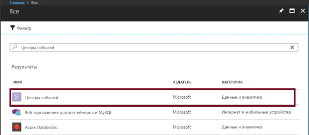
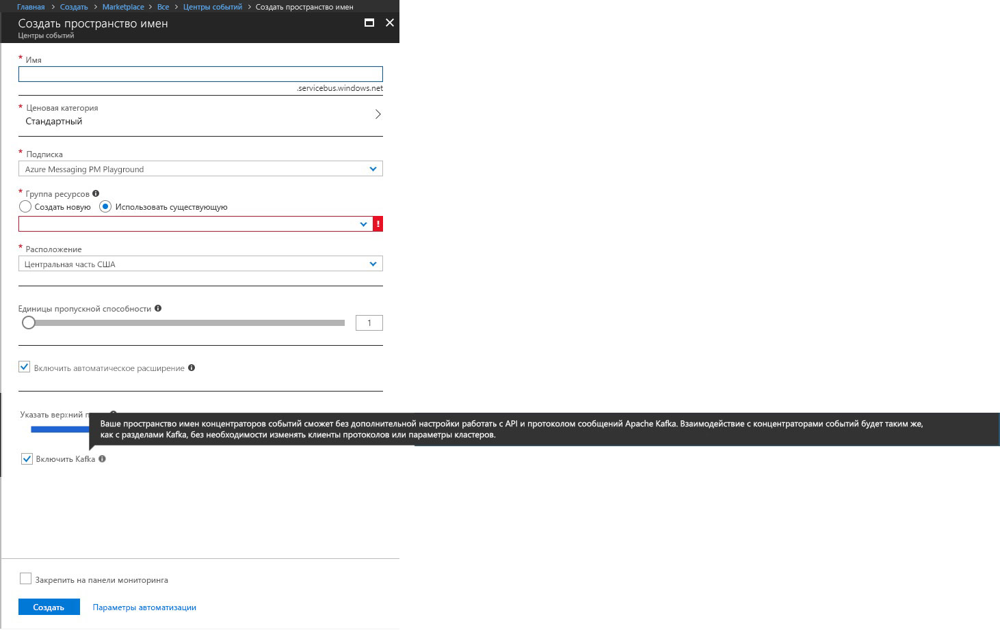
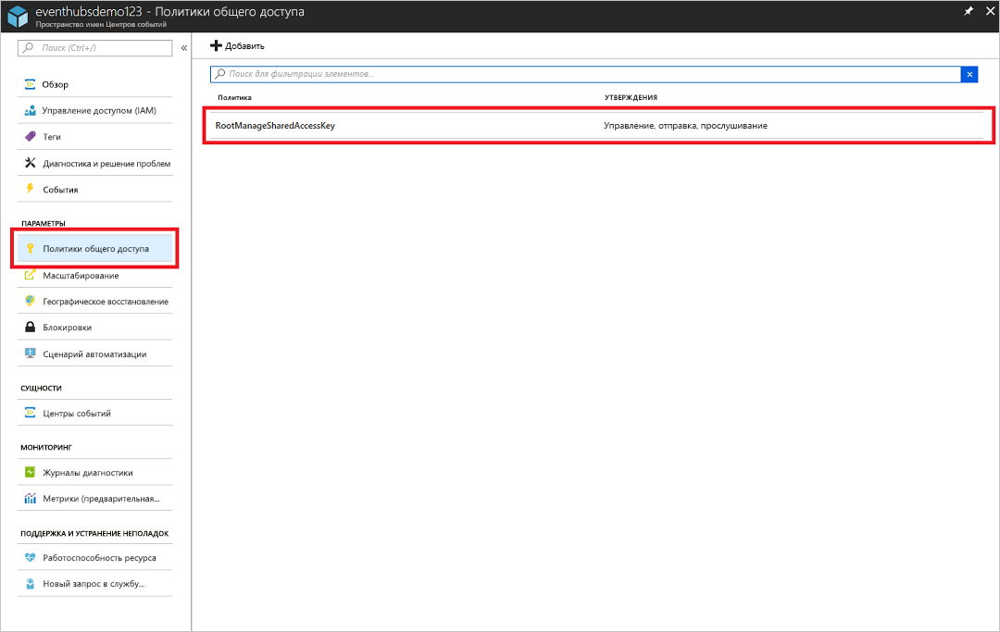
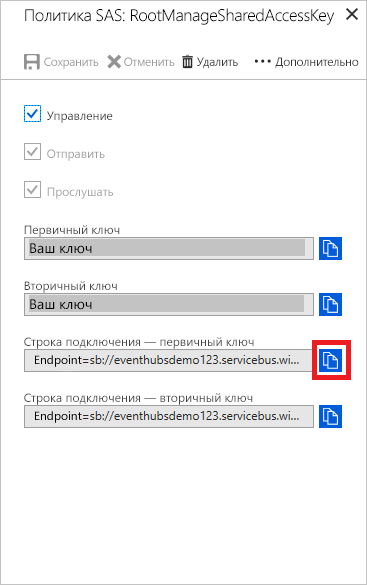

# <a name="quickstart-data-streaming-with-event-hubs-using-the-kafka-protocol"></a>Краткое руководство. Потоковая передача данных с помощью Центров событий Azure и протокола Kafka
В этом кратком руководстве показано, как выполнять потоковую передачу данных в Центры событий с поддержкой Kafka без необходимости менять клиенты протоколов или запускать собственные кластеры. Вы узнаете, как обеспечить взаимодействие отправителей и объектов-получателей с Центрами событий с поддержкой Kafka, изменив конфигурацию в приложениях. Центры событий Azure поддерживают [Apache Kafka 1.0.](https://kafka.apache.org/10/documentation.html)

> [!NOTE]
> Этот пример можно найти на сайте [GitHub](https://github.com/Azure/azure-event-hubs-for-kafka/tree/master/quickstart/java).

## <a name="prerequisites"></a>Предварительные требования

Ниже указаны требования для работы с этим кратким руководством.

* Прочтите статью [Центры событий Azure для Apache Kafka](event-hubs-for-kafka-ecosystem-overview.md).
* Подписка Azure. Если у вас еще нет подписки Azure, создайте [бесплатную учетную запись](https://azure.microsoft.com/free/?ref=microsoft.com&utm_source=microsoft.com&utm_medium=docs&utm_campaign=visualstudio), прежде чем начать работу.
* [Комплект разработчика Java (JDK) 1.7+](https://aka.ms/azure-jdks).
* [Скачайте](https://maven.apache.org/download.cgi) и [установите](https://maven.apache.org/install.html) двоичный архив Maven.
* [Git](https://www.git-scm.com/)
* [Пространство имен Центров событий с поддержкой Kafka](event-hubs-create.md).

## <a name="create-a-kafka-enabled-event-hubs-namespace"></a>Создание пространства имен Центров событий с поддержкой Kafka

1. Войдите на [портал Azure](https://portal.azure.com) и щелкните **Создать ресурс** в левой верхней части экрана.

2. Найдите Центры событий и выберите отображаемые параметры:
    
    
 
3. Укажите уникальное имя и включите Kafka в пространстве имен. Нажмите кнопку **Создать**. Примечание. Центры событий для Kafka поддерживаются только Центрами событий ценовых категорий "Стандартный"и "Выделенный". Центр событий цен. категории "Базовый" будет возвращать ошибку авторизации раздела в ответ на любые операции Kafka.
    
    
 
4. Создав пространство имен, на вкладке **Параметры** щелкните **Политики общего доступа** для получения строки подключения.

    

5. Вы можете выбрать значение по умолчанию **RootManageSharedAccessKey** или добавить новую политику. Щелкните имя политики и скопируйте строку подключения. 
    
    
 
6. Добавьте эту строку подключения в конфигурацию приложения Kafka.

Теперь можно выполнять потоковую передачу событий из приложений, использующих протокол Kafka, в Центры событий.

## <a name="send-and-receive-messages-with-kafka-in-event-hubs"></a>Отправка и получение сообщений с использованием Kafka в Центрах событий

1. Клонируйте [репозиторий Центров событий Azure для Kafka](https://github.com/Azure/azure-event-hubs-for-kafka).

2. Перейдите на страницу `azure-event-hubs-for-kafka/quickstart/java/producer`.

3. Обновите сведения о конфигурации для отправителя в файле по адресу `src/main/resources/producer.config` следующим образом:

    ```xml
    bootstrap.servers={YOUR.EVENTHUBS.FQDN}:9093
    security.protocol=SASL_SSL
    sasl.mechanism=PLAIN
    sasl.jaas.config=org.apache.kafka.common.security.plain.PlainLoginModule required username="$ConnectionString" password="{YOUR.EVENTHUBS.CONNECTION.STRING}";
    ```
    
4. Выполните код отправителя и потоковую передачу данных в Центры событий с поддержкой Kafka.
   
    ```shell
    mvn clean package
    mvn exec:java -Dexec.mainClass="TestProducer"                                    
    ```
    
5. Перейдите на страницу `azure-event-hubs-for-kafka/quickstart/java/consumer`.

6. Обновите для объекта-получателя сведения о конфигурации в файле по адресу `src/main/resources/consumer.config` следующим образом.
   
    ```xml
    bootstrap.servers={YOUR.EVENTHUBS.FQDN}:9093
    security.protocol=SASL_SSL
    sasl.mechanism=PLAIN
    sasl.jaas.config=org.apache.kafka.common.security.plain.PlainLoginModule required username="$ConnectionString" password="{YOUR.EVENTHUBS.CONNECTION.STRING}";
    ```

7. Используя клиенты Kafka, запустите код объекта-получателя и обработку из включенных Центров событий с поддержкой Kafka.

    ```java
    mvn clean package
    mvn exec:java -Dexec.mainClass="TestConsumer"                                    
    ```

Если у кластера Центров событий с поддержкой Kafka появятся события, можно начать получать их от объекта-получателя.

## <a name="next-steps"></a>Дополнительная информация
В этой статье вы узнаете, как выполнять потоковую передачу данных в Центры событий с поддержкой Kafka без необходимости менять клиенты протоколов или запускать собственные кластеры. Для получения дополнительных сведений перейдите к следующему руководству:

* [Сведения о Центрах событий](event-hubs-what-is-event-hubs.md)
* [Azure Event Hubs for Apache Kafka (preview)](event-hubs-for-kafka-ecosystem-overview.md) (Центры событий Azure для Apache Kafka (предварительный просмотр))
* [Дополнительные примеры для службы "Центры событий" для Kafka на сайте GitHub](https://github.com/Azure/azure-event-hubs-for-kafka)
* Используйте [MirrorMaker](https://cwiki.apache.org/confluence/pages/viewpage.action?pageId=27846330) для [потоковой передачи событий из локальной системы Kafka к Центрам событий с поддержкой Kafka в облаке](event-hubs-kafka-mirror-maker-tutorial.md).
* Дополнительные сведения о потоковой передаче во включенные Центры событий с поддержкой Kafka с помощью [Apache Flink ](event-hubs-kafka-flink-tutorial.md) или [Akka Streams](event-hubs-kafka-akka-streams-tutorial.md).
