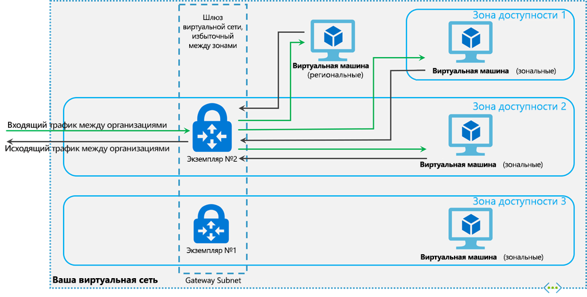

# <a name="about-expressroute-virtual-network-gateways"></a>О виртуальном сетевых шлюзах ExpressRoute

Чтобы подключить виртуальную сеть Azure и локальную сеть через ExpressRoute, сначала необходимо создать виртуальный сетевой шлюз. Виртуальный сетевой шлюз служит двум целям: обмен IP-маршрутов между сетями и трафик сети маршрутов. В этой статье разъясняются типы шлюзов, шлюзов SKUS и оценочная производительность SKU. В этой статье также объясняется ExpressRoute [FastPath](#fastpath), функция, которая позволяет сетевому трафику из вашей сети, чтобы обойти виртуальный шлюз сети для повышения производительности.

## <a name="gateway-types"></a>Типы шлюзов

При создании шлюза виртуальной сети нужно указать несколько параметров. Один из обязательных параметров (-GatewayType) указывает, будет ли шлюз использоваться для трафика ExpressRoute или VPN. Существуют два типа шлюзов:

* **VPN.** Сетевой трафик направляется в зашифрованном виде через общедоступный Интернет (при использовании типа шлюза VPN). Он также называется VPN-шлюзом. При подключениях типа "сеть — сеть", "точка — сеть" и "виртуальная сеть — виртуальная сеть" используется VPN-шлюз.

* **ExpressRoute.** Сетевой трафик направляется через частное подключение (при использовании типа шлюза ExpressRoute). Он также называется шлюзом ExpressRoute. Этот тип шлюза используется для настройки ExpressRoute.

В виртуальной сети каждому типу шлюза может соответствовать только один шлюз виртуальной сети. Например, у вас может быть только один шлюз виртуальной сети типа VPN и только один типа ExpressRoute.

## <a name="gateway-skus"></a><a name="gwsku"></a>SKU шлюза
[!INCLUDE [expressroute-gwsku-include](../../includes/expressroute-gwsku-include.md)]

Если вы хотите обновить свой шлюз до более мощного шлюза SKU, в большинстве случаев вы можете использовать 'Resize-AzVirtualNetworkGateway' PowerShell cmdlet. Это подойдет для обновлений до SKU Standard и HighPerformance. Однако для обновления до SKU UltraPerformance шлюз необходимо создать заново. Повторное создание шлюза вызовет простой.

### <a name="estimated-performances-by-gateway-sku"></a><a name="aggthroughput"></a>Приблизительная производительность в зависимости от номера SKU шлюза
В таблице ниже приведены типы шлюзов с приблизительной производительностью. Эта таблица относится к классической модели развертывания и модели диспетчера ресурсов.

[!INCLUDE [expressroute-table-aggthroughput](../../includes/expressroute-table-aggtput-include.md)]

> [!IMPORTANT]
> Производительность приложения зависит от нескольких факторов, таких как сквозная задержка и количество потоков трафика, которые открывает приложение. Числа в таблице представляют собой верхний предел, которого приложение может теоретически достичь в идеальных условиях.
>
>

## <a name="gateway-subnet"></a><a name="gwsub"></a>Подсеть шлюза

Перед созданием шлюза ExpressRoute необходимо создать подсеть шлюза. Подсеть шлюза содержит IP-адреса, которые используют виртуальные машины и службы шлюза виртуальной сети. При создании виртуального сетевого шлюза в подсеть шлюза развертываются и настраиваются с требуемыми настройками шлюза ExpressRoute. Никогда не развертывайте ничего другого (например, дополнительные ввожги) в подсеть шлюза. Чтобы подсеть шлюза работала правильно, ее нужно назвать GatewaySubnet. Такое имя позволяет Azure определить, что это подсеть для развертывания виртуальных машин и служб шлюза виртуальной сети.

>[!NOTE]
>[!INCLUDE [vpn-gateway-gwudr-warning.md](../../includes/vpn-gateway-gwudr-warning.md)]
>

При создании подсети шлюза указывается количество IP-адресов, которое содержит подсеть. IP-адреса в подсети шлюза выделяются виртуальным машинам и службам шлюза. Некоторым конфигурациям требуется больше IP-адресов, чем прочим. 

При планировании размера подсети шлюза обратитесь к документации для конфигурации, которую планируется создать. Например, сосуществовающая конфигурация ExpressRoute/VPN Gateway требует более крупной подсети шлюза, чем большинство других конфигураций. Кроме того, необходимо убедиться, что подсеть шлюза содержит достаточно IP-адресов для дополнительных конфигураций, которые могут быть добавлены в будущем. Хотя вы можете создать подсеть шлюза размером с /29, мы рекомендуем создать подсеть шлюза /27 или больше (/27, /26 и т.д.), если у вас есть доступное адресное пространство для этого. Это будет учитывать большинство конфигураций.

В примере PowerShell для Resource Manager ниже показана подсеть шлюза GatewaySubnet. Здесь приведена нотация CIDR, указывающая размер /27, при котором можно использовать достаточно IP-адресов для большинства существующих конфигураций.

```azurepowershell-interactive
Add-AzVirtualNetworkSubnetConfig -Name 'GatewaySubnet' -AddressPrefix 10.0.3.0/27
```

[!INCLUDE [vpn-gateway-no-nsg](../../includes/vpn-gateway-no-nsg-include.md)]

### <a name="zone-redundant-gateway-skus"></a><a name="zrgw"></a>Номера SKU избыточного между зонами шлюза

Вы также можете развернуть шлюзы ExpressRoute в компоненте "Зоны доступности Azure". При этом происходит физическое и логическое разделение шлюзов в разные зоны доступности с защитой локального сетевого подключения к Azure от сбоев на уровне зоны.



Избыточные между зонами шлюзы используют определенные новые номера SKU шлюза ExpressRoute.

* ErGw1AZ
* ErGw2AZ
* ErGw3AZ

Новые номера SKU шлюза также поддерживают другие варианты развертывания в соответствии с вашими потребностями. При создании шлюза виртуальной сети с использованием новых номеров SKU вы также можете развернуть шлюз в определенной зоне. Такой шлюз называется зональным. При развертывании зонального шлюза все его экземпляры развертываются в одной зоне доступности.

## <a name="fastpath"></a><a name="fastpath"></a>FastPath

Виртуальный сетевой шлюз ExpressRoute предназначен для обмена сетевыми маршрутами и маршрутного сетевого трафика. FastPath предназначен для повышения производительности пути передачи данных между вашей предварительной сетью и виртуальной сетью. При включении FastPath отправляет сетевой трафик непосредственно на виртуальные машины в виртуальной сети, минуя шлюз.

Для получения дополнительной информации о FastPath, [About FastPath](about-fastpath.md)включая ограничения и требования, см.

## <a name="rest-apis-and-powershell-cmdlets"></a><a name="resources"></a>Интерфейсы REST API и командлеты PowerShell
Дополнительные технические материалы и специальные требования к синтаксису, действующие при использовании интерфейсов REST API и командлетов PowerShell для настройки конфигураций шлюзов виртуальных сетей, доступны по приведенным ниже ссылкам.

| **Классический** | **Менеджер ресурсов** |
| --- | --- |
| [PowerShell](https://docs.microsoft.com/powershell/module/servicemanagement/azure/?view=azuresmps-4.0.0#azure) |[PowerShell](https://docs.microsoft.com/powershell/module/az.network#networking) |
| [REST API](https://msdn.microsoft.com/library/jj154113.aspx) |[REST API](https://msdn.microsoft.com/library/mt163859.aspx) |

## <a name="next-steps"></a>Дальнейшие действия

Для получения дополнительной информации об [ExpressRoute Overview](expressroute-introduction.md)доступных конфигурациях соединения см.

Для получения дополнительной информации о создании шлюзов ExpressRoute [см.](expressroute-howto-add-gateway-resource-manager.md)

Для получения дополнительной информации о настройке резервных шлюзов, избыточных в зоне, [см.](../../articles/vpn-gateway/create-zone-redundant-vnet-gateway.md)

Для получения дополнительной информации о FastPath, [см.](about-fastpath.md)