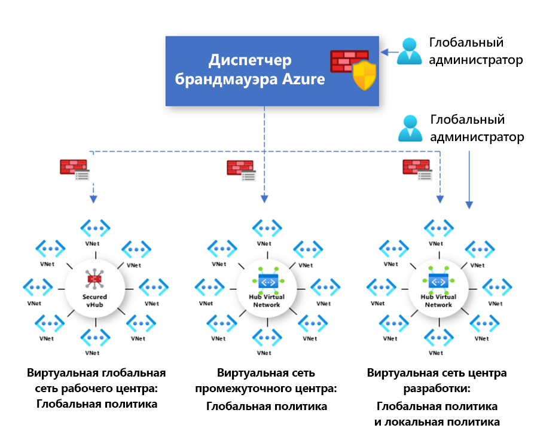

# Общие сведения о политиках предварительной версии Диспетчера брандмауэра Azure

[!INCLUDE [Preview](../../includes/firewall-manager-preview-notice.md)]

Политика брандмауэра — это ресурс Azure, который содержит коллекции правил преобразования сетевых адресов (NAT), сети и приложений, а также параметры Threat Intelligence. Это глобальный ресурс для множества экземпляров Брандмауэра Azure на защищенных виртуальных концентраторах и в центральных виртуальных сетях. Политики работают в разных регионах и подписках.

## Создание и связь политики

Создавать политику и управлять ею можно разными способами, в том числе с помощью портала Azure, REST API, шаблонов, Azure PowerShell и CLI.

Можно также перенести существующие правила из брандмауэра Azure с помощью портала или Azure PowerShell для создания политик. Дополнительные сведения см. в статье [Migrate Azure Firewall configurations to Azure Firewall policy (preview) using Powershell](migrate-to-policy.md) (Перенос конфигураций Брандмауэра Azure в политику Брандмауэра Azure (предварительная версия)). 

Политики могут быть связаны с одним или несколькими виртуальными концентраторами или виртуальными сетями. Брандмауэр может находиться в любой подписке, связанной с вашей учетной записью, и в любом регионе.

## Иерархические политики

Новые политики могут быть созданы с нуля или унаследованы от существующих. Наследование позволяет DevOps создавать локальные политики брандмауэра поверх обязательных базовых политик организации.

Политики, созданные с помощью непустых родительских политик, наследуют все коллекции правил родительской политики. Коллекции правил сети, унаследованные от родительской политики, всегда приоритетнее, чем коллекции правил сети, определенные в рамках новой политики. Такая же логика применяется к коллекциям правил приложений. Однако коллекции правил сети всегда обрабатываются до коллекций правил приложений независимо от наследования.

Режим аналитики угроз также наследуется от родительской политики. Можно задать другое значение для режима аналитики угроз, чтобы переопределить это поведение, но отключить его нельзя. Для переопределения следует использовать только более строгое значение. Например, если задана родительская политика **Только оповещение**, ее можно переопределить политикой **Предупреждение и отклонение**.

Коллекции правил NAT не наследуются, так как они относятся к конкретному брандмауэру.

При наследовании любые изменения родительской политики автоматически применяются к связанным дочерним политикам брандмауэра.

## Традиционные правила и политики

Брандмауэр Azure поддерживает как традиционные правила, так и политики. В следующей таблице приводится сравнительная характеристика политик и правил.

|         |Политика  |Правила  |
|---------|---------|---------|
|Содержит     |NAT, сеть, правила приложений и параметры аналитики угроз|NAT, сеть и правила приложений |
|Защищает     |Виртуальные концентраторы и виртуальные сети|Только виртуальные сети|
|Взаимодействие с порталом     |Централизованное управление через Диспетчер брандмауэра.|Интерфейс автономного брандмауэра|
|Поддержка нескольких брандмауэров     |Политика брандмауэра — это отдельный ресурс, который можно использовать в брандмауэрах.|Ручной экспорт и импорт правил или использование сторонних решений для управления |
|Цены     |Счета выставляются на основе связи брандмауэра. Дополнительные сведения см. в разделе [Цены](#pricing).|Free|
|Поддерживаемый режим развертывания     |Портал, REST API, шаблоны, Azure PowerShell и CLI.|Портал, REST API, шаблоны, PowerShell и CLI. |
|Состояние выпуска     |Общедоступная предварительная версия|Общедоступная версия|

## Цены

Счета за политики выставляются на основе связей брандмауэра. Плата за политику с нулевой или одной связью брандмауэра не взимается. Счета за политику с несколькими связями брандмауэра выставляются по фиксированной ставке. Дополнительные сведения см. на странице [Цены на Диспетчер брандмауэра Azure](https://azure.microsoft.com/pricing/details/firewall-manager/).

## Дальнейшие действия

Дополнительные сведения о развертывании Брандмауэра Azure см. в статье [Tutorial: Secure your cloud network with Azure Firewall Manager Preview using the Azure portal](secure-cloud-network.md) (Учебник по защите облачной сети с помощью предварительной версии Диспетчера брандмауэра Azure на портале Azure)
