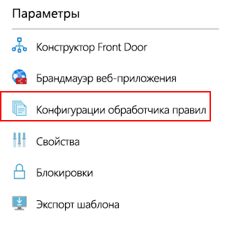
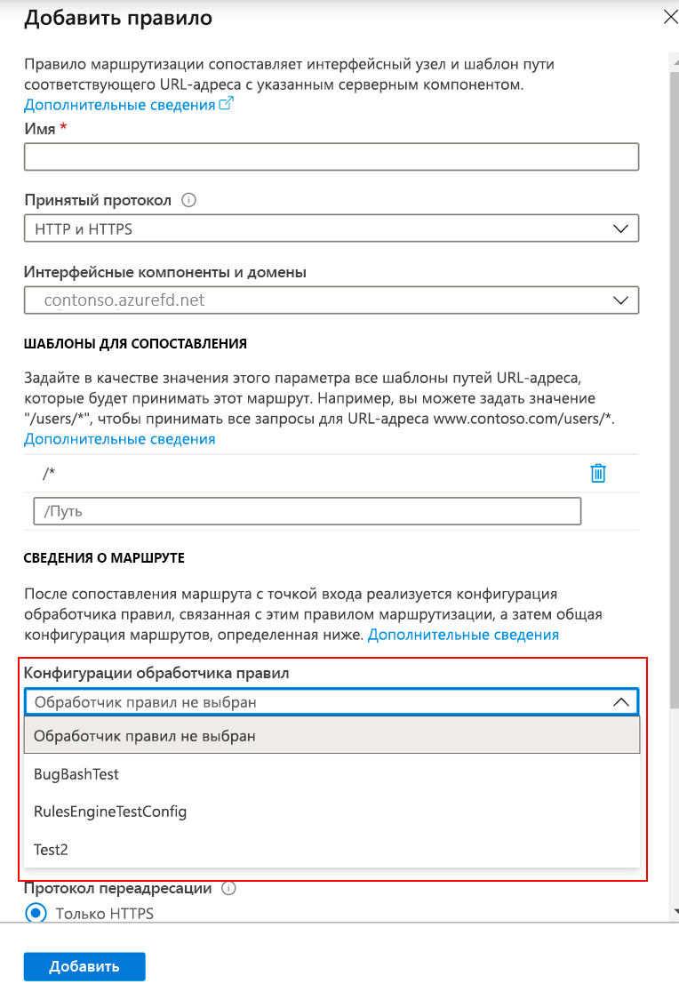

# <a name="configure-your-rules-engine"></a>Настройка обработчика правил

В этой статье описано, как создать конфигурацию обработчика правил и первое правило на портале Azure и в интерфейсе командной строки (CLI). 

## <a name="configure-rules-engine-in-azure-portal"></a>Настройка обработчика правил на портале Azure
1. Перед созданием конфигурации обработчика правил [создайте профиль Front Door](quickstart-create-front-door.md).

2. Во Front Door перейдите в раздел **Параметры** и выберите **Rule Engine configuration** (Конфигурация обработчика правил). Щелкните **Добавить**, присвойте имя конфигурации и приступите к созданию первой конфигурации обработчика правил.

    

3. Щелкните **Добавить правило**, чтобы создать первое правило. Затем определите правило, щелкнув **Добавить условие** или **Добавить действие**.
    
    > [!NOTE]
    >- Чтобы удалить условие или действие из правила, используйте корзину в правой части определенного условия или действия.
    > - Чтобы создать правило, которое применяется ко всему входящему трафику, не указывайте никаких условий.
    > - Чтобы отключить обработку правил после выполнения первого условия соответствия, установите флажок **Stop evaluating remaining rule** (Остановить анализ оставшихся правил). Если флажок установлен и для какого-то правила выполнены все условия соответствия, то остальные правила в конфигурации выполняться не будут.  

     

4. Определите приоритет правил в конфигурации с помощью кнопок "Вверх", "Вниз" и "На самый верх". Приоритет устанавливается в порядке создания, то есть правило, указанное первым, является самым важным.

5. После создания одного или нескольких правил нажмите кнопку **Сохранить**. В результате будет создана конфигурация обработчика правил.

6. После создания одной или нескольких конфигураций свяжите конфигурацию обработчика правил с правилом маршрутизации. Хотя к нескольким правилам маршрутизации можно применить одну конфигурацию, правило маршрутизации может содержать только одну конфигурацию обработчика правил. Чтобы создать взаимосвязь, выберите **Front Door designer** (Конструктор Front Door) > **Route rules** (Правила маршрутизации). Выберите правило маршрутизации, к которому нужно добавить конфигурацию обработчика правил, выберите **Route details** (Сведения о маршрутизации) > **Rules engine configuration** (Конфигурация обработчика правил) и конфигурацию, которую нужно связать.

    


## <a name="configure-rules-engine-in-azure-cli"></a>Настройка обработчика правил в Azure CLI

1. Установите [Azure CLI](https://docs.microsoft.com/cli/azure/install-azure-cli?view=azure-cli-latest), если это еще не сделано. Добавьте расширение "front-door":- az extension add --name front-door. Затем войдите в подписку az account set — <имя_или_ид> подписки.

2. Начните с создания обработчика правил. В этом примере показано одно правило с одним действием на основе заголовка и одно условие соответствия. 

```azurecli-interactive
az network front-door rules-engine rule create -f {front_door} -g {resource_group} --rules-engine-name {rules_engine} --name {rule1} --priority 1 --action-type RequestHeader --header-action Overwrite --header-name Rewrite --header-value True --match-variable RequestFilenameExtension --operator Contains --match-values jpg png --transforms Lowercase
```

3. Перечисление всех правил. 

```azurecli-interactive
az network front-door rules-engine rule list -f {front_door} -g {rg} --name {rules_engine}
```

4. Добавление перенаправляемого действия переопределения маршрутизации. 

```azurecli-interactive
az network front-door rules-engine rule action add -f {front_door} -g {rg} --rules-engine-name {rules_engine} --name {rule1} --action-type ForwardRouteOverride --backend-pool {backend_pool_name} --caching Disabled
```

5. Перечисление всех действий в правиле. 

```azurecli-interactive
az network front-door rules-engine rule action list -f {front_door} -g {rg} -r {rules_engine} --name {rule1}
```

6. Связывание конфигурации обработчика правил с правилом маршрутизации.  

```azurecli-interactive
az network front-door routing-rule update -g {rg} -f {front_door} -n {routing_rule_name} --rules-engine {rules_engine}
```

7. Отмена связи с обработчиком правил. 

```azurecli-interactive
az network front-door routing-rule update -g {rg} -f {front_door} -n {routing_rule_name} --remove rulesEngine # case sensitive word ‘rulesEngine’
```

Полный список команд обработчика правил AFD можно найти [здесь](https://docs.microsoft.com/cli/azure/ext/front-door/network/front-door/rules-engine?view=azure-cli-latest).   

## <a name="next-steps"></a>Дальнейшие действия

- Дополнительные сведения об [обработчике правил AFD](front-door-rules-engine.md). 
- Дополнительные сведения о [создании Front Door](quickstart-create-front-door.md).
- Дополнительные сведения о том, [как работает Front Door](front-door-routing-architecture.md).
- Ознакомьтесь с дополнительными сведениями об обработчике правил AFD см. в [справочнике по CLI](https://docs.microsoft.com/cli/azure/ext/front-door/network/front-door/rules-engine?view=azure-cli-latest). 
- Ознакомьтесь с дополнительными сведениями об обработчике правил AFD в [справочнике по PowerShell](https://docs.microsoft.com/powershell/module/az.frontdoor/?view=azps-3.8.0). 
