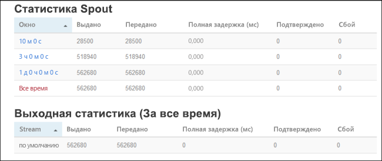

# <a name="quickstart-create-and-monitor-an-apache-storm-topology-in-azure-hdinsight"></a>Краткое руководство. Создание и мониторинг топологии Apache Storm в Azure HDInsight

Apache Storm — это масштабируемая отказоустойчивая распределенная система выполнения расчетов для обработки данных потоковой передачи в режиме реального времени. С помощью Storm вы можете создать в Azure HDInsight облачный кластер, который анализирует данные в режиме реального времени.

В этом кратком руководстве используется пример из проекта Apache [storm-starter](https://github.com/apache/storm/tree/v2.0.0/examples/storm-starter) для создания и отслеживания топологии Apache Storm в имеющемся кластере Apache Storm.

## <a name="prerequisites"></a>Предварительные требования

* Кластер Apache Storm в HDInsight. Ознакомьтесь со статьей [Create Linux-based clusters in HDInsight by using the Azure portal](../hdinsight-hadoop-create-linux-clusters-portal.md) (Создание кластеров под управлением Linux в HDInsight с помощью портала Azure) и выберите **Storm** для параметра **Тип кластера**.

* Клиент SSH. Дополнительные сведения см. в руководстве по [подключению к HDInsight (Apache Hadoop) с помощью SSH](../hdinsight-hadoop-linux-use-ssh-unix.md).

## <a name="create-the-topology"></a>Создание топологии

1. Подключитесь к своему кластеру Storm. Измените приведенную ниже команду, заменив `CLUSTERNAME` именем своего кластера Storm, а затем введите сценарий:

    ```cmd
    ssh sshuser@CLUSTERNAME-ssh.azurehdinsight.net
    ```

2. Пример **WordCount** включен в ваш кластер HDInsight в `/usr/hdp/current/storm-client/contrib/storm-starter/`. При помощи этой топологии создаются случайные предложения и подсчитывается число вхождений слов. Используйте следующую команду для запуска топологии **подсчета слов** в кластере:

    ```bash
    storm jar /usr/hdp/current/storm-client/contrib/storm-starter/storm-starter-topologies-*.jar org.apache.storm.starter.WordCountTopology wordcount
    ```

## <a name="monitor-the-topology"></a>Мониторинг топологии

Storm предоставляет веб-интерфейс для работы с запущенными топологиями и включен в ваш кластер HDInsight.

Чтобы начать мониторинг топологии из пользовательского интерфейса Storm, выполните следующие действия.

1. Для отображения пользовательского интерфейса Storm перейдите в веб-браузере по адресу `https://CLUSTERNAME.azurehdinsight.net/stormui`. Замените `CLUSTERNAME` именем кластера.

2. В разделе**Topology summary** (Сводка по топологии) выберите запись **wordcount** в столбце **Name** (Имя). Отобразятся сведения о топологии.

    

    Новая страница содержит следующую информацию.

    |Свойство | Описание |
    |---|---|
    |Статистика топологии|Базовая информация о производительности топологии, упорядоченной по временным промежуткам. При выборе определенного временного промежутка меняется информация, отображаемая в других разделах страницы.|
    |Воронки|Базовая информация о воронках, а также о последней ошибке, возвращенной каждой воронкой.|
    |Элементы|Базовая информация об элементах.|
    |Конфигурация топологии|Подробные сведения о конфигурации топологии.|
    |Активировать|Возобновление обработки отключенной топологии.|
    |Отключение|Приостановка выполняемой топологии.|
    |Повторная балансировка|Корректировка параллелизма топологии. После изменения числа узлов в кластере необходимо выполнить повторную балансировку топологий. Повторная балансировка корректирует параллелизм для компенсации увеличения или уменьшения количества узлов в кластере. Дополнительные сведения см. в статье о [параллелизме топологии Apache Storm](https://storm.apache.org/documentation/Understanding-the-parallelism-of-a-Storm-topology.html).|
    |Завершить|Останавливает выполнение топологии Storm по истечении заданного времени ожидания.|

3. На этой странице выберите запись и раздела **Spouts** (Воронки) или **Bolts** (Сита). Отобразятся сведения о выбранном компоненте.

    

    На этой странице отображается следующая информация.

    |Свойство | Описание |
    |---|---|
    |Статистика по воронке/элементам|Базовая информация о производительности компонентов, упорядоченная во временным промежуткам. При выборе определенного временного промежутка меняется информация, отображаемая в других разделах страницы.|
    |Статистика входных данных (только bolt)|Информация о компонентах, производящих данные, использованные элементом bolt.|
    |Статистика выходных данных|Информация о данных, созданных с помощью этого элемента bolt.|
    |Исполнители|Информация об экземплярах этого компонента.|
    |ошибки|Ошибки, созданные этим компонентом.|

4. При просмотре информации о воронке и сите выберите запись из столбца **Port** (Порт) в разделе **Executors** (Исполнители), чтобы просмотреть информацию о конкретном экземпляре компонента.

        2015-01-27 14:18:02 b.s.d.task [INFO] Emitting: split default ["with"]
        2015-01-27 14:18:02 b.s.d.task [INFO] Emitting: split default ["nature"]
        2015-01-27 14:18:02 b.s.d.executor [INFO] Processing received message source: split:21, stream: default, id: {}, [snow]
        2015-01-27 14:18:02 b.s.d.task [INFO] Emitting: count default [snow, 747293]
        2015-01-27 14:18:02 b.s.d.executor [INFO] Processing received message source: split:21, stream: default, id: {}, [white]
        2015-01-27 14:18:02 b.s.d.task [INFO] Emitting: count default [white, 747293]
        2015-01-27 14:18:02 b.s.d.executor [INFO] Processing received message source: split:21, stream: default, id: {}, [seven]
        2015-01-27 14:18:02 b.s.d.task [INFO] Emitting: count default [seven, 1493957]

    В этом примере слово **seven** (семь) использовалось 1 493 957 раз. Столько раз это слово было обнаружено с момента запуска данной топологии.

## <a name="stop-the-topology"></a>Остановка топологии

Вернитесь к странице **Topology summary** (Сводка по топологии), чтобы найти топологию подсчета слов, и нажмите кнопку **Kill** (Удалить) в разделе **Topology actions** (Действия топологии). При появлении запроса введите 10 секунд ожидания перед остановкой топологии. По истечении времени ожидания топология перестанет отображаться при переходе к разделу **Пользовательский интерфейс Storm** на панели мониторинга.

## <a name="clean-up-resources"></a>Очистка ресурсов

После завершения работы с этим кратким руководством кластер можно удалить. В случае с HDInsight ваши данные хранятся в службе хранилища Azure, что позволяет безопасно удалить неиспользуемый кластер. Плата за кластеры HDInsight взимается, даже когда они не используются. Поскольку стоимость кластера во много раз превышает стоимость хранилища, экономически целесообразно удалять неиспользуемые кластеры.

Инструкции по удалению кластера см. в статье [Delete an HDInsight cluster using your browser, PowerShell, or the Azure CLI](../hdinsight-delete-cluster.md) (Удаление кластера HDInsight с помощью браузера, PowerShell или Azure CLI).

## <a name="next-steps"></a>Дальнейшие действия

В этом кратком руководстве используется пример из проекта Apache [storm-starter](https://github.com/apache/storm/tree/v2.0.0/examples/storm-starter) для создания и отслеживания топологии Apache Storm в имеющемся кластере Apache Storm. Перейдите к следующей статье, чтобы ознакомиться с основами управления топологиями Apache Storm и их мониторинга.

> [!div class="nextstepaction"]
>[Deploy and manage Apache Storm topologies on Azure HDInsight](./apache-storm-deploy-monitor-topology-linux.md) (Развертывание топологий Apache Storm и управление ими в Azure HDInsight)