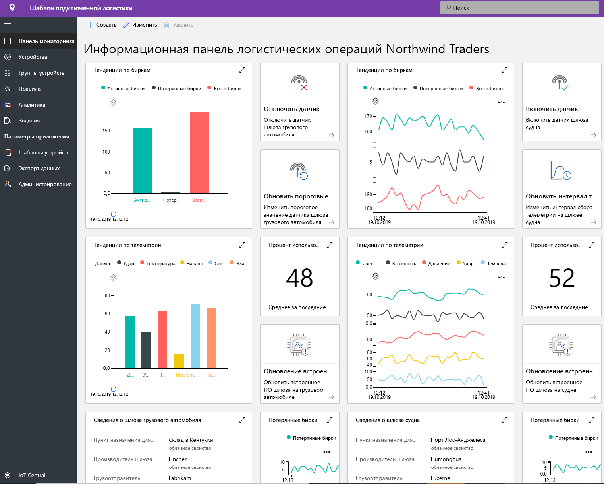
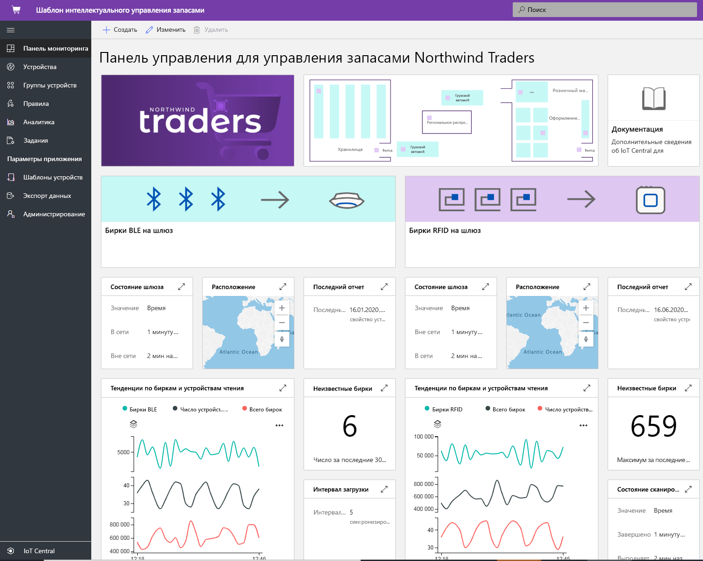

# Создание решений для розничной торговли с помощью Azure IoT Central

[!INCLUDE [iot-central-pnp-original](../../../includes/iot-central-pnp-original-note.md)]

Azure IoT Central — это платформа приложений IoT, которая сокращает расходы и затраты на разработку и обслуживание решений IoT корпоративного уровня, а также на управление ими. Выбирая Azure IoT Central для создания приложений, вы сможете выделить время, деньги и энергию на преобразование бизнеса с помощью данных Интернет вещей, а не просто поддерживать и обновлять сложную и постоянно развивающуюся инфраструктуру Интернета вещей.

Здесь описаны несколько шаблонов приложений из IoT Central, предназначенных для предприятий розничной торговли. Разработчики решений могут на основе этих шаблонов создавать решения Интернета вещей, которые позволяют оптимизировать цепочки поставок, улучшать взаимодействие с клиентами и более эффективно отслеживать запасы.

> [!div class="mx-imgBorder"]
> 

В следующих разделах описаны возможности каждого шаблона приложения.

## Интеллектуальная логистика

Глобальные расходы на логистику в 2020 году достигнут 10,6 трлн долл. США. Основная часть этих затрат приходится на транспортировку товаров, и поставщики услуг доставки сталкиваются с огромным конкурентным давлением и множеством ограничений.

Вы можете использовать датчики Интернета вещей для сбора данных и мониторинга окружающих условий, таких как температура, влажность, наклон, удар, освещенность и расположение груза. В облачных системах бизнес-аналитики вы можете объединить данные телеметрии, полученные от датчиков и устройств Интернета вещей, с другими данными, например о погоде и дорожном движении.

Подключенное решение для логистики предоставляет следующие преимущества:

* мониторинг грузов с отслеживанием в реальном времени; 
* гарантия целостности грузов благодаря мониторингу условий окружающей среды в реальном времени;
* защита грузов от кражи, потери и повреждения;
* определение геозон, оптимизация маршрутов, управление транспортным парком и аналитика для транспортных средств;
* прогнозирование времени отправки и прибытия грузов.

На следующих снимках экрана показана стандартная панель мониторинга, включенная в шаблон приложения. Вы можете полностью изменять эту панель мониторинга в соответствии с требованиями для конкретного решения.

> [!div class="mx-imgBorder"]
> 

> [!div class="mx-imgBorder"]
> 

Дополнительные сведения см. в руководстве [по развертыванию и использованию шаблона подключенного приложения логистики](./tutorial-iot-central-connected-logistics-pnp.md).

## Цифровой центр дистрибуции

По мере того, как производители и розничные продавцы выходят на общемировой рынок, их цепочки поставок расширяются и становятся все более сложными. Сегодня потребители ожидают, что им предоставят на выбор широкий ассортимент товаров и доставят покупку за один или два дня. Центры распространения должны адаптироваться к этим тенденциям, оптимизируя неэффективные методы работы. 

Сегодня большая часть работы выполняется вручную, в результате чего комплектация и упаковка заказов занимает до 55–65 % общих затрат на центры распространения. Ручная комплектация и упаковка занимает обычно больше времени, чем автоматизированная, а резкие изменения требований к количеству сотрудников еще больше мешают соблюдать требуемые объемы поставок. Сезонные колебания приводят к высокой текучести кадров, а также повышают вероятность дорогостоящих ошибок.

Решения на основе камер с поддержкой Интернета вещей могут преобразовать эти процессы, предоставляя цифровой канал обратной связи. Данные из центра дистрибуции позволят получить ценные сведения для внесения исправлений, которые в свою очередь повысят качество получаемых данных.

Цифровой центр дистрибуции предоставит следующие преимущества:

* отслеживание камерами товаров, которые поступают на конвейер и перемещаются по нему;
* автоматическая идентификация дефектных товаров;
* эффективное отслеживание заказов;
* снижение затрат, повышение производительности и оптимизация загрузки.

На следующем снимке экрана показана стандартная панель мониторинга, включенная в шаблон приложения. Вы можете полностью изменять эту панель мониторинга в соответствии с требованиями для конкретного решения. 

> [!div class="mx-imgBorder"]
> 

Дополнительные сведения см. в руководстве [по развертыванию и использованию шаблона приложения для цифрового центра дистрибуции](./tutorial-iot-central-digital-distribution-center-pnp.md).

## Мониторинг условий для аналитики магазина

Многие розничные продавцы уверены, что контроль условий окружающей среды в их магазинах поможет им выделиться среди конкурентов. Розничные продавцы хотят поддерживать приятные условия в магазинах, чтобы порадовать своих клиентов.  

Разработчик решений может применить шаблон приложения мониторинга условий для аналитики магазина из IoT Central, чтобы создать комплексное решение. Этот шаблон приложения позволяет реализовать цифровое подключение и мониторинг условий среды в розничном магазине с помощью разных датчиков и устройств. Эти датчики создают данные телеметрии, которые можно преобразовать в бизнес-аналитику. На ее основе розничные продавцы смогут сократить эксплуатационные расходы и создать превосходные условия для своих клиентов.

С помощью этого шаблона приложения можно решить следующие задачи:

* подключение разных датчиков Интернета вещей к экземпляру приложения в IoT Central;
* мониторинг и контроль работоспособности сети датчиков и любых шлюзов в подключенной среде;
* создание пользовательских правил с учетом условий окружающей среды в магазине для отправки предупреждений управляющим магазинами;
* получение полезных сведений на основе данных об условиях окружающей среды в магазине, которые можно применить для улучшения взаимодействия с клиентом;
* экспорт агрегированных аналитических сведений в существующие или новые бизнес-приложения, которые предоставят сотрудникам магазина полезные и своевременные сведения.

Этот шаблон приложения включает набор шаблонов устройств и использует имитированные устройства для заполнения панели мониторинга. 

На следующем снимке экрана показана стандартная панель мониторинга, включенная в шаблон приложения. Вы можете полностью изменять эту панель мониторинга в соответствии с требованиями для конкретного решения. 

> [!div class="mx-imgBorder"]
> 

Дополнительные сведения см. в руководстве [по созданию приложения для аналитики магазина в Azure IoT Central](./tutorial-in-store-analytics-create-app-pnp.md).

## Оформление заказов для аналитики магазина

Некоторые розничные продавцы считают, что опыт оформления заказов в их магазинах поможет им выделиться среди конкурентов. Розничные продавцы хотят обеспечить клиентам приятные впечатления при оформлении заказа, чтобы у них возникало желание вернуться в магазин.  

Разработчик решений может применить шаблон приложения оформления заказов для аналитики магазина из IoT Central и создать решение, которое предоставляет сотрудникам магазина полезные данные о работе зоны оформления заказов. Например, можно собирать от датчиков сведения о длине очередей и среднем времени ожидания для каждой кассы.

С помощью этого шаблона приложения можно решить следующие задачи:

* подключение разных датчиков Интернета вещей к экземпляру приложения в IoT Central;
* мониторинг и контроль работоспособности сети датчиков и любых шлюзов в подключенной среде;
* создание пользовательских правил на основе условий зоны оформления заказов в магазине для отправки предупреждений сотрудникам магазина;
* получение полезных сведений на основе данных об условиях оформления заказов в магазине, которые можно применить для улучшения взаимодействия с клиентами;
* экспорт агрегированных аналитических сведений в существующие или новые бизнес-приложения, которые предоставят сотрудникам магазина полезные и своевременные сведения.

Этот шаблон приложения включает набор шаблонов устройств и использует имитированные устройства для заполнения панели мониторинга данными о загруженности касс. 

На следующем снимке экрана показана стандартная панель мониторинга, включенная в шаблон приложения. Вы можете полностью изменять эту панель мониторинга в соответствии с требованиями для конкретного решения. 

> [!div class="mx-imgBorder"]
> 

Дополнительные сведения см. в руководстве [по созданию приложения для аналитики магазина в Azure IoT Central](./tutorial-in-store-analytics-create-app-pnp.md).

## Интеллектуальное управление запасами

Под запасами мы понимаем те товары, которые есть в наличии у продавца. Управление запасами стало критически важным процессом, который позволяет получить нужные товары в нужном месте в нужное время. Розничному продавцу нужно поддерживать баланс между затратами на хранение слишком больших запасов и потерями от нехватки товаров на складе для удовлетворения спроса.

Данные Интернета вещей, получаемые с меток радиочастотной идентификации (RFID), маяков и камер, позволяют улучшить процессы управления запасами. В облачных системах бизнес-аналитики вы можете объединить данные телеметрии, полученные от датчиков и устройств Интернета вещей, с другими данными, например о погоде и дорожном движении.

Интеллектуальное управление запасами предоставляет следующие преимущества:

* уменьшение риска отсутствия товаров в наличии и поддержание требуемого уровня обслуживания клиентов; 
* подробная аналитика и полезные сведения по точности контроля запасов почти в реальном времени;
* средства для выбора правильного уровня запасов, который позволит обслуживать заказы клиентов.

Этот шаблон приложения поддерживает подключение, настройку и контроль считывающих устройств RFID и Bluetooth с низким энергопотреблением (BLE).

На следующем снимке экрана показана стандартная панель мониторинга, включенная в шаблон приложения. Вы можете полностью изменять эту панель мониторинга в соответствии с требованиями для конкретного решения.

> [!div class="mx-imgBorder"]
> 

Дополнительные сведения см. в руководстве [по развертыванию и использованию шаблона приложения для интеллектуального управления запасами для IoT Central](./tutorial-iot-central-smart-inventory-management-pnp.md).

## Микроцентр исполнения заказов

В условиях роста конкурентного давления для розничной торговли продавцам нужно постоянно заполнять разрывы между спросом и предложением. Для удовлетворения растущего потребительского спроса возникла сравнительно новая тенденция — размещать запасы рядом с потребителями и магазинами, которые они посещают.

Шаблон приложения "Микроцентр исполнения заказов" из IoT Central позволяет разработчикам решений отслеживать и изменять все параметры полностью автоматизированных центров исполнения заказов. Этот шаблон включает набор имитированных датчиков мониторинга условий и автоматизированных средств перевозки, что позволяет ускорить процесс разработки решения. Эти датчики собирают важные сведения, которые можно преобразовать в бизнес-аналитику. На ее основе розничные продавцы смогут сократить эксплуатационные расходы и создать для клиентов новые возможности.

Этот шаблон приложения позволяет реализовать следующие возможности: 

- подключение разных датчиков Интернета вещей, в том числе роботов и датчиков мониторинга условий, к экземпляру приложения в IoT Central;
- мониторинг и контроль работоспособности сети датчиков и любых шлюзов в подключенной среде;
- создание пользовательских правил на основе условий окружающей среды в центре оформления заказов для получения своевременных предупреждений;
- получение полезных сведений на основе данных об условиях окружающей среды в центре оформления заказов, которые будут полезны сотрудникам склада;
- экспорт агрегированных аналитических сведений в существующие или новые бизнес-приложения, предоставляющие сотрудникам розничного магазина новые возможности.

На следующем снимке экрана показана стандартная панель мониторинга, включенная в шаблон приложения. Вы можете полностью изменять эту панель мониторинга в соответствии с требованиями для конкретного решения.

> [!div class="mx-imgBorder"]
> 

Дополнительные сведения см. в руководстве [по развертыванию и использованию шаблона приложения для микроцентра исполнения заказов](./tutorial-iot-central-smart-inventory-management-pnp.md).

## Дальнейшие действия

Чтобы начать разработку решения для розничной торговли, воспользуйтесь следующими ресурсами:

* Начните работу с руководства по [созданию приложения аналитики магазина в Azure IoT Central](./tutorial-in-store-analytics-create-app-pnp.md), где представлены инструкции по созданию решения на основе любого из шаблонов приложения для аналитики магазина.
* [Развертывание и использование шаблона подключенного приложения логистики](./tutorial-iot-central-connected-logistics-pnp.md).
* [Развертывание и использование шаблона приложения цифрового центра дистрибуции](./tutorial-iot-central-digital-distribution-center-pnp.md).
* [Развертывание и использование шаблона приложения для интеллектуального управления запасами](./tutorial-iot-central-smart-inventory-management-pnp.md).
* [Развертывание и использование шаблона приложения микроцентра исполнения заказов](./tutorial-iot-central-smart-inventory-management-pnp.md).
* Дополнительные сведения об IoT Central см. в разделе [Общие сведения об IoT Central](../preview/overview-iot-central.md).
