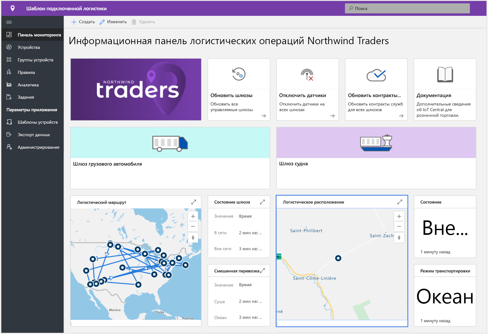
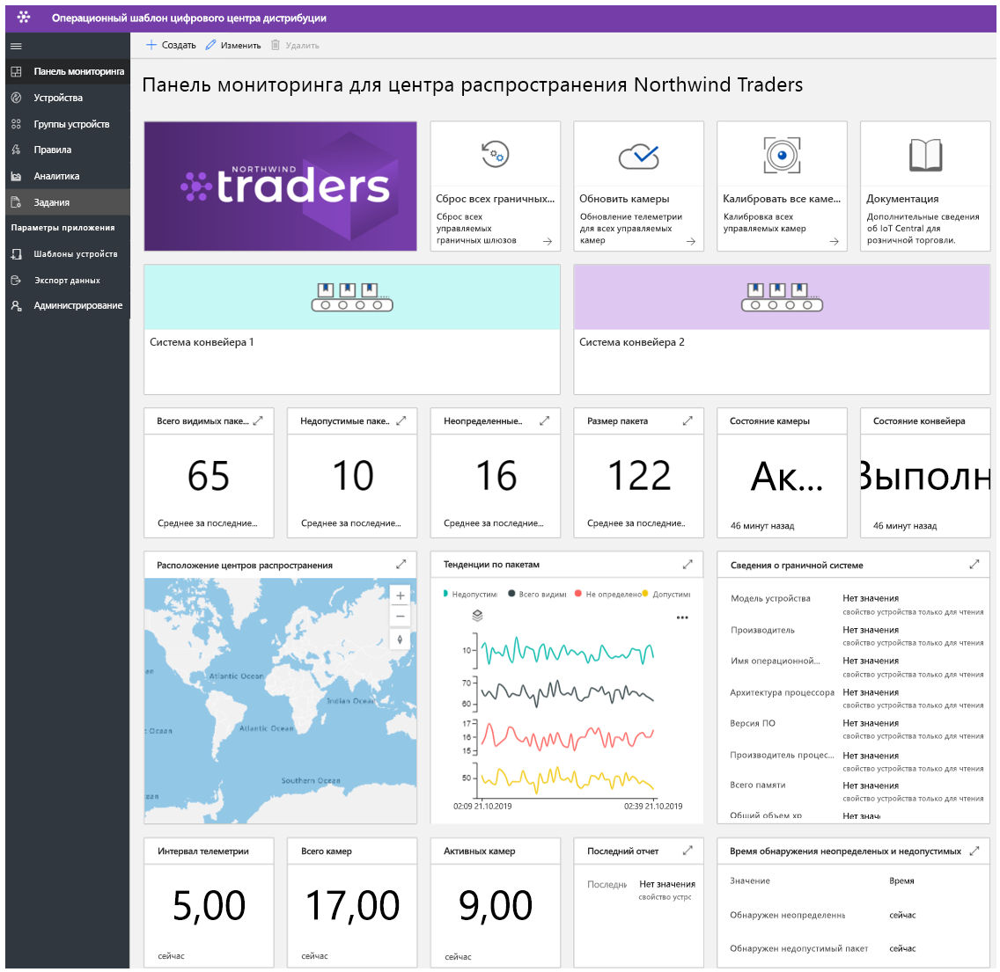
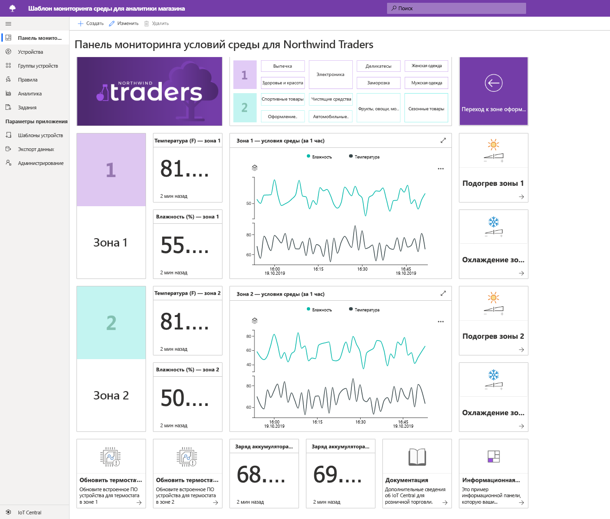

# Создание решений для розничной торговли с помощью Azure IoT Central

[!INCLUDE [iot-central-pnp-original](../../../includes/iot-central-pnp-original-note.md)]

Azure IoT Central это платформа для создателей приложений Интернета вещей. Она упрощает процесс разработки масштабируемых приложений и управление ими. В этой статье мы рассмотрим несколько шаблонов приложений в IoT Central, предназначенных для предприятий розничной торговли. Создатели решений могут создавать решения Интернета вещей на основе опубликованных шаблонов. Эти шаблоны помогают оптимизировать цепочки поставок, улучшить взаимодействие с клиентами и более эффективно отслеживать запасы.

> [!div class="mx-imgBorder"]
> 

## Что собой представляет подключенное решение для логистики?
Глобальные расходы на логистику к 2020 году достигнут 10,6 трлн долл. США, выйдя на первое место по объему затрат среди всех отраслей. Из общих расходов на логистику большая часть (до 70 %) приходится на транспортировку товаров. Поставщики услуг доставки испытывают огромное конкурентное давление и сталкиваются со множеством ограничений. Сроки выполнения работ 3PL-поставщиков постоянно уменьшаются, а расходы на заработную плату повышаются. Дополнительными ограничениями в сфере логистики являются риски, связанные с геополитическими событиями, климатическими явлениями и преступностью. 

С помощью датчиков Интернета вещей мы можем собирать и отслеживать условия окружающей среды, в том числе температуру, влажность, смещение, тряску, освещенность и расположение груза по GPS при транспортировке любыми средствами транспорта (воздушным, водным и наземным). Данные, поступающие от датчиков и устройств, а также сведения о погоде и важных событиях можно интегрировать в облачные системы бизнес-аналитики. Подключенное решение для логистики предоставляет следующие преимущества:
* передача грузов с отслеживанием в реальном времени; 
* гарантия целостности грузов благодаря мониторингу условий окружающей среды и холодовой цепи в реальном времени;
* защита грузов от кражи, потери и повреждения;
* географическое разграничение, оптимизация маршрутов, управление транспортным парком; аналитика по транспортным средствам;
* прогнозирование и предсказуемость времени отправки и прибытия. 

### Стандартные возможности
Партнеры могут использовать шаблон при разработке комплексных решений для логистики с описанными выше преимуществами. Опубликованный шаблон поддерживает подключение, настройку устройств и управление ими в IoT Central. 

> [!div class="mx-imgBorder"]
> 

> [!div class="mx-imgBorder"]
> 

Обратите внимание, что эта панель мониторинга приводится только в качестве примера, и вы можете настроить приложение в полном соответствии с предполагаемым режимом использования.

Начните работу с [полного руководства](./tutorial-iot-central-connected-logistics-pnp.md) с инструкциями по созданию решения на основе одного из шаблонов решения для подключенной логистики.

## Что такое цифровой центр распространения?
По мере того, как производители и розничные продавцы выходят на общемировой рынок, их цепочки поставок становятся все более и более сложными. Организация центров распространения становится главной задачей. На работу складов и центров все большее давление оказывает электронная коммерция. Сегодня потребители ожидают, что им предоставят на выбор широкий ассортимент товаров и доставят покупку за один или два дня. Центры распространения должны адаптироваться к этим тенденциям, оптимизируя неэффективные методы работы. 

Сегодня большая часть работы выполняется вручную, в результате чего комплектация и упаковка заказов занимает до 55-65 % общих затрат на центры распространения. Мало того, что выполняемые вручную операции замедляют работу центров, быстрое изменение потребности в персонале (с разницей до 10 раз между праздничными и обычными днями) еще больше затрудняет обработку больших объемов поставок. Сезонные колебания приводят к высокой текучести кадров, а также повышают вероятность ошибок, что влечет дополнительные затраты на их исправление.
Решения на основе камер с поддержкой Интернета вещей могут преобразовать эти процессы, предоставляя цифровой канал обратной связи. Сбор таких данных из центра распространения позволит получить ценные сведения для внесения исправлений, которые в свою очередь повысят качество получаемых данных.

Вы получите следующие преимущества: 
* камеры отслеживают товары, которые поступают на конвейер и перемещаются по нему;
* неисправные товары своевременно выявляются и отправляются на ремонт;
* заказы эффективно отслеживаются;
* расходы сокращаются, повышается производительность и оптимизируется эффективность.

### Стандартные возможности
Партнеры могут использовать этот шаблон приложения для создания цифрового центра распространения, который позволит получить ценные и актуальные сведения, а также реализовать описанные выше преимущества. Опубликованный шаблон поможет подключить и настроить камеры и пограничные устройства с возможностью управления в IoT Central. 

> [!div class="mx-imgBorder"]
> 

Обратите внимание, что эта панель мониторинга приводится только в качестве примера, и вы можете настроить приложение в полном соответствии с предполагаемым режимом использования.

Начните работу с [полного руководства](./tutorial-iot-central-digital-distribution-center-pnp.md) с инструкциями по созданию решения на основе одного из шаблонов цифрового центра распространения.

## Что собой представляет мониторинг условий для аналитики магазина?
В современных конкурентных условиях розничные продавцы ищут новые способы предоставить клиентам что-то уникальное или особенное, чтобы привлечь посетителей в физические магазины. Многие розничные продавцы понимают, что контроль условий окружающей среды в их магазинах поможет им выделиться среди конкурентов. Розничные продавцы готовы постоянно поддерживать комфортные условия, обеспечивая клиентам приятные впечатления.  

Шаблон приложения мониторинга условий для аналитики магазина в IoT Central предоставляет создателям решений основу для разработки комплексного решения. Этот шаблон приложения позволяет создать цифровую систему для подключения и мониторинга условий среды в розничном магазине с помощью разнообразных датчиков и устройств. Эти сенсорные устройства собирают важные сведения, которые можно преобразовать в бизнес-аналитику, на основе которой розничные продавцы сократят эксплуатационные расходы и создадут для клиентов новые приятные возможности.

Этот шаблон приложения предоставляет следующие возможности:

*  подключение разных датчиков Интернета вещей к экземпляру приложения в IoT Central;
*  мониторинг и контроль работоспособности сети датчиков и шлюзов в подключенной среде;
*  создание пользовательских правил на основе условий окружающей среды в магазине для получения своевременных предупреждений;
*  получение полезных сведений на основе данных об условиях окружающей среды в магазине, которые будут полезны сотрудникам розничного магазина;
* экспорт агрегированных аналитических сведений в существующие или новые бизнес-приложения, позволяющие сотрудникам розничного магазина новые возможности.

### Стандартные возможности
Этот шаблон приложения в стандартной комплектации включает набор шаблонов устройств и интерфейс для оператора. Он заполняет элементы панели мониторинга данными, поступающими от набора имитированных устройств. Развернув в IoT Central приложение на основе шаблона приложения [мониторинга условий для аналитики магазина](https://aka.ms/conditiontemplate), вы увидите представленную ниже стандартную панель мониторинга приложения. 

> [!div class="mx-imgBorder"]
> 

Обратите внимание, что эта панель мониторинга приводится только в качестве примера, и вы можете настроить приложение в полном соответствии с предполагаемым режимом использования. 

Начните работу с [полного руководства](./tutorial-in-store-analytics-create-app-pnp.md) с инструкциями по созданию решения на основе одного из шаблонов мониторинга условий для аналитики магазина.

## Что собой представляет оформление заказа для аналитики магазина?
В условиях растущей конкуренции современные розничные продавцы сталкиваются с необходимостью обеспечить покупателям такие условия, которые превзойдут их ожидания и будут мотивировать их возвращаться в этот магазин. Некоторые розничные продавцы уже используют технологические решения для удовлетворения этой потребности, но процесс оформления заказов пока остается за пределами внимания большинства из них.

Шаблон приложения оформления заказов для аналитики магазина в IoT Central позволяет создателям решений разрабатывать новые пути взаимодействия и предоставлять сотрудникам розничного магазина ценные сведения о работе зоны оформления заказов. Он определяет состояние заполнения для каждой из очередей в зоне оформления заказов в розничном магазине, используя набор имитированных устройств. Датчики позволяют отслеживать количество людей в каждой очереди, а также среднее время ожидания.

Этот шаблон поможет создателям решения ускорить процесс выхода на рынок, предоставляя базовое решение Интернета вещей со следующими возможностями: 

* подключение разных датчиков Интернета вещей к экземпляру приложения в IoT Central;
* мониторинг и контроль работоспособности сети датчиков и шлюзов в подключенной среде;
* создание пользовательских правил на основе условий зоны оформления заказов в магазине для получения своевременных предупреждений;
* получение полезных сведений на основе данных о зоне оформления заказов в магазине, которые будут полезны сотрудникам розничного магазина;
* экспорт агрегированных аналитических сведений в существующие или новые бизнес-приложения, позволяющие сотрудникам розничного магазина новые возможности.

### Стандартные возможности
Этот шаблон приложения в стандартной комплектации включает набор шаблонов устройств и интерфейс для оператора. Он заполняет элементы панели мониторинга данными, поступающими от набора имитированных устройств. Развернув в IoT Central приложение на основе шаблона приложения [оформления заказов для аналитики магазина](https://aka.ms/checkouttemplate), вы увидите представленную ниже стандартную панель мониторинга приложения. 

> [!div class="mx-imgBorder"]
> 

Обратите внимание, что эта панель мониторинга приводится только в качестве примера, и вы можете настроить приложение в полном соответствии с предполагаемым режимом использования. 

Начните работу с [полного руководства](./tutorial-in-store-analytics-create-app-pnp.md) с инструкциями по созданию решения на основе одного из шаблонов оформления заказов для аналитики магазина.

## Что собой представляет решение для интеллектуального управления запасами?
Под запасами мы понимаем те товары, которые находятся на объекте розничной торговли. Каждому розничному продавцу важно следить за уровнями запасов и графиком поставок. Несомненно, для каждого розничного продавца запасы считаются самым ценным ресурсом, который следует продать. В современном мире многогранного взаимодействия управление запасами стало критически важным процессом, который позволяет получить нужные товары в нужном месте в нужное время. Слишком большой или недостаточный уровень запасов приносит убытки в сфере розничной торговли. Ежегодно розничные продавцы теряют от 8 до 10 % своего дохода из-за неэффективного управления запасами.

Правильно подойти к решению этой задачи в требуемом масштабе вам помогут данные Интернета вещей с поддержкой радиочастотной идентификации (RFID), маячков и камер. Возможности подключения и аналитика в реальном времени, которые предоставляет служба Интернета вещей, полностью изменят ситуацию для продавцов, которые пытаются решить эту сложную задачу.  Данные, поступающие от датчиков и устройств, а также сведения о погоде и важных событиях можно интегрировать в облачные системы бизнес-аналитики.  
Интеллектуальное управление запасами предоставляет следующие преимущества: 
* защита организации от исчерпания запасов и поддержание нужного уровня обслуживания клиентов; 
* подробная аналитика и полезные сведения по точности контроля запасов в режиме, близком к реальному времени;
* правильный выбор уровня запасов, позволяющего обслуживать заказы клиентов.

### Стандартные возможности
Партнеры могут использовать шаблон для разработки решений интеллектуального управления запасами, которые предоставят описанные выше преимущества. Опубликованный шаблон поддерживает подключение, настройку датчиков радиочастотной идентификации (RFID) и Bluetooth с низким энергопотреблением (BLE) и управление ими в IoT Central. 

> [!div class="mx-imgBorder"]
> 

Обратите внимание, что эта панель мониторинга приводится только в качестве примера, и вы можете настроить приложение в полном соответствии с предполагаемым режимом использования. 

Начните работу с [полного руководства](./tutorial-iot-central-smart-inventory-management-pnp.md) с инструкциями по созданию решения на основе одного из шаблонов интеллектуального управления запасами.

## Дополнительная информация
Чтобы начать разработку решения для розничной торговли, воспользуйтесь следующими ресурсами:
* Начните работу с [полного руководства](./tutorial-in-store-analytics-create-app-pnp.md) с инструкциями по созданию решения на основе одного из шаблонов приложения для аналитики магазина.
* Узнайте, как развернуть [шаблон решения для подключенной логистики](./tutorial-iot-central-connected-logistics-pnp.md).
* Узнайте, как развернуть [шаблон приложения для цифрового центра распространения](./tutorial-iot-central-digital-distribution-center-pnp.md).
* Узнайте, как развернуть [шаблон интеллектуального управления запасами](./tutorial-iot-central-smart-inventory-management-pnp.md).
* См. сведения об [IoT Central](../core/overview-iot-central-pnp.md).
