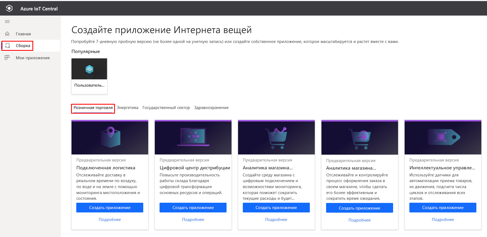
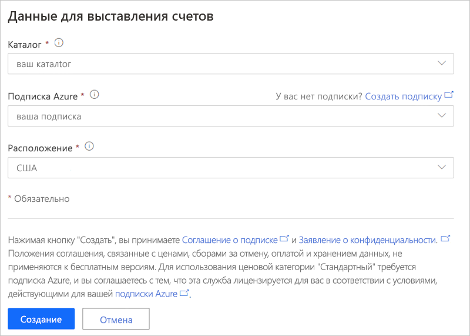
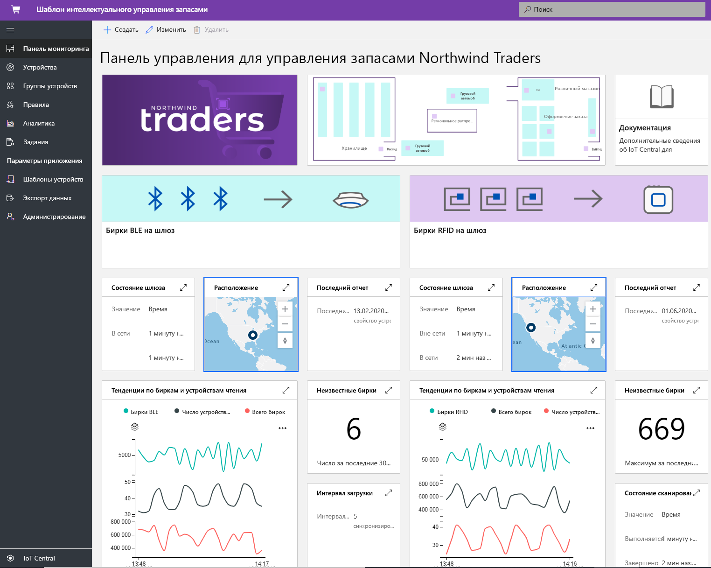
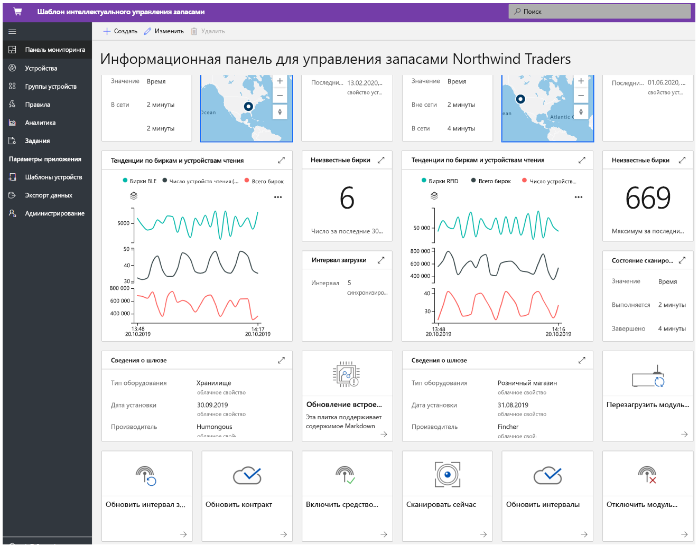
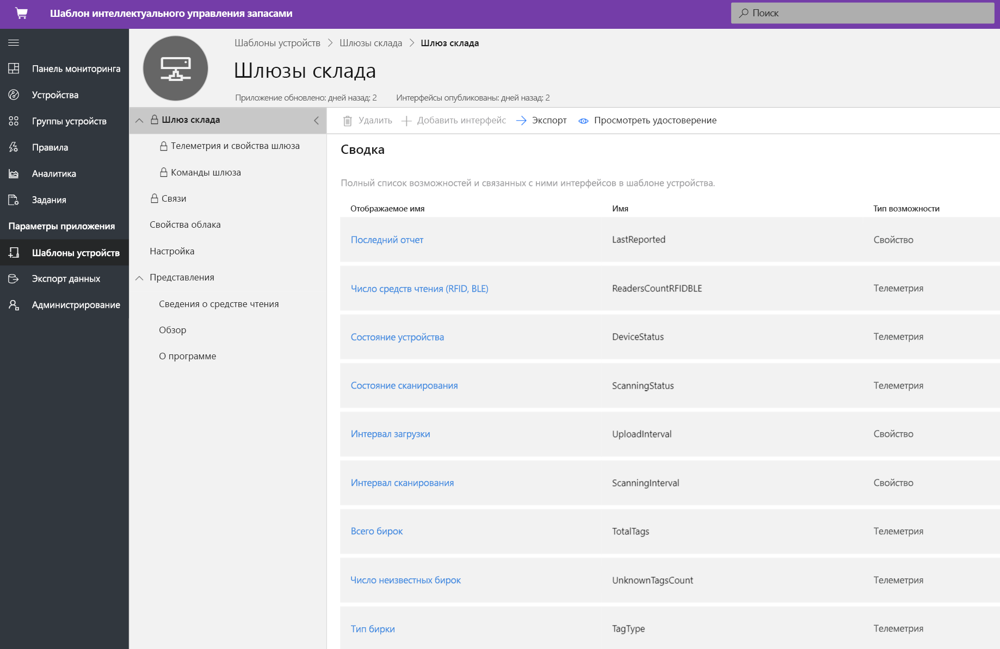
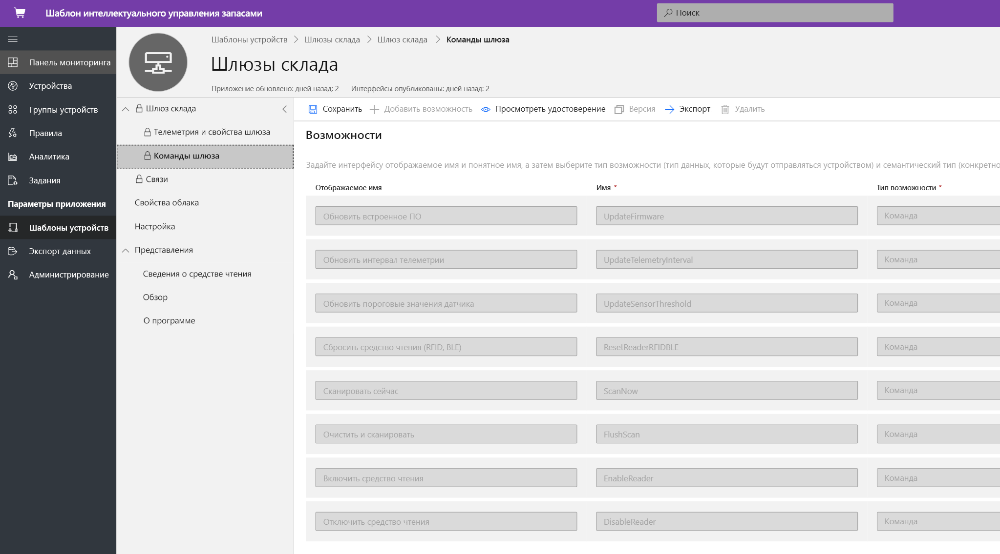
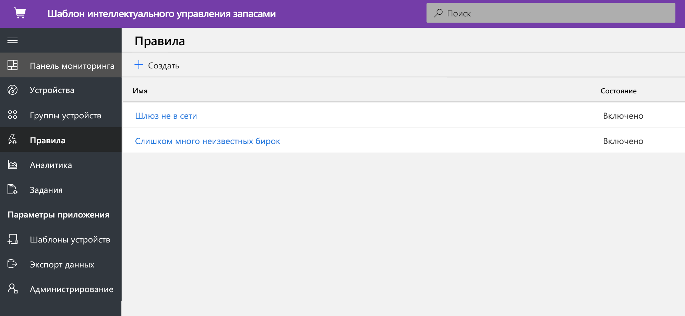
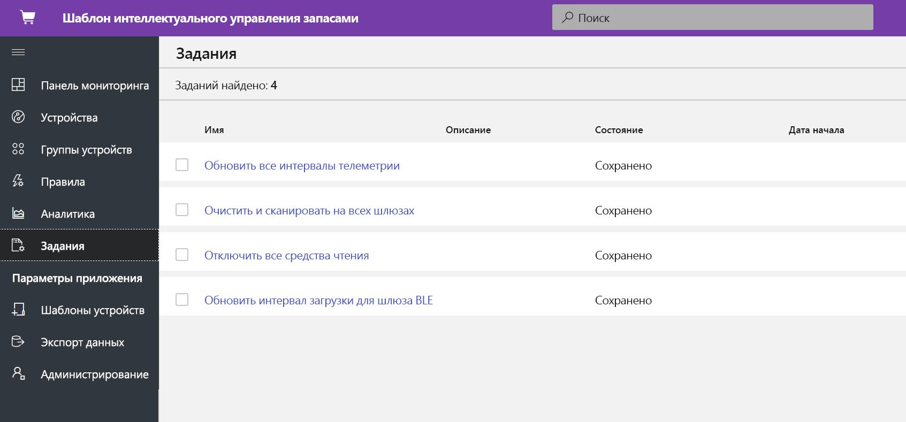
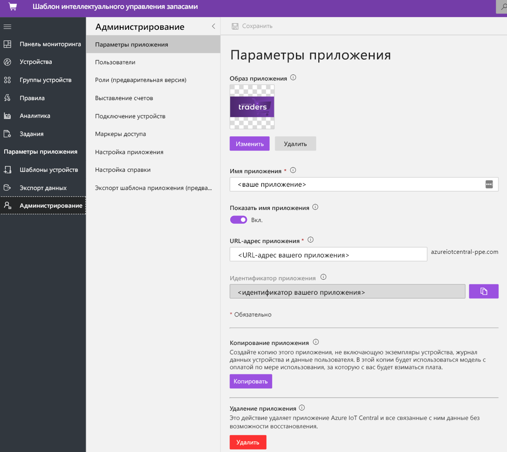

# Руководство по развертыванию шаблона приложения для интеллектуального управления запасами для IoT Central и его использованию

В этом руководстве показано, как приступить к работе, развернув шаблон приложения **для интеллектуального управления запасами** для IoT Central. Вы узнаете, как развернуть шаблон, который готов к использованию, и что можно будет сделать дальше.

Из этого руководства вы узнаете, как: 
* создать приложение для интеллектуального управления запасами; 
* ознакомиться с этим приложением. 

## Предварительные требования

* Для развертывания этого приложения не требуется выполнять какие-либо предварительные требования.
* Рекомендуется иметь подписку Azure, но вы можете поработать с приложением даже без нее.

## Создание приложения для интеллектуального управления запасами

Вы можете создать приложение, выполнив следующие действия.

1. Перейдите на веб-сайт диспетчера приложений в Azure IoT Central. Выберите **Build** (Сборка) в области навигации слева, а затем перейдите на вкладку **Retail** (Розничная торговля).

    > [!div class="mx-imgBorder"]
    > 

2. Выберите вкладку **Розничная торговля** и щелкните **Создать приложение** в разделе **Интеллектуальное управление запасами**

3. Для **создания приложения** откроется форма нового приложения, которая будет заполнена запрошенными данными, как показано ниже.
   **Application name** (Имя приложения): можно использовать предложенное имя по умолчанию или ввести понятное имя приложения.
   **URL** (URL-адрес): можно использовать предложенный URL-адрес по умолчанию или ввести понятный уникальный URL-адрес. Если у вас уже есть подписка Azure, то рекомендуется использовать параметр по умолчанию. Вы можете начать с 7-дневной бесплатной пробной версии тарифного плана и выбрать преобразование в стандартный тарифный план в любое время до истечения срока действия бесплатной версии.
   **Billing Info** (Данные для выставления счетов): сведения о каталоге, подписке Azure и регионе необходимы для подготовки ресурсов.
   **Создание**. Выберите "Create" (Создать) в нижней части страницы, чтобы развернуть приложение.

    > [!div class="mx-imgBorder"]
    > 

    > [!div class="mx-imgBorder"]
    > 

## ознакомиться с этим приложением. 

### Панель мониторинга 

После успешного развертывания шаблона приложения панель мониторинга по умолчанию является порталом оператора интеллектуального управления запасами. Northwind Trader — это вымышленный поставщик интеллектуального управления запасами, управляющий хранилищем со сканерами BLE и магазином розничной торговли со сканерами RFID. На этой панели мониторинга вы увидите два шлюза, предоставляющих данные телеметрии о запасах вместе со связанными командами, заданиями и действиями, которые можно выполнить. Эта панель мониторинга предварительно настроена для демонстрации важных операций устройства интеллектуального управления запасами.
Панель мониторинга логически поделена для отображения операций управления устройством, связанных с двумя шлюзами. 
   * Хранилище развернуто со стационарным шлюзом BLE и сканерами BLE на палетах для отслеживания запасов на крупном объекте.
   * Магазин розничной торговли оснащен стационарным шлюзом RFID и сканерами RFID для каждой отдельной позиции для отслеживания запасов на складе магазина.
   * Просмотр расположения шлюзов, сведений о состоянии и связанных сведений 

> [!div class="mx-imgBorder"]
> 

   * Вы можете легко отслеживать общее число шлюзов, активных и неизвестных радиожетонов.
   * Вы можете выполнять такие операции управления устройствами, как обновление встроенного ПО, отключение датчика, включение датчика, изменение порога датчика, изменение интервалов передачи телеметрии и обновление контрактов службы устройства.
   * Устройства шлюза могут выполнять управление запасами по запросу, осуществляя полное или добавочное сканирование.

> [!div class="mx-imgBorder"]
> 

## Шаблон устройства
Перейдите на вкладку "Device templates" (Шаблоны устройств), и вы увидите модель возможностей шлюза. Модель возможностей основана на двух разных интерфейсах, **Gateway Telemetry & Property** (Телеметрия и свойства шлюза) и **Gateway Commands** (Команды шлюза).

**Gateway Telemetry & Property** (Телеметрия и свойства шлюза). Этот интерфейс представляет все данные телеметрии, связанные с датчиками, расположением и сведениями об устройстве, а также возможностями свойств двойника устройства, такими как пороги и интервалы обновления шлюзов.

> [!div class="mx-imgBorder"]
> 

**Gateway Commands** (Команды шлюза). Этот интерфейс организовывает все возможности команд шлюза.

> [!div class="mx-imgBorder"]
> 

## Правила
Перейдите на вкладку "Rules" (Правила), чтобы просмотреть два правила в этом шаблоне приложения. Эти правила настроены для отправки уведомлений по электронной почте операторам для дальнейшего исследования.

**Gateway offline** (Шлюз не в сети): это правило активируется, если шлюз долго не передает данные в облако. Шлюз может не отвечать из-за низкого заряда аккумулятора, потери подключения или неработоспособности устройства.

**Unknown tags** (Неизвестные радиожетоны): очень важно отслеживать все радиожетоны RFID и BLE, связанные с ресурсом. Если шлюз обнаруживает слишком много неизвестных радиожетонов, это указывает на проблемы синхронизации, связанные с приложениями для работы с радиожетонами.

> [!div class="mx-imgBorder"]
> 

## Задания
Перейдите на вкладку "Jobs" (Задания), чтобы увидеть пять заданий, входящих в состав этого шаблона приложения. Функцию заданий можно использовать для выполнения операций для всего решения. Здесь задания управления запасами используют команды устройства и возможности двойника для выполнения таких задач, как:
   * отключение сканеров для всех шлюзов;
   * изменение порогов телеметрии; 
   * проверка запасов по запросу во всем решении.

> [!div class="mx-imgBorder"]
> 

## Очистка ресурсов

Если вы не собираетесь в дальнейшем использовать это приложение, удалите шаблон приложения, выбрав **Administration** (Администрирование)  > **Application settings** (Параметры приложения) и щелкнув **Delete** (Удалить).

> [!div class="mx-imgBorder"]
> 

## Дальнейшие действия
* Узнайте больше об интеллектуальном управлении запасами и его [принципах](./architecture-smart-inventory-management-pnp.md).
* Узнайте больше о других [шаблонах IoT Central для розничной торговли](./overview-iot-central-retail-pnp.md).
* См. сведения об [IoT Central](../core/overview-iot-central.md).
