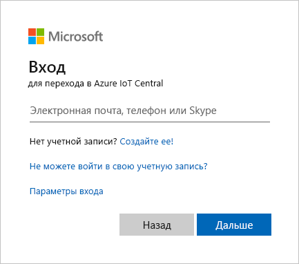
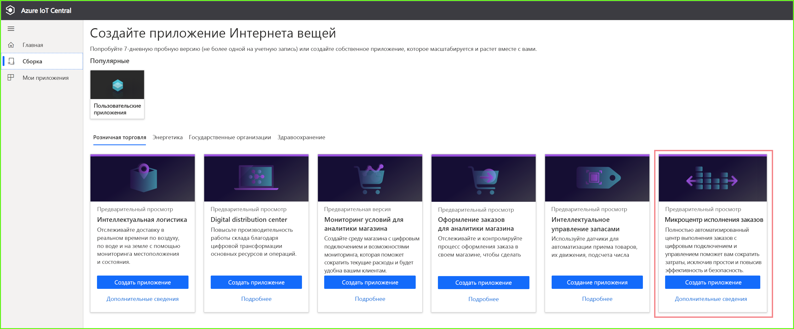
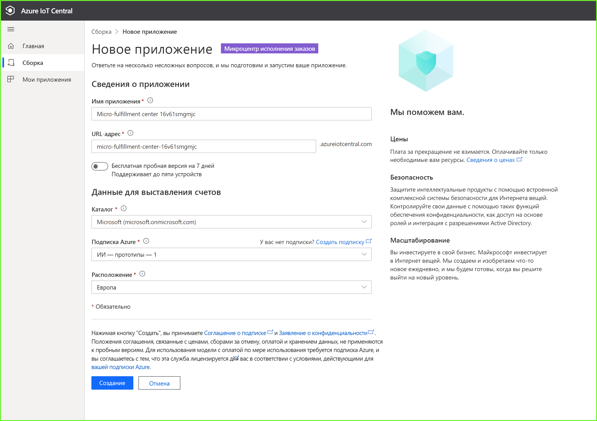
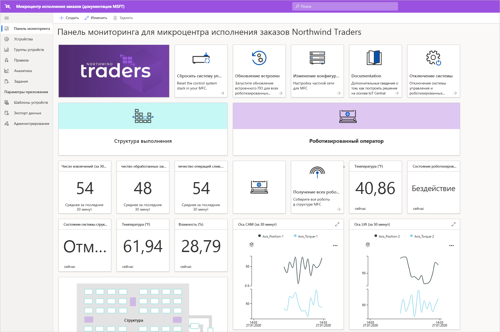
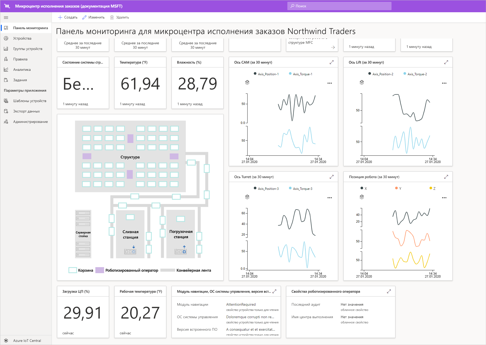
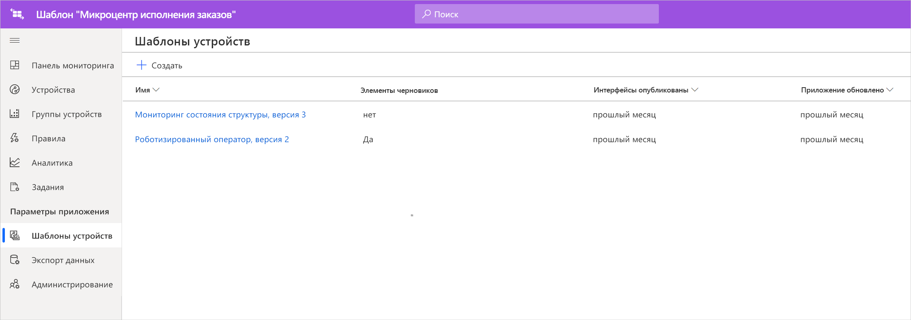
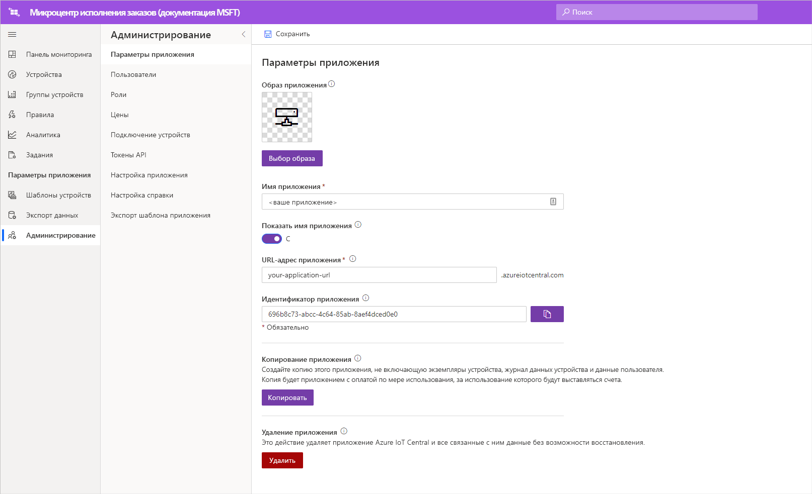

# Руководство по Развертывание и использование шаблона приложения микроцентра исполнения заказов

В этом учебнике вы используете шаблон приложения микроцентра исполнения заказов Azure IoT Central, чтобы создать решение для розничной торговли. Вы узнаете, как развернуть шаблон, который входит в его состав, и что можно будет сделать дальше.

## Предварительные требования
Для работы с этими сериями учебников вам потребуется подписка Azure. При необходимости можно использовать бесплатную пробную версию в течение семи дней. Если у вас еще нет подписки, создайте ее на [странице регистрации в Azure](https://aka.ms/createazuresubscription);

## Создание приложения 
В этом разделе вы создадите новое приложение Azure IoT Central на основе шаблона. Это приложение будет использоваться на всем протяжении серии учебников для создания полного решения.

Чтобы создать приложение Azure IoT Central, сделайте следующее:

1. Перейдите на веб-сайт [диспетчера приложений в Azure IoT Central](https://aka.ms/iotcentral).
1. Если у вас есть подписка Azure, выполните вход с ее учетными данными. В противном случае используйте для входа учетную запись Майкрософт:

   

1. Чтобы начать создание приложения Azure IoT Central, выберите **Новое приложение**.

1. Выберите **Розничная торговля**.  На странице "Розничная торговля" отображается несколько шаблонов розничных приложений.

Чтобы создать новое приложение для микроцентра исполнения заказов, которое использует предварительные версии функций, сделайте следующее.  
1. Выберите шаблон приложения **Микроцентр исполнения заказов**. Этот шаблон включает шаблоны для всех устройств, используемых в руководстве. Шаблон также предоставляет панель оператора для мониторинга условий в вашем центре выполнения заказов, а также условий для роботизированных операторов. 

    
    
1. Выберите **понятное имя** для приложения. Шаблон приложения основан на вымышленной компании Northwind Traders. 

    >[!NOTE]
    >Если вы используете понятное имя приложения, все равно необходимо использовать уникальное значение для URL-адреса приложения.

1. Если у вас есть подписка Azure, укажите каталог, подписку Azure и регион. Если у вас нет подписки, вы можете включить семидневную бесплатную пробную версию и заполнить необходимые контактные данные.  

    Дополнительные сведения о каталогах и подписках см. в кратком руководстве по [созданию приложения Azure IoT Central](../preview/quick-deploy-iot-central.md).

1. Нажмите кнопку **создания**.

    

## ознакомиться с этим приложением. 

После успешного развертывания шаблона приложения вы увидите **панель мониторинга микроцентра исполнения заказов Northwind Traders**. Northwind Trader — это вымышленный розничный продавец, который управляет микроцентром исполнения заказов в этом приложении Azure IoT Central. На этой панели мониторинга оператора вы увидите сведения и данные телеметрии об устройствах в этом шаблоне вместе с набором команд, заданий, а также действий, которые вы можете выполнить. Панель мониторинга логически разделена на две части. Слева вы можете следить за состоянием среды в структуре выполнения, а справа — за состоянием роботизированного оператора в рамках этого средства.  

На панели мониторинга можно:
   * Просматривать сведения о телеметрии устройства, например количество извлечений, количество обработанных заказов, а также такие свойства, как состояние системы структуры и т. д.  
   * Просматривать план этажей и расположение роботизированных операторов в структуре выполнения.
   * Активировать такие команды, как сброс системы управления, обновление встроенного ПО оператора и изменение конфигурации сети.

     
   * См. пример панели мониторинга, которую оператор может использовать для наблюдения за условиями в центре выполнения. 
   * Осуществлять мониторинг работоспособности полезных данных, выполняемых на устройстве шлюза в центре выполнения.    

     

## Шаблон устройства
Если выбрать вкладку "Шаблоны устройств", вы увидите, что в шаблоне есть два различных типа устройств: 
   * **Роботизированный оператор**: этот шаблон устройства представляет определение действующего роботизированного оператора, который развернут в структуре выполнения, и выполняет определенные операции хранения и извлечения. Если вы выберете этот шаблон, то увидите, что робот отправляет данные устройства, например температуру, расположение осей и свойства, такие как состояние роботизированного оператора. 
   * **Мониторинг состояния структуры**: этот шаблон устройств представляет собой коллекцию устройств, которая позволяет отслеживать состояние среды, а также устройство шлюза, на котором размещены различные пограничные рабочие нагрузки для обеспечения работы центра выполнения. Устройство отправляет данные телеметрии, такие как температура, количество извлечений и количество заказов. Оно также отправляет сведения о состоянии и работоспособности рабочих нагрузок, выполняемых в вашей среде. 

     

Если выбрать вкладку "Группы устройств", вы увидите, что для этих шаблонов устройств автоматически созданы группы устройств.

## Правила
На вкладке **Правила** вы увидите пример правила, которое существует в шаблоне приложения для отслеживания температурных условий для роботизированного оператора. Это правило можно использовать, чтобы предупредить оператора, если конкретный робот на объекте перегревается и его необходимо отключить для обслуживания. 

Используйте пример правила как помощь для определения правил, более подходящих для бизнес-функций.

## Очистка ресурсов

Если вы больше не собираетесь использовать это приложение в дальнейшем, удалите шаблон приложения. Выберите элементы **Администрирование** > **Параметры приложения** и выберите **Удалить**.

## Дальнейшие действия

Кроме того, вы можете узнать больше о:
> [!div class="nextstepaction"]
> [архитектура решения для микроцентра исполнения заказов](./architecture-micro-fulfillment-center.md).
* Дополнительные сведения о шаблонах Azure IoT Central для розничной торговли см. [здесь](./overview-iot-central-retail.md).
* Дополнительные сведения об Azure IoT Central см. в [этой статье](../preview/overview-iot-central.md).
