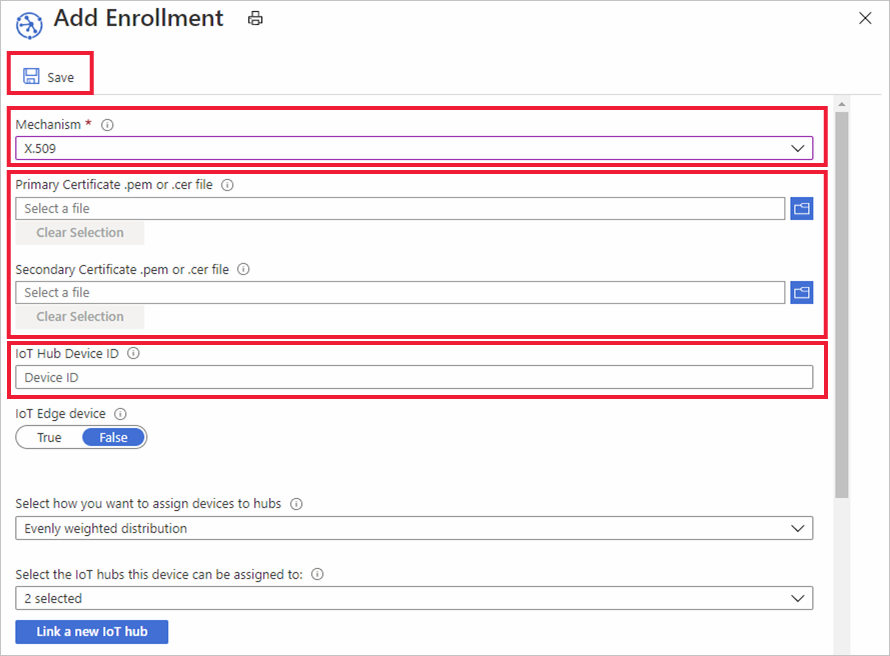

# Управление регистрацией устройств с помощью портал Azure

При *регистрации устройства* создается запись одного устройства или группы устройств, которые можно в будущем зарегистрировать с помощью службы подготовки устройств для Центра Интернета вещей Azure. Запись регистрации содержит начальную конфигурацию устройств в рамках этой регистрации. В конфигурацию входит центр Интернета вещей, которому будет назначено устройство, или политика распределения, которая настраивает концентратор из набора концентраторов. В этой статье описывается, как управлять регистрацией устройств для службы подготовки.

## Создание регистрации устройств

Зарегистрировать устройства с помощью службы подготовки можно двумя способами.

* **Группа регистрации** — это запись для группы устройств, совместно использующих общий механизм аттестации. Мы рекомендуем использовать группу регистрации для большого количества устройств, которые совместно используют начальную конфигурацию или для устройств, использующих один и тот же клиент. Устройства, использующие [симметричный ключ](concepts-symmetric-key-attestation.md) или [сертификаты X. 509](concepts-x509-attestation.md) , поддерживаются. 

    Пошаговые инструкции по созданию и использованию групп регистрации с симметричными ключами см. в руководстве по [подготовке устройств с симметричными ключами](how-to-legacy-device-symm-key.md) .

    Вы создадите группу регистрации на портале для группы устройств, выполнив следующие действия.

    1. Войдите на портал Azure и выберите **Все ресурсы** в меню слева.  
    1. Выберите службу подготовки устройств, в которой нужно зарегистрировать устройство, из списка ресурсов.  
    1. В службе подготовки щелкните **Управление регистрациями**, а затем нажмите кнопку **Добавить группу регистрации** в верхней части страницы.  
     
        
        
    1. Когда появится панель "добавить группу регистрации", введите сведения о регистрации и нажмите кнопку " **сохранить**".  
     
        
        
        | Поле | Описание |
        | :--- | :--- |
        | **Имя группы** | Обязательное имя группы устройств. |
        | **Тип аттестации** | Щелкните **сертификат** или **симметричный ключ** для типа аттестации в зависимости от метода аттестации, который будет использоваться устройствами. |
        | **Тип сертификата** | Доступно, если используется аттестация сертификатов. Выберите **сертификат ЦС** или **промежуточный** центр в зависимости от сертификата, подписавшего сертификаты устройств. |
        | **Основной сертификат** | Если вы подписываете сертификаты устройства с помощью сертификата корневого ЦС, этот сертификат корневого ЦС должен иметь [подтверждение принадлежности](how-to-verify-certificates.md) завершено. Затем можно выбрать его в качестве **основного сертификата** для группы устройств.  Если вы подписываете сертификаты устройств с помощью промежуточного сертификата, будет доступна кнопка отправки, позволяющая передать промежуточный сертификат. Сертификат, подписанный для промежуточного уровня, должен также иметь [Подтверждение](how-to-verify-certificates.md) готовности к выполнению. |

        
    

* **Отдельная регистрация** — это запись для одного устройства, которое может быть назначено центру Интернета вещей. Поддерживаются устройства с [симметричным ключом](concepts-symmetric-key-attestation.md), [сертификаты X. 509](concepts-x509-attestation.md)и [аттестация доверенного платформенного модуля](concepts-tpm-attestation.md) . 

    Вы можете создать отдельную регистрацию на портале, выполнив указанные ниже действия:

    1. Войдите на портал Azure и выберите **Все ресурсы** в меню слева.
    1. Выберите службу подготовки устройств, в которой нужно зарегистрировать устройство, из списка ресурсов.
    1. В службе подготовки щелкните **Управление регистрациями**, а затем нажмите кнопку **Добавить отдельную регистрацию** в верхней части страницы.   

       

    1. Когда появится панель "Добавление регистрации", введите сведения о регистрации отдельных устройств и нажмите кнопку **сохранить**. 
     
        
    
        | Поле | Описание |
        | :--- | :--- |
        | **Механизм** | Выберите **X. 509**, **TPM** или **симметричный ключ** для использования механизм аттестации в зависимости от метода аттестации, который будет использоваться устройствами. |
        | Параметры аттестации | Пошаговые инструкции по созданию и использованию индивидуальных регистраций с симметричными ключами или сертификатами X. 509 см. в разделе Создание [симметричного устройства](quick-create-simulated-device-symmetric-key-java.md#create-a-device-enrollment) или предварительная [инициализация устройств сертификата x. 509](quick-create-simulated-device-x509-java.md#create-a-self-signed-x509-device-certificate-and-individual-enrollment-entry) .  Пошаговые инструкции по созданию и использованию индивидуальных регистраций с помощью аттестации доверенного платформенного модуля см. в разделе Создание [симуляторов устройств доверенного платформенного модуля](quick-create-simulated-device-tpm-java.md#create-a-device-enrollment-entry) .|
        | **ИДЕНТИФИКАТОР устройства центра Интернета вещей** |  Этот идентификатор будет представлять ваше устройство. Оно должно соответствовать правилам для идентификатора устройства. Дополнительные сведения см. в разделе [Свойства удостоверения устройства](../iot-hub/iot-hub-devguide-identity-registry.md#device-identity-properties).  При использовании сертификатов X. 509 этот текст должен быть именем субъекта в сертификате устройства, отправляемом для регистрации. Имя субъекта должно соответствовать правилам для идентификатора устройства.|
            

## Обновление записи регистрации
Вы можете обновить имеющуюся запись регистрации на портале, выполнив указанные ниже действия:

1. Откройте службу подготовки устройств на портале Azure и выберите **Manage Enrollments** (Управление регистрациями). 
1. Перейдите к записи регистрации, которую необходимо изменить. Щелкните запись, после чего откроется сводная информация о регистрации устройства. 
1. На этой странице можно изменять элементы, отличные от типов и учетных данных безопасности, например центра Интернета вещей, с которым должно быть связано устройство, и ИДЕНТИФИКАТОРом устройства. Вы также можете изменить первоначальное состояние двойника устройства. 
1. После завершения выберите **Сохранить**, чтобы обновить регистрацию устройства. 

    

## Удаление регистрации устройств
Если вам не нужно подготавливать устройства для Центра Интернета вещей, на портале можно удалить связанную запись регистрации, выполнив указанные ниже действия:

1. Откройте службу подготовки устройств на портале Azure и выберите **Manage Enrollments** (Управление регистрациями). 
1. Найдите и выберите запись регистрации, которую необходимо удалить. 
1. Нажмите кнопку **Удалить** в верхней части страницы, а затем — кнопку **Да** при появлении запроса на подтверждение. 
1. После завершения действия вы увидите, что ваша запись удалена из списка регистраций устройств. 
 
    