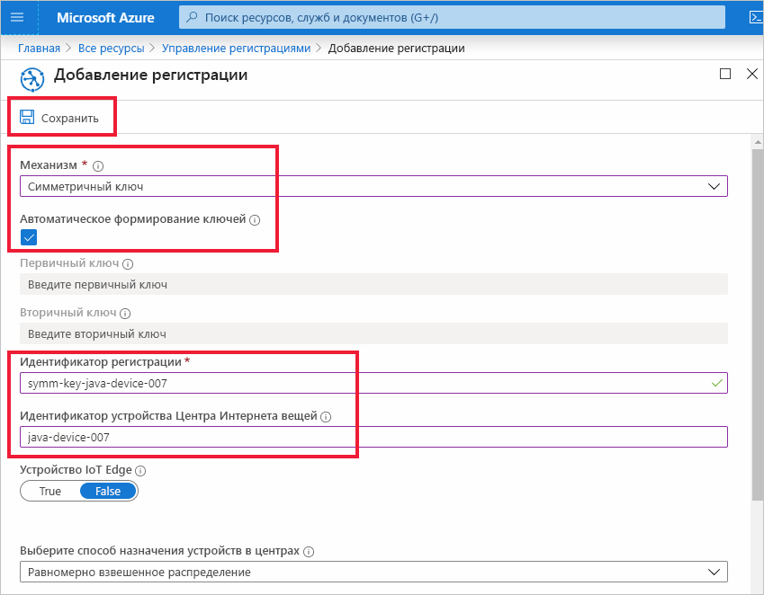
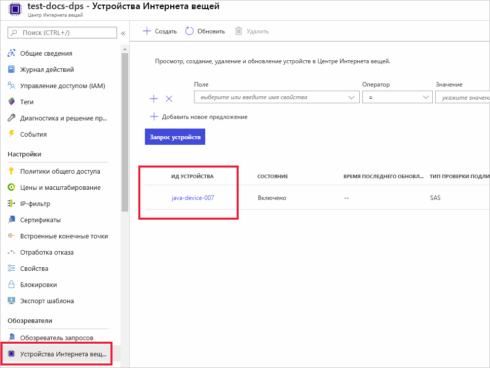

# <a name="quickstart-provision-a-simulated-device-to-iot-hub-with-symmetric-keys"></a>Подготовка имитированного устройства в Центре Интернета вещей с использованием симметричных ключей

В этом кратком руководстве вы узнаете, как создать и запустить симулятор устройств на компьютере для разработки Windows. Вы настроите имитированное устройство на использование симметричного ключа для прохождения аутентификации в экземпляре Службы подготовки устройств (DPS) и назначения центру Интернета вещей. Для моделирования последовательности загрузки устройства, которая инициирует подготовку, будет использоваться пример кода из [пакетов SDK Azure IoT для Java](https://github.com/Azure/azure-iot-sdk-java). Устройство будет распознано по отдельной регистрации в экземпляре службы DPS и назначено Центру Интернета вещей.

Хотя в этой статье показано, как выполнить подготовку с использованием отдельной регистрации, вы можете использовать группы регистрации. При использовании групп регистрации существуют некоторые отличия. Например, необходимо использовать производный ключ устройства с уникальным идентификатором регистрации. Хотя группы регистрации с использованием симметричных ключей не ограничиваются устаревшими устройствами, пример группы регистрации см.[How to provision legacy devices using Symmetric key attestation](how-to-legacy-device-symm-key.md) (Как подготовить устаревшие устройства с использованием симметричных ключей). Дополнительные сведения см. в разделе [о групповых регистрациях](concepts-symmetric-key-attestation.md#group-enrollments).

Если вы не знакомы с процессом автоматической подготовки, см. раздел [Процесс подготовки](about-iot-dps.md#provisioning-process). 

Кроме того, прежде чем продолжить работу с этим кратким руководством, выполните шаги, описанные в статье [Настройка службы подготовки устройств для Центра Интернета вещей на портале Azure](./quick-setup-auto-provision.md). В этом руководстве предполагается, что экземпляр службы подготовки устройств уже создан.

В этой статье описывается использование рабочей станции под управлением Windows. Тем не менее эти процедуры можно выполнить и на Linux. Пример для Linux см. в статье [Подготовка к мультитенантности](how-to-provision-multitenant.md).


[!INCLUDE [quickstarts-free-trial-note](../../includes/quickstarts-free-trial-note.md)]


## <a name="prerequisites"></a>Предварительные требования

* Убедитесь, что на вашем компьютере установлен [пакет SDK для Java SE версии 8](/azure/developer/java/fundamentals/java-jdk-long-term-support) или более поздней.

* Скачайте и установите [Maven](https://maven.apache.org/install.html).

* Установите последнюю версию [Git](https://git-scm.com/download/).

<a id="setupdevbox"></a>

## <a name="prepare-the-java-sdk-environment"></a>Подготовка среды пакета SDK для Java 

1. Установите на компьютер систему Git и добавьте ее в переменные среды, доступные в командном окне. Последнюю версию средств `git` для установки, которая включает **Git Bash**, приложение командной строки для взаимодействия с локальным репозиторием Git, можно найти на [этой странице](https://git-scm.com/download/). 

2. Откройте командную строку. Клонируйте репозиторий GitHub для примера кода виртуального устройства:
    
    ```cmd/sh
    git clone https://github.com/Azure/azure-iot-sdk-java.git --recursive
    ```
3. Перейдите в корневой каталог `azure-iot-sdk-java` и создайте проект для скачивания всех необходимых пакетов.
   
   ```cmd/sh
   cd azure-iot-sdk-java
   mvn install -DskipTests=true
   ```

## <a name="create-a-device-enrollment"></a>Создание регистрации устройств

1. Войдите на [портал Azure](https://portal.azure.com), нажмите кнопку **Все ресурсы** в меню слева и откройте экземпляр Службы подготовки устройств (DPS).

2. Щелкните вкладку **Управление регистрациями**, а затем нажмите кнопку **Добавить индивидуальную регистрацию** в верхней области. 

3. В области **Добавление регистрации** введите приведенные ниже сведения, а затем нажмите кнопку **Сохранить**.

   - **Механизм**: выберите **симметричный ключ** как *механизм* аттестации удостоверения.

   - **Автоматически создавать ключи**: установите флажок.

   - **Идентификатор регистрации**: введите идентификатор регистрации для идентификации регистрации. Используйте только буквы в нижнем регистре, цифры и дефис ("-"). Например, **symm-key-java-device-007**.

   - **Идентификатор устройства Центра Интернета вещей**: введите идентификатор устройства. Например, **java-device-007**.

     

4. После сохранения регистрации **первичный** и **вторичный ключи** будут созданы и добавлены в запись регистрации. Запись о регистрации устройства по симметричному ключу отобразится как **symm-key-java-device-007** в столбце *Идентификатор регистрации* на вкладке *Индивидуальные регистрации*. 

    Откройте регистрацию и скопируйте значение сформированного **первичного ключа**. Вы будете использовать это значение ключа и **Идентификатор регистрации** позже при обновлении кода Java для устройства.


<a id="firstbootsequence"></a>

## <a name="simulate-device-boot-sequence"></a>Имитация последовательности загрузки устройства

В этом разделе вы обновите пример кода устройства для отправки последовательности загрузки устройства в экземпляр DPS. Эта последовательность загрузки приведет к тому, что устройство будет распознано, проверено и назначено Центру Интернета вещей, связанному с экземпляром DPS.

1. В меню Службы подготовки устройств выберите **Обзор** и запишите указанные там значения _Область идентификатора_ и _Provisioning Service Global Endpoint_ (Глобальная конечная точка службы подготовки).

    

2. Откройте пример кода для устройства Java для редактирования. Полный путь к примеру кода устройства:

    `azure-iot-sdk-java/provisioning/provisioning-samples/provisioning-symmetrickey-sample/src/main/java/samples/com/microsoft/azure/sdk/iot/ProvisioningSymmetricKeySampleSample.java`

   - Добавьте значения для _Область идентификатора_ и _Provisioning Service Global Endpoint_ (Глобальная конечная точка службы подготовки) экземпляра DPS. Также включите первичный симметричный ключ и идентификатор регистрации, выбранный для индивидуальной регистрации. Сохраните изменения. 

      ```java
        private static final String SCOPE_ID = "[Your scope ID here]";
        private static final String GLOBAL_ENDPOINT = "[Your Provisioning Service Global Endpoint here]";
        private static final String SYMMETRIC_KEY = "[Enter your Symmetric Key here]";
        private static final String REGISTRATION_ID = "[Enter your Registration ID here]";
      ```

3. Откройте окно командной строки для выполнения сборки. Перейдите к папке с примером подготовки проекта в репозитории с пакетом SDK для Java.

    ```cmd/sh
    cd azure-iot-sdk-java/provisioning/provisioning-samples/provisioning-symmetrickey-sample
    ```

4. Выполните сборку примера, а затем перейдите в папку `target`, чтобы выполнить созданный JAR-файл.

    ```cmd/sh
    mvn clean install
    cd target
    java -jar ./provisioning-symmetrickey-sample-{version}-with-deps.jar
    ```

5. Ожидаемый результат должен выглядеть следующим образом.

    ```cmd/sh
      Starting...
      Beginning setup.
      Waiting for Provisioning Service to register
      IotHUb Uri : <Your DPS Service Name>.azure-devices.net
      Device ID : java-device-007
      Sending message from device to IoT Hub...
      Press any key to exit...
      Message received! Response status: OK_EMPTY
    ```

6. На портале Azure перейдите в Центр Интернета вещей, связанный со службой подготовки, и откройте колонку **Обозреватель устройств**. После успешной подготовки имитированного устройства с симметричным ключом к концентратору, в колонке **Device Explorer** появится идентификатор этого устройства со значением **Включено** в столбце *Состояние*.  Если вы уже открывали колонку, прежде чем запустить пример приложения для устройства, возможно, потребуется нажать кнопку **Обновить** вверху. 

     

> [!NOTE]
> Если в записи регистрации для своего устройства вы изменили значение по умолчанию для *начального состояния двойника устройства*, требуемое состояние двойника будет извлечено из концентратора с последующим выполнением соответствующих действий. См. [общие сведения о двойниках устройств и их использовании в Центре Интернета вещей](../iot-hub/iot-hub-devguide-device-twins.md).
>


## <a name="clean-up-resources"></a>Очистка ресурсов

Если вы планируете продолжить работу с примером клиентского устройства, не удаляйте ресурсы, созданные в ходе работы с этим кратким руководством. Если вы не планируете продолжать работу, следуйте инструкциям ниже, чтобы удалить все созданные ресурсы.

1. Закройте окно выходных данных примера клиентского устройства на компьютере.
1. В меню слева на портале Azure щелкните **Все ресурсы** и откройте службу подготовки устройств. Откройте раздел **Управление регистрациями** для службы, а затем щелкните вкладку **Индивидуальные регистрации**. Установите флажок рядом с *идентификатором регистрации* устройства, которое вы зарегистрировали в рамках этого краткого руководства, и нажмите кнопку **Удалить** в верхней части панели. 
1. В меню слева на портале Azure щелкните **Все ресурсы** и выберите свой центр Интернета вещей. Откройте колонку **Устройства Интернета вещей** для нужного центра, установите флажок *Идентификатор устройства*, зарегистрированного в процессе работы с кратким руководством, и нажмите кнопку **Удалить** в верхней части панели.

## <a name="next-steps"></a>Дальнейшие действия

В этом кратком руководстве вы создали имитированное устройство на компьютере Windows и подготовили его для Центра Интернета вещей с использованием симметричного ключа в Службе подготовки устройств к добавлению в Центр Интернета вещей Azure на портале. Чтобы узнать, как выполнить программную регистрацию устройства X.509, изучите соответствующее краткое руководство. 

> [!div class="nextstepaction"]
> [Краткое руководство. Регистрация устройств X.509 в Службе подготовки устройств с помощью C#](quick-enroll-device-x509-java.md)