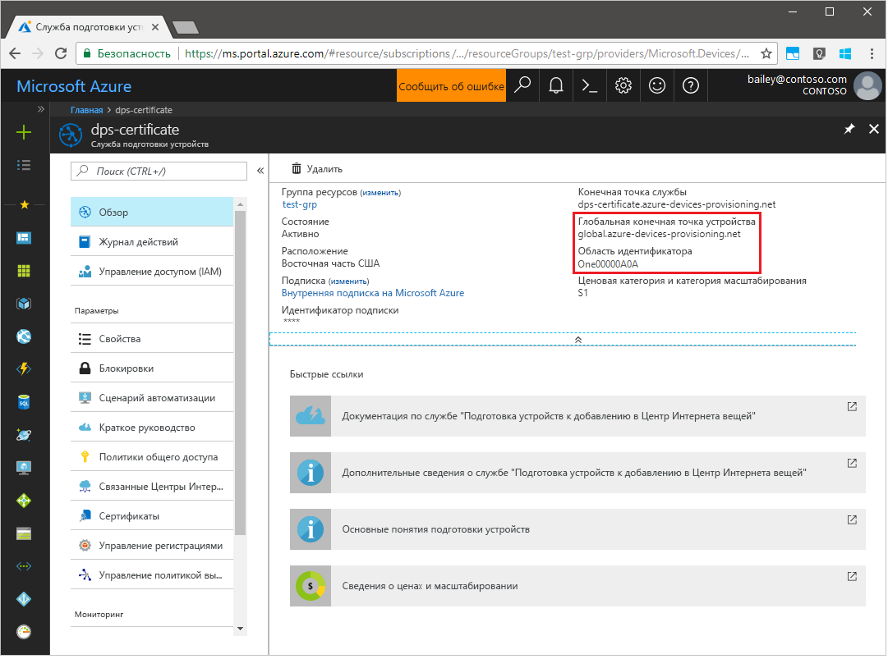
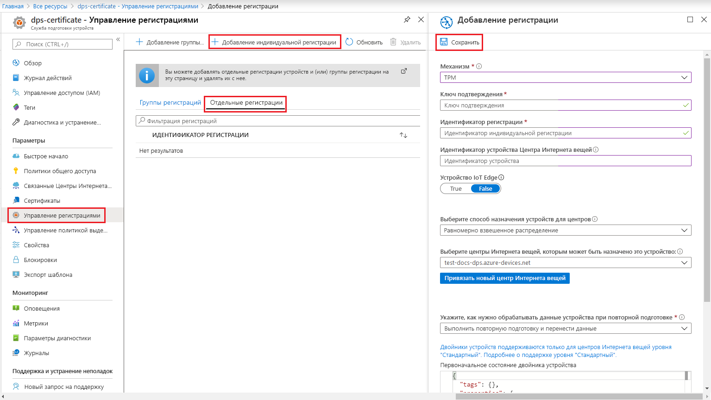

# <a name="quickstart-create-and-provision-a-simulated-tpm-device-using-java-device-sdk-for-azure-iot-hub-device-provisioning-service"></a>Краткое руководство. Создание и подготовка имитированного устройства доверенного платформенного модуля с помощью пакета SDK Java для Службы подготовки устройств к добавлению в Центр Интернета вещей.

[!INCLUDE [iot-dps-selector-quick-create-simulated-device-tpm](../../includes/iot-dps-selector-quick-create-simulated-device-tpm.md)]

С помощью этого краткого руководства вы создадите имитированное устройство Интернета вещей на компьютере Windows. В состав этого имитированного устройства входит симулятор TPM в качестве аппаратного модуля безопасности (HSM). Для подключения этого имитированного устройства к центру Интернета вещей вы будете использовать пример кода Java для устройства, а также индивидуальную регистрацию в Службе подготовки устройств (DPS).

## <a name="prerequisites"></a>Предварительные требования

- Ознакомьтесь с принципами [подготовки к работе](about-iot-dps.md#provisioning-process).
- Выполнение инструкций из краткого руководства по [настройке Службы подготовки устройств к добавлению в Центр Интернета вещей на портале Azure](./quick-setup-auto-provision.md).
- Учетная запись Azure с активной подпиской. [Создайте бесплатно](https://azure.microsoft.com/free/?ref=microsoft.com&utm_source=microsoft.com&utm_medium=docs&utm_campaign=visualstudio).
- [Пакет SDK для Java SE 8](/azure/developer/java/fundamentals/java-jdk-long-term-support).
- [Maven](https://maven.apache.org/install.html).
- [Git](https://git-scm.com/download/).

[!INCLUDE [IoT Device Provisioning Service basic](../../includes/iot-dps-basic.md)]

## <a name="prepare-the-environment"></a>Подготовка среды 

1. Убедитесь, что на вашем компьютере установлен [пакет SDK 8 для Java SE](/azure/developer/java/fundamentals/java-jdk-long-term-support).

1. Скачайте и установите [Maven](https://maven.apache.org/install.html).

1. Установите на компьютер систему `git` и добавьте ее в переменные среды, доступные в командном окне. Последнюю версию средств `git` для установки, которая включает **Git Bash**, приложение командной строки для взаимодействия с локальным репозиторием Git, можно найти на [этой странице](https://git-scm.com/download/). 

1. Откройте командную строку. Клонируйте из репозитория GitHub пример кода для имитации устройства.
    
    ```cmd/sh
    git clone https://github.com/Azure/azure-iot-sdk-java.git --recursive
    ```

1. Запустите симулятор [TPM](/windows/device-security/tpm/trusted-platform-module-overview), который будет выполнять роль модуля [HSM](https://azure.microsoft.com/blog/azure-iot-supports-new-security-hardware-to-strengthen-iot-security/) для имитированного устройства. Нажмите кнопку **Разрешить доступ**, чтобы разрешить вносить изменения в параметры _брандмауэра Windows_. Он ожидает передачи данных через сокет на портах 2321 и 2322. Не закрывайте это окно. Симулятор должен работать, пока вы не выполните все инструкции из этого краткого руководства. 

    ```cmd/sh
    .\azure-iot-sdk-java\provisioning\provisioning-tools\tpm-simulator\Simulator.exe
    ```

    

1. В отдельной командной строке перейдите к корневой папке и создайте зависимости для примера.

    ```cmd/sh
    cd azure-iot-sdk-java
    mvn install -DskipTests=true
    ```

1. Перейдите к папке с примерами.

    ```cmd/sh
    cd provisioning/provisioning-samples/provisioning-tpm-sample
    ```

1. Войдите на портал Azure, нажмите кнопку **Все ресурсы** в меню слева и откройте службу подготовки устройств. Запишите значения параметров _Область идентификатора_ и _Provisioning Service Global Endpoint_ (Глобальная конечная точка службы подготовки).

    

1. Измените `src/main/java/samples/com/microsoft/azure/sdk/iot/ProvisioningTpmSample.java`, добавив значения параметров _Область идентификатора_ и _Provisioning Service Global Endpoint_ (Глобальная конечная точка службы подготовки), как было указано ранее.  

    ```java
    private static final String idScope = "[Your ID scope here]";
    private static final String globalEndpoint = "[Your Provisioning Service Global Endpoint here]";
    private static final ProvisioningDeviceClientTransportProtocol PROVISIONING_DEVICE_CLIENT_TRANSPORT_PROTOCOL = ProvisioningDeviceClientTransportProtocol.HTTPS;
    ```
    Сохраните файл.

1. Выполните следующие команды, чтобы выполнить сборку проекта, перейдите в целевую папку и выполните созданный JAR-файл. Замените заполнитель `version` своей версией Java.

    ```cmd/sh
    mvn clean install
    cd target
    java -jar ./provisioning-tpm-sample-{version}-with-deps.jar
    ```

1. Запустится программа. Запишите значения параметров _Ключ подтверждения_ и _Идентификатор регистрации_ для следующего раздела и оставьте программу запущенной.

    
    

## <a name="create-a-device-enrollment-entry"></a>Создание записи о регистрации устройства

Служба подготовки устройств Интернета вещей Azure поддерживает два типа регистрации:

- [группы регистрации](concepts-service.md#enrollment-group) — используются для регистрации нескольких связанных устройств;
- [индивидуальная регистрация](concepts-service.md#individual-enrollment) — используется для регистрации одного устройства.

В этой статье описана индивидуальная регистрация.

1. Войдите на портал Azure, нажмите кнопку **Все ресурсы** в меню слева и откройте службу подготовки устройств.

1. В меню службы подготовки устройств выберите **Управление регистрациями**. Выберите вкладку **Индивидуальные регистрации** и нажмите кнопку **Добавить индивидуальную регистрацию** вверху. 

1. На панели **Добавление регистрации** введите следующие сведения:
   - Выберите **доверенный платформенный модуль (TPM)** как *механизм* аттестации удостоверения.
   - Введите записанные ранее *идентификатор регистрации* и *ключ подтверждения* для вашего устройства доверенного платформенного модуля.
   - Выберите Центр Интернета вещей, связанный с вашей службой подготовки.
   - При необходимости можно указать следующие сведения:
       - Укажите уникальный *идентификатор устройства*. Убедитесь, что при назначении имен устройства не используются конфиденциальные данные. Если вы решите его не предоставлять, вместо него для идентификации устройства будет использоваться идентификатор регистрации.
       - Обновите **начальное состояние двойника устройства**, используя требуемую начальную конфигурацию для устройства.
   - По завершении нажмите кнопку **Сохранить**. 

       

   После успешной регистрации *идентификатор регистрации* устройства отобразится в списке под вкладкой *Индивидуальные регистрации*. 


## <a name="simulate-the-device"></a>Имитация устройства

1. В окне командной строки, в котором выполняется пример кода Java на компьютере, нажмите клавишу *ВВОД*, чтобы приложение продолжило работу. Обратите внимание на сообщения, которые имитируют загрузку устройства и его подключение к службе подготовки устройств для получения информации Центра Интернета вещей.  

    

1. После подготовки имитированного устройства для центра Интернета вещей, подключенного к службе подготовки, идентификатор устройства отобразится в колонке **Устройства Интернета вещей**.

     

    Если в записи регистрации для своего устройства вы изменили значение по умолчанию для *начального состояния двойника устройства*, требуемое состояние двойника будет извлечено из концентратора с последующим выполнением соответствующих действий. См. [общие сведения о двойниках устройств и их использовании в Центре Интернета вещей](../iot-hub/iot-hub-devguide-device-twins.md).


## <a name="clean-up-resources"></a>Очистка ресурсов

Если вы планируете продолжить работу с примером клиентского устройства, не удаляйте ресурсы, созданные в ходе работы с этим кратким руководством. Если вы не планируете продолжать работу, следуйте инструкциям ниже, чтобы удалить все созданные ресурсы.

1. Закройте окно выходных данных примера клиентского устройства на компьютере.
1. Закройте окно симулятора доверенного платформенного модуля на компьютере.
1. В меню слева на портале Azure щелкните **Все ресурсы** и откройте службу подготовки устройств. Откройте колонку **Управление регистрациями** для службы, а затем щелкните вкладку **Индивидуальные регистрации**. Установите флажок рядом с *идентификатором регистрации* устройства, которое вы зарегистрировали в рамках этого краткого руководства, и нажмите кнопку **Удалить** в верхней части панели. 
1. В меню слева на портале Azure щелкните **Все ресурсы** и выберите свой центр Интернета вещей. Откройте колонку **Устройства Интернета вещей** для нужного концентратора, установите флажок *Идентификатор устройства*, зарегистрированного в процессе работы с кратким руководством, и нажмите кнопку **Удалить** в верхней части панели.

## <a name="next-steps"></a>Дальнейшие действия

Вы создали имитированное устройство доверенного платформенного модуля на компьютере и подготовили его для центра Интернета вещей с помощью Службы подготовки устройств к добавлению в Центр Интернета вещей. Чтобы узнать, как программными средствами зарегистрировать устройство доверенного платформенного модуля, изучите соответствующее краткое руководство. 

> [!div class="nextstepaction"]
> [Краткое руководство. Регистрация устройств TPM в службе подготовки устройств Центра Интернета вещей с помощью пакета SDK для службы Java](quick-enroll-device-tpm-java.md)