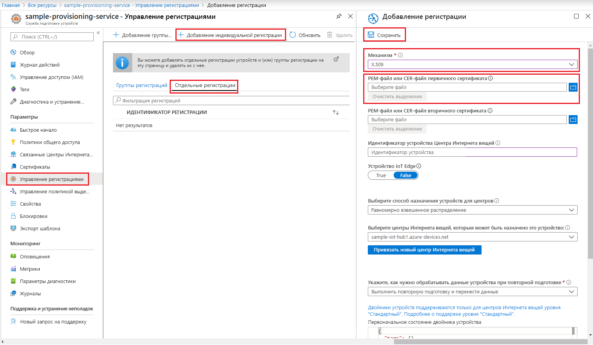
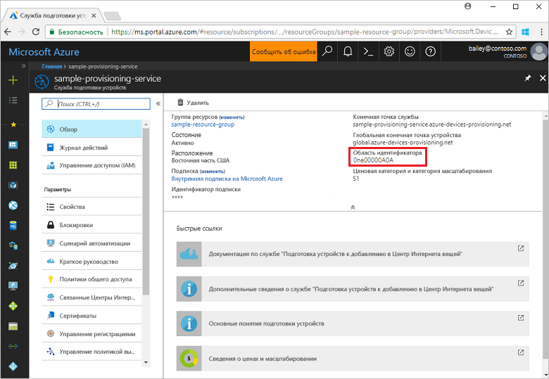

# <a name="quickstart-create-and-provision-a-simulated-x509-device-using-c-device-sdk-for-iot-hub-device-provisioning-service"></a>Краткое руководство. Создание и подготовка имитированного устройства X.509 с помощью пакета SDK для устройства C# для службы подготовки устройств Центра Интернета вещей
[!INCLUDE [iot-dps-selector-quick-create-simulated-device-x509](../../includes/iot-dps-selector-quick-create-simulated-device-x509.md)]

В этой статье описывается, как с помощью [примеров Azure IoT для C#](https://github.com/Azure-Samples/azure-iot-samples-csharp) имитировать устройство X.509 на компьютере для разработки под управлением ОС Windows. В примере также показано, как подключить это имитированное устройство к Центру Интернета вещей с помощью службы подготовки устройств.

Если вы не знакомы с процессом автоматической подготовки устройств, обязательно прочтите [эту статью](concepts-auto-provisioning.md). Кроме того, прежде чем продолжить, выполните инструкции по [настройке службы "Подготовка устройств к добавлению в Центр Интернета вещей" на портале Azure](./quick-setup-auto-provision.md). 

Служба подготовки устройств Интернета вещей Azure поддерживает два типа регистрации:
- [Группы регистрации](concepts-service.md#enrollment-group). Используются для регистрации нескольких связанных устройств.
- [Индивидуальные регистрации](concepts-service.md#individual-enrollment). Предназначены для регистрации одного устройства.

В этой статье описана индивидуальная регистрация.

[!INCLUDE [IoT Device Provisioning Service basic](../../includes/iot-dps-basic.md)]

<a id="setupdevbox"></a>
## <a name="prepare-the-development-environment"></a>Подготовка среды разработки 

1. Установите на компьютере [пакет SDK для .NET Core 2.1 или более поздней версии](https://www.microsoft.com/net/download/windows). 

1. Установите на компьютер систему `git` и добавьте ее в переменные среды, доступные в командном окне. Последнюю версию средств `git` для установки, которая включает **Git Bash**, приложение командной строки для взаимодействия с локальным репозиторием Git, можно найти на [этой странице](https://git-scm.com/download/). 

1. Откройте окно командной строки или Git Bash. Клонируйте репозиторий GitHub с примерами на C# для Интернета вещей Azure:
    
    ```cmd
    git clone https://github.com/Azure-Samples/azure-iot-samples-csharp.git
    ```

## <a name="create-a-self-signed-x509-device-certificate-and-individual-enrollment-entry"></a>Создание самозаверяющего сертификата устройства X.509 и запись отдельной регистрации

В этом разделе описано, как использовать самозаверяющий сертификат X.509. При этом обязательно учитывайте следующее:

* Самозаверяющие сертификаты предназначены только для тестирования и не должны использоваться в рабочей среде.
* Срок действия самозаверяющего сертификата по умолчанию составляет один год.

Вы используете пример кода из репозитория [Provisioning Device Client Sample - X.509 Attestation](https://github.com/Azure-Samples/azure-iot-samples-csharp/tree/master/provisioning/Samples/device/X509Sample) (Пример клиента для подготовки устройств. Аттестация X.509), чтобы создать сертификат, который будет использоваться с отдельной записью регистрации для имитированного устройства.


1. В окне командной строки замените каталоги каталогом проекта в примере подготовки устройства X.509.

    ```cmd
    cd .\azure-iot-samples-csharp\provisioning\Samples\device\X509Sample
    ```

2. Пример кода настроен на использование сертификатов X.509, хранящихся в защищенном паролем форматированном файле PKCS12 (certificate.pfx). Кроме того, дальше в этом руководстве для создания индивидуальной регистрации вам понадобится файл сертификата открытого ключа (certificate.cer). Чтобы создать самозаверяющий сертификат и связанные CER- и PFX-файлы, выполните следующую команду:

    ```cmd
    powershell .\GenerateTestCertificate.ps1
    ```

3. Появится запрос на ввод пароля для PFX-файла. Запомните этот пароль, он понадобится для выполнения примера кода.

      


4. Войдите на портал Azure, нажмите кнопку **Все ресурсы** в меню слева и откройте службу подготовки.

5. В колонке сводки службы подготовки устройств выберите **Управление регистрациями**. Выберите вкладку **Индивидуальные регистрации** и нажмите кнопку **Добавить индивидуальную регистрацию** вверху. 

6. На панели **Добавление регистрации** введите следующие сведения:
   - Выберите **X.509** как *механизм* аттестации удостоверения.
   - В поле *Primary certificate .pem or .cer file* (PEM-файл или CER-файл первичного сертификата) щелкните *Select a file* (Выбрать файл), чтобы выбрать созданный ранее файл сертификата **certificate.cer**.
   - Оставьте поле **идентификатор устройства** пустым. Устройство будет подготовлено с идентификатором, который назначен общему имени в сертификате X.509, т. е. **iothubx509device1**. Это имя также будет использоваться в качестве идентификатора регистрации для записи индивидуальной регистрации. 
   - При необходимости можно указать следующие сведения:
       - Выберите Центр Интернета вещей, связанный с вашей службой подготовки.
       - Обновите **начальное состояние двойника устройства**, используя требуемую начальную конфигурацию для устройства.
   - Затем нажмите кнопку **Сохранить**. 

     [](./media/quick-create-simulated-device-x509-csharp/device-enrollment.png#lightbox)
    
   После регистрации запись о регистрации устройства X.509 отобразится как **iothubx509device1** в столбце *Идентификатор регистрации* на вкладке *Индивидуальные регистрации*. 

## <a name="provision-the-simulated-device"></a>Подготовка имитированного устройства

1. Выберите колонку **Обзор** службы подготовки и запишите значение **_области идентификатора_** .

     


2. Введите следующую команду, чтобы создать и запустить пример подготавливаемого устройства X.509. Замените значение `<IDScope>` значением области идентификатора для службы подготовки. 

    ```cmd
    dotnet run <IDScope>
    ```

3. Когда появится запрос, введите пароль для PFX-файла, созданного ранее. Обратите внимание на сообщения, которые имитируют загрузку устройства и его подключение к службе подготовки устройств для получения информации Центра Интернета вещей. 

     

4. Убедитесь, что устройство подготовлено. После подготовки имитированного устройства для Центра Интернета вещей, подключенного к службе подготовки, идентификатор устройства отобразится в колонке устройств **Центра Интернета вещей**. 

     

    Если в записи регистрации для своего устройства вы изменили значение по умолчанию для *начального состояния двойника устройства*, требуемое состояние двойника будет извлечено из концентратора с последующим выполнением соответствующих действий. См. [общие сведения о двойниках устройств и их использовании в Центре Интернета вещей](../iot-hub/iot-hub-devguide-device-twins.md).


## <a name="clean-up-resources"></a>Очистка ресурсов

Если вы планируете продолжить работу с примером клиентского устройства, не удаляйте ресурсы, созданные в ходе работы с этим руководством. Если вы не планируете продолжать работу, следуйте инструкциям ниже, чтобы удалить все созданные ресурсы.

1. Закройте окно выходных данных примера клиентского устройства на компьютере.
1. Закройте окно симулятора доверенного платформенного модуля на компьютере.
1. В меню слева на портале Azure щелкните **Все ресурсы** и откройте службу подготовки устройств. В верхней части колонки **Все ресурсы** щелкните **Удалить**.  
1. В меню слева на портале Azure нажмите кнопку **Все ресурсы** и выберите свой Центр Интернета вещей. В верхней части колонки **Все ресурсы** щелкните **Удалить**.  

## <a name="next-steps"></a>Дополнительная информация

В этом кратком руководстве вы создали имитированное устройство X.509 на компьютере Windows и подготовили его для Центра Интернета вещей с помощью службы подготовки устройств Центра Интернета вещей Azure на портале. Чтобы узнать, как выполнить программную регистрацию устройства X.509, изучите соответствующее краткое руководство. 

> [!div class="nextstepaction"]
> [Краткое руководство Azure. Регистрация устройств X.509 в службе подготовки устройств Центра Интернета вещей](quick-enroll-device-x509-csharp.md)
