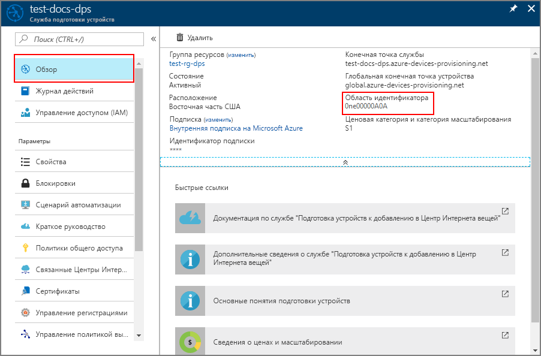
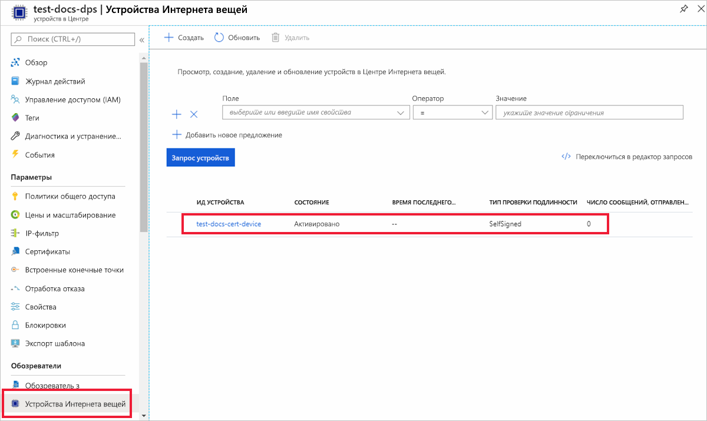

# <a name="quickstart-provision-an-x509-simulated-device-using-the-azure-iot-c-sdk"></a>Краткое руководство. Подготовка имитированного устройства X.509 с помощью пакета SDK для устройства C Интернета вещей Azure

[!INCLUDE [iot-dps-selector-quick-create-simulated-device-x509](../../includes/iot-dps-selector-quick-create-simulated-device-x509.md)]

В этом кратком руководстве вы узнаете, как создать и запустить симулятор устройства X.509 на компьютере Windows, на котором ведется разработка. Вы настроите это имитированное устройство, которое будет назначено центру Интернета вещей, зарегистрировав его в экземпляре службы подготовки устройств. Пример кода из [пакета SDK для устройства C Интернета вещей Azure](https://github.com/Azure/azure-iot-sdk-c) будет использоваться для моделирования последовательности загрузки устройства. Устройство будет распознано по регистрации в службе подготовки и назначено Центру Интернета вещей.

Если вы не знакомы с процессом автоматической подготовки, см. раздел [Роли и учетные записи Azure](about-iot-dps.md#provisioning-process). Кроме того, прежде чем продолжить работу с этим кратким руководством, выполните шаги, описанные в статье [Настройка службы подготовки устройств для Центра Интернета вещей на портале Azure](quick-setup-auto-provision.md). 

Служба подготовки устройств Интернета вещей Azure поддерживает два типа регистрации:

* [Группы регистрации](concepts-service.md#enrollment-group). Используются для регистрации нескольких связанных устройств.
* [Индивидуальные регистрации](concepts-service.md#individual-enrollment). Предназначены для регистрации одного устройства.

В этой статье описана индивидуальная регистрация.

[!INCLUDE [quickstarts-free-trial-note](../../includes/quickstarts-free-trial-note.md)]

## <a name="prerequisites"></a>Предварительные требования

Приведенные ниже предварительные требования касаются среды разработки Windows. При использовании Linux или macOS ознакомьтесь с соответствующим разделом в статье [Подготовка среды разработки](https://github.com/Azure/azure-iot-sdk-c/blob/master/doc/devbox_setup.md) из документации к пакету SDK.

* [Visual Studio 2019](https://visualstudio.microsoft.com/vs/) с включенной рабочей нагрузкой [Разработка классических приложений на C++](/cpp/ide/using-the-visual-studio-ide-for-cpp-desktop-development). Visual Studio 2015 или Visual Studio 2017 также поддерживаются.

* Установите последнюю версию [Git](https://git-scm.com/download/).

## <a name="prepare-a-development-environment-for-the-azure-iot-c-sdk"></a>Подготовка среды разработки для пакета SDK для устройства C Интернета вещей Azure

В этом разделе вы подготовите среду разработки, которая используется для создания [пакета SDK для устройства C Интернета вещей Azure](https://github.com/Azure/azure-iot-sdk-c) с примером кода для последовательности загрузки устройства X.509.

1. Скачайте [систему сборки CMake](https://cmake.org/download/).

    **Перед** установкой `CMake` очень важно установить на компьютер необходимые компоненты Visual Studio (Visual Studio с рабочей нагрузкой "Разработка классических приложений на C++"). После установки компонентов и проверки загрузки установите систему сборки CMake.

2. Найдите имя тега для [последнего выпуска](https://github.com/Azure/azure-iot-sdk-c/releases/latest) пакета SDK.

3. Откройте командную строку или оболочку Git Bash. Выполните приведенные ниже команды, чтобы клонировать репозиторий GitHub с последним выпуском [пакета SDK Azure IoT для C](https://github.com/Azure/azure-iot-sdk-c). Используйте найденный тег в качестве значения для параметра `-b`:

    ```cmd/sh
    git clone -b <release-tag> https://github.com/Azure/azure-iot-sdk-c.git
    cd azure-iot-sdk-c
    git submodule update --init
    ```

    Выполнение этой операции может занять несколько минут.

4. Создайте подкаталог `cmake` в корневом каталоге репозитория Git и перейдите в эту папку. В каталоге `azure-iot-sdk-c` выполните следующие команды:

    ```cmd/sh
    mkdir cmake
    cd cmake
    ```

5. В примере кода используется сертификат X.509, который обеспечивает аттестацию с помощью аутентификации на основе X.509. Выполните приведенную ниже команду, чтобы создать версию пакета SDK для используемой платформы разработки, которая включает в себя клиент подготовки устройств. Эта команда также создает решение Visual Studio для имитированного устройства в каталоге `cmake`.

    ```cmd
    cmake -Duse_prov_client:BOOL=ON ..
    ```

    Если `cmake` не удастся найти компилятор C++, могут возникнуть ошибки сборки во время выполнения предыдущей команды. В этом случае попробуйте, выполнить эту команду в [командной строке Visual Studio](/dotnet/framework/tools/developer-command-prompt-for-vs).

    После успешного создания последние несколько строк выходных данных выглядят следующим образом:

    ```cmd/sh
    $ cmake -Duse_prov_client:BOOL=ON ..
    -- Building for: Visual Studio 16 2019
    -- The C compiler identification is MSVC 19.23.28107.0
    -- The CXX compiler identification is MSVC 19.23.28107.0

    ...

    -- Configuring done
    -- Generating done
    -- Build files have been written to: C:/code/azure-iot-sdk-c/cmake
    ```

## <a name="create-a-self-signed-x509-device-certificate"></a>Создание самозаверяющего сертификата для устройства X.509

В этом разделе мы будем использовать самозаверяющий сертификат X.509. При этом важно учитывать следующее:

* Самозаверяющие сертификаты предназначены только для тестирования и не должны использоваться в рабочей среде.
* Срок действия самозаверяющего сертификата по умолчанию составляет один год.

Вы воспользуетесь примером кода из пакета SDK для Интернета вещей Azure для С, чтобы создать сертификат, который будет использоваться с отдельной записью регистрации для имитированного устройства.

1. Запустите Visual Studio и откройте новый файл решения с именем `azure_iot_sdks.sln`. Этот файл решения находится в папке `cmake`, созданной ранее в корневом каталоге репозитория Git azure-iot-sdk-c.

2. В меню Visual Studio выберите **Построить** > **Построить решение** для создания всех проектов в решении.

3. В окне *Обозреватель решений* Visual Studio перейдите в папку **Provision\_Tools**. Щелкните проект **dice\_device\_enrollment** правой кнопкой мыши и выберите параметр **Назначить запускаемым проектом**.

4. В меню Visual Studio выберите **Отладка** > **Запуск без отладки**, чтобы запустить решение. При появлении запроса введите **i** в окне вывода для индивидуальной регистрации.

    В окне вывода появится локально созданный самозаверяющий сертификат X.509 для имитированного устройства. Скопируйте в буфер обмена выходные данные, начиная со строки **-----BEGIN CERTIFICATE-----** и заканчивая строкой **-----END CERTIFICATE-----** . Не забудьте скопировать и эти две строки. Вам нужен только первый сертификат из окна выходных данных.

5. С помощью текстового редактора сохраните сертификат в новый файл с именем **_X509testcert.pem_** .

## <a name="create-a-device-enrollment-entry-in-the-portal"></a>Создание записи регистрации устройств на портале

1. Войдите на портал Azure, нажмите кнопку **Все ресурсы** в меню слева и откройте службу подготовки устройств.

2. Щелкните вкладку **Управление регистрациями**, а затем нажмите кнопку **Добавить индивидуальную регистрацию** в верхней области.

3. В области **Добавление регистрации** введите приведенные ниже сведения, а затем нажмите кнопку **Сохранить**.

    * **Механизм**. Выберите **X.509** как *механизм* аттестации удостоверения.
    * **PEM-файл или CER-файл первичного сертификата.** Щелкните **Выберите файл**, чтобы выбрать созданный ранее файл сертификата — X509testcert.pem.
    * **Идентификатор устройства Центра Интернета вещей**. Введите **test-docs-cert-device**, чтобы присвоить устройству идентификатор.

      [](./media/quick-create-simulated-device-x509/device-enrollment.png#lightbox)

      После успешной регистрации устройство X.509 отобразится как **riot-device-cert** в столбце *Идентификатор регистрации* на вкладке *Индивидуальные регистрации*. 

## <a name="simulate-first-boot-sequence-for-the-device"></a>Имитация последовательности первой загрузки для устройства

В этом разделе вы обновите пример кода для отправки последовательности загрузки устройства в экземпляр службы подготовки устройств. Эта последовательность загрузки приведет к тому, что устройство будет распознано и назначено Центру Интернета вещей, связанному с экземпляром службы подготовки устройств.

1. На портале Azure выберите вкладку **Обзор** службы подготовки устройств и запишите значение **_области идентификатора_** .

     

2. В окне *Обозреватель решений* Visual Studio перейдите в папку **Provision\_Samples**. Разверните пример проекта с именем **prov\_dev\_client\_sample**. Разверните **исходные файлы** и откройте **prov\_dev\_client\_sample.c**.

3. Найдите константу `id_scope` и замените ее значение ранее скопированным значением **области идентификатора**. 

    ```c
    static const char* id_scope = "0ne00002193";
    ```

4. Найдите определение функции `main()` в том же файле. Проверьте, чтобы переменной `hsm_type` было задано значение `SECURE_DEVICE_TYPE_X509`, а не `SECURE_DEVICE_TYPE_TPM`, как показано ниже.

    ```c
    SECURE_DEVICE_TYPE hsm_type;
    //hsm_type = SECURE_DEVICE_TYPE_TPM;
    hsm_type = SECURE_DEVICE_TYPE_X509;
    ```

5. Щелкните проект **prov\_dev\_client\_sample** правой кнопкой мыши и выберите пункт **Назначить запускаемым проектом**.

6. В меню Visual Studio выберите **Отладка** > **Запуск без отладки**, чтобы запустить решение. При появлении запроса перестроить проект щелкните **Да**, чтобы перестроить его перед запуском.

    Следующий результат является примером успешной загрузки примера клиента устройства подготовки и подключения к экземпляру службы подготовки для получения сведений о Центре Интернета вещей и регистрации:

    ```cmd
    Provisioning API Version: 1.2.7

    Registering... Press enter key to interrupt.

    Provisioning Status: PROV_DEVICE_REG_STATUS_CONNECTED
    Provisioning Status: PROV_DEVICE_REG_STATUS_ASSIGNING
    Provisioning Status: PROV_DEVICE_REG_STATUS_ASSIGNING

    Registration Information received from service:
    test-docs-hub.azure-devices.net, deviceId: test-docs-cert-device
    ```

7. На портале перейдите в центр Интернета вещей, связанный со службой подготовки, и щелкните вкладку **Устройства Интернета вещей**. Когда имитированное устройство X.509 будет подготовлено для центра, в колонке **Устройства Интернета вещей** появится идентификатор этого устройства со значением *Включено* в столбце **Состояние**. Возможно, вам потребуется нажать кнопку **Обновить** в верхней области. 

     

## <a name="clean-up-resources"></a>Очистка ресурсов

Если вы планируете продолжить работу с примером клиентского устройства, не удаляйте ресурсы, созданные в ходе работы с этим кратким руководством. Если вы не планируете продолжать работу, следуйте инструкциям ниже, чтобы удалить все созданные ресурсы.

1. Закройте окно выходных данных примера клиентского устройства на компьютере.
1. В меню слева на портале Azure щелкните **Все ресурсы** и откройте службу подготовки устройств. Откройте раздел **Управление регистрациями** для службы, а затем щелкните вкладку **Индивидуальные регистрации**. Установите флажок рядом с *идентификатором регистрации* устройства, которое вы зарегистрировали в рамках этого краткого руководства, и нажмите кнопку **Удалить** в верхней части панели. 
1. В меню слева на портале Azure щелкните **Все ресурсы** и выберите свой центр Интернета вещей. Откройте колонку **Устройства Интернета вещей** для нужного центра, установите флажок *Идентификатор устройства*, зарегистрированного в процессе работы с кратким руководством, и нажмите кнопку **Удалить** в верхней части панели.

## <a name="next-steps"></a>Дальнейшие действия

В рамках этого краткого руководства вы создали имитированное устройство X.509 на компьютере Windows и подготовили его для центра Интернета вещей с помощью Службы подготовки устройств к добавлению в Центр Интернета вещей Azure на портале. Чтобы узнать, как выполнить программную регистрацию устройства X.509, изучите соответствующее краткое руководство. 

> [!div class="nextstepaction"]
> [Краткое руководство. Регистрация устройств X.509 в Службе подготовки устройств с помощью C#](quick-enroll-device-x509-java.md)