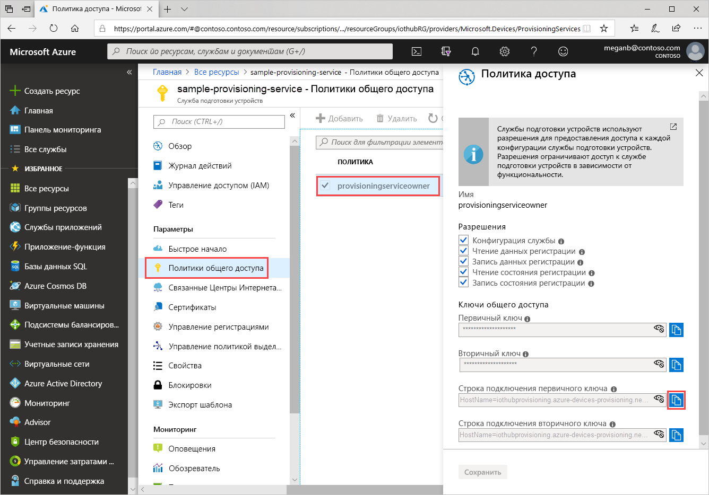
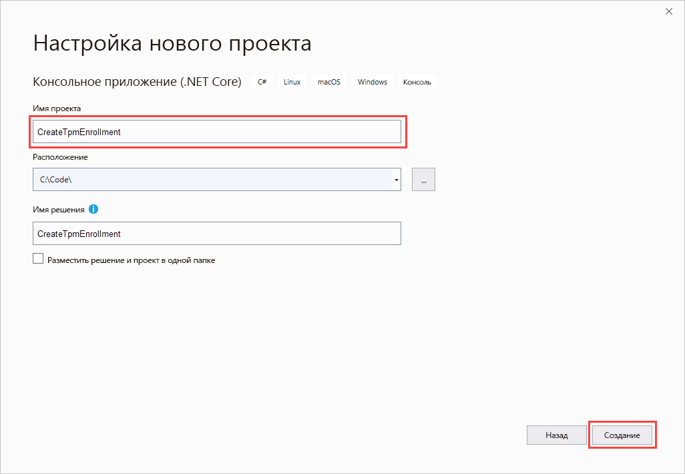
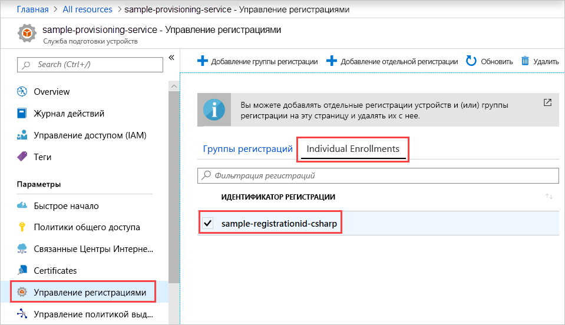

# <a name="enroll-tpm-device-to-iot-hub-device-provisioning-service-using-c-service-sdk"></a>Регистрация устройств TPM в службе "Подготовка устройств к добавлению в Центр Интернета вещей" пакета SDK для служб C#

[!INCLUDE [iot-dps-selector-quick-enroll-device-tpm](../../includes/iot-dps-selector-quick-enroll-device-tpm.md)]

В этой статье показано, как программными средствами создать отдельную регистрацию устройства TPM в службе "Подготовка устройств к добавлению в Центр Интернета вещей" с помощью [пакета SDK для служб C#](https://github.com/Azure/azure-iot-sdk-csharp) и примера приложения C# .NET Core. С помощью этой записи отдельной регистрации вы можете по мере необходимости регистрировать имитированные устройства TPM в службе подготовки. В этой статье описана работа с компьютером под управлением Windows, но эта процедура применима для компьютеров под управлением как Windows, так и Linux.

## <a name="prepare-the-development-environment"></a>Подготовка среды разработки

1. Убедитесь, что на компьютере установлен [Visual Studio 2019](https://www.visualstudio.com/vs/).

1. Убедитесь, что на компьютере установлен пакет SDK для [.NET Core](https://www.microsoft.com/net/download/windows).

1. Выполните инструкции по [настройке службы подготовки устройств к добавлению в Центр Интернета вещей на портале Azure](./quick-setup-auto-provision.md).

1. (Необязательно). Если вы намерены зарегистрировать имитированное устройство в конце этого руководства, выполните процедуру из статьи [Создание и подготовка имитированного устройства доверенного платформенного модуля с помощью пакета SDK службы устройства C# для службы подготовки устройств Центра Интернета вещей](quick-create-simulated-device-tpm-csharp.md) вплоть до шага, на котором вы получаете ключ подтверждения для устройства. Сохраните ключ подтверждения, идентификатор регистрации и, при необходимости, идентификатор устройства, поскольку позже в этом кратком руководстве они понадобятся.

   > [!NOTE]
   > Не выполняйте шаги по созданию отдельной регистрации с помощью портала Azure.

## <a name="get-the-connection-string-for-your-provisioning-service"></a>Получение строки подключения к службе подготовки

Чтобы запустить пример из этого краткого руководства, требуется строка подключения к службе подготовки.

1. Войдите на портал Azure, выберите **Все ресурсы**, а затем службу подготовки устройств.

1. Выберите **Политики общего доступа**, а затем нужную политику доступа, чтобы открыть ее свойства. В разделе **Политика доступа** скопируйте и сохраните строку подключения первичного ключа.

    

## <a name="create-the-individual-enrollment-sample"></a>Создание примера для отдельной регистрации

В этом разделе показано, как создать консольное приложение .NET Core, которое добавляет отдельные регистрации устройства TPM в службу подготовки. С некоторыми изменениями c помощью этих шагов можно также создать консольное приложение [Windows IoT Базовая](https://developer.microsoft.com/en-us/windows/iot), чтобы добавлять отдельную регистрацию. Дополнительные сведения о разработке с помощью основных служб IoT см. в [этой документации](https://docs.microsoft.com/windows/iot-core/).

1. Откройте Visual Studio и выберите **Создать проект**. В окне **Создание проекта** выберите шаблон проекта **Консольное приложение (.NET Core)** для C# и нажмите кнопку **Далее**.

1. Присвойте проекту имя *CreateTpmEnrollment* и выберите команду **Создать**.

    

1. В **обозревателе решений** щелкните правой кнопкой мыши проект **CreateTpmEnrollment** и выберите **Управление пакетами NuGet**.

1. В окне **Диспетчер пакетов NuGet** щелкните **Обзор**, найдите и выберите **Microsoft.Azure.Devices.Provisioning.Service**, а затем щелкните **Установить**.

   

   В результате скачивается и устанавливается [клиентский пакет NuGet для службы "Подготовка устройств к добавлению в Центр Интернета вещей"](https://www.nuget.org/packages/Microsoft.Azure.Devices.Provisioning.Service/) и его зависимости, а также добавляется соответствующая ссылка.

1. Добавьте следующие `using` операторы после других `using` операторов вверху `Program.cs`:
  
   ```csharp
   using System.Threading.Tasks;
   using Microsoft.Azure.Devices.Provisioning.Service;
   ```

1. Добавьте следующие поля в класс `Program` и внесите перечисленные изменения.

   ```csharp
   private static string ProvisioningConnectionString = "{Your provisioning service connection string}";
   private const string RegistrationId = "sample-registrationid-csharp";
   private const string TpmEndorsementKey =
       "AToAAQALAAMAsgAgg3GXZ0SEs/gakMyNRqXXJP1S124GUgtk8qHaGzMUaaoABgCAAEMAEAgAAAAAAAEAxsj2gUS" +
       "cTk1UjuioeTlfGYZrrimExB+bScH75adUMRIi2UOMxG1kw4y+9RW/IVoMl4e620VxZad0ARX2gUqVjYO7KPVt3d" +
       "yKhZS3dkcvfBisBhP1XH9B33VqHG9SHnbnQXdBUaCgKAfxome8UmBKfe+naTsE5fkvjb/do3/dD6l4sGBwFCnKR" +
       "dln4XpM03zLpoHFao8zOwt8l/uP3qUIxmCYv9A7m69Ms+5/pCkTu/rK4mRDsfhZ0QLfbzVI6zQFOKF/rwsfBtFe" +
       "WlWtcuJMKlXdD8TXWElTzgh7JS4qhFzreL0c1mI0GCj+Aws0usZh7dLIVPnlgZcBhgy1SSDQMQ==";
       
   // Optional parameters
   private const string OptionalDeviceId = "myCSharpDevice";
   private const ProvisioningStatus OptionalProvisioningStatus = ProvisioningStatus.Enabled;
   ```

   * Замените значение заполнителя `ProvisioningConnectionString` строкой подключения к службе подготовки, для которой необходимо создать регистрацию.

   * При необходимости можно изменить идентификатор регистрации, ключ подтверждения, идентификатор устройства и состояние подготовки.

   * Если вы подготавливали имитированное устройство на основе сведений из этой статьи и краткого руководства [Создание и подготовка имитированного устройства доверенного платформенного модуля с помощью пакета SDK службы устройства C# для службы подготовки устройств Центра Интернета вещей](quick-create-simulated-device-tpm-csharp.md), замените ключ подтверждения и идентификатор регистрации значениями, полученными в этом руководстве. Вы можете заменить идентификатор устройства значением, предлагаемым в руководстве, использовать собственное значение или использовать значения по умолчанию из этого примера.

1. Добавьте следующий метод в класс `Program`.  Этот код создает отдельную запись регистрации, а затем вызывает метод `CreateOrUpdateIndividualEnrollmentAsync` в `ProvisioningServiceClient`, чтобы добавить индивидуальную регистрацию в службу подготовки.

   ```csharp
   public static async Task RunSample()
   {
       Console.WriteLine("Starting sample...");

       using (ProvisioningServiceClient provisioningServiceClient =
               ProvisioningServiceClient.CreateFromConnectionString(ProvisioningConnectionString))
       {
           #region Create a new individualEnrollment config
           Console.WriteLine("\nCreating a new individualEnrollment...");
           Attestation attestation = new TpmAttestation(TpmEndorsementKey);
           IndividualEnrollment individualEnrollment =
                   new IndividualEnrollment(
                           RegistrationId,
                           attestation);

           // The following parameters are optional. Remove them if you don't need them.
           individualEnrollment.DeviceId = OptionalDeviceId;
           individualEnrollment.ProvisioningStatus = OptionalProvisioningStatus;
           #endregion

           #region Create the individualEnrollment
           Console.WriteLine("\nAdding new individualEnrollment...");
           IndividualEnrollment individualEnrollmentResult =
               await provisioningServiceClient.CreateOrUpdateIndividualEnrollmentAsync(individualEnrollment).ConfigureAwait(false);
           Console.WriteLine("\nIndividualEnrollment created with success.");
           Console.WriteLine(individualEnrollmentResult);
           #endregion
        
       }
   }
   ```

1. Осталось заменить текст метода `Main` следующими строками:

   ```csharp
   RunSample().GetAwaiter().GetResult();
   Console.WriteLine("\nHit <Enter> to exit ...");
   Console.ReadLine();
   ```

1. Выполните сборку решения.

## <a name="run-the-individual-enrollment-sample"></a>Запуск примера отдельной регистрации
  
Запустите пример в Visual Studio, чтобы создать отдельную регистрацию устройства TPM.

После успешного создания в окне командной строки отобразятся свойства новой отдельной регистрации.

Теперь можно убедиться, что отдельная регистрация создана. Перейдите к сводной информации о службе подготовки устройств и выберите **Управление регистрациями**, а затем — **Отдельная регистрация**. Вы должны увидеть новую запись регистрации, которая соответствует идентификатору регистрации, используемому в примере.



Выберите запись, чтобы проверить ключ подтверждения и другие ее свойства.

Если вы следуете инструкциям из краткого руководства [Создание и подготовка имитированного устройства доверенного платформенного модуля с помощью пакета SDK службы устройства C# для службы подготовки устройств Центра Интернета вещей](quick-create-simulated-device-tpm-csharp.md), зарегистрировать имитируемое устройство можно также с использованием приведенных в нем шагов. Пропустите шаги по созданию отдельной регистрации с помощью портала Azure.

## <a name="clean-up-resources"></a>Очистка ресурсов

Если вы планируете изучить пример службы C#, не удаляйте ресурсы, которые создали при работе с этим руководством. В противном случае выполните следующие действия, чтобы удалить все ресурсы, созданные с помощью этого руководства.

1. Закройте окно выходных данных примера C#, если оно открыто на компьютере.

1. Перейдите к службе подготовки устройств на портале Azure, откройте раздел **Управление регистрациями** и выберите вкладку **Индивидуальные регистрации**. Выберите *Идентификатор регистрации* для записи о регистрации, которую вы создали с помощью этого руководства, и нажмите кнопку **Удалить**.

1. Если вы следовали инструкциям по [созданию и подготовке имитированного устройства доверенного платформенного модуля с помощью пакета SDK устройства для C#](quick-create-simulated-device-tpm-csharp.md), чтобы создать устройство TPM, следуйте инструкциям, приведенным ниже.

    1. Закройте окно симулятора TPM и окно примера выходных данных имитируемого устройства.

    1. На портале Azure перейдите в Центр Интернета вещей, в котором подготовлено устройство. В меню под **Explorers** выберите **Устройства IOT**, установите флажок рядом с устройством и нажмите кнопку **Удалить**.

## <a name="next-steps"></a>Дополнительная информация

В этом кратком руководстве вы программно создали отдельную запись регистрации для устройства TPM. Помимо этого, вы создали виртуальное устройство TPM на компьютере и подготовили его для Центра Интернета вещей с помощью службы подготовки устройств к добавлению в Центр Интернета вещей Azure. Дополнительные сведения о подготовке устройств см. в руководстве по настройке службы подготовки устройств на портале Azure.

> [!div class="nextstepaction"]
> [Руководства по службе подготовки устройств для Центра Интернета вещей Azure](./tutorial-set-up-cloud.md)
