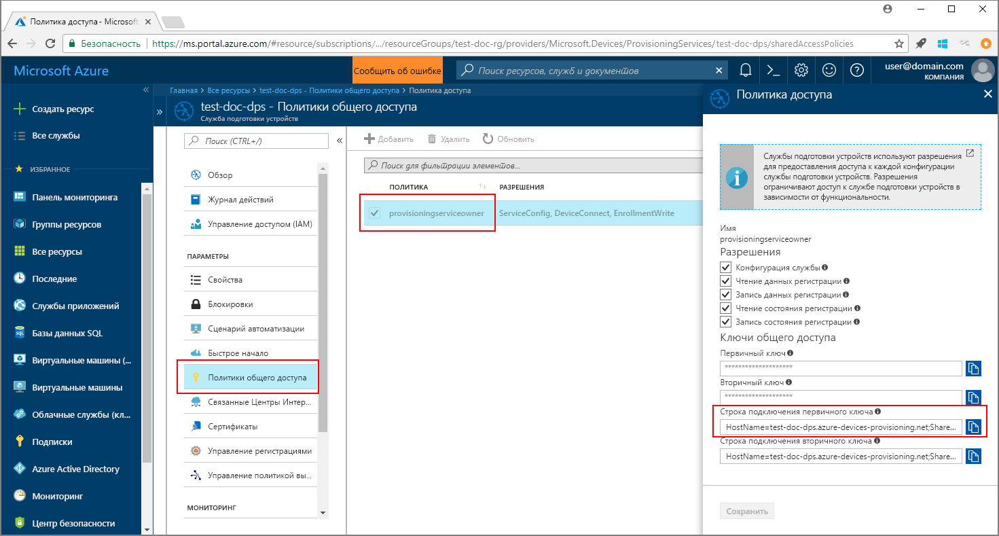
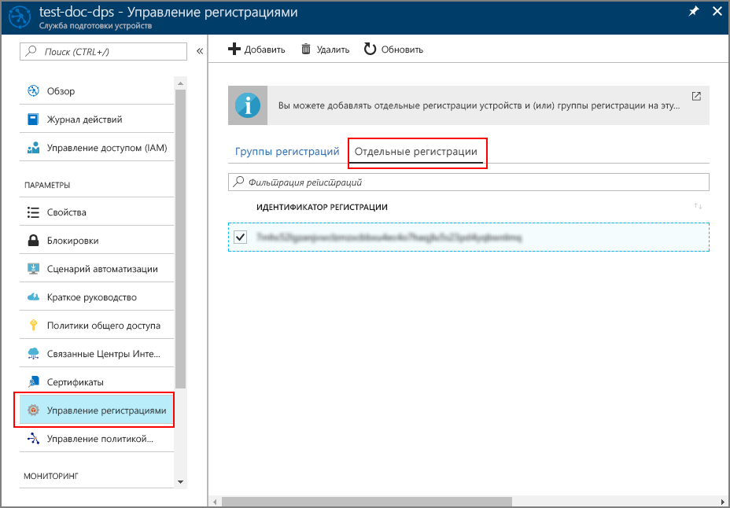

# <a name="quickstart-enroll-tpm-device-to-iot-hub-device-provisioning-service-using-java-service-sdk"></a>Краткое руководство. Регистрация устройств TPM в Службе подготовки устройств к добавлению в Центр Интернета вещей с помощью пакета SDK для службы Java

[!INCLUDE [iot-dps-selector-quick-enroll-device-tpm](../../includes/iot-dps-selector-quick-enroll-device-tpm.md)]

В этом кратком руководстве показано, как программными средствами создать отдельную регистрацию устройства TPM в Службе подготовки устройств к добавлению в Центр Интернета вещей с помощью пакета SDK службы для Java и примера приложения Java.

## <a name="prerequisites"></a>Предварительные требования

- Выполнение инструкций из краткого руководства по [настройке Службы подготовки устройств к добавлению в Центр Интернета вещей на портале Azure](./quick-setup-auto-provision.md).
- Выполнение действий в разделе [Чтение криптографических ключей из устройства доверенного платформенного модуля](quick-create-simulated-device.md#simulatetpm).
- Учетная запись Azure с активной подпиской. [Создайте бесплатно](https://azure.microsoft.com/free/?ref=microsoft.com&utm_source=microsoft.com&utm_medium=docs&utm_campaign=visualstudio).
- [Пакет SDK для Java SE 8](https://aka.ms/azure-jdks). В этом кратком руководстве мы устанавливаем [пакет SDK для Java](https://azure.github.io/azure-iot-sdk-java/service/), приведенный ниже. Он поддерживает операционные системы Linux и Windows. В рамках этого краткого руководства используется Windows.
- [Maven версии 3](https://maven.apache.org/download.cgi).
- [Git](https://git-scm.com/download/).

<a id="setupdevbox"></a>

## <a name="prepare-the-development-environment"></a>Подготовка среды разработки 

1. Убедитесь, что на вашем компьютере установлен [пакет SDK 8 для Java SE](https://aka.ms/azure-jdks). 

2. Настройте переменные среды для установки Java. Переменная `PATH` должна содержать полный путь к каталогу *jdk1.8.x\bin*. Если это первая установка Java на этом компьютере, создайте новую переменную среды с именем `JAVA_HOME` и сохраните в ней полный путь к каталогу *jdk1.8.x*. На компьютере Windows этот каталог находится в папке *C:\\Program Files\\Java\\* . Для создания и редактирования переменных среды вам нужно выполнить поиск по строке **Изменение переменных среды** на **панели управления**. 

   Чтобы проверить, правильно ли настроена среда Java на компьютере, выполните в окне командной строки следующую команду:

    ```cmd\sh
    java -version
    ```

3. Скачайте и разверните на компьютере [Maven 3](https://maven.apache.org/download.cgi). 

4. Измените переменную среды `PATH`, чтобы она указывала на папку *apache-maven-3.x.x\\bin* в папке, куда вы извлекли Maven. Чтобы убедиться, что средство Maven успешно установлено, выполните в окне командной строки следующую команду:

    ```cmd\sh
    mvn --version
    ```

5. Обязательно установите на компьютер систему [git](https://git-scm.com/download/) и добавьте ее в переменную среды `PATH`. 


<a id="javasample"></a>

## <a name="download-and-modify-the-java-sample-code"></a>Скачивание и изменение примера кода на Java

В этом разделе показано, как добавить в пример кода сведения о подготовке устройства TPM. 

1. Откройте командную строку. Клонируйте из репозитория GitHub пример кода для регистрации устройства, используя [пакет SDK для службы Java](https://azure.github.io/azure-iot-sdk-java/service/):
    
    ```cmd\sh
    git clone https://github.com/Azure/azure-iot-sdk-java.git --recursive
    ```

2. В полученном исходном коде найдите папку с примером **_azure-iot-sdk-java/provisioning/provisioning-samples/service-enrollment-sample_** . Откройте файл **_/src/main/java/samples/com/microsoft/azure/sdk/iot/ServiceEnrollmentSample.java_** в любом удобном текстовом редакторе и добавьте следующие данные:

   1. В службу подготовки добавьте `[Provisioning Connection String]` с портала следующим образом:
       1. Откройте службу подготовки на [портале Azure](https://portal.azure.com). 
       2. Откройте раздел **Политики общего доступа** и выберите политику с разрешением *EnrollmentWrite*.
       3. Скопируйте **строку подключения первичного ключа**. 

             

       4. В примере кода откройте файл **_ServiceEnrollmentSample.java_** и замените в нем `[Provisioning Connection String]` значением **строки подключения первичного ключа**.
    
           ```Java
           private static final String PROVISIONING_CONNECTION_STRING = "[Provisioning Connection String]";
           ```

   2. Добавление сведений об устройстве TPM
       1. Получите *идентификатор регистрации* и *ключ подтверждения TPM* для имитированного устройства TPM, выполнив подготовительные действия для выполнения инструкций по [имитации устройства TPM](quick-create-simulated-device.md#simulatetpm).
       2. Используйте **_идентификатор регистрации_** и **_ключ подтверждения_** из выходных данных на предыдущем шаге, чтобы заменить `[RegistrationId]` и `[TPM Endorsement Key]` в файле с примером кода **_ServiceEnrollmentSample.java_** :
        
           ```Java
           private static final String REGISTRATION_ID = "[RegistrationId]";
           private static final String TPM_ENDORSEMENT_KEY = "[TPM Endorsement Key]";
           ```

   3. Также службу подготовки можно настроить с помощью этого примера кода:
      - Чтобы добавить эту конфигурацию в пример, выполните следующие действия:
        1. На [портале Azure](https://portal.azure.com) откройте Центр Интернета вещей, связанный с используемой службой подготовки. Откройте для этого центра вкладку **Обзор** и скопируйте значение **Hostname**. Присвойте значение **Hostname** параметру *IOTHUB_HOST_NAME*.
            ```Java
            private static final String IOTHUB_HOST_NAME = "[Host name].azure-devices.net";
            ```
        2. Укажите понятное имя в качестве значения параметра *DEVICE_ID*, а для *PROVISIONING_STATUS* сохраните значение по умолчанию *ENABLED* (включено). 
    
      - Вы также можете не настраивать службу подготовки. В этом случае закомментируйте или удалите в файле _ServiceEnrollmentGroupSample.java_ следующие инструкции:
          ```Java
          // The following parameters are optional. Remove it if you don't need.
          individualEnrollment.setDeviceId(DEVICE_ID);
          individualEnrollment.setIotHubHostName(IOTHUB_HOST_NAME);
          individualEnrollment.setProvisioningStatus(PROVISIONING_STATUS);
          ```

   4. Изучите пример кода. При помощи этого кода создается, обновляется, ставится в очередь и удаляется регистрация отдельного устройства TPM. Чтобы проверить успешность регистрации на портале, временно закомментируйте в конце файла _ServiceEnrollmentSample.java_ следующие строки кода:
    
       ```Java
       // *********************************** Delete info of individualEnrollment ************************************
       System.out.println("\nDelete the individualEnrollment...");
       provisioningServiceClient.deleteIndividualEnrollment(REGISTRATION_ID);
       ```

   5. Сохраните файл _ServiceEnrollmentSample.java_.

<a id="runjavasample"></a>

## <a name="build-and-run-the-java-sample-code"></a>Соберите и запустите пример кода Java

1. Откройте окно командной строки и перейдите к папке **_azure-iot-sdk-java/provisioning/provisioning-samples/service-enrollment-sample_** .

2. Соберите пример кода с помощью следующей команды:

    ```cmd\sh
    mvn install -DskipTests
    ```

   С помощью этой команды можно скачать на компьютер пакет Maven [`com.microsoft.azure.sdk.iot.provisioning.service`](https://www.mvnrepository.com/artifact/com.microsoft.azure.sdk.iot.provisioning/provisioning-service-client). Пакет содержит двоичные файлы [пакета SDK для службы Java](https://azure.github.io/azure-iot-sdk-java/service/), которую должен собрать пример кода. 

3. Запустите пример кода, выполнив в окне командной строки следующие команды:

    ```cmd\sh
    cd target
    java -jar ./service-enrollment-sample-{version}-with-deps.jar
    ```

4. Удостоверьтесь, что регистрация прошла успешно, просмотрев данные в окне вывода. 

5. Откройте службу подготовки на портале Azure. Выберите раздел **Управление регистрациями** и вкладку **Индивидуальные регистрации**. Обратите внимание, что теперь здесь отображается *идентификатор регистрации* имитированного устройства TPM. 

      

## <a name="clean-up-resources"></a>Очистка ресурсов
Если вы планируете изучить пример службы Java, не удаляйте ресурсы, созданные при работе с этим кратким руководством. Если вы не планируете продолжать работу, следуйте инструкциям ниже, чтобы удалить все созданные ресурсы.

1. Закройте окно выходных данных примера Java, если оно открыто на компьютере.
1. Закройте окно симулятора TPM, созданное для имитации устройства TPM.
1. Перейдите к службе подготовки устройств на портале Azure, откройте раздел **Управление регистрациями** и выберите вкладку **Индивидуальные регистрации**. Выберите флажок рядом с *идентификатором регистрации* для записи регистрации, которую вы создали в процессе работы с этим кратким руководством, и нажмите кнопку **Удалить** в верхней части панели.

## <a name="next-steps"></a>Дальнейшие действия
В рамках этого краткого руководства вы зарегистрировали имитированное устройство TPM в службе подготовки устройств. Дополнительные сведения о подготовке устройств см. в руководстве по настройке службы подготовки устройств на портале Azure. 

> [!div class="nextstepaction"]
> [Руководства по службе подготовки устройств для Центра Интернета вещей Azure](./tutorial-set-up-cloud.md)
