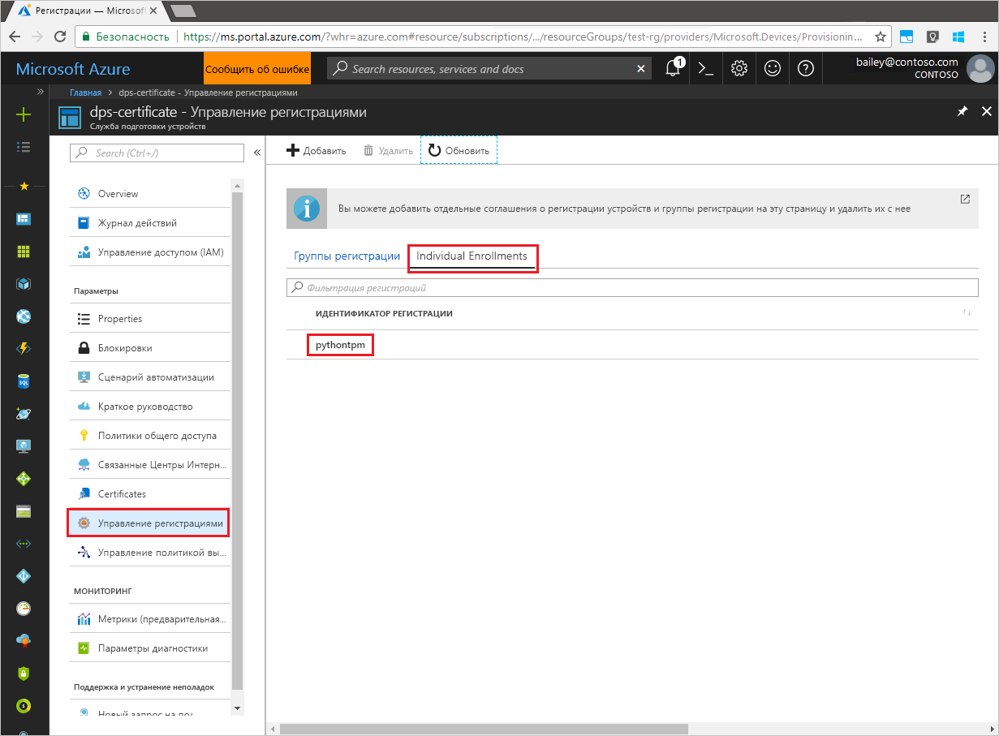

# <a name="quickstart-enroll-tpm-device-to-iot-hub-device-provisioning-service-using-python-provisioning-service-sdk"></a>Краткое руководство. Регистрация устройств TPM в службе "Подготовка устройств к добавлению в Центр Интернета вещей" пакета SDK для службы подготовки Python

[!INCLUDE [iot-dps-selector-quick-enroll-device-tpm](../../includes/iot-dps-selector-quick-enroll-device-tpm.md)]

В этом кратком руководстве вы создадите индивидуальную регистрацию устройства TPM в службе "Подготовка устройств к добавлению в Центр Интернета вещей" программным способом с помощью пакета SDK для Службы подготовки Python и примера приложения Python.

## <a name="prerequisites"></a>Предварительные требования

- Выполнение инструкций из краткого руководства по [настройке Службы подготовки устройств к добавлению в Центр Интернета вещей на портале Azure](./quick-setup-auto-provision.md).
- Учетная запись Azure с активной подпиской. [Создайте бесплатно](https://azure.microsoft.com/free/?ref=microsoft.com&utm_source=microsoft.com&utm_medium=docs&utm_campaign=visualstudio).
- [Python версии 2.x или 3.x](https://www.python.org/downloads/). В рамках этого краткого руководства устанавливается [пакет SDK для Службы подготовки Python](https://github.com/Azure/azure-iot-sdk-python/tree/v1-deprecated/provisioning_service_client), указанный ниже.
- [Pip](https://pip.pypa.io/en/stable/installing/), если он не включен в дистрибутив Python.
- Ключ подтверждения. Выполните действия, описанные в статье [Краткое руководство. Подготовка имитированного устройства TPM с помощью пакета SDK Интернета вещей Azure для C](quick-create-simulated-device.md) или используйте ключ подтверждения, предоставляемый вместе с пакетом SDK, как описано ниже.

> [!IMPORTANT]
> Эта статья предназначена исключительно для пакета SDK Python версии 1, который был объявлен нерекомендуемым. Клиенты устройств и служб для Службы подготовки устройств к добавлению в Центр Интернета вещей пока недоступны в версии 2. Сейчас ведутся работы по реализации всего функционала в версии 2.

<a id="prepareenvironment"></a>

## <a name="prepare-the-environment"></a>Подготовка среды 

1. Скачайте и установите [Python 2.x или 3.x](https://www.python.org/downloads/). Обязательно используйте 32-разрядную или 64-разрядную версию установки согласно требованиям программы настройки. При появлении запроса во время установки обязательно добавьте Python в переменную среды соответствующей платформы. 

1. Для [пакета SDK для Службы подготовки Python](https://github.com/Azure/azure-iot-sdk-python/tree/v1-deprecated/provisioning_service_client) выберите один из следующих вариантов.

    - Создайте и скомпилируйте **пакет SDK для Azure IoT Python**. Следуйте [этим инструкциям](https://github.com/Azure/azure-iot-sdk-python/blob/v1-deprecated/doc/python-devbox-setup.md) по созданию пакетов Python. Если вы работаете с ОС Windows, также установите [распространяемый пакет Visual C++](https://support.microsoft.com/help/2977003/the-latest-supported-visual-c-downloads), чтобы разрешить использовать собственные библиотеки DLL из Python.

    - [Установите или обновите *pip*, систему управления пакетами Python](https://pip.pypa.io/en/stable/installing/) и установите пакет с помощью следующей команды.

        ```cmd/sh
        pip install azure-iothub-provisioningserviceclient
        ```

1. Вам потребуется ключ подтверждения для устройства. Если вы создали имитированное устройство TPM с помощью краткого руководства [Создание и подготовка имитированного устройства с помощью службы подготовки устройств Центра Интернета вещей](quick-create-simulated-device.md), используйте созданный в нем ключ для устройства. В противном случае вы можете использовать следующий ключ подтверждения, который входит в пакет SDK.

    ```
    AToAAQALAAMAsgAgg3GXZ0SEs/gakMyNRqXXJP1S124GUgtk8qHaGzMUaaoABgCAAEMAEAgAAAAAAAEAtW6MOyCu/Nih47atIIoZtlYkhLeCTiSrtRN3q6hqgOllA979No4BOcDWF90OyzJvjQknMfXS/Dx/IJIBnORgCg1YX/j4EEtO7Ase29Xd63HjvG8M94+u2XINu79rkTxeueqW7gPeRZQPnl1xYmqawYcyzJS6GKWKdoIdS+UWu6bJr58V3xwvOQI4NibXKD7htvz07jLItWTFhsWnTdZbJ7PnmfCa2vbRH/9pZIow+CcAL9mNTNNN4FdzYwapNVO+6SY/W4XU0Q+dLMCKYarqVNH5GzAWDfKT8nKzg69yQejJM8oeUWag/8odWOfbszA+iFjw3wVNrA5n8grUieRkPQ==
    ```


## <a name="modify-the-python-sample-code"></a>Изменение примера кода Python

В этом разделе показано, как добавить в пример кода сведения о подготовке устройства TPM. 

1. В текстовом редакторе создайте файл **TpmEnrollment.py**.

1. Добавьте следующие инструкции `import` и переменные в начало файла **TpmEnrollment.py**: Затем замените `dpsConnectionString` вашей строкой подключения, которая находится в разделе **Политики общего доступа** в **службе подготовки устройств** на **портале Azure**. Замените `endorsementKey` значением, указанным ранее в разделе [Подготовка среды](quick-enroll-device-tpm-python.md#prepareenvironment). Наконец, создайте уникальный идентификатор `registrationid` и убедитесь, что он состоит только из алфавитно-цифровых символов нижнего регистра и дефисов.  
   
    ```python
    from provisioningserviceclient import ProvisioningServiceClient
    from provisioningserviceclient.models import IndividualEnrollment, AttestationMechanism

    CONNECTION_STRING = "{dpsConnectionString}"

    ENDORSEMENT_KEY = "{endorsementKey}"

    REGISTRATION_ID = "{registrationid}"
    ```

1. Добавьте следующую функцию и ее вызов, чтобы реализовать создание групповой регистрации:
   
    ```python
    def main():
        print ( "Starting individual enrollment..." )

        psc = ProvisioningServiceClient.create_from_connection_string(CONNECTION_STRING)

        att = AttestationMechanism.create_with_tpm(ENDORSEMENT_KEY)
        ie = IndividualEnrollment.create(REGISTRATION_ID, att)

        ie = psc.create_or_update(ie)
    
        print ( "Individual enrollment successful." )
    
    if __name__ == '__main__':
        main()
    ```

1. Сохраните и закройте файл **TpmEnrollment.py**.
 

## <a name="run-the-sample-tpm-enrollment"></a>Запуск образца регистрации доверенного платформенного модуля

1. Откройте командную строку и выполните скрипт.

    ```cmd/sh
    python TpmEnrollment.py
    ```

1. Удостоверьтесь, что регистрация прошла успешно, просмотрев выходные данные.

1. Откройте службу подготовки на портале Azure. Выберите **Управление регистрациями**. Обратите внимание, что устройство доверенного платформенного модуля отображается на вкладке **Индивидуальные регистрации** с именем созданного ранее `registrationid`. 

      


## <a name="clean-up-resources"></a>Очистка ресурсов
Если вы планируете изучить пример службы Java, не удаляйте ресурсы, созданные при работе с этим кратким руководством. Если вы не планируете продолжать работу, следуйте инструкциям ниже, чтобы удалить все созданные ресурсы.

1. Закройте окно выходных данных примера Python, если оно открыто на компьютере.
1. Если вы создавали имитированное устройство TPM, закройте окно симулятора.
1. Перейдите к службе подготовки устройств на портале Azure, откройте раздел **Управление регистрациями** и выберите вкладку **Индивидуальные регистрации**. Выберите флажок рядом с *идентификатором регистрации* для записи регистрации, которую вы создали в процессе работы с этим кратким руководством, и нажмите кнопку **Удалить** в верхней части панели.


## <a name="next-steps"></a>Дальнейшие действия
При работе с этим кратким руководством вы программным способом создали запись отдельной регистрации для устройства TPM, а также (необязательно) создали на компьютере имитированное устройство TPM и подготовили его для Центра Интернета вещей с помощью Службы подготовки устройств к добавлению в Центр Интернета вещей Azure. Дополнительные сведения о подготовке устройств см. в руководстве по настройке службы подготовки устройств на портале Azure.

> [!div class="nextstepaction"]
> [Руководства по службе подготовки устройств для Центра Интернета вещей Azure](./tutorial-set-up-cloud.md)
