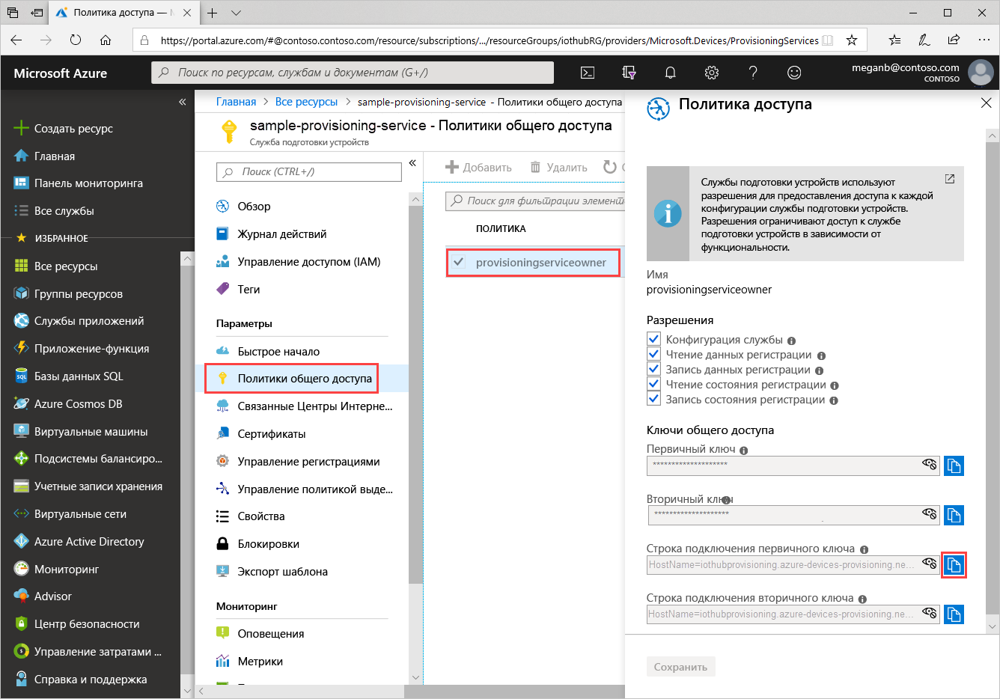
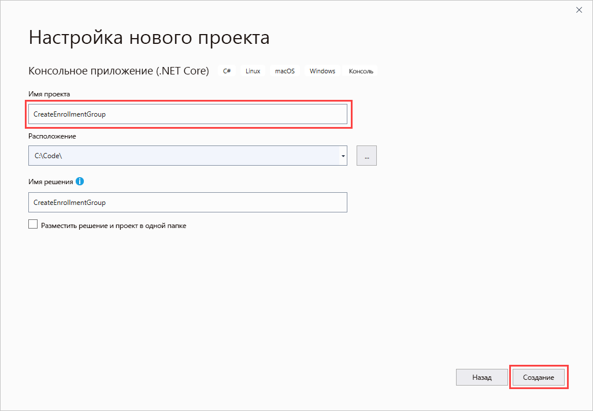
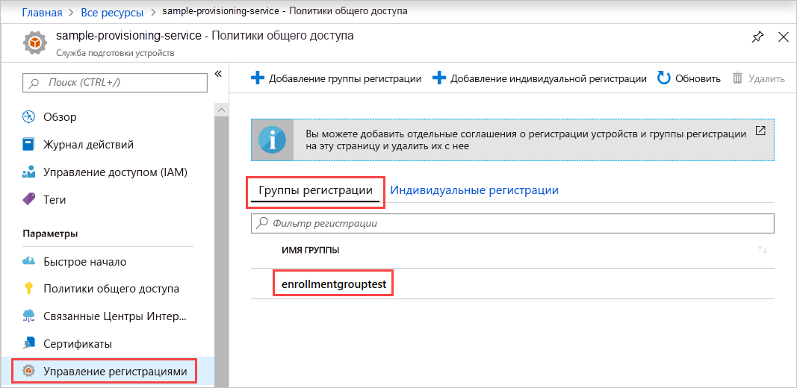

# <a name="quickstart-enroll-x509-devices-to-the-device-provisioning-service-using-c"></a>Краткое руководство. Регистрация устройств X.509 в Службе подготовки устройств с помощью C#

[!INCLUDE [iot-dps-selector-quick-enroll-device-x509](../../includes/iot-dps-selector-quick-enroll-device-x509.md)]

В этом кратком руководстве показано, как использовать C# для программного создания [группы регистрации](concepts-service.md#enrollment-group), которая использует промежуточный или корневой сертификат CA X.509. Эта группа регистрации создается с помощью [пакета SDK для Центра Интернета вещей Microsoft Azure для .NET](https://github.com/Azure/azure-iot-sdk-csharp) и примера приложения C# .NET Core. Группа регистрации управляет доступом к службе подготовки устройств, которые совместно используют стандартный сертификат для подписи в цепочке сертификатов. Дополнительные сведения см. в разделе [Управление доступом устройств к службе подготовки с использованием сертификатов X.509](./concepts-security.md#controlling-device-access-to-the-provisioning-service-with-x509-certificates). Дополнительные сведения об использовании инфраструктуры открытых ключей на основе сертификатов X.509 с Центром Интернета вещей и службой подготовки устройств см. в статье [Device Authentication using X.509 CA Certificates](https://docs.microsoft.com/azure/iot-hub/iot-hub-x509ca-overview) (Проверка подлинности устройств с помощью сертификатов ЦС X.509). 

В этом руководстве предполагается, что Центр Интернета вещей и экземпляр службы подготовки устройств уже созданы. Если эти ресурсы еще не созданы, прежде чем продолжить работу с этой статьей, выполните действия, описанные в руководстве по [Настройке службы подготовки устройств к добавлению в Центр Интернета вещей на портале Azure](./quick-setup-auto-provision.md).

Хотя действия, описанные в этой статье, применяются к работе на компьютерах под управлением Windows и Linux, в этой статье используется компьютер разработки Windows.

[!INCLUDE [quickstarts-free-trial-note](../../includes/quickstarts-free-trial-note.md)]

## <a name="prerequisites"></a>предварительные требования

* Установите [Visual Studio 2019](https://www.visualstudio.com/vs/).
* Установите [пакет SDK для .NET Core](https://www.microsoft.com/net/download/windows).
* Установите [Git](https://git-scm.com/download/).

## <a name="prepare-test-certificates"></a>Подготовка тестовых сертификатов

Для этого краткого руководства требуется файл PEM или CER, который содержит общедоступную часть промежуточного или корневого сертификата ЦС X.509. Этот сертификат должен быть отправлен в службу подготовки и проверен в ней.

[Пакет SDK для Центра Интернета вещей Azure](https://github.com/Azure/azure-iot-sdk-c) содержит средства тестирования, с помощью которых можно создать цепочку сертификатов X.509, передать корневой или промежуточный сертификат из этой цепочки и подтвердить владение сертификатом в службе.

> [!CAUTION]
> Используйте сертификаты, созданные с помощью средств пакета SDK, только для тестирования разработки.
> Не используйте эти сертификаты в рабочей среде.
> Они содержат жестко заданные пароли, такие как *1234*, срок действия которых истекает через 30 дней.
> Сведения о получении сертификатов, подходящих для рабочего использования, см. в документации Центра Интернета вещей Azure в статье [Как получить сертификат ЦС X.509](https://docs.microsoft.com/azure/iot-hub/iot-hub-x509ca-overview#how-to-get-an-x509-ca-certificate).
>

Чтобы создать сертификаты с помощью этих средств тестирования, выполните следующие действия:

1. Найдите имя тега для [последнего выпуска](https://github.com/Azure/azure-iot-sdk-c/releases/latest) пакета SDK Azure IoT для C.

2. Откройте командную строку или оболочку Git Bash и перейдите в рабочую папку на компьютере. Выполните приведенные ниже команды, чтобы клонировать репозиторий GitHub с последним выпуском [пакета SDK Azure IoT для C](https://github.com/Azure/azure-iot-sdk-c). Используйте найденный тег в качестве значения для параметра `-b`:

    ```cmd/sh
    git clone -b <release-tag> https://github.com/Azure/azure-iot-sdk-c.git
    cd azure-iot-sdk-c
    git submodule update --init
    ```

    Выполнение этой операции может занять несколько минут.

   Средства тестирования находятся в клонированном репозитории *azure-iot-sdk-c/tools/CACertificates*.

3. Выполните действия, описанные в статье [Managing test CA certificates for samples and tutorials](https://github.com/Azure/azure-iot-sdk-c/blob/master/tools/CACertificates/CACertificateOverview.md) (Управление тестовыми сертификатами ЦС для образцов и руководств).

Помимо средств в *пакете SDK для Центра Интернета вещей Microsoft Azure для .NET* в [примере проверки сертификата группы](https://github.com/Azure-Samples/azure-iot-samples-csharp/tree/master/provisioning/Samples/service/GroupCertificateVerificationSample) показано, как подтвердить владение в C# с помощью имеющегося промежуточного или корневого сертификата ЦС X.509.

## <a name="get-the-connection-string-for-your-provisioning-service"></a>Получение строки подключения к службе подготовки

Чтобы запустить пример из этого краткого руководства, требуется строка подключения к службе подготовки.

1. Войдите на портал Azure, выберите **Все ресурсы**, а затем службу подготовки устройств.

1. Выберите **Политики общего доступа**, а затем нужную политику доступа, чтобы открыть ее свойства. В разделе **Политика доступа** скопируйте и сохраните строку подключения первичного ключа.

    

## <a name="create-the-enrollment-group-sample"></a>Создание примера группы регистрации 

В этом разделе показано, как создать консольное приложение .NET Core, которое добавляет группу регистрации в службу подготовки. С некоторыми изменениями c помощью этих шагов можно также создать консольное приложение [Windows IoT Базовая](https://developer.microsoft.com/en-us/windows/iot), чтобы добавить группу регистрации. Дополнительные сведения о разработке с помощью Windows IoT Базовая см. в этой [документации](https://docs.microsoft.com/windows/iot-core/).

1. Откройте Visual Studio и выберите **Создать проект**. В окне **Создать проект** выберите **Консольное приложение (.NET Core)** для шаблона проекта C# и нажмите кнопку **Далее**.

1. Задайте проекту имя *CreateEnrollmentGroup*, а затем выберите **Создать**.

    

1. После открытия решения в Visual Studio в области **Обозреватель решений** щелкните правой кнопкой мыши проект **CreateEnrollmentGroup** и выберите **Управление пакетами NuGet**.

1. В окне **Диспетчер пакетов NuGet** щелкните **Обзор**, найдите и выберите **Microsoft.Azure.Devices.Provisioning.Service**, а затем нажмите кнопку **Установить**.

    

   В результате скачивается и устанавливается [клиентский пакет NuGet для службы "Подготовка устройств к добавлению в Центр Интернета вещей"](https://www.nuget.org/packages/Microsoft.Azure.Devices.Provisioning.Service/) и его зависимости, а также добавляется соответствующая ссылка.

1. Добавьте следующие `using` операторы после других `using` операторов вверху `Program.cs`:

   ```csharp
   using System.Security.Cryptography.X509Certificates;
   using System.Threading.Tasks;
   using Microsoft.Azure.Devices.Provisioning.Service;
   ```

1. Добавьте следующие поля в класс `Program` и внесите перечисленные изменения.  

   ```csharp
   private static string ProvisioningConnectionString = "{ProvisioningServiceConnectionString}";
   private static string EnrollmentGroupId = "enrollmentgrouptest";
   private static string X509RootCertPath = @"{Path to a .cer or .pem file for a verified root CA or intermediate CA X.509 certificate}";
   ```

   * Замените значение заполнителя `ProvisioningServiceConnectionString` строкой подключения к службе подготовки, для которой необходимо создать регистрацию.

   * Замените значение заполнителя `X509RootCertPath` на путь к PEM- или CER-файлу. Этот файл представляет открытую часть промежуточного или корневого сертификата CA X.509, который был ранее загружен и проверен вашей службой инициализации.

   * При желании вы можете изменить значение `EnrollmentGroupId`. Строка может содержать только символы в нижнем регистре и дефисы.

   > [!IMPORTANT]
   > В рабочем коде следует учитывать следующие рекомендации по безопасности:
   >
   > * Жесткое программирование строки подключения для администратора службы подготовки противоречит рекомендациям по обеспечению безопасности. Вместо этого строки подключения должны храниться без угрозы безопасности, например в безопасном файле конфигурации или в реестре.
   > * Обязательно отправьте только открытую часть сертификата подписи. Никогда не отправляйте в службу подготовки PFX- (PKCS12) или PEM-файлы, содержащие закрытые ключи.

1. Добавьте следующий метод в класс `Program`. Этот код создает запись группы регистрации, а затем вызывает метод `CreateOrUpdateEnrollmentGroupAsync` в `ProvisioningServiceClient`, чтобы добавить группу регистрации в службу подготовки.

   ```csharp
   public static async Task RunSample()
   {
       Console.WriteLine("Starting sample...");
 
       using (ProvisioningServiceClient provisioningServiceClient =
               ProvisioningServiceClient.CreateFromConnectionString(ProvisioningConnectionString))
       {
           #region Create a new enrollmentGroup config
           Console.WriteLine("\nCreating a new enrollmentGroup...");
           var certificate = new X509Certificate2(X509RootCertPath);
           Attestation attestation = X509Attestation.CreateFromRootCertificates(certificate);
           EnrollmentGroup enrollmentGroup =
                   new EnrollmentGroup(
                           EnrollmentGroupId,
                           attestation)
                   {
                       ProvisioningStatus = ProvisioningStatus.Enabled
                   };
           Console.WriteLine(enrollmentGroup);
           #endregion
 
           #region Create the enrollmentGroup
           Console.WriteLine("\nAdding new enrollmentGroup...");
           EnrollmentGroup enrollmentGroupResult =
               await provisioningServiceClient.CreateOrUpdateEnrollmentGroupAsync(enrollmentGroup).ConfigureAwait(false);
           Console.WriteLine("\nEnrollmentGroup created with success.");
           Console.WriteLine(enrollmentGroupResult);
           #endregion
 
       }
   }
   ```

1. Осталось заменить метод `Main` следующими строками:

   ```csharp
    static async Task Main(string[] args)
    {
        await RunSample();
        Console.WriteLine("\nHit <Enter> to exit ...");
        Console.ReadLine();
    }
   ```

1. Создайте решение.

## <a name="run-the-enrollment-group-sample"></a>Запуск примера группы регистрации
  
Запустите пример в Visual Studio, чтобы создать группу регистрации. Появится окно командной строки, в котором будут отображаться сообщения с подтверждением. После успешного создания в окне командной строки отображаются свойства новой группы регистрации.

Вы можете убедится, что группа регистрации успешно создана. Перейдите к сводной информации о службе подготовки устройств и выберите **Управление регистрациями**, а затем — **Группы регистрации**. Вы должны увидеть новую запись регистрации, которая соответствует идентификатору регистрации, используемому в примере.



Выберите запись, чтобы проверить отпечаток сертификата и другие ее свойства.

## <a name="clean-up-resources"></a>Очистка ресурсов

Если вы планируете изучить пример службы C#, не удаляйте ресурсы, которые создали при работе с этим руководством. В противном случае выполните следующие действия, чтобы удалить все ресурсы, созданные с помощью этого руководства.

1. Закройте окно выходных данных примера C#, если оно открыто на компьютере.

1. Перейдите к службе подготовки устройств на портале Azure, выберите **Управление регистрациями** и вкладку **Группы регистрации**. Выберите *Идентификатор регистрации* для записи о регистрации, которую вы создали с помощью этого краткого руководства, и нажмите кнопку **Удалить**.

1. На странице службы подготовки устройств на портале Azure щелкните **Сертификаты**, выберите сертификат, загруженный для работы с этим кратким руководством, а затем нажмите кнопку **Удалить** в верхней части окна **Сведения о сертификате**.  

## <a name="next-steps"></a>Дальнейшие действия

В этом кратком руководстве вы создали группу регистрации сертификата X.509 промежуточного или корневого центра сертификации с помощью службы "Подготовка устройств к добавлению в Центр Интернета вещей". Дополнительные сведения о подготовке устройств см. в руководстве по настройке службы подготовки устройств на портале Azure.

> [!div class="nextstepaction"]
> [Руководства по службе подготовки устройств для Центра Интернета вещей Azure](./tutorial-set-up-cloud.md)
