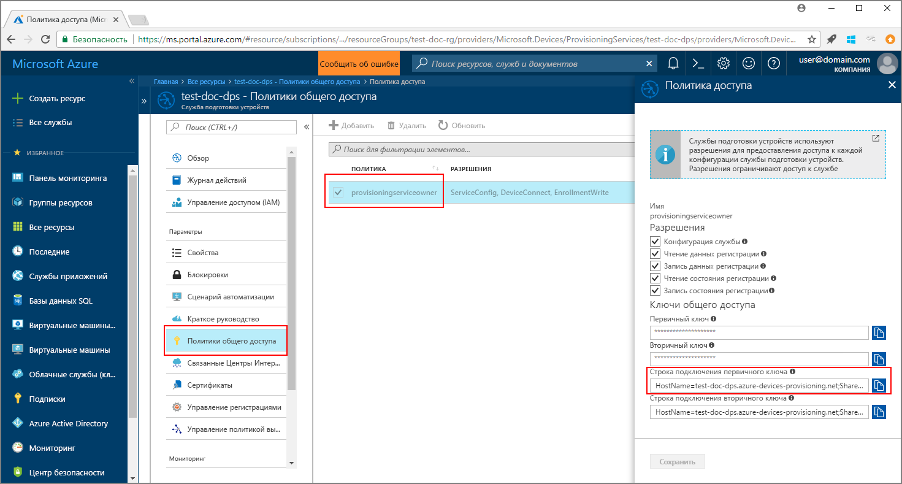
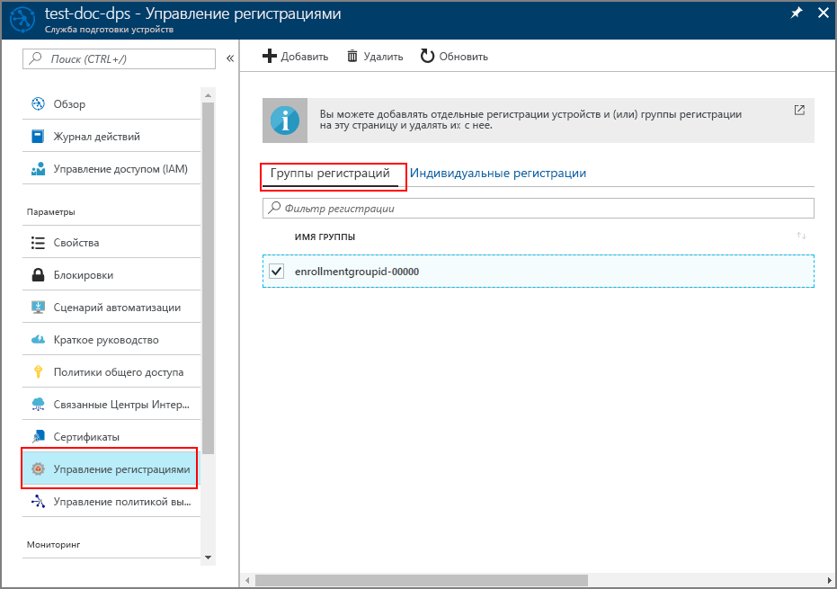

# <a name="quickstart-enroll-x509-devices-to-the-device-provisioning-service-using-java"></a>Краткое руководство. Регистрация устройств X.509 в Службе подготовки устройств с помощью Java

[!INCLUDE [iot-dps-selector-quick-enroll-device-x509](../../includes/iot-dps-selector-quick-enroll-device-x509.md)]

В этом кратком руководстве вы используете Java для программной регистрации группы имитированных устройств X.509 в Службе подготовки устройств к добавлению в Центр Интернета вещей. Устройства регистрируются в экземпляре службы подготовки, создавая группу регистрации или индивидуальную регистрацию. В этом кратком руководстве показано, как создавать оба типа регистраций с помощью пакета SDK для Java и примера приложения Java.

## <a name="prerequisites"></a>Предварительные требования

- Выполнение инструкций из краткого руководства по [настройке Службы подготовки устройств к добавлению в Центр Интернета вещей на портале Azure](./quick-setup-auto-provision.md).
- Учетная запись Azure с активной подпиской. [Создайте бесплатно](https://azure.microsoft.com/free/?ref=microsoft.com&utm_source=microsoft.com&utm_medium=docs&utm_campaign=visualstudio).
- [Пакет SDK для Java SE 8](https://aka.ms/azure-jdks). В этом кратком руководстве мы устанавливаем [пакет SDK для Java](https://azure.github.io/azure-iot-sdk-java/service/), приведенный ниже. Он поддерживает операционные системы Linux и Windows. В рамках этого краткого руководства используется Windows.
- [Maven версии 3](https://maven.apache.org/download.cgi).
- [Git](https://git-scm.com/download/).

<a id="javasample"></a>

## <a name="download-and-modify-the-java-sample-code"></a>Скачивание и изменение примера кода на Java

Для выполнения задач в этом разделе используется самозаверяющий сертификат X.509. При этом важно учесть следующие моменты.

* Самозаверяющие сертификаты предназначены только для тестирования и не должны использоваться в рабочей среде.
* Срок действия самозаверяющего сертификата по умолчанию составляет один год.

Ниже приведены инструкции по добавлению в пример кода сведений о подготовке устройства X.509. 

1. Откройте командную строку. Клонируйте из репозитория GitHub пример кода для регистрации устройства, используя [пакет SDK для службы Java](https://azure.github.io/azure-iot-sdk-java/service/):
    
    ```cmd\sh
    git clone https://github.com/Azure/azure-iot-sdk-java.git --recursive
    ```

2. В загруженном исходном коде найдите папку **_azure-iot-sdk-java/provisioning/provisioning-samples/service-enrollment-group-sample_** . Откройте файл **_/src/main/java/samples/com/microsoft/azure/sdk/iot/ServiceEnrollmentGroupSample.java_** в любом удобном текстовом редакторе и добавьте следующие данные:

    1. В службу подготовки добавьте `[Provisioning Connection String]` с портала следующим образом:
        1. Откройте службу подготовки на [портале Azure](https://portal.azure.com). 
        2. Откройте раздел **Политики общего доступа** и выберите политику с разрешением *EnrollmentWrite*.
        3. Скопируйте **строку подключения первичного ключа**. 

              

        4. В файле с примером кода **_ServiceEnrollmentGroupSample.java_** замените `[Provisioning Connection String]` значением **строки подключения первичного ключа**.

            ```Java
            private static final String PROVISIONING_CONNECTION_STRING = "[Provisioning Connection String]";
            ```

    2. Добавьте корневой сертификат для группы устройств. Если вам нужен пример корневого сертификата, примените _генератор сертификатов X.509_ следующим образом:
        1. В окне командной строки перейдите в папку **_azure-iot-sdk-java/provisioning/provisioning-tools/provisioning-x509-cert-generator_** .
        2. Выполните сборку средства с помощью этой команды:

                ```cmd\sh
                mvn clean install
                ```

        4. Запустите средство с помощью таких команд:

                ```cmd\sh
                cd target
                java -jar ./provisioning-x509-cert-generator-{version}-with-deps.jar
                ```

        5. (Необязательно.) Введите _общее имя_ для сертификатов, когда появится соответствующий запрос.
        6. Это средство локально создает **сертификат клиента**, **закрытый ключ сертификата клиента** и **корневой сертификат**.
        7. Скопируйте полученный **корневой сертификат**, включая строки **_-----BEGIN CERTIFICATE-----_** и **_-----END CERTIFICATE-----_** . 
        8. Присвойте значение **корневого сертификата** параметру **PUBLIC_KEY_CERTIFICATE_STRING**, как показано ниже:

                ```Java
                private static final String PUBLIC_KEY_CERTIFICATE_STRING =
                        "-----BEGIN CERTIFICATE-----\n" +
                        "XXXXXXXXXXXXXXXXXXXXXXXXXXXXXXXXXXXXXXXXXXXXXXXXXXXXXXXXXXXXXXXX\n" +
                        "XXXXXXXXXXXXXXXXXXXXXXXXXXXXXXXXXXXXXXXXXXXXXXXXXXXXXXXXXXXXXXXX\n" +
                        "XXXXXXXXXXXXXXXXXXXXXXXXXXXXXXXXXXXXXXXXXXXXXXXXXXXXXXXXXXXXXXXX\n" +
                        "XXXXXXXXXXXXXXXXXXXXXXXXXXXXXXXXXXXXXXXXXXXXXXXXXXXXXXXXXXXXXXXX\n" +
                        "XXXXXXXXXXXXXXXXXXXXXXXXXXXXXXXXXXXXXXXXXXXXXXXXXXXXXXXXXXXXXXXX\n" +
                        "XXXXXXXXXXXXXXXXXXXXXXXXXXXXXXXXXXXXXXXXXXXXXXXXXXXXXXXXXXXXXXXX\n" +
                        "XXXXXXXXXXXXXXXXXXXXXXXXXXXXXXXXXXXXXXXXXXXXXXXXXXXXXXXXXXXXXXXX\n" +
                        "XXXXXXXXXXXXXXXXXXXXXXXXXXXXXXXXXXXXXXXXXXXXXXXXXXXXXXXXXXXXXXXX\n" +
                        "XXXXXXXXXXXXXXXXXXXXXXXXXXXXXXXXXXXXXXXXXXXXXXXXXXXXXXXXXXXXXXXX\n" +
                        "XXXXXXXXXXXXXXXXXXXXXXXXXXXXXXXXXXXXXXXXXXXXXXXXXXXXXXXXXXXXXXXX\n" +
                        "-----END CERTIFICATE-----\n";
                ```

        9. Закройте окно командной строки или введите **n**, когда появится запрос указать *код проверки*. 
 
    3. Также службу подготовки можно настроить с помощью этого примера кода:
        - Чтобы добавить эту конфигурацию в пример, выполните следующие действия:
            1. На [портале Azure](https://portal.azure.com) откройте Центр Интернета вещей, связанный с используемой службой подготовки. Откройте для этого центра вкладку **Обзор** и скопируйте значение **Hostname**. Присвойте значение **Hostname** параметру *IOTHUB_HOST_NAME*.

                ```Java
                private static final String IOTHUB_HOST_NAME = "[Host name].azure-devices.net";
                ```
            2. Укажите понятное имя в качестве значения параметра *DEVICE_ID*, а для *PROVISIONING_STATUS* сохраните значение по умолчанию *ENABLED* (включено). 

        - Вы также можете не настраивать службу подготовки. В этом случае закомментируйте или удалите в файле _ServiceEnrollmentGroupSample.java_ следующие инструкции:

            ```Java
            enrollmentGroup.setIotHubHostName(IOTHUB_HOST_NAME);                // Optional parameter.
            enrollmentGroup.setProvisioningStatus(ProvisioningStatus.ENABLED);  // Optional parameter.
            ```

    4. Изучите пример кода. Этот код создает, обновляет и удаляет группу регистрации для устройств X.509. Чтобы проверить успешность регистрации на портале, временно закомментируйте в конце файла _ServiceEnrollmentGroupSample.java_ следующие строки кода:

        ```Java
        // ************************************** Delete info of enrollmentGroup ***************************************
        System.out.println("\nDelete the enrollmentGroup...");
        provisioningServiceClient.deleteEnrollmentGroup(enrollmentGroupId);
        ```

    5. Сохраните файл _ServiceEnrollmentGroupSample.java_. 
 

<a id="runjavasample"></a>

## <a name="build-and-run-sample-group-enrollment"></a>Сборка и запуск примера для регистрации группы

Служба подготовки устройств Интернета вещей Azure поддерживает два типа регистрации:

- [Группы регистрации](concepts-service.md#enrollment-group). Используются для регистрации нескольких связанных устройств.
- [Индивидуальные регистрации.](concepts-service.md#individual-enrollment) Предназначены для регистрации одного устройства.

В этой процедуре используется группа регистрации. В следующем разделе используется индивидуальная регистрация.

1. Откройте окно командной строки и перейдите к папке **_azure-iot-sdk-java/provisioning/provisioning-samples/service-enrollment-group-sample_** .

2. Соберите пример кода с помощью следующей команды:

    ```cmd\sh
    mvn install -DskipTests
    ```

   С помощью этой команды можно скачать на компьютер пакет Maven [`com.microsoft.azure.sdk.iot.provisioning.service`](https://mvnrepository.com/artifact/com.microsoft.azure.sdk.iot.provisioning/provisioning-service-client). Пакет содержит двоичные файлы пакета SDK для службы Java, которую должен собрать пример кода. Если в предыдущем разделе вы применяли _генератор сертификатов X.509_, этот пакет уже загружен на ваш компьютер. 

3. Запустите пример кода, выполнив в окне командной строки следующие команды:

    ```cmd\sh
    cd target
    java -jar ./service-enrollment-group-sample-{version}-with-deps.jar
    ```

4. Удостоверьтесь, что регистрация прошла успешно, просмотрев данные в окне вывода.

5. Откройте службу подготовки на портале Azure. Щелкните **Управление регистрациями**. Обратите внимание, что на вкладке **Группы регистрации** отображается группа устройств X.509 с автоматически созданным *именем группы*. 

      

## <a name="modifications-to-enroll-a-single-x509-device"></a>Изменения, позволяющие зарегистрировать одно устройство X.509

Чтобы зарегистрировать одно устройство X.509, отредактируйте пример кода для *отдельной регистрации*, который приводится в статье [Регистрация устройств TPM в службе подготовки устройств Центра Интернета вещей с помощью пакета SDK для службы Java](quick-enroll-device-tpm-java.md#javasample), следующим образом:

1. Скопируйте в буфер обмена *общее имя* сертификата клиента X.509. Если вы хотите использовать _генератор сертификатов X.509_, как описано [в предыдущем разделе](#javasample), введите _общее имя_ своего сертификата или имя по умолчанию **microsoftriotcore**. Это **общее имя** следует задать как значение переменной *REGISTRATION_ID*. 

    ```Java
    // Use common name of your X.509 client certificate
    private static final String REGISTRATION_ID = "[RegistrationId]";
    ```

2. Переименуйте переменную *TPM_ENDORSEMENT_KEY* в *PUBLIC_KEY_CERTIFICATE_STRING*. Скопируйте сертификат клиента или значение **Client Cert** из выходных данных _генератора сертификатов X.509_ и задайте это значение для переменной *PUBLIC_KEY_CERTIFICATE_STRING*. 

    ```Java
    // Rename the variable *TPM_ENDORSEMENT_KEY* as *PUBLIC_KEY_CERTIFICATE_STRING*
    private static final String PUBLIC_KEY_CERTIFICATE_STRING =
            "-----BEGIN CERTIFICATE-----\n" +
            "XXXXXXXXXXXXXXXXXXXXXXXXXXXXXXXXXXXXXXXXXXXXXXXXXXXXXXXXXXXXXXXX\n" +
            "XXXXXXXXXXXXXXXXXXXXXXXXXXXXXXXXXXXXXXXXXXXXXXXXXXXXXXXXXXXXXXXX\n" +
            "XXXXXXXXXXXXXXXXXXXXXXXXXXXXXXXXXXXXXXXXXXXXXXXXXXXXXXXXXXXXXXXX\n" +
            "XXXXXXXXXXXXXXXXXXXXXXXXXXXXXXXXXXXXXXXXXXXXXXXXXXXXXXXXXXXXXXXX\n" +
            "XXXXXXXXXXXXXXXXXXXXXXXXXXXXXXXXXXXXXXXXXXXXXXXXXXXXXXXXXXXXXXXX\n" +
            "XXXXXXXXXXXXXXXXXXXXXXXXXXXXXXXXXXXXXXXXXXXXXXXXXXXXXXXXXXXXXXXX\n" +
            "XXXXXXXXXXXXXXXXXXXXXXXXXXXXXXXXXXXXXXXXXXXXXXXXXXXXXXXXXXXXXXXX\n" +
            "XXXXXXXXXXXXXXXXXXXXXXXXXXXXXXXXXXXXXXXXXXXXXXXXXXXXXXXXXXXXXXXX\n" +
            "XXXXXXXXXXXXXXXXXXXXXXXXXXXXXXXXXXXXXXXXXXXXXXXXXXXXXXXXXXXXXXXX\n" +
            "XXXXXXXXXXXXXXXXXXXXXXXXXXXXXXXXXXXXXXXXXXXXXXXXXXXXXXXXXXXXXXXX\n" +
            "-----END CERTIFICATE-----\n";
    ```
3. В функции **main** замените строку `Attestation attestation = new TpmAttestation(TPM_ENDORSEMENT_KEY);` следующим фрагментом, чтобы использовать сертификат клиента X.509:
    ```Java
    Attestation attestation = X509Attestation.createFromClientCertificates(PUBLIC_KEY_CERTIFICATE_STRING);
    ```

4. Сохраните файл с примером кода для *отдельной регистрации*, выполните его сборку и запустите, следуя инструкциям из раздела [о сборке и запуске примера кода для отдельной регистрации](quick-enroll-device-tpm-java.md#runjavasample).


## <a name="clean-up-resources"></a>Очистка ресурсов
Если вы планируете изучить пример службы Java, не удаляйте ресурсы, созданные при работе с этим кратким руководством. Если вы не планируете продолжать работу, следуйте инструкциям ниже, чтобы удалить все созданные ресурсы.

1. Закройте окно выходных данных примера Java, если оно открыто на компьютере.
1. Закройте окно _генератора сертификатов X.509_, если оно открыто на компьютере.
1. Перейдите к службе подготовки устройств на портале Azure, выберите **Управление регистрациями** и выберите вкладку **Группы регистрации**. Выберите флажок рядом с *именем группы* устройств X.509, которую вы зарегистрировали в процессе работы с этим кратким руководством, и нажмите кнопку **Удалить** в верхней части панели.  

## <a name="next-steps"></a>Дальнейшие действия
В рамках работы с этим кратким руководством вы зарегистрировали группу имитированных устройств X.509 в службе подготовки устройств. Дополнительные сведения о подготовке устройств см. в руководстве по настройке службы подготовки устройств на портале Azure. 

> [!div class="nextstepaction"]
> [Руководства по службе подготовки устройств для Центра Интернета вещей Azure](./tutorial-set-up-cloud.md)
