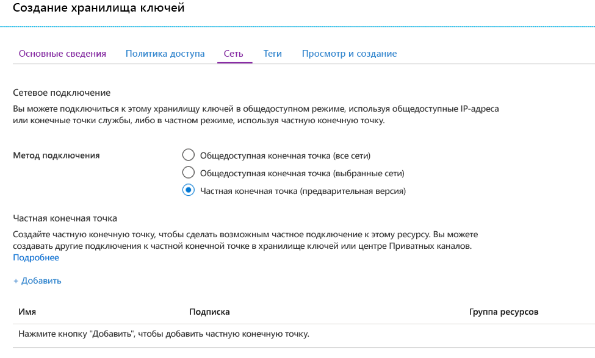
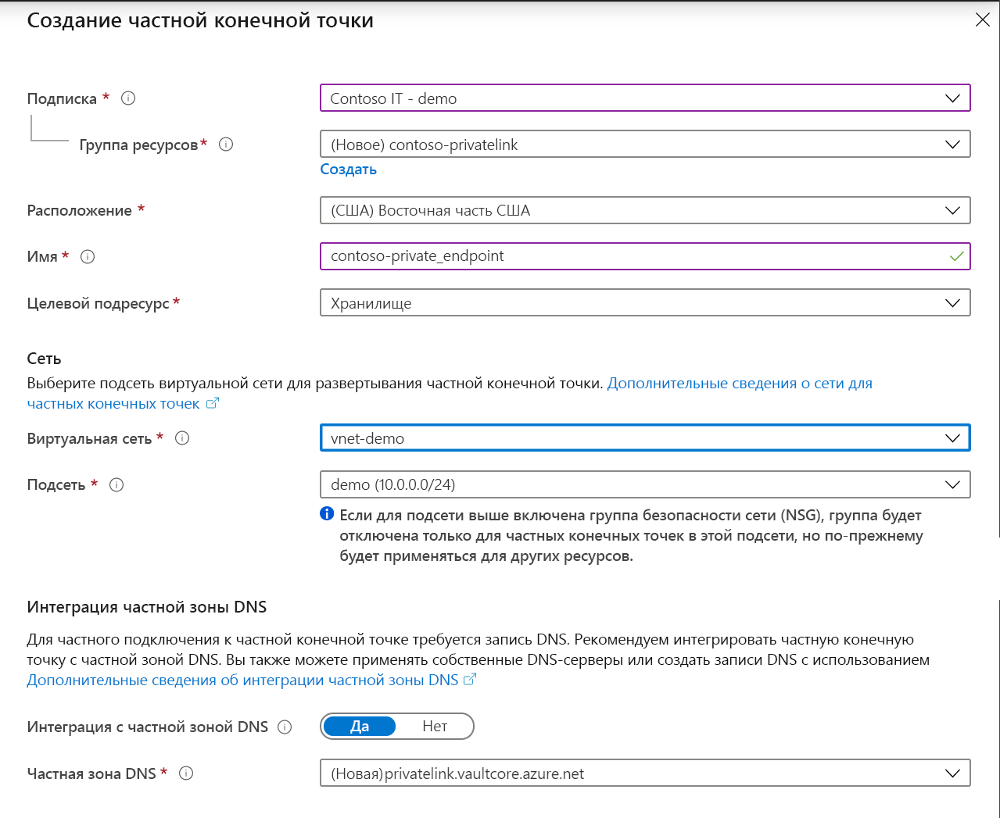
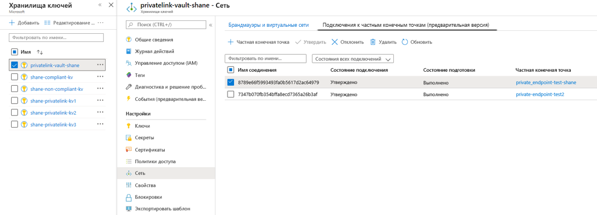

# <a name="integrate-key-vault-with-azure-private-link"></a>Интеграция Key Vault со службой "Приватный канал Azure"

Приватный канал Azure обеспечивает доступ к службам Azure (например, к Azure Key Vault, службе хранилища Azure и Azure Cosmos DB), а также размещенным в Azure службам клиентов или партнеров через частную конечную точку виртуальной сети.

Частная конечная точка Azure — это сетевой интерфейс, который защищенно и надежно подключается к службе через Приватный канал Azure. Частная конечная точка использует частный IP-адрес из виртуальной сети, по сути перемещая службу в виртуальную сеть. Весь трафик к службе может маршрутизироваться через частную конечную точку, поэтому шлюзы, устройства преобразования сетевых адресов (NAT), подключения ExpressRoute и VPN, а также общедоступные IP-адреса не требуются. Трафик между виртуальной сетью и службой проходит через магистральную сеть Майкрософт, что позволяет избежать рисков общедоступного Интернета. Вы можете подключиться к экземпляру ресурса Azure, обеспечивая наивысшую степень детализации в управлении доступом.

Дополнительные сведения см. в статье [Что такое Приватный канал Azure](../../private-link/private-link-overview.md).

## <a name="prerequisites"></a>Предварительные требования

Чтобы интегрировать хранилище ключей с Приватным каналом Azure, вам потребуется следующее:

- Хранилище ключей.
- Виртуальная сеть Azure.
- Подсеть в виртуальной сети.
- Разрешения владельца или участника для хранилища ключей и виртуальной сети.

Частная конечная точка и виртуальная сеть должны находиться в одном регионе. При выборе региона для частной конечной точки с помощью портала будут автоматически фильтроваться только виртуальные сети в этом регионе. Хранилище ключей может находиться в другом регионе.

Частная конечная точка использует частный IP-адрес в виртуальной сети.

## <a name="establish-a-private-link-connection-to-key-vault-using-the-azure-portal"></a>Установка подключения Приватного канала к хранилищу ключей с помощью портала Azure 

Сначала создайте виртуальную сеть, выполнив действия, описанные в статье [Краткое руководство. Создание виртуальной сети с помощью портала Azure](../../virtual-network/quick-create-portal.md).

Затем можно или создать хранилище ключей, либо установить подключение Приватного канала к существующему хранилищу ключей.

### <a name="create-a-new-key-vault-and-establish-a-private-link-connection"></a>Создание хранилища ключей и установка подключения Приватного канала

Вы можете создать хранилище ключей, выполнив действия, описанные в статье [Краткое руководство. Настройка и получение секрета из Azure Key Vault с помощью портала Azure](../secrets/quick-create-portal.md).

После настройки основных компонентов хранилища ключей перейдите на вкладку "Сеть" и выполните следующие шаги:

1. Выберите переключатель "Частная конечная точка" на вкладке "Сеть".
1. Нажмите кнопку "+ Добавить", чтобы добавить частную конечную точку.

    
 
1. В колонке "Создание частной конечной точки" в поле "Расположение" выберите регион, в котором расположена ваша виртуальная сеть. 
1. В поле "Имя" введите описательное имя. По нему вы сможете найти эту частную конечную точку. 
1. В раскрывающемся меню выберите виртуальную сеть и подсеть, в которых нужно создать эту частную конечную точку. 
1. Оставьте без изменений переключатель Integrate with the private zone DNS (Интегрировать с частной зоной DNS).  
1. Нажмите «ОК».

    
 
После этого вы сможете увидеть настроенную частную конечную точку. Теперь у вас есть возможность удалить и изменить эту частную конечную точку. Нажмите кнопку "Просмотр и создание" и создайте хранилище ключей. Развертывание может занять 5–10 минут. 

### <a name="establish-a-private-link-connection-to-an-existing-key-vault"></a>Установка подключения Приватного канала к существующему хранилищу ключей

Если у вас уже есть хранилище ключей, можно создать подключение Приватного канала к нему, выполнив следующие действия:

1. Войдите на портал Azure. 
1. В строке поиска введите "хранилища ключей".
1. Выберите в списке хранилище ключей, для которого необходимо добавить частную конечную точку.
1. Выберите вкладку "Сеть" в разделе "Параметры".
1. Выберите вкладку "Подключения к частным конечным точкам" в верхней части страницы.
1. Нажмите кнопку "+ Private Endpoint" (+ Частная конечная точка) в верхней части страницы.

     

Вы можете создать частную конечную точку для любого ресурса Azure, используя эту колонку. Можно использовать раскрывающиеся меню, чтобы выбрать тип ресурса и ресурс в каталоге, или подключиться к любому ресурсу Azure, используя идентификатор ресурса. Оставьте без изменений переключатель Integrate with the private zone DNS (Интегрировать с частной зоной DNS).  


## <a name="establish-a-private-link-connection-to-key-vault-using-cli"></a>Установка подключения Приватного канала к Key Vault с помощью интерфейса командой строки

### <a name="login-to-azure-cli"></a>Вход в Azure CLI
```console
az login 
```
### <a name="select-your-azure-subscription"></a>Выбор подписки Azure 
```console
az account set --subscription {AZURE SUBSCRIPTION ID}
```
### <a name="create-a-new-resource-group"></a>Создание новой группы ресурсов 
```console
az group create -n {RG} -l {AZURE REGION}
```
### <a name="register-microsoftkeyvault-as-a-provider"></a>Регистрация Microsoft.KeyVault в качестве поставщика 
```console
az provider register -n Microsoft.KeyVault
```
### <a name="create-a-new-key-vault"></a>Создание Key Vault
```console
az keyvault create --name {KEY VAULT NAME} --resource-group {RG} --location {AZURE REGION}
```
### <a name="turn-on-key-vault-firewall"></a>Включение брандмауэра Key Vault
```console
az keyvault update --name {KEY VAULT NAME} --resource-group {RG} --default-action deny
```
### <a name="create-a-virtual-network"></a>Создайте виртуальную сеть
```console
az network vnet create --resource-group {RG} --name {vNet NAME} --location {AZURE REGION}
```
### <a name="add-a-subnet"></a>Добавление подсети
```console
az network vnet subnet create --resource-group {RG} --vnet-name {vNet NAME} --name {subnet NAME} --address-prefixes {addressPrefix}
```
### <a name="disable-virtual-network-policies"></a>Отключение политик виртуальной сети 
```console
az network vnet subnet update --name {subnet NAME} --resource-group {RG} --vnet-name {vNet NAME} --disable-private-endpoint-network-policies true
```
### <a name="add-a-private-dns-zone"></a>Добавление частной зоны DNS 
```console
az network private-dns zone create --resource-group {RG} --name privatelink.vaultcore.azure.net
```
### <a name="link-private-dns-zone-to-virtual-network"></a>Связывание частной зоны DNS с виртуальной сетью 
```console
az network private-dns link vnet create --resource-group {RG} --virtual-network {vNet NAME} --zone-name privatelink.vaultcore.azure.net --name {dnsZoneLinkName} --registration-enabled true
```
### <a name="create-a-private-endpoint-automatically-approve"></a>Создание частной конечной точки (автоматическое утверждение) 
```console
az network private-endpoint create --resource-group {RG} --vnet-name {vNet NAME} --subnet {subnet NAME} --name {Private Endpoint Name}  --private-connection-resource-id "/subscriptions/{AZURE SUBSCRIPTION ID}/resourceGroups/{RG}/providers/Microsoft.KeyVault/vaults/ {KEY VAULT NAME}" --group-ids vault --connection-name {Private Link Connection Name} --location {AZURE REGION}
```
### <a name="create-a-private-endpoint-manually-request-approval"></a>Создание частной конечной точки (запрос утверждения вручную) 
```console
az network private-endpoint create --resource-group {RG} --vnet-name {vNet NAME} --subnet {subnet NAME} --name {Private Endpoint Name}  --private-connection-resource-id "/subscriptions/{AZURE SUBSCRIPTION ID}/resourceGroups/{RG}/providers/Microsoft.KeyVault/vaults/ {KEY VAULT NAME}" --group-ids vault --connection-name {Private Link Connection Name} --location {AZURE REGION} --manual-request
```
### <a name="show-connection-status"></a>Отображение строк подключения 
```console
az network private-endpoint show --resource-group {RG} --name {Private Endpoint Name}
```
## <a name="manage-private-link-connection"></a>Управление подключением Приватного канала

При создании частной конечной точки подключение должно быть утверждено. Если ресурс, для которого создается частная конечная точка, расположен в вашем каталоге, вы сможете одобрить запрос на подключение при наличии необходимых разрешений. При подключении к ресурсу Azure из другого каталога необходимо дождаться, пока владелец этого ресурса не одобрит запрос на подключение.

Существует четыре состояния подготовки:

| Действие предоставления службы | Состояние частной конечной точки объекта-получателя службы | Описание |
|--|--|--|
| None | Ожидает | Подключение создается вручную и ожидает утверждения от владельца ресурса Приватного канала. |
| Утверждение | Approved | Подключение утверждено автоматически или вручную и готово к использованию. |
| Reject | Отклонено | Подключение отклонил владелец ресурса Приватного канала. |
| Удалить | Отключено | Подключение удалил владелец ресурса Приватного канала. Частная конечная точка станет информативной и подлежит удалению для очистки. |
 
###  <a name="how-to-manage-a-private-endpoint-connection-to-key-vault-using-the-azure-portal"></a>Управление подключением частной конечной точки к Key Vault с помощью портала Azure 

1. Войдите на портал Azure.
1. В строке поиска введите "хранилища ключей".
1. Выберите хранилище ключей для управления.
1. Перейдите на вкладку "Сеть".
1. Если есть какие-либо подключения в состоянии подготовки, вы увидите такое подключение в списке с состоянием подготовки "В ожидании". 
1. Выберите частную конечную точку, которую вы хотите утвердить.
1. Нажмите кнопку "Утвердить".
1. Если есть подключения к частным конечным точкам, которые вы хотите отклонить (по запросу в ожидании или существующее подключение), выберите подключение и нажмите кнопку "Отклонить".

    

##  <a name="how-to-manage-a-private-endpoint-connection-to-key-vault-using-azure-cli"></a>Управление подключением частной конечной точки к Key Vault с помощью Azure CLI

### <a name="approve-a-private-link-connection-request"></a>Утверждение запроса на подключение к Приватному каналу
```console
az keyvault private-endpoint-connection approve --approval-description {"OPTIONAL DESCRIPTION"} --resource-group {RG} --vault-name {KEY VAULT NAME} –name {PRIVATE LINK CONNECTION NAME}
```

### <a name="deny-a-private-link-connection-request"></a>Отклонение запроса на подключение к Приватному каналу
```console
az keyvault private-endpoint-connection reject --rejection-description {"OPTIONAL DESCRIPTION"} --resource-group {RG} --vault-name {KEY VAULT NAME} –name {PRIVATE LINK CONNECTION NAME}
```

### <a name="delete-a-private-link-connection-request"></a>Удаление запроса на подключение к Приватному каналу
```console
az keyvault private-endpoint-connection delete --resource-group {RG} --vault-name {KEY VAULT NAME} --name {PRIVATE LINK CONNECTION NAME}
```

## <a name="validate-that-the-private-link-connection-works"></a>Проверка работоспособности подключения Приватного канала

Необходимо убедиться, что ресурсы в одной подсети ресурса частной конечной точки подключаются к хранилищу ключей по частному IP-адресу и что они правильно интегрируются с частной зоной DNS.

Сначала создайте виртуальную машину, выполнив действия, описанные в статье [Краткое руководство. Создание виртуальной машины Windows на портале Azure](../../virtual-machines/windows/quick-create-portal.md).

На вкладке "Сеть" выполните следующее:

1. Укажите виртуальную сеть и подсеть. Можно создать виртуальную сеть или выбрать существующую. При выборе существующей сети убедитесь, что регион соответствует.
1. Укажите ресурс общедоступного IP-адреса.
1. В списке "Группа безопасности сети сетевого адаптера" выберите "Нет".
1. В поле "Балансировка нагрузки" выберите "Нет".

Откройте командную строку и выполните следующую команду:

```console
nslookup <your-key-vault-name>.vault.azure.net
```

Если выполните команду nslookup, чтобы разрешить IP-адрес хранилища ключей через общедоступную конечную точку, вы увидите следующий результат:

```console
c:\ >nslookup <your-key-vault-name>.vault.azure.net

Non-authoritative answer:
Name:    
Address:  (public IP address)
Aliases:  <your-key-vault-name>.vault.azure.net
```

Если выполните команду nslookup, чтобы разрешить IP-адрес хранилища ключей через частную конечную точку, вы увидите следующий результат:

```console
c:\ >nslookup your_vault_name.vault.azure.net

Non-authoritative answer:
Name:    
Address:  10.1.0.5 (private IP address)
Aliases:  <your-key-vault-name>.vault.azure.net
          <your-key-vault-name>.privatelink.vaultcore.azure.net
```

## <a name="limitations-and-design-considerations"></a>Проблемы и ограничения разработки

> [!NOTE]
> Количество хранилищ ключей с включенными частными конечными точками для каждой подписки можно настраивать. Ниже приведено ограничение по умолчанию. Если вы хотите запросить увеличение ограничения для вашей службы, отправьте электронное письмо по адресу akv-privatelink@microsoft.com. Мы одобряем эти запросы в зависимости от индивидуальной ситуации.

**Цены**. Сведения о ценах на службу "Приватный канал Azure" см. [здесь](https://azure.microsoft.com/pricing/details/private-link/).

**Ограничения**.  Частная конечная точка для Azure Key Vault поддерживается только в общедоступных регионах Azure.

**Максимальное число частных конечных точек на Key Vault**: 64

**Число хранилищ ключей с частными конечными точками на одну подписку по умолчанию**: 400.

Дополнительные сведения см. в разделе [Azure Private Link service: Limitations](../../private-link/private-link-service-overview.md#limitations) (Служба "Приватный канал Azure". Ограничения)

## <a name="next-steps"></a>Next Steps

- Дополнительные сведения о службе [Приватный канал Azure](../../private-link/private-link-service-overview.md)
- См. дополнительные сведения об [Azure Key Vault](overview.md).
