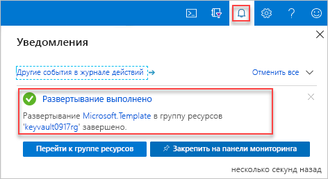

# <a name="quickstart-set-and-retrieve-a-secret-from-azure-key-vault-using-resource-manager-template"></a>Краткое руководство. Настройка и получение секрета из Azure Key Vault с помощью шаблона Resource Manager

[Azure Key Vault](./key-vault-overview.md) — это облачная служба, которая обеспечивает безопасное хранение секретов, таких как ключи, пароли, сертификаты, и другой секретной информации. В этом кратком руководстве рассматривается процесс развертывания шаблона Resource Manager для создания хранилища ключей и секрета.

[Шаблон Resource Manager](../azure-resource-manager/template-deployment-overview.md) является файлом нотации объектов JavaScript (JSON), определяющими инфраструктуру и конфигурацию вашего проекта. Шаблон использует декларативный синтаксис, который позволяет указать объект, который вы собираетесь развернуть. При этом, для развертывания объекта, не нужно писать последовательность команд. Дополнительные сведения о разработке шаблонов Resource Manager см. в разделе [Документация по Azure Resource Manager](/azure/azure-resource-manager/) и в [справочнике по шаблонам](/azure/templates/microsoft.keyvault/allversions).

Если у вас еще нет подписки Azure, [создайте бесплатную учетную запись Azure](https://azure.microsoft.com/free/?WT.mc_id=A261C142F), прежде чем начинать работу.

## <a name="prerequisites"></a>предварительные требования

Для работы с этой статьей необходимо иметь следующее.

* Шаблону для настройки разрешений требуется идентификатор объекта пользователя Azure AD. Следующая процедура возвращает идентификатор объекта (GUID).

    1. Выполните следующую команду Azure PowerShell или Azure CLI, выбрав **Попробовать**, а затем вставьте сценарий в панель оболочки. Чтобы вставить сценарий, щелкните правой кнопкой мыши оболочку и выберите **Вставить**.

        # <a name="clitabcli"></a>[CLI](#tab/CLI)
        ```azurecli-interactive
        echo "Enter your email address that is used to sign in to Azure:" &&
        read upn &&
        az ad user show --id $upn --query "objectId" &&
        echo "Press [ENTER] to continue ..."
        ```

        # <a name="powershelltabpowershell"></a>[PowerShell](#tab/PowerShell)
        ```azurepowershell-interactive
        $upn = Read-Host -Prompt "Enter your email address used to sign in to Azure"
        (Get-AzADUser -UserPrincipalName $upn).Id
        Write-Host "Press [ENTER] to continue..."
        ```

        ---

    2. Запишите идентификатор объекта. Он понадобится в следующем разделе этого краткого руководства.

## <a name="create-a-vault-and-a-secret"></a>Создание хранилища и секрета

Шаблон, используемый в этом кратком руководстве, взят из [шаблонов быстрого запуска Azure](https://azure.microsoft.com/resources/templates/101-key-vault-create/).

[!code-json[<Azure Resource Manager template create key vault>](~/quickstart-templates/101-key-vault-create/azuredeploy.json)]

В шаблоне определено два ресурса Azure:

* **Microsoft.KeyVault/vaults** — создает хранилище ключей Azure.
* **Microsoft.KeyVault/vaults/secrets** — создает секрет хранилища ключей.

Другие примеры шаблонов хранилища Azure Key Vault можно найти [здесь](https://azure.microsoft.com/resources/templates/?resourceType=Microsoft.Keyvault).

1. Выберите следующее изображение, чтобы войти на портал Azure и открыть шаблон. Шаблон создает хранилище ключей и секрет.

    <a href="https://portal.azure.com/#create/Microsoft.Template/uri/https%3A%2F%2Fraw.githubusercontent.com%2FAzure%2Fazure-quickstart-templates%2Fmaster%2F101-key-vault-create%2Fazuredeploy.json"></a>

2. Введите или выберите следующие значения.

    

    Если значение не указано, используйте для создания хранилища ключей и секрета значение по умолчанию.

    * **Подписка**. Выберите нужную подписку Azure.
    * **Группа ресурсов**. Щелкните **Создать**, введите уникальное имя новой группы ресурсов и нажмите кнопку **ОК**.
    * **Расположение**. Выберите расположение.  Например, **центральная часть США**.
    * **Имя хранилища ключей**: введите имя для хранилища ключей, которое должно быть уникальным в пределах всего пространства имен .vault.azure.net. В следующем разделе при проверке развертывания, необходимо имя.
    * **Идентификатор клиента**: функция шаблона автоматически получает идентификатор клиента.  Не изменяйте значение по умолчанию.
    * **Идентификатор пользователя AD**. Введите идентификатор объекта пользователя Azure AD, который вы получили на шаге [Предварительные требования](#prerequisites).
    * **Имя секрета**. Введите имя секрета, который вы храните в хранилище ключей.  Например, **adminpassword**.
    * **Значение секрета**. Ведите значение секрета.  Если вы храните пароль, рекомендуется использовать сгенерированный пароль, который вы создали на шаге "Предварительные требования".
    * **I agree to the terms and conditions state above** (Я принимаю указанные выше условия). Установите этот флажок.
3. Щелкните **Приобрести**. После успешного развертывания хранилища ключей вы получите уведомление:

    

Для развертывания шаблона используется портал Azure. В дополнение к порталу Azure можно также использовать Azure PowerShell, Azure CLI и REST API. Дополнительные сведения о других методах развертывания см. в статье о [развертывании с использованием шаблонов](../azure-resource-manager/resource-group-template-deploy.md).

## <a name="validate-the-deployment"></a>Проверка развертывания

Можно проверить хранилище ключей и секрет с помощью портала Azure или использовать следующий скрипт Azure CLI или Azure PowerShell, чтобы просмотреть созданный секрет.

# <a name="clitabcli"></a>[CLI](#tab/CLI)

```azurecli-interactive
echo "Enter your key vault name:" &&
read keyVaultName &&
az keyvault secret list --vault-name $keyVaultName &&
echo "Press [ENTER] to continue ..."
```

# <a name="powershelltabpowershell"></a>[PowerShell](#tab/PowerShell)

```azurepowershell-interactive
$keyVaultName = Read-Host -Prompt "Enter your key vault name"
Get-AzKeyVaultSecret -vaultName $keyVaultName
Write-Host "Press [ENTER] to continue..."
```

---

Результат будет выглядеть примерно так:

# <a name="clitabcli"></a>[CLI](#tab/CLI)


# <a name="powershelltabpowershell"></a>[PowerShell](#tab/PowerShell)


---
## <a name="clean-up-resources"></a>Очистка ресурсов

Другие руководства о Key Vault созданы на основе этого документа. Если вы планируете продолжить работу с последующими краткими руководствами и статьями, эти ресурсы можно не удалять.
Удалите ненужную группу ресурсов. Key Vault и связанные ресурсы будут также удалены. Чтобы удалить группу ресурсов с помощью Azure CLI или Azure PowerShell, выполните следующие действия.

# <a name="clitabcli"></a>[CLI](#tab/CLI)

```azurecli-interactive
echo "Enter the Resource Group name:" &&
read resourceGroupName &&
az group delete --name $resourceGroupName &&
echo "Press [ENTER] to continue ..."
```

# <a name="powershelltabpowershell"></a>[PowerShell](#tab/PowerShell)

```azurepowershell-interactive
$resourceGroupName = Read-Host -Prompt "Enter the Resource Group name"
Remove-AzResourceGroup -Name $resourceGroupName
Write-Host "Press [ENTER] to continue..."
```

---

## <a name="next-steps"></a>Дальнейшие действия

Работая с этим кратким руководством, вы создали хранилище ключей и секрет с помощью шаблона Azure Resource Manager и проверили развертывание. Дополнительные сведения о Key Vault и Azure Resource Manager см. в следующих статьях.

- [Обзор Azure Key Vault](key-vault-overview.md)
- Сведения об [Azure Resource Manager](../azure-resource-manager/management/overview.md)
- Сведения о [ключах, секретах и сертификатах](about-keys-secrets-and-certificates.md)
- [Рекомендации по Azure Key Vault](key-vault-best-practices.md)